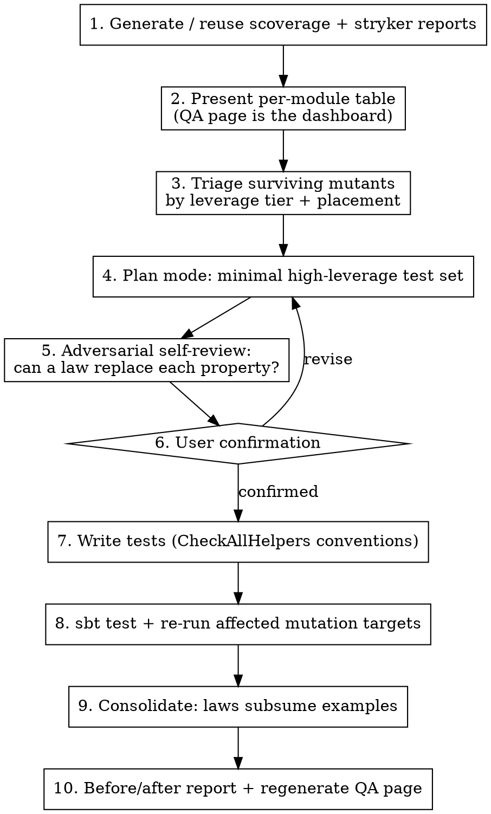

# Improve Test Leverage

## Overview

This skill runs a complete test-quality improvement cycle for cats-eo. It is
the algebraic adaptation of a per-module coverage skill: instead of asking
"which example test kills this mutant?", it asks **"which law, registered
against which instance, kills the largest family of mutants?"** — and places
each test where one line of test code scores against the most modules.

Two structural facts drive everything:

1. **The leverage hierarchy is algebraic.** A Discipline ruleset registration
   (`checkAll`) is ~5–15 properties in one line; a law over a *composed* optic
   exercises two families plus the compose machinery; a single `forAll`
   property beats N examples. Example-based tests are the floor, not the
   default.
2. **Test placement is attribution.** The `tests/` module's suite is
   task-borrowed into both `core`'s and `laws`' mutation runs (see
   `mutationAll` in build.sbt), and scoverage aggregates cross-module. So a
   law registration in `tests/` kills mutants in core AND laws AND raises
   coverage everywhere it reaches — while a spec in `schemes/src/test` is the
   only thing that can kill a schemes mutant. Put the test where it scores.

**Announce at start:** "I'm using the improve-test-leverage skill to analyze
and improve the test suite's kill capacity."

**Aliases:** `/test-upgrade` (ADD moves only, highest tier first),
`/test-fix` (gap-closing: candidates ranked by measured Survived /
NoCoverage clusters), `/test-prune` (CONSOLIDATE only: shrink LOC at
held kills). Each is a thin skill that delegates here with the move bias
pre-set; arguments pass through.

**Two modes:**

- **Guided (default)** — the 10-step workflow below: one planned batch,
  user-confirmed, executed, verified, reported.
- **Eval-optimization loop** (`/improve-test-leverage loop [N iterations |
  module focus]`) — autonomous iterate-measure-accept/revert against the
  explicit objective in [the loop section](#eval-optimization-loop-mode).
  Steps 1–3 (reports, table, triage) still run first to build the candidate
  pool; steps 4–10 are replaced by the loop. Get user confirmation ONCE on
  the objective, budget, and candidate pool — then iterate without per-batch
  confirmation. Sole exception: the
  [law-promotion gate](#law-promotion-intervention-point) always stops for
  the user.

## Workflow



## Step 1: Generate or Reuse Reports

Reports are expensive (~15–25 min for the full sweep). **Reuse them if fresh**
— same branch, no main-source changes since they were written:

- Coverage aggregate: `target/scala-*/scoverage-report/scoverage.xml`
- Mutation, per module: `<module>/target/stryker4s-report/<timestamp>/report.json`
  (schema v2: `files{}.mutants[].status` ∈ Killed / Timeout / Survived /
  NoCoverage / CompileError / Ignored)

To regenerate:

```sh
SBT_OPTS="-Xmx6g -Xss8m" sbt coverageAll     # cross-module aggregate
SBT_OPTS="-Xmx6g -Xss8m" sbt mutationAll     # all scoreable modules
```

Both aliases relax `-Werror` and need the big heap (the `set` reapply
re-evaluates the Laika docs settings). `mutationAll` already contains the
core/laws borrow `set`s and stops at avro's known failure — that's expected.

**Re-running a single module** (after writing tests, step 8):

```sh
# schemes / circe — module-local suites:
SBT_OPTS="-Xmx6g -Xss8m" sbt -batch 'set ThisBuild/tlFatalWarnings := false' \
  'project schemes' stryker

# core or laws — MUST include the borrow sets or every mutant is NoCoverage:
SBT_OPTS="-Xmx6g -Xss8m" sbt -batch 'set ThisBuild/tlFatalWarnings := false' \
  'set LocalProject("core")/Test/definedTests ++= (LocalProject("tests")/Test/definedTests).value' \
  'set LocalProject("core")/Test/fullClasspath ++= (LocalProject("tests")/Test/fullClasspath).value' \
  'project core' stryker
```

Never use `<module>/stryker` (module-scoped task form) — it resolves test
frameworks from the root project and reports 100% NoCoverage. Always
`project <m>; stryker`.

### Module caveats (do not fight these)

| Module | Status | Why |
|---|---|---|
| `core`, `laws` | scored via borrowed `tests/` suite | task-level borrowing; see build.sbt `mutationAll` comment |
| `generics` | structurally unscoreable (0%) | macro code expands at compile time — no runtime mutants. Guarded by the law specs in `generics/test`; skip it here |
| `avro` | not scored | stryker's forked test-runner fails to initialise in its sandbox (specs pass under plain `sbt test`) |
| `jsoniter` | check current QA page | historically blocked: instrumenting `PathParser.parseField` overflowed the JVM 64 KB method limit |
| all | StringLiteral mutants excluded build-wide | error messages / labels / rule-set names — unkillable noise (`ThisBuild / strykerExcludedMutations`) |
| all | CompileError mutants are normal | `-Yexplicit-nulls` flow-typing rejects some null-check mutations; stryker marks and continues. Do NOT strip the flag — these are excluded from the score |

## Step 2: Present the Module Table

The QA page (`site/docs/quality-assurance.md`) already holds the generated
per-package coverage table (with BC/SC ratio) and the per-module mutation
table — `site/tools/gen-qa-report.py` parses the same reports this skill
reads. Present those numbers (regenerate the page first if reports are newer)
and ask which module / mutant cluster to attack, unless the user already said.

## Step 3: Triage Surviving Mutants by Leverage

Read the chosen module's `report.json`. For each Survived / NoCoverage mutant
collect: mutator type, file:line, original vs replacement, and enough
surrounding source to judge what behaviour changed. Then sort into the
**leverage tiers** — for each mutant, the question is not "what test kills
this?" but "what is the most algebraic artifact that kills this *and its
neighbors*?":

| Tier | Artifact | Kill profile | When |
|---|---|---|---|
| 0 | **Law promotion** — a NEW law added to `cats-eo-laws` + its Discipline ruleset (requires the [user gate](#law-promotion-intervention-point)) | one law method × EVERY existing `checkAll` registration repo-wide, then ships to clients in the published `cats-eo-laws` artifact | a candidate property is *universal* for an abstraction (associativity, identity, fusion, naturality) — not specific to one instance |
| 1 | **Law-ruleset registration** — `checkAll` via `CheckAllHelpers` against an instance/carrier/arity not yet covered | one line ≈ 5–15 properties; kills whole branches of the instance's code paths | the mutant sits on a code path any existing law exercises, just not for this instance shape |
| 2 | **Composed-optic law registration** — laws on `outer.andThen(inner)` for an uncovered family pair | kills in BOTH component families plus the compose/carrier machinery | the mutant is in `compose`/carrier dispatch or only reachable through composition |
| 3 | **Negative fixture** — a deliberately unlawful instance asserted to FAIL specific laws | the ONLY killer of law-WEAKENING mutants in `laws` (guard → `false`, `&&` → `\|\|`): every lawful instance satisfies the weakened law too | the mutant is in `laws/` law bodies and survived the borrowed suite |
| 4 | **Targeted property** (`forAll`) | one property ≈ N examples; needed where laws don't reach (machinery internals, boundaries) | e.g. schemes' fold-machine: size generators must *straddle* thresholds like `OnStackLimit` so both branches of `depth >= limit` execute with observable difference |
| 5 | **Example test** | one kill each — the floor | fixed constants, lifecycle, or a single semantically-distinct input |

Also mark **equivalent mutants** (behaviour provably unchanged — e.g. an
`eq`-identity fast-path whose slow path computes the same result) and
**wrong-module mutants**: a NoCoverage mutant in core whose only natural
exercise is a schemes/circe code path can be left to scoverage (the aggregate
already counts cross-module coverage) — note it instead of forcing an
artificial test into `tests/`.

**Placement rule** (decides where each artifact lives):

- Mutant in `core` or `laws` → write in `tests/` (scores against both via
  borrowing; one artifact can kill in core and laws at once).
- Mutant in `schemes` / `circe` / `jsoniter` → write in that module's own
  `src/test` (its stryker run sees nothing else).
- Never write the same exercise twice in two places; prefer the placement
  with the larger blast radius.

## Step 4: Plan the Minimal Set (Plan Mode)

Enter plan mode. Output a table — one row per artifact, not per assertion:

```
| # | Artifact | Tier | File | Mutants killed (ids/lines) | Why this beats alternatives |
|---|----------|------|------|----------------------------|-----------------------------|
| 1 | PSVec MultiFocus laws @ size-0/1/many | 1 | tests/.../OpticsLawsSpec.scala | ~9 in data/PSVec | one checkAll vs 9 examples |
| 2 | Unlawful AffineFold fixture fails missIsEmpty | 3 | tests/.../UnlawfulFixturesSpec.scala | laws:41 guard→false | only negative fixture can kill weakening |
```

For each row include: generators needed (with the *distribution* argument —
e.g. "sizes biased to {0, 1, OnStackLimit−1, OnStackLimit, OnStackLimit+1}"),
the law/property statement, and the named mutants it kills with the causal
chain (mutant flips X → law Y's equality fails on input class Z).

## Step 5: Adversarial Self-Review

Before presenting, challenge every row (dispatch a review subagent for large
plans):

1. Any Tier-4/5 row that restates an existing law → replace with a Tier-1
   registration of that law.
2. Any generator whose distribution can't actually reach the mutated branch
   (the most common silent failure — e.g. default `Gen.listOf` almost never
   produces lists longer than a stack threshold).
3. Negative fixtures must be *minimally* unlawful: break exactly the clause
   the mutant weakens, keep everything else lawful, otherwise the fixture
   can't distinguish the weakened law from the original.
4. Each claimed kill must name the assertion that fails under the mutant.

## Law-Promotion Intervention Point

While triaging or self-reviewing, a Tier-4 property sometimes turns out not to
be a test at all — it's a **missing law**. Telltales:

- It quantifies over *all* instances of a family/typeclass, not one fixture —
  e.g. `andThen` associativity (`(a ∘ b) ∘ c` ≅ `a ∘ (b ∘ c)` at both the
  carrier and read/write level), composition identities against `Iso.id`,
  fusion equalities, naturality of a carrier transformation.
- Several specs each verify the same shape ad-hoc for their own instance.
- The algebra demands it: the composition matrix is a category — where are
  its associativity and identity witnesses? A carrier with `map` is a functor
  — does anything pin composition?

**This is a user decision, never autonomous.** A law is a public contract:
clients will check THEIR instances against it via the published
`cats-eo-laws` artifact. Before asking, do the homework:

1. **State it formally** — name, signature, the equality it asserts, and
   which existing laws (if any) nearly-imply it. If it is *derivable* from
   existing laws, it is redundant — don't propose it.
2. **Counterexample search** — run the candidate as a scratch `forAll`
   against EVERY instance shape currently registered in the repo's
   `checkAll` sites. A failure means either it's not a law or an instance is
   unlawful — both findings go to the user verbatim, not silently dropped.
3. **Estimate the blast radius** — which existing registrations would inherit
   it (= predicted kills), and what clients gain.

Then ask the user (AskUserQuestion), presenting: the formal statement, the
evidence (N instance shapes × M samples, zero counterexamples), placement,
predicted kills, and the options **promote** / **keep as tests/-only
property** / **reject**. The user is the judge of *validity* (universally
true for the abstraction, not incidentally true for today's instances) and
*worth* (is this a contract we want to maintain forever?).

**On approval, promotion mechanics:**

1. Law method → the matching trait in `laws/src/main/scala/.../laws/`
   (family laws at the root, `laws.data` for carriers, `laws.typeclass` for
   typeclasses, `laws.eo` for EO-specific structure). Scaladoc states the
   equality and why it holds.
2. Ruleset wiring → the corresponding `*Tests` class in the sibling
   `.discipline` package. Every existing `checkAll` call site inherits the
   new property with **zero test-file changes** — that's the Tier-0 payoff.
3. `sbt test` — if a previously-registered instance now FAILS, stop: either
   the law is wrong or the instance is unlawful. Back to the user.
4. `sbt mimaReportBinaryIssues` — `cats-eo-laws` is published; adding
   concrete trait methods is normally compatible, but verify (vacuous before
   0.1.1, load-bearing after).
5. Re-run mutation for the affected modules — the promotion's kills are
   measured like any other candidate.
6. Surface the new law in the docs (the laws listing the site documents) so
   clients can find it.

## Step 6: User Confirmation

Present the plan (artifact table + expected kill count + before-numbers).
Wait for explicit confirmation.

## Step 7: Execute

Conventions (read a neighbor spec first; these are the load-bearing ones):

- **Framework**: specs2 `mutable.Specification`; law registrations via
  `CheckAllHelpers` (mixes in Discipline; helpers return `Fragment` to
  silence `-Wnonunit-statement`). Add a `// covers: ...` comment at each
  `checkAll` call site — that's the established audit convention.
- **Generators**: `Arbitrary`/`Cogen` given instances near the spec (see
  `OpticsLawsSpec`), shared fixtures in `Samples.scala` / `examples/`.
- **Negative fixtures**: instantiate the law trait directly with the broken
  instance and assert the law method returns `false` on a witness input —
  e.g. `new AffineFoldLaws[S, A] { def af = brokenAffineFold }
  .missIsEmpty(missInput, f) must beFalse`. Pin the witness input as a
  constant with a comment naming the mutant it kills; do NOT register
  negative fixtures through `checkAll` (Discipline expects laws to pass).
- **schemes machinery properties**: structures must straddle the documented
  thresholds (`OnStackLimit`); assert results, not timing.
- **No mocks** anywhere in this codebase; everything is pure data.
- Format before committing: `sbt "scalafixAll; scalafmtAll"` (the sbt form,
  NOT the CLI scalafmt — they diverge; pre-commit gates on the sbt form).

## Step 8: Verify

```sh
sbt test                                  # full root aggregate must pass
# then re-run mutation ONLY for the modules whose mutants you targeted,
# using the step-1 single-module commands (borrow sets for core/laws!)
```

Compare each targeted mutant's status in the new `report.json` against the
plan's claims. A claimed kill that still survives means the generator never
reached the branch or the assertion is too weak — fix it now; do not move on.

## Step 9: Consolidate

The eo consolidation rule is stronger than "one property per method":
**no test may restate what a law already says.**

1. A property that is an instance of an existing law → delete it, register
   the law (Tier 1) instead.
2. \>1 example on the same code path → one property whose generator spans the
   input categories (encode expected outcomes in the generated scenario when
   categories are finite; keep the assertion a bare invariant when it's
   universal).
3. Two properties asserting different facets of one operation → merge.
4. Keep negative fixtures separate and explicit — they are documentation of
   the laws' discriminating power, one fixture per weakened clause.

After consolidating, re-run the affected mutation targets; if the score
regressed, a deleted test was the sole killer of some mutant — restore that
exercise.

## Step 10: Report + Refresh the QA Page

```sh
python3 site/tools/gen-qa-report.py        # rewrites the generated tables
```

Present before/after:

```
## Test-leverage improvement: <module(s)>

| Metric                    | Before | After | Change |
|---------------------------|--------|-------|--------|
| Mutation score (covered)  | 73.6%  | 80.1% | +6.5%  |
| Surviving mutants         | 53     | 31    | -22    |
| Statement coverage (pkg)  | 81.9%  | 84.2% | +2.3%  |
| Test LINES added          | —      | 38    | 22 kills / 38 lines |

### Artifacts added (kills per line is the headline)
1. checkAll PSVec MultiFocus @ biased sizes — 9 mutants, 4 lines
2. UnlawfulFixturesSpec (2 fixtures) — 3 mutants, 18 lines
...

### Remaining survivors (documented, not chased)
- N equivalent mutants (identity fast-paths) — listed with justification
- M mutants only reachable from <other module> — covered by aggregate scoverage
```

The QA page diff (regenerated tables) ships with the PR so the docs stay
truthful.

## Eval-Optimization Loop Mode

The loop turns the guided workflow into a measured optimizer. Nothing is
"improved" by assertion: every iteration's value is *measured* by re-running
the evals, and candidates that don't pay for their lines are reverted.

### Objective

Maximize repo-wide **kill density**, with branch coverage as the secondary
term:

```
iteration_leverage = (new_kills + new_branches_covered) / max(1, net_test_lines_added)

suite_kill_density = total_detected_mutants / total_test_LOC   (must rise monotonically)
```

- `new_kills` — mutants whose status flips Survived/NoCoverage → Killed/Timeout,
  summed across ALL scoreable modules (a `tests/` artifact can score in core
  and laws at once — count both).
- `new_branches_covered` — `<statement branch="true">` elements flipping to
  `invocation-count > 0` in the scoverage aggregate.
- `net_test_lines_added` — net added lines under `*/src/test/**.scala` from
  `git diff --numstat` (consolidation makes this negative — that's the point).

Mutants are keyed by `(file, line, mutatorName, replacement)` — report ids are
NOT stable across runs.

### State

Keep loop state in `target/test-leverage/state.json` (gitignored via
`target/`):

```json
{
  "baseline": {"per_module_status_counts": {}, "branch_covered": 0, "test_loc": 0},
  "iterations": [
    {"n": 1, "candidate": "checkAll PSVec MultiFocus @ biased sizes",
     "predicted_kills": 9, "measured_kills": 7, "lines": 4,
     "verdict": "accepted", "commit": "<sha>"}
  ],
  "do_not_retry": ["<candidate descriptions that failed measurement>"],
  "classified_out": [{"key": "...", "reason": "equivalent: eq fast-path"}]
}
```

### Loop body

Each iteration is **one candidate**, smallest first within the highest tier —
clean attribution requires never batching two candidates into one eval.

1. **Pick** the highest `predicted_leverage = predicted_kills / estimated_lines`
   candidate from the triage pool, skipping `do_not_retry`. Moves available:
   - **ADD** an artifact (tiers 1–5, placement rule applies);
   - **CONSOLIDATE** (replace examples with a law registration / merge
     properties — kills must hold, lines drop);
   - **PROMOTE-LAW** (tier 0): the loop PAUSES — this move always passes
     through the [law-promotion gate](#law-promotion-intervention-point),
     including the counterexample search, before any edit. On approval the
     promotion is implemented and evaluated like any candidate, with its
     `laws/src/main` + discipline lines counted in the denominator (the
     repo-wide kill multiplication normally dwarfs them). On "keep as
     tests/-only", downgrade to a Tier-4 ADD; on reject, record in
     `do_not_retry`.
   - **CLASSIFY-OUT** (mark a mutant equivalent or wrong-module with a one-line
     justification — shrinks the pool, costs nothing, never inflates the score).
2. **Implement** the candidate on a clean working tree (`git status` clean
   apart from loop work; commit or stash anything else first).
3. **Eval** (this is the gate, not a formality):
   - `sbt <affected>/test` — must pass, else fix or revert;
   - re-run stryker for **every module the candidate claims kills in**
     (borrow sets for core/laws — see step 1);
   - diff the new `report.json` against state by mutant key → `measured_kills`;
   - `git diff --numstat -- '*/src/test/*'` → `net_test_lines_added`.
4. **Accept or revert**:
   - **Accept** if `measured_kills ≥ 1` and `lines/kill ≤ 8`, or
     `net_test_lines_added < 0` with zero kill regression (consolidation).
   - On accept: `git add` the test files + one small commit
     (`test(<module>): <candidate> — kills N mutants in M lines`), append the
     iteration record to state.
   - On revert: `git checkout -- <touched test files>`, record the candidate
     in `do_not_retry` WITH the measured outcome (e.g. "predicted 9, measured
     0 — generator never exceeds OnStackLimit"). A failed measurement is
     information; keep it.
5. **Checkpoint** every 3 accepted iterations (and at loop end):
   `sbt coverageAll` → refresh `new_branches_covered` (per-iteration mutation
   runs are the fast proxy; NoCoverage→Killed flips co-move with branch
   coverage, but only the aggregate is the truth), then
   `python3 site/tools/gen-qa-report.py` so the QA page tracks the loop.

### Stop criteria (whichever fires first)

1. **Budget** — the iteration count / time the user set (default: 5 accepted
   iterations).
2. **Convergence** — 2 consecutive reverted iterations: the pool's remaining
   predictions don't survive measurement.
3. **Pool exhausted** — every remaining survivor is classified-out
   (equivalent / wrong-module / needs-negative-fixture-the-user-declined).

### Loop report

On exit, present the trajectory, not just the endpoint:

```
| Iter | Candidate                          | Pred | Meas | Lines | Leverage | Verdict |
|------|------------------------------------|-----:|-----:|------:|---------:|---------|
| 1    | checkAll PSVec MF @ biased sizes   |    9 |    7 |     4 |     1.75 | accept  |
| 2    | negative fixture missIsEmpty       |    1 |    1 |     9 |     0.11 | accept* |
| 3    | property: M-machine fresh state    |    4 |    0 |    12 |     0.00 | revert  |
| 4    | consolidate OpticsBehaviorSpec §3  |    0 |    0 |   -41 |        ∞ | accept  |

suite kill density: 0.041 → 0.052 kills/test-line
branch coverage:    71.7% → 73.4%
* negative fixtures are exempt from the lines/kill threshold — they are the
  only possible killer of law-weakening mutants and double as documentation.
```

Then finish with the guided workflow's step 10 (QA page regen + PR-ready
diff). Every accepted commit is already small and attributed, so the loop's
history reads as its own audit log.

### Loop guardrails

- Never weaken an assertion or delete a test to "free up" lines — the
  `suite_kill_density` denominator only shrinks via genuine consolidation
  with held kills (the eval in step 3 enforces this; zero kill regression is
  measured, not assumed).
- Never mark a mutant equivalent to dodge a hard test — `classified_out`
  entries need a justification a reviewer can check.
- The loop edits ONLY files under `*/src/test/`, with one exception: a
  user-approved **PROMOTE-LAW** move may touch `laws/src/main` and its
  `.discipline` package — nothing else. Other main-source changes (e.g.
  splitting jsoniter's `parseField`) stay out of scope; surface them as
  follow-ups in the loop report.
- The loop is autonomous between candidates EXCEPT at the law-promotion gate:
  proposing a new public law always stops for the user, however high the
  predicted leverage. Unattended runs (cron, `/loop` overnight) queue
  promotion candidates in `state.json` (`"pending_promotions"`) and skip to
  the next move instead of blocking.
- If running under `/loop` or unattended, the per-iteration commits are the
  recovery points; state.json names the last completed iteration.

## Error Handling

- `stryker` reports 100% NoCoverage → you used `<m>/stryker` or forgot the
  borrow sets for core/laws. Re-read step 1.
- sbt OOM during the runs → you forgot `SBT_OPTS="-Xmx6g -Xss8m"`.
- `Method too large` during mutant compilation → that module has a giant
  method (jsoniter's `PathParser.parseField`); record as not-scoreable unless
  the method gets split. Don't chase it here.
- avro `InitialTestRunFailedException` in <1s with no test output → the known
  sandbox/test-runner issue; record and move on.
- A negative fixture makes an unrelated law fail → the fixture is too broken;
  re-shape it to violate exactly one clause.
