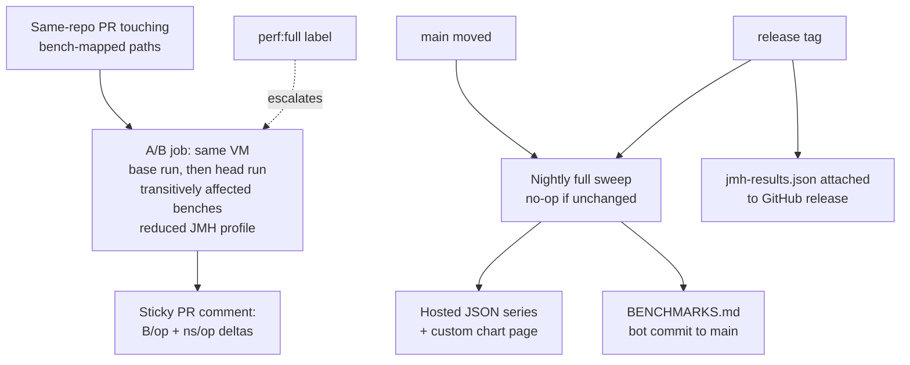

# Benchmark CI Pipeline: PR Deltas, Generated BENCHMARKS.md, Release History

## Problem Frame

eo is a performance-conscious optics library whose benchmark suite (JMH vs
Monocle, ~25 bench classes) runs only on manual `workflow_dispatch`. Perf
regressions are discovered ad hoc — often long after the offending merge —
and there is no published, trustworthy record of current or historical
performance. Contributors reviewing a PR have no benchmark signal at all.

Three gaps: (1) no early regression warning on PRs, (2) no up-to-date
published benchmark numbers, (3) no per-release performance history.

Research basis: rustc-perf (deterministic metric + opt-in depth), Go
benchstat (same-machine A/B doctrine), asv/Lucene (history series + nightly
cadence), conbench (compare vs distribution), github-action-benchmark
(gh-pages JSON series, native JMH support). CodSpeed's new Java support was
evaluated and ruled out (Maven/Gradle only, walltime-only for JVM).

The eo-specific measured fact anchoring the design: on shared runners,
`-prof gc` B/op is deterministic while ns/op is ±15–50% noise. Doctrine:
**B/op gates, ns/op advises.**

## Architecture

## Requirements

**PR regression warning**

- R1. A PR whose diff touches benchmark-mapped source paths (core/, avro/,
  circe/, jsoniter/, schemes/, generics/, benchmarks/) automatically runs an
  A/B benchmark job; PRs touching only docs/site/tests/CI skip it. The job
  triggers for same-repo branches only (plain `pull_request`); fork PRs get
  no benchmark run or comment — the same accepted caveat deploy-site.yml
  documents. This is what keeps executing PR code with a comment-write
  token safe.
- R2. The A/B job runs the *affected* benchmark classes on the merge-base
  of main and on the PR head, in the same job on the same VM, and computes
  deltas from those two same-VM runs. Selection uses a path→bench mapping
  maintained in-repo that closes over the reverse module-dependency graph:
  core/ ⇒ all benches (every module depends on core); a leaf module ⇒ its
  own benches only. The PR A/B runs a reduced JMH profile (fewer forks /
  iterations, `-prof gc`) — legitimate for the deterministic gate metric
  and calibrated per-profile (R5); full-rigor numbers are the nightly's
  job. Changes to `build.sbt`, `project/`, or the bench harness itself
  select the full sweep. The job compiles both sides before running and
  validates the mapping on every run — every bench class must be reachable
  from at least one path pattern and every mapped path must exist —
  failing loudly when the mapping has drifted.
- R3. Results are posted as a single sticky PR comment (updated in place on
  re-push): B/op delta per benchmark, ns/op delta marked as directional,
  provenance footer. Benchmarks that exist only on the PR head are reported
  as "new", not diffed; benchmarks present only on the merge-base are
  reported as "removed", and a simultaneous removed+new pair is flagged as
  a possible rename. All PR-derived content in the comment (bench names,
  params, results) is treated as untrusted input — schema-validated and
  markdown-escaped before rendering. A compile or run failure on either
  side renders as an explicit failure state in the comment — a partial or
  missing table never reads as a pass.
- R4. Rollout is advisory-first: no CI failure on regression until B/op
  thresholds are calibrated (R5). After calibration, a B/op regression
  beyond threshold fails the job; ns/op never fails it.
- R5. An A/A calibration mode (same commit benchmarked twice in one job)
  exists and is run enough times to measure the empirical noise floor per
  metric; gate thresholds are set from that data, not guessed. Calibration
  is bound to the measurement profile (JMH params, JDK, runner image); any
  profile change — including R14 reductions — reverts the gate to advisory
  until A/A recalibration under the new profile.
- R6. A `perf:full` PR label escalates the A/B job to the full sweep
  regardless of the diff (label application relies on GitHub's triage+
  permission — labels-as-authorization is a stated assumption).

**Published benchmarks (BENCHMARKS.md)**

- R7. A generated `BENCHMARKS.md` at the repo root holds the current full-
  sweep results as per-family tables (eo vs Monocle side by side where
  paired), with a provenance header (commit, date, JDK, runner, JMH params)
  and the standard JMH shared-runner disclaimer.
- R8. `BENCHMARKS.md` is rewritten and committed by the main-branch sweep
  job only — never hand-edited (same doctrine as ci.yml). The bot commit
  must not trigger CI or another sweep. The committing credential is held
  only by the trusted main-code sweep workflow — never by any job that
  executes PR-derived input; its identity (GITHUB_TOKEN vs fine-grained
  App/PAT) and branch-protection interplay are planning decisions.

**History and releases**

- R9. A scheduled nightly job runs the full sweep on main, no-oping when
  main has not moved since the last recorded sweep — where "moved" excludes
  the sweep's own BENCHMARKS.md bot commits (compare the last non-bot
  commit against the swept source SHA recorded in the series, not main
  HEAD). A release tag always triggers a sweep.
- R10. Every sweep appends its results (JSON, with provenance) to an
  append-only hosted series; the series is the machine-readable source of
  truth from which BENCHMARKS.md is rendered. A custom-built browsable
  chart page over that series is a deliverable of this iteration, with
  B/op as the first-class plotted metric and ns/op shown as directional.
  (github-action-benchmark's JMH mode is ruled out: it charts
  primaryMetric ns/op only and would drop the gating metric.) Only the
  trusted sweep workflow may write the series.
- R11. Each GitHub release carries the sweep's `jmh-results.json` as a
  release asset, so per-release numbers are permanently downloadable and
  diffable across versions.

**Cross-cutting qualities**

- R12. Provenance everywhere: no published number (comment, BENCHMARKS.md,
  series, release asset) without commit SHA, JDK, runner type, and JMH
  parameters attached.
- R13. Benchmark workflows stay off the push/PR critical path of `ci.yml`
  (which remains generated and untouched); all bench workflows are
  hand-written files alongside the existing `benchmarks.yml`.
- R14. Every automated run fits GitHub-hosted runner limits (job timeout,
  concurrency); if the full sweep cannot, it is sharded or its JMH
  parameters reduced for CI, with the reduction recorded in provenance.
- R15. Least privilege: every bench workflow declares an explicit minimal
  `permissions` block scoped to exactly what it writes; any job that checks
  out or executes PR-head code runs with a read-only token and no secrets;
  privileged actions (comment posting, main commit, gh-pages push, release
  upload) happen only in jobs executing trusted (main/tag) code.

## Success Criteria

- A PR that regresses allocation on a benchmarked path gets a visible
  B/op delta comment before review, with zero manual steps.
- `BENCHMARKS.md` on main is never more than one nightly behind the code.
- For any two releases, comparing performance is a download of two release
  assets (or a glance at the gh-pages chart) — no re-running history.
  Cross-run/cross-release comparison is authoritative for B/op only; ns/op
  from different VMs is directional and marked as such wherever published.
- After calibration, at least one induced test regression is caught by the
  gate, and no false-positive gate failure occurs in normal traffic
  (advisory period measures this).

## Scope Boundaries

- The gate covers allocation (B/op) regressions only. CPU-time regressions
  invisible to B/op (the historical 3× composed-Getter ns case) are a
  **named, accepted blind spot** on shared runners — backstopped by the
  same-VM ns/op advisory delta and reviewer attention. A dedicated quiet
  runner for ns/op gating is the named future iteration if a timing
  regression ships.
- Fork PRs get no benchmark run or comment (same-repo only, R1); a
  maintainer re-runs on an in-repo branch when a fork PR needs numbers.
- No dedicated benchmark hardware; GitHub-hosted runners only, with the
  noise doctrine (B/op gates, ns/op advises) compensating.
- No third-party benchmark service (CodSpeed, Bencher, conbench server) in
  this iteration.
- No change to benchmark content or JMH annotation defaults beyond what CI
  time budgets force (R14).
- No historical backfill: the series starts at adoption; past releases are
  not retro-benchmarked.
- Per-commit resolution on main is a non-goal; nightly resolution suffices
  (PR A/B is the primary catch point).

## Key Decisions

- **Hybrid architecture**: same-job A/B for PR deltas (validity), gh-pages
  series for history/charts (cheap persistence) — each goal gets the tool
  the research says fits it.
- **Auto-trigger on mapped paths** rather than opt-in or always-on:
  benchmark cost lands only on PRs that can regress performance.
- **Advisory first, gate after calibration**: thresholds derive from
  measured A/A noise, honoring the project's "verify claims empirically"
  doctrine.
- **Committed, bot-generated BENCHMARKS.md** over a site-only page:
  readable in-repo, diffable, versioned with the code.
- **Nightly-if-changed + release-tag sweeps**: dense enough for trend/step
  detection, zero waste on quiet days, releases guaranteed fresh numbers.
- **CodSpeed rejected for now**: JVM support (2026-05) is Maven/Gradle
  walltime-only; revisit if sbt/instrumentation support lands.
- **Same-repo PRs only**: keeps write-token + PR-code-execution safe with
  zero extra machinery (no workflow_run split); matches how contributors
  actually work here.
- **Transitive mapping + reduced PR profile**: honest about dependency
  direction (core/ ⇒ all benches) while fitting the budget, because the
  deterministic gate metric doesn't need full JMH rigor; per-profile
  calibration (R5) makes the reduction sound.
- **CPU-timing blind spot accepted and named** rather than hidden or
  solved with premature infrastructure.
- **Custom chart over github-action-benchmark**: its JMH mode charts the
  advisory metric and drops the gating one — reuse was a false economy.

## Dependencies / Assumptions

- The docs site deploys to Cloudflare Pages (deploy-site.yml); no gh-pages
  branch or GitHub Pages setup exists today. Hosting the series/chart means
  either creating gh-pages + enabling GitHub Pages (new one-time setup) or
  publishing through the existing Cloudflare deploy — decided in planning.
- Tags trigger Maven publishing (sbt-typelevel flow), but the GitHub
  Release *object* is created manually today; the tag sweep must create the
  release (or a draft) if absent before uploading, or attach on retry once
  it exists.
- A bot commit to main (BENCHMARKS.md) is acceptable to branch protection
  as configured, or a mergeable equivalent exists.

## Outstanding Questions

### Resolve Before Planning

- (none)

### Deferred to Planning

- [Affects R2][Technical] Exact path→bench mapping table format and where
  it lives (likely a small script or YAML the workflow reads).
- [Affects R2][Technical] A/B mechanics: how the job builds and runs the
  merge-base side (checkout + assembly of two jars vs two sbt runs) and
  how JMH JSON pairs are diffed.
- [Affects R4, R5][Needs research] Threshold values and the statistical
  form of the ns/op advisory (benchstat-style test vs simple % + error
  bars) — decided from A/A calibration data.
- [Affects R9, R14][Technical] Full-sweep CI budget: measured wall time of
  all ~25 classes on a 2-vCPU runner; whether to shard across a matrix or
  reduce forks/iterations for the nightly profile.
- [Affects R8][Technical] Bot-commit mechanics that don't retrigger CI
  (`[skip ci]` vs path filters), coexist with branch protection, survive a
  push race with a human merge (fetch-rebase-retry), and which identity
  holds the credential (GITHUB_TOKEN vs App/PAT).
- [Affects R10][Technical] Series JSON schema and the custom chart page's
  shape (static HTML+JS over the series) and host (gh-pages vs the
  existing Cloudflare deploy).
- [Affects R2][Needs research] The reduced PR JMH profile's exact params
  (forks/warmups/iterations) — validated by A/A that B/op stays stable
  under the reduction (escape-analysis needs C2 warmup).
- [Affects R5][Technical] Right-size calibration: standing A/A mode vs a
  one-off confirmation script, given B/op is expected deterministic.
- [Affects R11][Technical] Hooking the release-asset upload into the
  existing tag-triggered release workflow without touching generated
  ci.yml.

## Next Steps

→ `/ce:plan` for structured implementation planning
