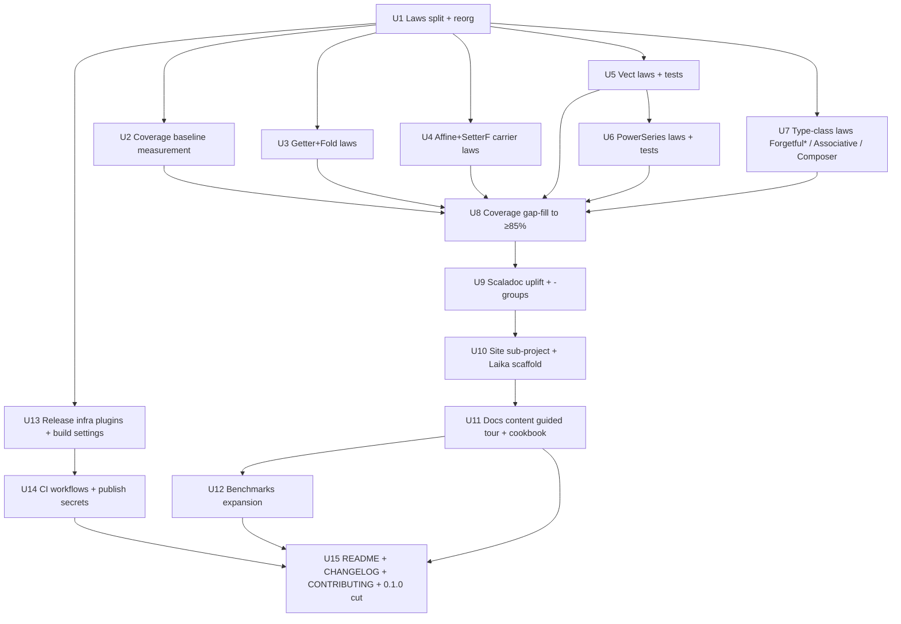
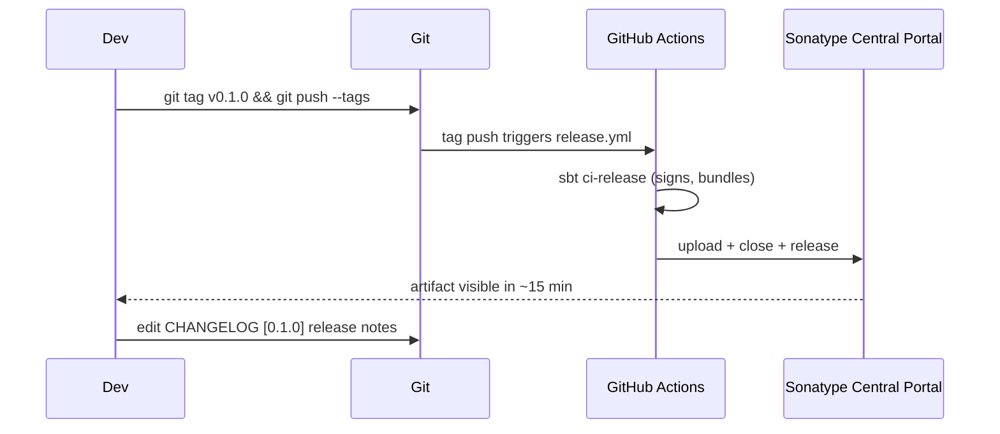

# feat: Production-readiness — Laws, Tests, Docs, Benchmarks, and 0.1.0 Release

## Overview

Bring `cats-eo` from an internal-feeling snapshot (`0.1.0-SNAPSHOT`) to a first
public Maven Central release (`0.1.0`) suitable for external adoption. The work
is structured as five complementary tracks, executed in sequence so each track
lands on a firm base:

1. **Laws & discipline restructure** — split `OpticLaws.scala` / `EoSpecificLaws.scala` into
   idiomatic `FooLaws` (equations) + `FooTests` (discipline RuleSet) pairs, one
   file per abstraction, mirroring cats / Monocle.
2. **Coverage closure** — add the missing law classes (`Getter`, `Fold`,
   `Affine`, `SetterF`, `Vect`, `PowerSeries`, and the `Forgetful*` carrier
   type-classes) and the matching property-test wiring so every public type
   carries a discipline-checked law set. Lift scoverage on `core` from ~70% to
   ≥85% statement coverage.
3. **Documentation track** — introduce an sbt-typelevel-site sub-project
   (Laika + mdoc), populate it with a guided tour, concept pages, API
   reference, and mdoc-verified runnable examples. Rewrite the README. Raise
   Scaladoc to full-release quality (`-groups`, `@tparam S/T/A/B`, examples)
   across the public surface.
4. **Benchmarks expansion** — add `Fold`, `Getter`, `Optional`, `Setter`, and
   `PowerSeries` benches, following Monocle's trait-per-optic +
   `Nested0…Nested6` fixture pattern. Keep JMH in its own sub-project, not on
   CI critical path.
5. **Release infrastructure** — adopt `sbt-typelevel-ci-release` (Sonatype
   Central Portal flow post-June-2025 OSSRH sunset), wire a JDK 17 / 21 CI
   matrix with scalafmt / scalafix / scoverage / mdoc / MiMa gates, write a
   `CHANGELOG.md`, and cut the 0.1.0 tag.

The entire plan is scoped for a pre-1.0 release — MiMa is introduced but not
enforced on the 0.1.0 tag itself; it becomes a gate on 0.1.1 and forward
within the `0.1.x` series.

## Problem Frame

The library has strong bones (rigorous existential-optics core, working Scala 3
macros, discipline-checked core optics, JMH suite vs Monocle for Lens / Prism /
Iso / Traversal) but is invisible as a public artifact:

- **No public release path.** `build.sbt` targets `0.1.0-SNAPSHOT`, no
  publishing config, no CI, no MiMa, no release automation. Any external user
  would need to clone + `sbt publishLocal`.
- **Documentation is absent.** `README.md` is the stock sbt 3-line stub. There
  is no `docs/`, no examples folder, no tutorial. The rich design notes live
  only in `CLAUDE.md` (agent-facing) and in Scaladoc on a few files.
  Newcomers cannot learn the library from the repository alone.
- **Law and test coverage has grown uneven** as the code grew. Post-PowerSeries
  additions (`Vect`, `PowerSeries`, `FixedTraversal`, richer `Affine` /
  `SetterF` / `Composer`) landed with behavior examples (`Unthreaded.scala`) but
  without law classes. The existing `OpticsLawsSpec` does not instantiate laws
  for `Getter`, `Fold`, `Affine`, `SetterF`, `Vect`, `PowerSeries`, or the
  `Forgetful*` type-classes.
- **Law organization does not match conventions.** `OpticLaws.scala` and
  `EoSpecificLaws.scala` bundle many `XxxLaws` traits + `XxxTests` RuleSets in
  a single file per module — fine while iterating internally, awkward for
  downstream discoverability and for downstream projects that want to depend on
  `cats-eo-laws`.
- **No changelog, no release notes, no version policy.** A public release needs
  "what's in it" and "what's guaranteed" artifacts.

The upstream brainstorm-equivalent was the in-conversation request: "let's go
over coverage again, add laws for PowerSeries, seriously improve documentation,
get ready for production — use Monocle and Cats as inspiration." The user has
chosen the maximal bundle (laws + tests + docs + release infra + benchmarks
expansion), docs-via-mdoc+Laika, `0.1.0` on Maven Central with pre-1.0
semantics, and full laws for PowerSeries / Vect. This plan honors those
choices directly.

## Requirements Trace

Requirements the plan must satisfy end-to-end:

- **R1. Every public type in `core/` carries a discipline-checked law set.**
  Explicitly:
  - **Optics** — `Iso`, `Lens`, `Prism`, `Optional`, `Setter`, `Traversal`,
    `Getter`, `Fold`.
  - **Data carriers** — `Affine`, `SetterF`, `Vect`, `PowerSeries`,
    `FixedTraversal`. (`Forgetful` is a type alias over `Id`; its behavior is
    exercised through the type-classes that use it, not a standalone law class.)
  - **Type-classes** — `ForgetfulFunctor`, `ForgetfulTraverse`,
    `AssociativeFunctor`, `Composer`. (The smaller type-classes
    `ForgetfulFold`, `ForgetfulApplicative`, `Accessor`, `ReverseAccessor`
    are covered by the optic-level laws that consume them — see Unit 7
    for the concrete scope; dedicated law classes are deferred to 0.1.1
    unless a second carrier lands.)

  "Discipline-checked law set" means a `FooLaws` trait (equations) plus a
  `FooTests` abstract class (discipline `RuleSet`) plus at least one
  `checkAll(...)` instantiation in `tests/`.
- **R2. Laws module is idiomatically structured** — `FooLaws` (equations)
  under `eo.laws.*`, `FooTests` (discipline RuleSet) under
  `eo.laws.discipline.*`. Cohesively grouped per abstraction, not
  one-equation-per-file. Matches cats / Monocle conventions. The published
  `cats-eo-laws` artifact is usable by downstream projects.
- **R3. `core` statement coverage ≥85%** (up from ~70% today) as measured
  by `sbt "clean; coverage; tests/test; coverageReport"`. Branch coverage
  is reported but not floored — scoverage 2.4.x under-reports branches on
  match types and inline givens, which we use heavily.
- **R4. A user can learn the library from the repository alone** via a
  `README.md` with navigation, a mdoc-verified `docs/` microsite built by
  `sbt-typelevel-site` (Laika), and an `examples/` folder. The guided tour
  covers: getting started, core concepts (existential optics vs classical
  profunctor encoding), each optic with runnable examples, the generics
  module, and a migration-from-Monocle appendix.
- **R5. All public surface has Scaladoc that compiles with `-groups`** and
  includes `@tparam` for every type parameter on `Optic`, its companion, and
  on every optic / data-carrier / type-class public member. `@example` blocks
  are welcome where they clarify usage (and can point at the microsite for
  deeper examples).
- **R6. The project publishes `cats-eo`, `cats-eo-laws`, and
  `cats-eo-generics` to Maven Central (via the Central Portal)** at version
  `0.1.0` from a git tag, signed, with source and Scaladoc jars, via
  `sbt-typelevel-ci-release`.
- **R7. CI enforces on every PR**: compile (JDK 17 + JDK 21), `sbt test`,
  `scalafmtCheckAll` + `scalafmtSbtCheck`, `scalafix --check` (ruleset
  documented), `coverage + coverageReport` with codecov upload, `docs/mdoc`,
  `mimaReportBinaryIssues` (reports only on 0.1.0; enforced on subsequent
  0.1.x releases).
- **R8. Benchmarks are expanded** to cover `Fold`, `Getter`, `Optional`,
  `Setter`, and `PowerSeries` in addition to existing `Lens / Prism / Iso /
  Traversal`, each with an EO implementation and a Monocle baseline where
  Monocle has an equivalent. Each bench uses Monocle's `Nested0…Nested6`
  fixture approach so numbers are comparable side-by-side.
- **R9. A `CHANGELOG.md`** captures the 0.1.0 release contents, using
  Keep-a-Changelog conventions, and is wired for subsequent releases.
- **R10. Existing behavior is preserved.** No law, benchmark, or API change
  alters the semantics of current optics or carriers; the existing ~70% of
  `core/` remains green against its laws.

## Scope Boundaries

In scope:

- All code under `core/`, `laws/`, `tests/`, `generics/`, `benchmarks/`.
- New `docs/` sub-project and a new top-level `docs/` markdown tree.
- Build plumbing (`build.sbt`, `project/plugins.sbt`, `project/build.properties`).
- CI configuration (`.github/workflows/ci.yml`, `release.yml`).
- `README.md`, `CHANGELOG.md`, `CONTRIBUTING.md`, `LICENSE` header review.

Out of scope (explicit non-goals):

- **No new optic abstractions.** The plan documents and hardens what exists;
  it does not add `Grate`, `Review`, `IndexedLens`, etc. Those belong in a
  follow-up.
- **No Scala.js / Scala Native cross-build.** The codebase is JVM-only today.
  Adding cross-build is tracked as a 1.0 follow-up (see Future Considerations
  below).
- **No 1.0.0 stability review.** API is allowed to shift inside the `0.1.x`
  and `0.2.x` lines; MiMa becomes a gate on `0.1.1+` only.
- **No new macro features in `generics/`.** Existing `lens` / `prism` macros
  are documented and tested; no new derivations (e.g., no `iso`/`optional`
  macro) in this plan.
- **No performance-regression CI job.** JMH benchmarks are added and
  documented but run offline — CI runtime and noise floor do not justify it
  pre-1.0. A later plan can add a nightly benchmarks workflow.
- **No changes to `CLAUDE.md`'s agent-facing content.** It is updated only
  where new commands (sbt tasks) or layout conventions materially changed;
  the user-facing documentation lives in the new `docs/` tree.

## Context & Research

### Relevant Code and Patterns

- **Laws convention already in use** — `laws/src/main/scala/eo/laws/OpticLaws.scala`
  uses `trait XxxLaws { def lens: Optic[...]; def roundTrip(s): Boolean }` plus
  `abstract class XxxTests[...] extends Laws { def laws: XxxLaws[...]; def
  iso(using Arbitrary[S], ...): RuleSet = new SimpleRuleSet("name", ...) }`.
  The pattern is correct — the restructure is purely moving each abstraction
  into its own file under `eo.laws` / `eo.laws.discipline`.
- **Carrier naming + paths** to follow when adding new law files:
  - Optics → `laws/src/main/scala/eo/laws/<Name>Laws.scala`,
    `laws/src/main/scala/eo/laws/discipline/<Name>Tests.scala`.
  - Data carriers → `laws/src/main/scala/eo/laws/data/<Name>Laws.scala`,
    `laws/src/main/scala/eo/laws/data/discipline/<Name>Tests.scala`.
- **Test wiring** — `tests/src/test/scala/eo/OpticsLawsSpec.scala` is the
  existing `AnyFunSuite with Discipline`-style entry point. Additional law
  classes plug in as `checkAll("Getter[Person, String] lawful", GetterTests[...].getter)`.
- **JMH fixture** — `benchmarks/src/main/scala/eo/bench/OpticsBench.scala`
  already defines a `Nested` case-class tree; reuse + extend it. Adopt
  Monocle's `MonocleLensBench` / `StdLensBench` trait-pair pattern.
- **Scaladoc density** — `Optic.scala`, `Lens.scala`, and `ForgetfulFunctor.scala`
  already carry heavy docstrings (the existing model). Extend that treatment
  uniformly to the `optics/` thin files (`Fold.scala`, `Getter.scala`,
  `Iso.scala`, `Optional.scala`, `Prism.scala`, `Setter.scala`,
  `Traversal.scala`) and to `data/` carriers.

### External References

- **sbt-typelevel-ci-release** as the publishing plugin — drops
  `sbt-sonatype` + `sbt-pgp` direct usage, matches Monocle's current setup,
  bakes in the Sonatype Central Portal flow introduced after OSSRH sunset
  (2025-06-30).
  <https://typelevel.org/sbt-typelevel/> ·
  <https://github.com/sbt/sbt-ci-release>.
- **sbt-typelevel-site + Laika + mdoc** as the docs toolchain — matches
  typelevel/cats's current `main` docs setup (`file("site")` project + Laika
  `directory.conf`). sbt-mdoc 2.9.0 current. (Monocle still uses Docusaurus;
  we choose the more current Typelevel pattern since cats-eo is named after
  cats and the audiences overlap.)
  <https://github.com/typelevel/cats/blob/main/build.sbt>.
- **Laws split conventions** — cats publishes `cats-laws` with
  `MonadLaws` (equations) + `MonadTests` (discipline RuleSet). Monocle
  publishes `monocle-law` with `LensTests` / `PrismTests` / etc. We mirror
  the cats layout because the law equations and RuleSet for the same
  abstraction are discovered side-by-side.
- **JMH / Monocle bench pattern** — Monocle's `bench/` has
  `abstract class LensBench { def lensGet0/3/6 }` then `MonocleLensBench extends
  LensBench` and `StdLensBench extends LensBench`. Same method names, one
  fixture, side-by-side JMH rows.
  <https://github.com/optics-dev/Monocle/tree/master/bench/src/main/scala/monocle/bench>.
- **Scaladoc groups** — `scalacOptions += "-groups"` is how Scala 3 enables
  `@group` tags. Use `@group Constructors`, `@group Operations`,
  `@group Instances` uniformly per optic companion.
  <https://docs.scala-lang.org/scala3/guides/scaladoc/docstrings.html>.

### Institutional Learnings

None in `docs/solutions/` yet (no such folder exists). As this plan executes,
any surprising incidents (e.g., "MiMa false positive on existential type X",
"Laika config gotcha Y") should land in `docs/solutions/` for future-us.

## Key Technical Decisions

- **D1. Adopt `sbt-typelevel-ci-release` 0.8.x (not hand-rolled sonatype /
  pgp).** Rationale: one plugin covers release automation, PGP secrets from
  CI, Central Portal API, and consistent `tlBaseVersion` / MiMa conventions
  from the same plugin family we use for site + mima. Hand-rolled publishing
  was the 2022 pattern; post-OSSRH-sunset it is strictly more work for no
  benefit.
- **D2. `tlBaseVersion := "0.1"`. Do not enforce MiMa on 0.1.0 itself.**
  Rationale: MiMa is useless when no prior artifact is published. Set
  `tlMimaPreviousVersions := Set.empty` in 0.1.0's build; on 0.1.1 the plugin
  starts comparing against `0.1.0` automatically. Pre-1.0 minor bumps are free
  to break compatibility; the `0.1.x` patch series is binary-compat-guarded.
- **D3. Docs stack is `sbt-typelevel-site` (Laika + mdoc).** Rationale: it
  matches cats's current docs, is Markdown-native (low friction for PR
  contributions), and mdoc verifies every code fence compiles against the
  library — so docs cannot silently rot. Rejected: Docusaurus (requires Node
  in the dev loop), microsites (abandoned), vanilla Scaladoc alone (no
  narrative layer).
- **D4. Split laws into `eo.laws` + `eo.laws.discipline`, one abstraction
  per file.** Rationale: matches cats and makes `cats-eo-laws` a clean
  downstream dependency. The current bundled files (`OpticLaws.scala`,
  `EoSpecificLaws.scala`) become entry-point "pallets" that re-export for
  backward source-compatibility in this same release — then we decide per
  abstraction whether the re-exports stay long-term.
- **D5. Keep `tests/` as the single place where discipline RuleSets are
  instantiated.** Rationale: it is the only `publish / skip := true`
  sub-project with access to both `core` and `laws`. All new property tests
  land here. `core/src/test/scala/eo/FoldSpec.scala` (the lone smoke test)
  is migrated into `tests/` for consistency.
- **D6. Use `cats-kernel` `Eq` / `Hash` for law equality everywhere.**
  Rationale: structural `==` is the current pattern but is fragile for
  function-typed law equations (e.g., `modify` equality). Every `FooLaws`
  definition should accept `Eq[S]` / `Eq[A]` / `Eq[B]` implicit evidence so
  property equality can be overridden per test fixture.
- **D7. CI matrix: `scala: [3.8.3]`, `java: [temurin@17, temurin@21]`,
  `os: [ubuntu-latest]`.** Rationale: no Scala 2 support (3.8.3 is the only
  supported compiler), no cross-platform (JVM-only today), JDK 17 is the
  current LTS floor matching `cats-core 2.13.0`'s support matrix, JDK 21 is
  the next LTS. macOS/Windows runners are unnecessary pre-1.0.
- **D8. `cats-kernel-laws` gets pulled transitively by depending on
  `discipline-core` + our own scalacheck arbitraries.** Rationale: we do not
  need `cats-laws` as a dep — we write optics / carrier laws, not monad laws.
  Keep the laws module slim.
- **D9. Bump scalafmt from `3.0.7` (current pin) to `3.11.0`** (already
  installed via coursier locally). Rationale: 3.0.7 is from 2021; the modern
  version is stable, has better Scala-3 support, and matches the `CLAUDE.md`
  "installed versions" claim. Bump pin in `.scalafmt.conf`, run
  `scalafmtAll`, commit the formatting churn as its own commit (it will touch
  many files; isolated from behavior changes).
- **D10. `coverage` enforcement is a report + codecov upload, not a CI
  failure gate.** Rationale: scoverage false positives on type-level-only
  code (`AssociativeFunctor` instances with existential `Z`) make a hard
  floor noisy. Publish the report, watch trend, discuss lifts in PR.
  Enforcement is a 1.0 concern.

## Open Questions

### Resolved During Planning

- **Which docs toolchain?** → `sbt-typelevel-site` (Laika + mdoc). User
  chose this option explicitly.
- **PowerSeries / Vect law depth?** → Full law classes. User chose this.
- **Publishing target?** → Maven Central (Central Portal) at 0.1.0, pre-1.0
  semantics. User chose this.
- **Include benchmarks expansion?** → Yes. User chose this.
- **Do we need a separate `cats-eo-bench` published artifact?** → No, keep
  `benchmarks/` with `publish / skip := true`. It exists only to produce
  JMH numbers.
- **Do we need a separate `cats-eo-docs` published artifact?** → No, the
  docs sub-project is `publish / skip := true` and exists to produce a
  deployable site bundle.

### Deferred to Implementation

- **Exact scoverage % achievable per file.** Some files (`AssociativeFunctor`)
  are almost entirely type-level; their runtime statement coverage may stay
  low regardless of test effort. Target is ≥85% on `core` overall; per-file
  floors are set during Unit 2 when we see real numbers.
- **Whether to keep the old `OpticLaws.scala` / `EoSpecificLaws.scala`
  umbrella objects as re-exports.** Decide during Unit 1 once the split is
  visible. If downstream users have already copied from the current shape
  (low likelihood at 0.1.0-SNAPSHOT) we keep them as `@deprecated` shims.
- **Laika navigation taxonomy.** The categorical grouping on the site
  (Concepts / Optics / Carriers / Cookbook / Migration) is drafted in Unit 10
  but will be refined during site authoring.
- **Whether to publish snapshot builds to Sonatype snapshots.** Left for the
  release cut in Unit 14 — may not be worth the extra secret surface for a
  single 0.1.0 line.
- **Which specific `@example` blocks migrate from Scaladoc into the
  microsite.** Short examples stay in Scaladoc; anything more than ~5 lines
  moves to `docs/` where mdoc verifies it. Call case by case in Unit 11.

## High-Level Technical Design

> *This illustrates the intended approach and is directional guidance for
> review, not implementation specification. The implementing agent should
> treat it as context, not code to reproduce.*

### Target repository layout

```
cats-eo/
├── build.sbt                              # +docs project, +ThisBuild release settings
├── project/
│   ├── build.properties                   # unchanged (sbt 1.12.9)
│   └── plugins.sbt                        # +sbt-typelevel-ci-release, +sbt-typelevel-site
├── .github/
│   └── workflows/
│       ├── ci.yml                         # new — compile+test+fmt+fix+cov+mdoc+mima
│       └── release.yml                    # new — tag-triggered publish to Central
├── core/                                  # (unchanged shape)
├── laws/
│   └── src/main/scala/eo/
│       ├── laws/
│       │   ├── IsoLaws.scala              # split from OpticLaws.scala
│       │   ├── LensLaws.scala
│       │   ├── PrismLaws.scala
│       │   ├── OptionalLaws.scala
│       │   ├── SetterLaws.scala
│       │   ├── TraversalLaws.scala
│       │   ├── GetterLaws.scala           # new
│       │   ├── FoldLaws.scala             # new
│       │   ├── eo/                        # EO-specific laws, grouped
│       │   │   ├── MorphLaws.scala
│       │   │   ├── ComposeLaws.scala
│       │   │   ├── ReverseAndTransformLaws.scala
│       │   │   ├── ModifyALaws.scala
│       │   │   ├── FoldAndTraverseLaws.scala
│       │   │   └── ChainLaws.scala
│       │   ├── data/                      # carrier laws
│       │   │   ├── AffineLaws.scala
│       │   │   ├── SetterFLaws.scala
│       │   │   ├── VectLaws.scala
│       │   │   ├── PowerSeriesLaws.scala
│       │   │   └── FixedTraversalLaws.scala
│       │   └── typeclass/                 # type-class laws
│       │       ├── ForgetfulFunctorLaws.scala
│       │       ├── ForgetfulTraverseLaws.scala
│       │       ├── AssociativeFunctorLaws.scala
│       │       └── ComposerLaws.scala
│       └── laws/discipline/               # RuleSets, mirrors structure above
│           ├── IsoTests.scala
│           ├── …
│           ├── data/
│           └── typeclass/
├── tests/                                 # checkAll wiring; +PowerSeriesSpec, +VectSpec
├── generics/                              # (unchanged)
├── benchmarks/                            # + OptionalBench, PowerSeriesBench,
│                                          #   FoldBench, GetterBench, SetterBench
│                                          #   (priority order — see Unit 12);
│                                          #   reuse Nested0..Nested6 fixture
├── site/                                  # new sbt-typelevel-site project
│   ├── build.sbt                          # or configured inline in root build.sbt
│   └── src/main/mdoc/                     # (if using custom mdoc dir)
├── docs/                                  # markdown source, read by Laika
│   ├── directory.conf                     # Laika nav order
│   ├── index.md
│   ├── getting-started.md
│   ├── concepts/
│   │   ├── existential-optics.md
│   │   ├── carriers.md
│   │   └── laws.md
│   ├── optics/                            # one page per optic
│   │   ├── iso.md
│   │   ├── lens.md
│   │   ├── prism.md
│   │   ├── optional.md
│   │   ├── traversal.md
│   │   ├── setter.md
│   │   ├── getter.md
│   │   └── fold.md
│   ├── generics.md                        # lens/prism macros
│   ├── cookbook/
│   │   ├── nested-records.md
│   │   ├── adts-and-sum-types.md
│   │   ├── json-paths.md
│   │   └── powerseries-heterogeneous.md
│   ├── migration-from-monocle.md
│   ├── plans/                             # this plan lives here
│   │   └── 2026-04-17-001-feat-production-readiness-laws-docs-plan.md
│   └── solutions/                         # learnings, as they accrue
├── examples/                              # runnable sbt-run examples
│   └── src/main/scala/eo/examples/…
├── README.md                              # rewritten
├── CHANGELOG.md                           # new
├── CONTRIBUTING.md                        # new
└── LICENSE                                # unchanged
```

### Dependency graph across implementation units



### Law-file skeleton shape (directional)

For every new law class, the same skeleton (not implementation — just shape):

```scala
// laws/src/main/scala/eo/laws/GetterLaws.scala
package eo.laws

trait GetterLaws[S, A]:
  def getter: Optic[S, S, A, A, Forgetful]
  def getConsistent(s: S): Boolean =
    getter.get(s) == getter.to(s)
  // + any Getter-specific invariants we identify
```

```scala
// laws/src/main/scala/eo/laws/discipline/GetterTests.scala
package eo.laws.discipline

abstract class GetterTests[S, A] extends Laws:
  def laws: GetterLaws[S, A]
  def getter(using Arbitrary[S], Eq[A]): RuleSet =
    new SimpleRuleSet("Getter", "getConsistent" -> forAll(laws.getConsistent _))
```

### Release flow



## Implementation Units

Unit granularity: each unit below represents roughly one atomic commit's worth
of work. Units marked *Execution note: test-first* should start by adding a
failing discipline `checkAll` block, then write the law equations until it
passes.

- [ ] **Unit 1: Split `laws/` into idiomatic per-abstraction files**

**Goal:** Restructure `OpticLaws.scala` and `EoSpecificLaws.scala` into one
file per abstraction under `eo.laws.*` (equations) and
`eo.laws.discipline.*` (RuleSets), matching cats conventions. Delete or
`@deprecated`-shim the old bundled objects. No behavior changes.

**Requirements:** R2, R10.

**Dependencies:** none — foundational restructure.

**Files:**
- Modify: `laws/src/main/scala/eo/laws/OpticLaws.scala` → becomes a thin
  `@deprecated` re-export umbrella (or is deleted if we decide against
  back-compat).
- Modify: `laws/src/main/scala/eo/laws/EoSpecificLaws.scala` → same treatment.
- Create: `laws/src/main/scala/eo/laws/IsoLaws.scala`, `LensLaws.scala`,
  `PrismLaws.scala`, `OptionalLaws.scala`, `SetterLaws.scala`,
  `TraversalLaws.scala` (one per optic).
- Create: `laws/src/main/scala/eo/laws/discipline/IsoTests.scala`, `LensTests.scala`,
  `PrismTests.scala`, `OptionalTests.scala`, `SetterTests.scala`,
  `TraversalTests.scala`.
- Create: cohesively-grouped EO law files under `laws/src/main/scala/eo/laws/eo/` —
  group closely-related equations together rather than one file per equation.
  Target grouping (refine during the split):
  - `MorphLaws.scala` (A1/A2 — morph preserves modify & get).
  - `ComposeLaws.scala` (Lens/Iso/Prism/Optional compositions together; if
    this file exceeds ~250 LoC, split per-optic-pair).
  - `ReverseAndTransformLaws.scala` (Iso reverse involution + place/transfer/
    transform + put ≡ reverseGet).
  - `ModifyALaws.scala` (D1 Identity + D3 Const).
  - `FoldAndTraverseLaws.scala` (foldMap homomorphism + traverse-all
    length/content + forget-all-modify).
  - `ChainLaws.scala` (Composer chain path-independence + accessor).
- Create: the matching `laws/src/main/scala/eo/laws/eo/discipline/*Tests.scala`.
- Modify: `tests/src/test/scala/eo/OpticsLawsSpec.scala`,
  `tests/src/test/scala/eo/EoSpecificLawsSpec.scala` — adjust imports to
  new locations.

**Approach:**
- Do this as a semantic move: each law equation and each RuleSet lands in its
  new home with its equations intact. Cosmetic renames of private helpers are
  allowed when necessary to resolve visibility (see next bullet). After the
  move, `sbt test` must pass with the same count of test cases.
- **Package-private visibility risk.** The current bundled files share
  `private[laws]` helpers (e.g., shared arbitrary fixtures inside
  `OpticLaws`). Splitting to sibling files may require widening those helpers
  to package-private at a coarser level or extracting them into a shared
  `LawsHelpers.scala`. Watch for `not accessible from` errors during the
  split; fix by promoting visibility rather than duplicating code.
- Decide the umbrella-object fate once the split is visible — likely keep the
  old `OpticLaws` object with `@deprecated` type aliases pointing at the new
  location, so any downstream copy-paste still compiles for 0.1.x.
- Scalafmt the touched files; do not reformat unrelated files.

**Execution note:** Run `sbt "clean; test"` before and after, compare totals to
confirm the move is mechanical.

**Patterns to follow:**
- cats' `typelevel/cats/laws/src/main/scala/cats/laws/` + `…/discipline/` split.
- Monocle's `law/src/main/scala/monocle/law/` + `…/discipline/` split.

**Test scenarios:**
- Happy path: every existing `checkAll` block in the two spec files still
  passes after imports are updated.
- Integration: `laws/target/scala-*/cats-eo-laws_*.jar` still produces a
  loadable module (`sbt lawsProject/publishLocal` + `sbt tests/test` against
  the published local jar).

**Verification:**
- `sbt "clean; compile; test"` green.
- `git grep "object OpticLaws" laws/` returns either nothing or only the
  `@deprecated` shim.
- Each new file is cohesively grouped (one abstraction or one closely-related
  law family). Size is a secondary signal — files should not be split further
  just to hit a LoC number.

- [ ] **Unit 2: Establish coverage baseline and file-level targets**

**Goal:** Run scoverage on the freshly-split `tests/` to capture the current
statement/branch coverage per file, write the baseline into
`docs/solutions/2026-04-17-coverage-baseline.md`, and set explicit per-file
coverage targets used by later units.

**Requirements:** R3.

**Dependencies:** Unit 1 (so the coverage map reflects the final laws
organization).

**Files:**
- Create: `docs/solutions/2026-04-17-coverage-baseline.md` with the full
  scoverage table (file, statement coverage %, branch coverage %, note on
  whether the file is type-level-only).

**Approach:**
- Run `sbt "clean; coverage; tests/test; coverageReport"`.
- Transcribe the per-file numbers.
- For each file, annotate: *"feature code (aim ≥85%)"*, *"type-level only
  (no target)"*, or *"mixed (aim per-file)"*.
- Output is informational for Unit 8 — no code change.

**Execution note:** None.

**Patterns to follow:** existing scoverage invocation from CLAUDE.md.

**Test scenarios:**
- Test expectation: none — this unit produces a measurement artifact, no
  behavioral change.

**Verification:**
- The baseline doc exists and lists every `.scala` under `core/src/main/`.
- The plan's later coverage-lift unit cites this baseline.

- [ ] **Unit 3: Add `GetterLaws` + `FoldLaws`**

**Goal:** Fill the two obvious optic-level law gaps. Getter should have at
least one consistency law (`get` = `to .accessor.get`); Fold should have
monoid-homomorphism laws analogous to cats-kernel's `FoldableLaws`, adapted
to the `Forget[F]` carrier.

**Requirements:** R1, R3.

**Dependencies:** Unit 1.

**Files:**
- Create: `laws/src/main/scala/eo/laws/GetterLaws.scala`,
  `laws/src/main/scala/eo/laws/FoldLaws.scala`.
- Create: `laws/src/main/scala/eo/laws/discipline/GetterTests.scala`,
  `laws/src/main/scala/eo/laws/discipline/FoldTests.scala`.
- Modify: `tests/src/test/scala/eo/OpticsLawsSpec.scala` — add `checkAll`
  for `GetterTests` and `FoldTests` with at least two fixtures each (e.g.,
  `Getter[Person, String]`, `Getter[(Int,String), Int]`, `Fold[List,Int]`,
  `Fold[Option,Int]`).

**Approach:**
- Getter laws: `getConsistent` (get matches `Accessor.get(to(s))`),
  `pureId` (for `Forgetful` carriers, `reverseGet` is `identity` — this
  becomes a type-level check only if `reverseGet` exists for Getter; if
  Getter exposes no `reverseGet`, drop and document).
- Fold laws:
  - `foldMapEmpty` (empty structure folds to `Monoid.empty`),
  - `foldMapCombine` (`foldMap(xs ++ ys) == foldMap(xs) |+| foldMap(ys)`
    once we can express `++`; for generic `F[_]: Foldable`, use cats'
    equivalence via `Foldable.combineK` or a simpler reformulation),
  - `foldMapIdentity` (`foldMap(identity)(xs) == xs.combineAll`),
  - `selectFilter` (for `Fold.select(p)`, the produced fold only emits
    elements satisfying `p`).

**Execution note:** test-first — write the `checkAll` block in
`OpticsLawsSpec.scala` first, then the laws + tests classes, then
satisfy the signatures until the suite compiles + passes.

**Patterns to follow:** cats' `FoldableLaws` / `FoldableTests` for the
shape; this project's `OpticLaws.IsoLaws` / `IsoTests` for the RuleSet
wiring.

**Test scenarios:**
- Happy path — `checkAll("Getter[Person, String] lawful", GetterTests[...].getter)`
  passes.
- Happy path — `checkAll("Fold[List, Int] lawful", FoldTests[...].fold)` passes.
- Edge case — empty-structure Fold (empty `List[Int]`) yields `Monoid.empty`.
- Edge case — `Fold.select(const(false))` produces a fold that always yields
  `Monoid.empty`.
- Error path — n/a (pure functions, no failure modes).

**Verification:**
- `sbt tests/test` shows both new `checkAll` blocks green.
- Coverage report for `core/src/main/scala/eo/optics/Getter.scala` and
  `…/Fold.scala` rises above 85%.

- [ ] **Unit 4: Add `AffineLaws` + `SetterFLaws` (carrier laws)**

**Goal:** Give `Affine` and `SetterF` standalone law classes independent of
the `Optional` / `Setter` optics that use them. Laws should cover the
carrier-level invariants — functor/traverse identity + composition, and
`Affine`'s `Fst/Snd` projections' round-trip.

**Requirements:** R1, R3.

**Dependencies:** Unit 1.

**Files:**
- Create: `laws/src/main/scala/eo/laws/data/AffineLaws.scala`,
  `laws/src/main/scala/eo/laws/data/SetterFLaws.scala`.
- Create: `laws/src/main/scala/eo/laws/data/discipline/AffineTests.scala`,
  `laws/src/main/scala/eo/laws/data/discipline/SetterFTests.scala`.
- Modify: `tests/src/test/scala/eo/OpticsLawsSpec.scala` — add `checkAll`
  blocks for both.

**Approach:**
- Affine laws: functor identity (`map id == id`), functor composition
  (`map (f ∘ g) == map f ∘ map g`), traverse naturality (standard
  traverse law), associate-left / associate-right idempotence (`Affine`
  has both `AssociativeFunctor` instances).
- SetterF laws: distributive-traverse law, `modify id == id`, modify
  composition.

**Execution note:** test-first.

**Patterns to follow:** cats-kernel's `FunctorLaws`, `TraverseLaws`,
adapted to the 2-parameter shape.

**Test scenarios:**
- Happy path — `AffineTests[...].affine` green on fixtures
  `Affine[(Int,String), Boolean]`, `Affine[(String,Person), Age]`.
- Happy path — `SetterFTests[...].setterF` green on fixtures.
- Edge case — `Affine` constructed in the `Fst` branch: functor / traverse
  still identity.
- Integration — `Optional[S, A]` built on top continues to pass its existing
  laws (no regression in `OptionalTests`).

**Verification:**
- `sbt tests/test` green.
- Coverage report for `core/src/main/scala/eo/data/Affine.scala` and
  `…/SetterF.scala` rises above 85%.

- [ ] **Unit 5: `VectLaws` + `VectSpec`**

**Goal:** Vect is heterogeneous and phantom-typed but still has a runtime
structure (the four constructors: `NilVect`, `ConsVect`, `TConsVect`,
`AdjacentVect`). We add a dedicated law class that pins down its
functor/traverse identity, concat associativity (`++` is associative up to
structural equality, with `NilVect` as identity on both sides), and
`slice` preservation, plus a behavior spec that exercises the
constructor-level invariants property-based (e.g., `(xs :+ x) ++ ys == xs ++ (x +: ys)`).

**Requirements:** R1, R3.

**Dependencies:** Unit 1.

**Files:**
- Create: `laws/src/main/scala/eo/laws/data/VectLaws.scala`.
- Create: `laws/src/main/scala/eo/laws/data/discipline/VectTests.scala`.
- Create: `tests/src/test/scala/eo/VectSpec.scala` — property tests that
  do not fit a discipline RuleSet (e.g., arity invariants, structural
  equality).
- Modify: `tests/src/test/scala/eo/OpticsLawsSpec.scala` — add `checkAll`.

**Approach:**
- Laws: `Functor[Vect[N, *]]` identity + composition, `Traverse` identity
  + sequential composition, concat associativity, `slice` length
  (`xs.slice(0, n).length == n`), cons/snoc symmetry.
- Spec: arity invariants (`(xs ++ ys).length == xs.length + ys.length`),
  structural equivalence between `TConsVect` and `ConsVect` where they
  should coincide, `AdjacentVect` flattening round-trip.
- Use `cats.laws.discipline.FunctorTests` and `TraverseTests` shapes as
  models for the per-N instances — each fixture pins a specific `N`
  (e.g., `Vect[3, Int]`).

**Execution note:** test-first — especially valuable here because `Vect`
has had no dedicated tests. Write three failing assertions first, then
make them pass.

**Patterns to follow:** cats-kernel `SemigroupLaws` for concat
associativity; Monocle has no direct analog.

**Test scenarios:**
- Happy path — functor identity on `Vect[3, Int]`, `Vect[5, String]`.
- Happy path — traverse identity with `Applicative[Option]`.
- Edge case — `NilVect ++ xs == xs` and `xs ++ NilVect == xs`.
- Edge case — `slice(0, 0)` on any `Vect` produces `NilVect`.
- Edge case — `slice(k, k)` produces `NilVect` for any valid `k`.
- Integration — `PowerSeries` operations that consume a `Vect` behave
  identically for `xs ++ ys` vs `xs` followed by `ys` piecewise.
- Error path — n/a (structural operations, no failure modes; illegal
  indices should be phantom-type ruled out at compile time — verify that
  with a `compileErrors` assertion).

**Verification:**
- `sbt tests/test` green.
- `core/src/main/scala/eo/data/Vect.scala` coverage reaches ≥85% (this
  file is currently ~0% covered).

- [ ] **Unit 6: `PowerSeriesLaws` + `PowerSeriesSpec`**

**Goal:** Full law coverage for the `PowerSeries` carrier + its
`Traversal.powerEach` surface. This is the largest new law family in the
plan because PowerSeries interacts with both `Affine` and `Tuple2`
through `Composer` chains.

**Requirements:** R1, R3.

**Dependencies:** Unit 1, Unit 5 (Vect laws must exist; PowerSeries laws
rely on Vect behaving lawfully).

**Files:**
- Create: `laws/src/main/scala/eo/laws/data/PowerSeriesLaws.scala`.
- Create: `laws/src/main/scala/eo/laws/data/discipline/PowerSeriesTests.scala`.
- Create: `laws/src/main/scala/eo/laws/data/FixedTraversalLaws.scala`,
  `laws/src/main/scala/eo/laws/data/discipline/FixedTraversalTests.scala`.
- Create: `tests/src/test/scala/eo/PowerSeriesSpec.scala` — property-based
  behavior tests for `Traversal.powerEach` / `pPowerEach`.
- Modify: `tests/src/test/scala/eo/OpticsLawsSpec.scala` — add `checkAll`
  blocks.
- Migrate: existing `tests/src/test/scala/eo/Unthreaded.scala` examples
  become mdoc-verified snippets in Unit 11; keep the file for now as a
  non-docs reference but drop it once Unit 11 lands.

**Approach:**
- PowerSeries laws: `ForgetfulFunctor` identity + composition,
  `ForgetfulTraverse` with `Applicative` identity + sequential composition,
  `AssociativeFunctor` left/right associativity (the `associateLeft ∘
  associateRight == identity` round-trip), Composer round-trips for the
  four chain bridges (`Tuple2 → PowerSeries`, `Either → PowerSeries`,
  `Affine → PowerSeries`, `PowerSeries → Affine`).
- FixedTraversal laws: arity preservation — a `FixedTraversal[N]` modify
  over `N` elements produces an output with `N` elements; functor
  identity; functor composition.
- Spec: `Traversal.powerEach` applied to a `(head, Vect[N, A])` fixture
  visits every element; modifies are in index order; `pPowerEach` with
  type-changing modifies preserves arity and head.

**Execution note:** test-first; this is high-value new coverage.

**Patterns to follow:** `Affine` laws in Unit 4 as structural model;
cats' `TraverseLaws` shape.

**Test scenarios:**
- Happy path — functor identity on `PowerSeries[(Int,Unit), String]`.
- Happy path — traverse identity with `Applicative[Option]`.
- Happy path — `Traversal.powerEach` maps every element of a
  `Vect`-backed fixture.
- Edge case — empty Vect (`Vect[0, A]`) → powerEach is a no-op.
- Edge case — single-element Vect (`Vect[1, A]`) → powerEach is a
  single-function map.
- Integration — `Composer` chain `Tuple2 → Affine → PowerSeries` round-trip
  preserves `get` and `modify` semantics on every fixture.
- Integration — migrated `Unthreaded.scala` example becomes a property test
  (its current "print" demonstrations become real assertions against
  expected output).
- Error path — n/a (pure type-safe operations; index errors are
  compile-time).

**Verification:**
- `sbt tests/test` green.
- `core/src/main/scala/eo/data/PowerSeries.scala` and
  `…/FixedTraversal.scala` coverage reaches ≥85%.
- The migrated `Unthreaded.scala` scenarios exist in `PowerSeriesSpec.scala`
  as property tests.

- [ ] **Unit 7: Type-class laws (`ForgetfulFunctor`, `ForgetfulTraverse`,
  `AssociativeFunctor`, `Composer`)**

**Goal:** Dedicate law classes to the four carrier type-classes that drive
runtime behavior across every optic and carrier in use today. Any
downstream projects adding a new carrier (`F[X, A]`) can verify the
instance with `ForgetfulFunctorTests[F].forgetfulFunctor` and see exactly
which law fails. Some of these laws exist inline in `EoSpecificLaws`
today (e.g., `ChainPathIndependenceLaws`); this unit promotes them to
carrier-level laws.

**Requirements:** R1.

**Dependencies:** Unit 1.

**Files:**
- Create: `laws/src/main/scala/eo/laws/typeclass/ForgetfulFunctorLaws.scala`,
  `ForgetfulTraverseLaws.scala`, `AssociativeFunctorLaws.scala`,
  `ComposerLaws.scala`.
- Create: matching `laws/src/main/scala/eo/laws/typeclass/discipline/*Tests.scala`.
- Modify: `tests/src/test/scala/eo/OpticsLawsSpec.scala` — instantiate
  one fixture per (carrier, type-class) pair.

**Approach:**
- `ForgetfulFunctor`: identity + composition.
- `ForgetfulTraverse`: the three standard traverse laws (identity,
  naturality, sequential composition), parameterized by the constraint
  `C[_[_]]`.
- `AssociativeFunctor`: `associateLeft ∘ associateRight == identity` on
  both sides, associativity of chained associations.
- `Composer`: chain preserves `get`, chain preserves `modify`, chain is
  path-independent (the existing `ChainPathIndependenceLaws` and
  `ChainAccessorLaws` move into this file as first-class Composer laws).

**Deferred to 0.1.1** (called out here so future-us doesn't re-plan from
scratch): `ForgetfulFoldLaws` (one-equation monoid-homomorphism law —
already covered transitively by `ForgetfulTraverse` + existing
`FoldMapHomomorphismLaws` at optic level); `ForgetfulApplicativeLaws`
(similarly thin); `AccessorLaws` / `ReverseAccessorLaws` (one conditional
round-trip equation — will be valuable when a second carrier with these
instances lands, but adds noise today). Each of the four can be added in
~30 minutes when justified; no work is thrown away by waiting.

**Execution note:** test-first at the fixture level. Start with one
`ForgetfulFunctorTests[Tuple2]` call, watch it fail because the laws
class is empty, write the law, iterate.

**Patterns to follow:** existing `EoSpecificLaws.ChainPathIndependenceLaws`,
`MorphLaws`.

**Test scenarios:**
- Happy path — one `checkAll` per (carrier, type-class) pair that exists
  today: (Tuple2, ForgetfulFunctor), (Tuple2, AssociativeFunctor),
  (Either, ForgetfulFunctor), (Either, AssociativeFunctor),
  (Affine, ForgetfulTraverse[Applicative]),
  (SetterF, ForgetfulTraverse[Distributive]),
  (PowerSeries, ForgetfulTraverse[Applicative]).
- Happy path — `ComposerTests` green for each bridge direction
  (Tuple2 → PowerSeries, Either → PowerSeries, Affine → PowerSeries,
  PowerSeries → Affine).
- Integration — existing `ChainPathIndependence` behavior is preserved via
  the Composer laws.
- Edge case — `Forgetful` existential `X = Nothing` threads through
  composition without materializing a value (verified by successful
  compile of the law instance).

**Verification:**
- `sbt tests/test` green; at least ~10 new `checkAll` blocks.
- `EoSpecificLaws.scala` after this unit only contains the laws that are
  genuinely optic-level (MorphLaws, Compose of optics, Transform, Put,
  TraverseAll, ForgetAllModify) — carrier-level laws have moved.

- [ ] **Unit 8: Coverage gap-fill to ≥85% on `core`**

**Goal:** Use the baseline from Unit 2 to identify the remaining
coverage gaps after Units 3–7 and write targeted tests to reach ≥85%.
Emphasize branches that Scalacheck would not have randomly triggered
(e.g., all four `Vect` constructors, `Affine.Fst` vs `Snd` branches,
`AssociativeFunctor` path selections).

**Requirements:** R3, R10.

**Dependencies:** Units 2–7.

**Files:**
- Modify: `tests/src/test/scala/eo/OpticsBehaviorSpec.scala` and the
  per-file specs created in Units 3–7.
- Create (if needed): `tests/src/test/scala/eo/coverage/*.scala` —
  targeted tests for branches that property-based fixtures missed.
- Update: `docs/solutions/2026-04-17-coverage-baseline.md` with the
  post-work numbers.

**Approach:**
- Run coverage, diff against baseline, list every file below 85%.
- For each, decide: (a) add a targeted test, (b) annotate as type-level
  only, (c) accept the gap with justification.
- Avoid writing trivial tests for coverage's sake — if a method is never
  called, delete it instead of testing it.

**Execution note:** None specific; this is remediation.

**Patterns to follow:** existing `OpticsBehaviorSpec.scala` style (`forAll`
properties, not one-off example tests).

**Test scenarios:**
- Happy path — every branch of `AssociativeFunctor` instances for
  `Tuple2`, `Either`, `Affine`, `Forgetful` is exercised at least once.
- Edge case — each `Vect` constructor path is hit (including
  `AdjacentVect` which a naive gen may skip).
- Error path — any genuinely unreachable branches are marked with
  `@unreachable` or rewritten to not exist.

**Verification:**
- `sbt "clean; coverage; tests/test; coverageReport"` shows `core`
  overall statement coverage ≥85% and branch coverage ≥80%.
- Every non-type-level file is ≥85% or has an explicit justification in
  the baseline doc.

- [ ] **Unit 9: Scaladoc uplift across public surface**

**Goal:** Bring every public trait / class / def in `core/` and `generics/`
to release-quality Scaladoc. Enable `-groups`, add `@tparam` for every
type parameter, add `@example` where short (≤5 lines) examples clarify
usage, use `@group Constructors` / `@group Operations` / `@group Instances`
uniformly on optic companions.

**Requirements:** R5.

**Dependencies:** Unit 8 (so the API is stable before we document it).

**Files:**
- Modify: `build.sbt` — add `Compile / doc / scalacOptions ++= Seq("-groups")`
  to `core`, `generics`, and `laws`.
- Modify: every file under `core/src/main/scala/eo/optics/` that is
  currently *light* or *medium* per the gap map — `Iso`, `Prism`,
  `Optional`, `Fold`, `Getter`, `Setter`, `Traversal`.
- Modify: every file under `core/src/main/scala/eo/data/` similarly.
- Modify: every file under `core/src/main/scala/eo/` (non-data) — Accessors,
  AssociativeFunctor, the Forgetful* type-class files.
- Modify: `generics/src/main/scala/eo/generics/LensMacro.scala`,
  `PrismMacro.scala`, `package.scala`.

**Approach:**
- On every optic companion: add `@group Constructors` on each `apply` /
  variant, `@group Operations` on combinators (`andThen`, `modify`,
  `replace`, `morph`), `@group Instances` on `given` blocks.
- On `Optic[S, T, A, B, F]`: document S/T/A/B/F with `@tparam` — this is
  the single biggest readability win.
- Keep examples short. Long examples go into the microsite (Unit 11).
- Run `sbt doc` and fix warnings: broken `@link`, unknown `@group`.

**Execution note:** None; pure documentation edit. Keep per-file commits.

**Patterns to follow:** existing heavy Scaladoc in `Optic.scala`,
`Lens.scala`, `ForgetfulFunctor.scala`.

**Test scenarios:**
- Test expectation: none — documentation change with no runtime behavior.
- Verify: `sbt doc` produces zero `[warn]`-level Scaladoc messages on
  `core` and `generics`.

**Verification:**
- `sbt doc` output under `core/target/scala-*/api/` and
  `generics/target/scala-*/api/` has `@group`-grouped sections visible on
  every optic companion.
- Every `type`, `trait`, `class`, `def`, `val` that is `public` in
  `core/src/main/scala/` has a `/** */` docstring.

- [ ] **Unit 10: `site/` sub-project scaffold (sbt-typelevel-site + Laika + mdoc)**

**Goal:** Introduce the docs sub-project without writing content yet —
wire plugins, Laika config, mdoc variable substitutions, a smoke-test
`index.md`, and verify `sbt docs/tlSite` (or equivalent) produces a
local static site under `docs/target/`.

**Requirements:** R4.

**Dependencies:** Units 1–9 (the library needs to compile cleanly and
have its public surface documented before we point docs at it).

**Files:**
- Modify: `project/plugins.sbt` — add
  `addSbtPlugin("org.typelevel" % "sbt-typelevel-site" % "0.8.5")`.
- Modify: `build.sbt` — add a `docs` project rooted at `file("site")`,
  `enablePlugins(TypelevelSitePlugin)`, `tlSiteHelium := …` (match
  cats' setup), `mdocVariables += ("VERSION" -> version.value)`, depend
  on `core`, `laws`, `generics`.
- Modify: `build.sbt` — **explicitly pin** the transitive mdoc / Laika /
  scalafmt versions rather than relying on sbt-typelevel-site 0.8.5's
  year-old defaults. Start with: `mdocVersion := "2.8.0"` (or newer
  stable compatible with Scala 3.8.3), and leave a comment documenting
  why (sbt-typelevel 0.8.5 pins predate Scala 3.8). Verify with a single
  `sbt docs/mdoc` run that the pins resolve.
- Create: `docs/directory.conf` — Laika navigation order (initially
  stub: getting-started, concepts, optics, generics, cookbook,
  migration-from-monocle).
- Create: `docs/index.md` — one page smoke content that imports from
  `eo.*` in an mdoc fence and demonstrates a minimal Lens.
- Modify: `.gitignore` — add `docs/target/`, `site/target/`.

**Approach:**
- Follow cats's `build.sbt` shape verbatim for the `docs` project block,
  adjusting depends-on and project root.
- First smoke-test: `sbt docs/mdoc && sbt docs/tlSite` — the mdoc fence
  in `index.md` must compile against the current `core` and produce
  static HTML. If mdoc rejects Scala 3.8.3 (possible — sbt-typelevel
  0.8.5 predates it), bump `mdocVersion` explicitly and retry before
  deciding the toolchain is broken.
- Do not wire to GitHub Pages yet (Unit 14).

**Execution note:** None.

**Patterns to follow:** cats's [build.sbt docs section](https://github.com/typelevel/cats/blob/main/build.sbt).

**Test scenarios:**
- Happy path — `sbt docs/mdoc` succeeds and rewrites
  `site/target/mdoc/index.md` with the compiled code output.
- Happy path — `sbt docs/tlSite` produces `docs/target/docs/site/index.html`.
- Error path — breaking a code fence (e.g., typo `Lens.appply`) makes
  `sbt docs/mdoc` fail the build (this is the core value of mdoc).

**Verification:**
- `sbt docs/mdoc` passes.
- `docs/target/` contains a generated `site/` with working `index.html`.
- `docs/directory.conf` lists the intended top-level pages even if they
  are empty stubs.

- [ ] **Unit 11: Docs content — guided tour, concepts, optics pages, cookbook, migration guide**

**Goal:** Populate the `docs/` tree with real content so a newcomer can
learn the library without reading source. Every code fence is
mdoc-compiled.

**Requirements:** R4.

**Dependencies:** Unit 10.

**Files:**
- Create: `docs/getting-started.md` — install, first Lens, first Prism,
  first Traversal.
- Create: `docs/concepts/existential-optics.md` — what the `F[X, A]`
  carrier means, why `X` is existential, how this differs from the
  profunctor encoding used by Monocle 3.
- Create: `docs/concepts/carriers.md` — Tuple2 / Either / Affine /
  SetterF / Forgetful / PowerSeries / FixedTraversal, one short
  section each with a canonical example.
- Create: `docs/concepts/laws.md` — what each law means, how to use
  `cats-eo-laws` in a downstream project.
- Create: one markdown per optic under `docs/optics/`: `iso.md`,
  `lens.md`, `prism.md`, `optional.md`, `traversal.md`, `setter.md`,
  `getter.md`, `fold.md`. Each includes: motivation, constructor
  survey, operations survey (`andThen`, `modify`, etc.), link to the
  discipline law set.
- Create: `docs/generics.md` — how `lens[S](_.field)` and
  `prism[S, A]` work (Scala 3 macros via Hearth), what's derived, what
  isn't, gotchas (outer accessors).
- Create: `docs/cookbook/` — `nested-records.md`,
  `adts-and-sum-types.md`, `json-paths.md` (migrated from
  `JsonOptic.scala`), `powerseries-heterogeneous.md` (the content from
  `Unthreaded.scala`).
- Create: `docs/migration-from-monocle.md` — side-by-side Lens /
  Prism / Traversal / Iso API mapping.
- Move: `Unthreaded.scala` content into `docs/cookbook/powerseries-heterogeneous.md`
  as mdoc fences; the test-side of `Unthreaded.scala` was already
  absorbed in Unit 6. Delete the `tests/` file once covered.
- Move: interesting bits of `JsonOptic.scala` into
  `docs/cookbook/json-paths.md`.
- Move: relevant parts of `Samples.scala` into the appropriate
  cookbook pages; the file can be deleted afterward or kept as a
  compile-time smoke test inside `tests/`.
- Modify: `docs/directory.conf` — final navigation order.

**Approach:**
- Every code fence is `scala mdoc`. Long imports go in an `mdoc:invisible`
  preamble.
- Side-by-side Monocle / cats-eo comparison in `migration-from-monocle.md`
  is the single most-important page for adoption; spend the time.
- Don't duplicate Scaladoc content — link to it from each page
  (`API reference: @:api(eo.optics.Lens)`).

**Execution note:** Write one cookbook page first, run `sbt docs/mdoc`,
make sure the round-trip works, then expand.

**Patterns to follow:** cats's `docs/` tree for tone and structure;
Monocle's tutorials for cookbook layout.

**Test scenarios:**
- Happy path — `sbt docs/mdoc` succeeds for every file.
- Integration — each "cookbook" fence compiles end-to-end against the
  current `core` (i.e., examples would not compile if someone renames
  `Lens.apply` without updating the page).
- Edge case — a fence that should *fail* (e.g., demonstrating a
  compile-time error in `docs/concepts/existential-optics.md`) uses
  `mdoc:fail` so mdoc verifies it fails for the right reason.

**Verification:**
- `sbt docs/mdoc` green on every page.
- `docs/target/site/index.html` navigates to all expected pages.
- Deleted `tests/src/test/scala/eo/Unthreaded.scala` and, if appropriate,
  `JsonOptic.scala` / `Samples.scala`.

- [ ] **Unit 12: Benchmarks expansion — Fold, Getter, Optional, Setter, PowerSeries**

**Goal:** Mirror Monocle's trait-per-optic + paired
`EoXxxBench` / `MonocleXxxBench` pattern across the optics that do not
have benches yet. Shared fixture is a `Nested0..Nested6` case-class tree.

**Requirements:** R8.

**Dependencies:** Unit 1 (stable law structure); can proceed in parallel
with Units 10–11.

**Files:**
- Modify: `benchmarks/src/main/scala/eo/bench/OpticsBench.scala` or
  split into per-optic files under `benchmarks/src/main/scala/eo/bench/`:
  `LensBench.scala` (existing, refactor), `PrismBench.scala`,
  `IsoBench.scala`, `TraversalBench.scala`, plus new `FoldBench.scala`,
  `GetterBench.scala`, `OptionalBench.scala`, `SetterBench.scala`,
  `PowerSeriesBench.scala`.
- Create: `benchmarks/src/main/scala/eo/bench/fixture/Nested.scala` —
  shared `Nested0..Nested6` fixture (extract from whatever is currently
  embedded in `OpticsBench.scala`).
- Modify: `README.md` (benchmarks section) or new `benchmarks/README.md`
  — document the run commands and what each number means.

**Approach:**
- Priority order (land in this sequence, stop if time runs out — each
  standalone bench is a separate commit):
  1. **Fixture extraction** → `Nested.scala` (enables everything else).
  2. **`OptionalBench`** — Monocle has a direct equivalent; real
     side-by-side signal. Highest-value new bench.
  3. **`PowerSeriesBench`** — user-requested, EO-only (no Monocle
     equivalent), documents the new capability's cost.
  4. **`FoldBench`** — Monocle has an equivalent via `monocle.Fold`.
  5. **`GetterBench`** — Monocle has an equivalent.
  6. **`SetterBench`** — Monocle has an equivalent.
  Each of (4)–(6) is thinner: the underlying `Forget` / `Forgetful`
  carriers are already benched transitively through Lens / Traversal.
  Keep them in scope for completeness (user chose expansion), but do
  not sink a day each into them.
- Each bench: one `abstract class XxxBench` with method names
  (`foldFoldMap0`, `foldFoldMap3`, `foldFoldMap6`), implemented by
  `EoXxxBench extends XxxBench` (using cats-eo) and `MonocleXxxBench
  extends XxxBench` (using Monocle) where Monocle has the equivalent.
  For `PowerSeriesBench`, there is no Monocle equivalent — bench only
  the EO variant, document that clearly.
- Use `@BenchmarkMode(Array(Mode.AverageTime))` and
  `@OutputTimeUnit(TimeUnit.NANOSECONDS)` for the shallow cases,
  `MICROSECONDS` for the deep (`_6`) ones.
- Do not add a CI job. Document in `benchmarks/README.md` how to run
  locally with `-i 5 -wi 3 -f 3 -t 1` for trustworthy numbers.

**Execution note:** None.

**Patterns to follow:** Monocle's
[bench/src/main/scala/monocle/bench/](https://github.com/optics-dev/Monocle/tree/master/bench/src/main/scala/monocle/bench).

**Test scenarios:**
- Happy path — `sbt "benchmarks/Jmh/run -i 1 -wi 1 -f 1 .*Bench"`
  compiles and runs every bench to completion with plausible numbers
  (not zero, not NaN).
- Edge case — shallow benches (`_0`) produce non-zero nanosecond numbers;
  deep benches (`_6`) produce non-zero microsecond numbers.
- Integration — side-by-side report row shows both `EoLensBench.lensGet3`
  and `MonocleLensBench.lensGet3` in the same JMH output.

**Verification:**
- `sbt "benchmarks/Jmh/run -i 1 -wi 1 -f 1 .*" ` produces a complete
  table (no missing benches, no exceptions).
- Documented run commands in `benchmarks/README.md` reproduce the
  historical Lens numbers within the same order of magnitude.

- [ ] **Unit 13: Release infrastructure — plugins, build settings, MiMa, Central Portal wiring**

**Goal:** Turn `build.sbt` into a publishable configuration. Wire
`sbt-typelevel-ci-release` and its friends, set
`tlBaseVersion := "0.1"`, configure MiMa (disabled on 0.1.0), declare
developers / homepage / licenses / scmInfo.

**Requirements:** R6, R7.

**Dependencies:** Unit 1 for stable module naming; can proceed in parallel
with Units 2–12.

**Files:**
- Modify: `project/plugins.sbt` — add
  `addSbtPlugin("org.typelevel" % "sbt-typelevel-ci-release" % "0.8.5")`.
  Drop any plugin that conflicts.
- Modify: `build.sbt`:
  - Add `ThisBuild / tlBaseVersion := "0.1"`.
  - Add `ThisBuild / organization := "<TBD — confirm with user>"`.
    Current project is hosted under the user's personal account and
    uses `rodolfo.hansen@adtechnacity.com` git email. The Sonatype
    Central Portal namespace must be either a reverse-DNS domain the
    user controls (`com.adtechnacity`, `io.github.<username>`, …) or a
    GitHub-verified `io.github.<username>` coordinate. Pick **before**
    starting DNS / GitHub verification.
  - Add `ThisBuild / organizationName := "…"`.
  - Add `ThisBuild / homepage := Some(url("https://github.com/…"))`.
  - Add `ThisBuild / licenses := Seq(License.Apache2)` (or the license
    `LICENSE` file actually specifies — verify).
  - Add `ThisBuild / developers := List(…)`.
  - Add `ThisBuild / tlMimaPreviousVersions := Set.empty` on 0.1.0.
  - Set `name` of `root` project correctly; ensure `publish / skip` on
    `root`, `tests`, `benchmarks`, `docs`.
  - Remove `version := "0.1.0-SNAPSHOT"` from `commonSettings` — the
    plugin derives version from tags.
- Create: `mima.sbt` (or inline) — empty on 0.1.0 for future filters.
- Modify: `CLAUDE.md` release-related sections — point at the new
  `sbt ci-release` flow.

**Approach:**
- Follow cats's `build.sbt` structure for the `ThisBuild` block.
- Confirm the license file matches what `LICENSE` actually says (it
  appears 11.1K — likely Apache 2.0, verify).
- **Central Portal namespace steps** (required before Unit 14 can issue a
  real release). These are external to the build but must happen in this
  unit so that CI secrets are ready:
  1. Register the chosen namespace at
     <https://central.sonatype.com/publishing/namespaces>.
  2. If `com.<domain>`: add the DNS TXT record Central asks for on the
     domain's DNS. Verify resolves (`dig TXT <domain>`).
  3. If `io.github.<username>`: create the verification repository on
     GitHub as instructed.
  4. Wait for Central to confirm (documentation says up to 48h; in
     practice often minutes).
  5. Only then generate GPG keys and upload the public key to
     `keys.openpgp.org` for the signing step.
  6. Document every credential needed by CI (Unit 14) — but do **not**
     commit them anywhere.
- **Namespace-reuse gotcha:** if the chosen `com.<domain>` or
  `io.github.<username>` coordinate was ever used under legacy OSSRH,
  registration in the Central Portal will bounce. Confirm the coordinate
  is unused first; if in doubt, choose a fresh one.
- Verify the organization / GitHub URL with the user before shipping.

**Execution note:** None.

**Patterns to follow:**
- Cats `build.sbt`.
- Monocle `build.sbt`.
- [sbt-typelevel FAQ](https://typelevel.org/sbt-typelevel/faq.html).

**Test scenarios:**
- Happy path — `sbt compile` still works.
- Happy path — `sbt +publishLocal` produces expected artifacts
  (`cats-eo_3-0.1.0-SNAPSHOT.jar` etc.).
- Integration — `sbt "mimaReportBinaryIssues"` runs (no-op on 0.1.0 but
  must not error).

**Verification:**
- `sbt publishLocal` succeeds; artifacts include source jar and
  Scaladoc jar.
- `sbt mimaReportBinaryIssues` succeeds (empty comparison set).
- `build.sbt` and `project/plugins.sbt` reviewed for hand-rolled
  publishing remnants.

- [ ] **Unit 14: CI workflows + publish secrets**

**Goal:** Write `.github/workflows/ci.yml` and `release.yml` so every PR
gets validated and every git tag triggers a release. Scaffold the
required GitHub Secrets for the Central Portal.

**Requirements:** R7.

**Dependencies:** Unit 13.

**Files:**
- Create: `.github/workflows/ci.yml` — matrix `scala: [3.8.3]`,
  `java: [temurin@17, temurin@21]`, steps: checkout,
  `sbt scalafmtCheckAll scalafmtSbtCheck`, `sbt "compile; tests/test;
  generics/test"`, `sbt coverageReport` (JDK 21 only),
  `codecov/codecov-action@v5`, `sbt doc`, `sbt docs/mdoc`,
  `sbt mimaReportBinaryIssues`.
- Create: `.github/workflows/release.yml` — on `v*` tag push, run
  `sbt ci-release`, then `sbt docs/tlSitePreview` +
  `actions/deploy-pages@v4` (or equivalent GH-Pages push).
- Create: `.github/dependabot.yml` — weekly sbt-plugin updates.
- Modify: `README.md` — add build-status / maven-central / codecov
  badges (stubs resolved in Unit 15 once secrets exist).
- Document (in this plan + CONTRIBUTING.md): the four GitHub Secrets
  required: `SONATYPE_USERNAME`, `SONATYPE_PASSWORD`, `PGP_SECRET`,
  `PGP_PASSPHRASE`.

**Approach:**
- Start with cats' `.github/workflows/ci.yml` as a template; delete
  Scala.js / Native / Scala-2 rows that do not apply; keep the
  scalafmt + mdoc + MiMa + test steps.
- The `scalafix --check` gate is listed in R7 but we do not have a
  `.scalafix.conf` yet. Add one containing at minimum `RemoveUnused`
  and `NoAutoTupling`, wire the gate, verify clean.
- Coverage upload runs on JDK 21 only to avoid duplicate reports.
- Secrets config is documentation only — the user provisions them in
  GitHub Settings; this plan does not insert real credentials.

**Execution note:** Test each workflow via `act` locally if available, or
via a throwaway PR branch that deliberately fails scalafmt to confirm
the gate triggers.

**Patterns to follow:**
- Cats `ci.yml` and `release.yml`.
- [sbt/sbt-ci-release](https://github.com/sbt/sbt-ci-release).

**Test scenarios:**
- Happy path — a PR with a clean branch has every check green.
- Error path — a PR with a scalafmt violation fails the `Format` job
  clearly.
- Error path — a PR that bumps a public method's signature (forcing a
  MiMa issue on 0.1.1+, not 0.1.0) is caught by `mimaReportBinaryIssues`.
- Integration — tagging `v0.1.0` triggers `release.yml`, which pushes
  signed artifacts to Central Portal and the built site to GH Pages.

**Verification:**
- A clean PR passes CI with all jobs green.
- A deliberately broken PR fails the right job.
- `.github/workflows/release.yml` dry-run via `act` (if available) or
  documented as "first real run happens on the 0.1.0 tag."

- [ ] **Unit 15: README + CHANGELOG + CONTRIBUTING, and cut the 0.1.0 release**

**Goal:** Write the three top-level markdown files a public project needs,
then tag `v0.1.0` and trigger the release workflow.

**Requirements:** R4, R6, R9.

**Dependencies:** Units 12, 11, 14.

**Files:**
- Create: `README.md` — overwrite the sbt stub. Sections: summary (1
  sentence + logo if any), install (sbt snippet), 60-second Lens example,
  table of optics with one-line descriptions, links to site sections,
  badges (build, maven-central, codecov, scaladoc), development +
  release pointers, license line.
- Create: `CHANGELOG.md` — Keep-a-Changelog format. Initial entry:
  `## [0.1.0] — 2026-MM-DD` listing the 15-unit scope at a high level
  ("first public release", "full law coverage for …", "mdoc-verified
  docs site", "benchmarks vs Monocle for Lens/Prism/Iso/Traversal/Fold/
  Getter/Optional/Setter/PowerSeries", "Sonatype Central Portal via
  sbt-typelevel-ci-release").
- Create: `CONTRIBUTING.md` — how to run tests, run benchmarks, preview
  the site locally, submit a PR, what the CI gates check.
- Modify: `CLAUDE.md` — cross-reference `CONTRIBUTING.md` for human
  contributors.
- Tag: `v0.1.0` (manual step by maintainer).

**Approach:**
- README: match the opener pattern of cats / monocle READMEs (concise,
  lots of links). Do not duplicate the site content — the README is a
  launchpad.
- CHANGELOG: the Keep-a-Changelog template is well-known; use `Added`,
  `Changed`, `Fixed`, `Removed` sections.
- CONTRIBUTING: short but complete — a new contributor should finish a
  PR without asking anyone how to run the tests.

**Execution note:** This is the last unit; do it calmly and triple-check
the artifacts on Maven Central after the tag push.

**Patterns to follow:** cats / monocle READMEs and CHANGELOGs.

**Test scenarios:**
- Happy path — local preview (`sbt docs/tlSitePreview`) renders the new
  README + the docs site.
- Integration — `git tag v0.1.0 && git push --tags` triggers
  `release.yml`; artifacts appear on
  `https://central.sonatype.com/artifact/<org>/cats-eo_3`.
- Edge case — CHANGELOG links (compare-URLs to previous releases) are
  absent on 0.1.0 (first release); placeholder added for 0.1.1.

**Verification:**
- `cats-eo_3`, `cats-eo-laws_3`, `cats-eo-generics_3` all resolve on
  `https://repo1.maven.org/maven2/…/0.1.0/`.
- README renders correctly on the GitHub repo home page with working
  badges.
- `CHANGELOG.md` has a populated `[0.1.0]` section.
- GitHub Pages site is live at the configured URL and shows the docs
  tree.

## System-Wide Impact

- **Interaction graph:**
  - `laws/` module structure changes → every downstream test spec that
    `import eo.laws._` is affected. Within this repo only
    `tests/src/test/scala/eo/OpticsLawsSpec.scala` and
    `EoSpecificLawsSpec.scala` are affected. Downstream projects (none
    yet — pre-0.1.0) would see new stable import paths after the split.
  - `build.sbt` module names change → anyone running
    `sbt coreProject/test` etc. must adjust. `CLAUDE.md` references the
    current names; update if renamed.
  - `docs` sub-project adds a new command namespace (`sbt docs/mdoc`,
    `sbt docs/tlSite`). CLAUDE.md day-to-day section should list it.
  - `sbt-typelevel-ci-release` adds `tlRelease*`, `tlBaseVersion`,
    `tlMimaPreviousVersions` keys — no interaction with the code, but
    re-running `cs setup` / metals index may blink until `.bloop/` is
    regenerated.
- **Error propagation:**
  - mdoc failures gate the `docs` task — silent doc rot becomes an
    explicit build failure. This is a win; confirm it does not cascade
    into `compile` of unrelated modules (it won't — `docs` is separate).
  - A law equation that fails on a fixture produces a discipline failure
    with property-based shrink output; this matches the current behavior
    and is fine.
  - MiMa reports remain non-fatal on 0.1.0 (`reportOnly`); on 0.1.1+,
    failures block the release.
- **State lifecycle risks:**
  - `target/` and `docs/target/` directories balloon. Update
    `.gitignore` accordingly.
  - GitHub secrets (`PGP_*`, `SONATYPE_*`) are sensitive; only the
    `release.yml` workflow accesses them, and we gate that workflow on
    `v*` tag pushes only.
  - The Central Portal staging flow (close + release) is not
    transactional — if the workflow errors mid-way, the release may be
    partially published. Document the manual recovery path in
    `CONTRIBUTING.md`.
- **API surface parity:**
  - Scaladoc `@group` tags are additive — no API change, only doc
    organization. No runtime effect.
  - Law class splits change `eo.laws.OpticLaws.IsoLaws[...]` to
    `eo.laws.IsoLaws[...]`. We will ship a type alias / re-export in
    the old location for one release to avoid breaking any hypothetical
    downstream consumer, or `@deprecated` it.
- **Integration coverage:**
  - New `checkAll` blocks in `tests/` cover the full law matrix at
    integration level. The Unit 6 integration scenario (migrated
    `Unthreaded.scala`) covers the PowerSeries-through-Composer chain
    end-to-end.
  - Site + mdoc add a new kind of integration: docs compile against
    the library on every CI run, ensuring documentation parity.
- **Unchanged invariants:**
  - Existing optic semantics (`get`, `modify`, `replace`, `andThen`,
    `morph`, `transfer`, etc.) do not change. The laws reorganization
    and documentation uplift must not touch runtime behavior.
  - Existing JMH results for `Lens / Prism / Iso / Traversal` should
    remain at their current levels; Unit 12 extracts the fixture but
    should not regress.
  - Cats dependency stays at `cats-core 2.13.0`. No bumps in this plan.

## Risks & Dependencies

| Risk | Likelihood | Impact | Mitigation |
|------|------------|--------|------------|
| Sonatype Central Portal onboarding is slow (namespace verification can take days). | Medium | High (delays 0.1.0 tag) | Start Unit 13 registration early; do not gate other units on it. The CI release workflow is ready before the namespace is live. |
| `sbt-typelevel-ci-release` version pinning conflicts with current sbt 1.12.9 or Scala 3.8.3. | Low | Medium (build breaks) | Pin to the exact latest compatible release (0.8.5 target). If incompatibility is found, fall back to `sbt-ci-release` (core) + hand-rolled mima — documented as a deferred fallback. |
| Laika / mdoc stop compiling against Scala 3.8.3 during the plan window. | Low | Medium (docs blocked) | Pin mdoc 2.9.x explicitly; if pin breaks, bump to current and accept whatever churn the bump requires — document in CHANGELOG. |
| Coverage below 85% is unreachable for `AssociativeFunctor` / existential-heavy files. | Medium | Low (target adjusts) | D10 decision: coverage is reported, not enforced at 0.1.0. Document per-file exceptions in the baseline doc. |
| Vect / PowerSeries laws reveal a genuine bug in existing behavior. | Low-Medium | Medium (scope grows) | Treat the bug as first-class: fix in a dedicated commit under this plan, note in CHANGELOG as a pre-0.1.0 fix. If the fix is large, defer to a 0.1.1. |
| Scalafmt bump (3.0.7 → 3.11.0) produces very large formatting diff. | High (certain) | Low (review cost) | Do the reformat in its own commit, before any other scalafmt-touching work. Keep that commit purely mechanical. |
| MiMa false positives on existential types / phantom-typed Vect on 0.1.1+. | Medium | Medium (release friction) | Document `mimaBinaryIssueFilters` usage in CONTRIBUTING.md; each intentional break gets a filter entry with a comment explaining why. |
| GitHub Pages deploy fails after first site publish. | Medium | Low (site down, not library broken) | Release workflow publishes library first, site second. Site failures do not block library publish. Document manual re-run. |
| Downstream (future external users) depending on `OpticLaws.IsoLaws` via the old object find the name gone after Unit 1. | Low (pre-0.1.0, no known users) | Low | Keep `@deprecated` re-exports for one release (0.1.0 → 0.2.0); remove in 0.2.0. |
| Package-private helpers in current bundled laws files do not survive the file split (`not accessible from sibling package` errors). | Medium | Low (mechanical fix) | Widen visibility to package-level (`private[laws]`) or extract shared helpers into `laws/src/main/scala/eo/laws/LawsHelpers.scala`. Flagged explicitly in Unit 1's Approach. |
| Central Portal namespace choice collides with legacy OSSRH registration or fails DNS / GitHub verification. | Medium | High (blocks 0.1.0 tag) | Unit 13's Approach walks the namespace-selection + verification steps in order. Pick a coordinate known to be unused; verify via `dig TXT` / GitHub UI before generating GPG keys. Budget 1–2 days of real-time wait for Central to confirm. |
| Versions transitively pinned by `sbt-typelevel-site 0.8.5` (mdoc, Laika, scalafmt) are too old for Scala 3.8.3. | Medium | Medium (docs or fmt break) | Unit 10 explicitly overrides `mdocVersion`; Unit 1/D9 bumps scalafmt independently. If Laika fails, document the mismatch in `docs/solutions/` and fall back to the older Scala 3.x for docs compilation as a last resort. |

## Documentation / Operational Notes

- **Release cadence:** Plan for 0.1.x (patch releases) monthly-or-on-demand
  through 2026, `0.2.0` only when an intentional binary break is required,
  `1.0.0` only when the API is judged stable by a separate 1.0-readiness
  review (out of scope here).
- **Contributor onboarding:** CONTRIBUTING.md is the single source. Keep
  CLAUDE.md in sync for agent contributors.
- **Issue templates:** GitHub issue templates (bug / feature / question)
  are a nice-to-have but not in this plan; add in the 0.1.x line.
- **Security policy:** `SECURITY.md` with disclosure email — add if the
  user intends this as a foundational library; otherwise skip for 0.1.0.
  (Raise at Unit 14 for user decision.)
- **Code of Conduct:** Not required pre-1.0 but standard for Typelevel
  projects. Skip for 0.1.0; add if/when we ship a 1.0.
- **Badges:** README badges need to wait for live artifacts (Central,
  GH Actions, Codecov) — add in Unit 15 after first green CI run.

## Alternative Approaches Considered

- **Docusaurus (Monocle's current docs toolchain) instead of Laika.**
  Rejected because it requires a Node.js toolchain in the dev loop, which
  adds friction for contributors and is incongruent with the
  Typelevel-adjacent positioning cats-eo aims for.
- **sbt-microsites instead of Laika.** Rejected — abandoned; no longer
  maintained.
- **Hand-rolled `sbt-sonatype` + `sbt-pgp` publishing.** Rejected because
  OSSRH sunset (2025-06-30) means the old path no longer works anyway;
  all roads lead to the Central Portal, and `sbt-typelevel-ci-release`
  covers it with less code.
- **Run the laws restructure last, not first.** Rejected because every
  subsequent unit adds new law files; doing the split at the end would
  require touching those files twice.
- **Add Scala.js / Scala Native cross-build in 0.1.0.** Rejected because
  (a) it's a multi-week effort on its own (cross-cutting source
  directories, Jsdom test runner, etc.), (b) the first goal is
  JVM-usable publishing, (c) adding cross-build is itself binary-compat
  neutral and can ship as a later 0.x minor.
- **Skip benchmarks expansion.** Rejected; user explicitly chose the
  full bundle. Benchmarks also provide hard evidence for marketing
  claims ("as fast as or faster than Monocle for …") in the README.
- **Defer PowerSeries laws to 0.2.0.** Rejected; user chose full laws
  now. Also: PowerSeries without law coverage at 0.1.0 would leave the
  most visually-new piece of code the most fragile, which is the
  opposite of what "ready for production" means.

## Success Metrics

- **Adoption-readiness:** a newcomer who has never touched the repo can
  follow `README → Getting Started → first Lens` end-to-end in under
  30 minutes without asking for help.
- **Quality floor:** `core` statement coverage ≥85%, every public type
  in `core/` is discipline-law-checked, no public method in `core/`
  lacks a Scaladoc docstring.
- **Benchmarks parity:** for every optic where Monocle has an equivalent
  operation, the cats-eo number is at most 2× Monocle's at shallow
  depth and at most 1.2× Monocle's at depth 6 (fused hot paths should
  pay off at depth). If we're faster, note that in the README.
- **Release hygiene:** 0.1.0 is tagged, artifacts on Maven Central, site
  on GH Pages, CHANGELOG populated, CI green on `main`, within one
  calendar month of Unit 1 merging (plan velocity signal).

## Phased Delivery

**Phase 1 — Laws structure + coverage (Units 1–8).** Lands the
restructure, fills the law gaps, lifts coverage. No user-visible
behavior change. Can ship as a single `laws-and-coverage` PR or as
eight small PRs.

**Phase 2 — Documentation (Units 9–11).** Scaladoc uplift, site
scaffold, site content. Landable as three PRs, but Unit 11 is the
largest (most markdown prose) and benefits from multiple authorial
passes.

**Phase 3 — Benchmarks (Unit 12).** Independent of Phase 2; can run in
parallel.

**Phase 4 — Release (Units 13–15).** Infrastructure first, then CI
gates, then README / CHANGELOG and the tag. Unit 15 formally depends on
Units 11, 12, and 14 — which in turn require Phases 2 and 3 to have
landed their content — so the tag ships with docs and benchmarks.
Unit 13 itself has no behavioral dependency on Phases 1–3 and can land
whenever is convenient.

Suggested merge order (optimizing for parallelism and reviewable PR
size — dependencies permitting):

- **Wave A (foundation, parallel-safe):** Unit 1, Unit 13.
- **Wave B (after A, mostly parallel):** Unit 2 (depends on 1), Units 3
  / 4 / 7 (all depend on 1), Unit 5 (depends on 1).
- **Wave C:** Unit 6 (depends on 5), Unit 12 (depends on 1 but benefits
  from a stable laws layout).
- **Wave D:** Unit 8 (depends on 2–7).
- **Wave E (sequential):** Unit 9 → Unit 10 → Unit 11.
- **Wave F:** Unit 14 (depends on 13), Unit 15 (depends on 11, 12, 14).

If executed in full parallel this is ~6 waves; sequential implementation
is 15 merges.

## Documentation Plan

Beyond the docs content this plan itself produces (Unit 11), the
following docs are updated in place:

- `CLAUDE.md` — day-to-day sbt commands get a new row for `docs/mdoc`
  and `docs/tlSite`; release commands point at the ci-release flow.
- `CONTRIBUTING.md` — new, covers everything a first-time contributor
  needs.
- `CHANGELOG.md` — new, seeded at 0.1.0.
- `docs/solutions/2026-04-17-coverage-baseline.md` — the measurement
  artifact from Unit 2, updated in Unit 8.
- `docs/solutions/` — gets populated as incidents occur during
  execution; not pre-written here.

## Operational / Rollout Notes

- **Monitoring:** no runtime monitoring relevant (pure library). CI
  monitoring: GitHub Actions email on failed `main` or tag build.
- **Rollout:** tag-based. `v0.1.0` triggers publish; no staged /
  percentage rollout possible for a published artifact — if something is
  wrong, yank via `v0.1.1` with the fix. Cannot delete from Central.
- **Versioning policy:** 0.1.x = binary-compat within the line,
  enforced by MiMa from 0.1.1 onward. 0.2.0 and up allow breaking
  changes.
- **Communication:** announce 0.1.0 on the repo's release page,
  optionally on `r/scala` and the Typelevel Discord.

## Future Considerations

- **Scala.js / Scala Native cross-build** — 0.2.0 timeframe.
- **New optic families** (Grate, Review, IndexedLens, AppendLens) — per
  `CLAUDE.md`'s future-work notes; each will need corresponding laws.
- **Auto-derivation for Iso / Optional / Traversal** in `generics/` — a
  natural extension of the current `lens` / `prism` macros.
- **Mutation testing with EO-aware mutators for sbt-stryker4s** — the
  CLAUDE.md note already documents this; a good community contribution
  project for post-1.0.
- **Nightly benchmarks workflow** with numbers posted to a GitHub
  discussion — better as a 1.0 concern when the API is stable.
- **`ValidCarrier[F[_, _], X]` witness.** `Affine.assoc` currently
  admits any `X` / `Y` — a deliberate relaxation taken at the
  Unit 12 bench work to unblock `Lens.andThen(Optional)` (see the
  docstring on `Affine.assoc`). The principled fix is to thread
  a `ValidCarrier[Affine, X]` (requires `X <: Tuple`) through
  every optic op, with identity witnesses for carriers that admit
  any existential. Deferred: touches the whole `Optic` extension
  surface; best landed alongside the Getter/Setter composition
  gaps so the witness threading pays for all three at once.

## Sources & References

- Research agents invoked during planning:
  - `compound-engineering:research:best-practices-researcher` — current
    Typelevel / Monocle conventions for docs, laws, publishing, CI,
    benchmarks, Scaladoc (2026).
- Local code references:
  - `laws/src/main/scala/eo/laws/OpticLaws.scala` — current laws shape
    to split.
  - `laws/src/main/scala/eo/laws/EoSpecificLaws.scala` — EO-specific
    laws to reorganize.
  - `tests/src/test/scala/eo/OpticsLawsSpec.scala`,
    `EoSpecificLawsSpec.scala`, `OpticsBehaviorSpec.scala` — wiring
    pattern for new `checkAll` blocks.
  - `tests/src/test/scala/eo/Unthreaded.scala`,
    `JsonOptic.scala`, `Samples.scala` — content to migrate into
    `docs/cookbook/`.
  - `benchmarks/src/main/scala/eo/bench/OpticsBench.scala` — fixture
    pattern to extend for Unit 12.
  - `project/plugins.sbt` — current plugin set (sbt-scoverage 2.4.4,
    sbt-jmh 0.4.7).
  - `.scalafmt.conf` — version pin to bump.
  - `CLAUDE.md` — agent-facing conventions that must stay coherent.
- External references:
  - [typelevel/cats `build.sbt`](https://github.com/typelevel/cats/blob/main/build.sbt).
  - [typelevel/cats `docs/directory.conf`](https://github.com/typelevel/cats/blob/main/docs/directory.conf).
  - [typelevel/cats `mima.sbt`](https://github.com/typelevel/cats/blob/main/mima.sbt).
  - [typelevel/cats `.github/workflows/ci.yml`](https://github.com/typelevel/cats/blob/main/.github/workflows/ci.yml).
  - [typelevel/cats `MonadTests.scala`](https://github.com/typelevel/cats/blob/main/laws/src/main/scala/cats/laws/discipline/MonadTests.scala).
  - [optics-dev/Monocle `build.sbt`](https://github.com/optics-dev/Monocle/blob/master/build.sbt).
  - [optics-dev/Monocle `LensTests.scala`](https://github.com/optics-dev/Monocle/blob/master/law/src/main/scala/monocle/law/discipline/LensTests.scala).
  - [optics-dev/Monocle `bench/`](https://github.com/optics-dev/Monocle/tree/master/bench/src/main/scala/monocle/bench).
  - [sbt-typelevel docs](https://typelevel.org/sbt-typelevel/) ·
    [FAQ](https://typelevel.org/sbt-typelevel/faq.html).
  - [sbt/sbt-ci-release](https://github.com/sbt/sbt-ci-release).
  - [scala/scala3 #23108 — OSSRH EOL](https://github.com/scala/scala3/issues/23108).
  - [Binary Compatibility for Library Authors](https://docs.scala-lang.org/overviews/core/binary-compatibility-for-library-authors.html).
  - [Scala 3 scaladoc docstrings](https://docs.scala-lang.org/scala3/guides/scaladoc/docstrings.html).
  - [Scaladoc for Library Authors](https://docs.scala-lang.org/overviews/scaladoc/for-library-authors.html).
