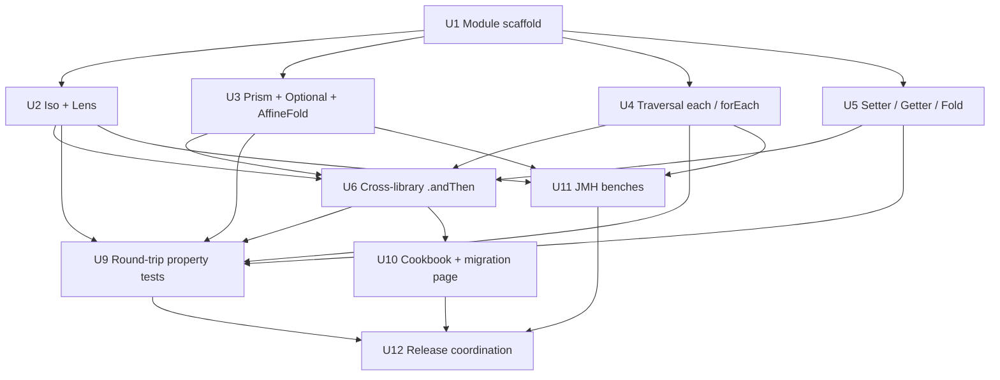

# feat: `eo-monocle` — Monocle 3 interop module

## Overview

Introduce a separate `eo-monocle` sub-module that lets users mix
[Monocle 3](https://www.optics.dev/Monocle/) optics with `cats-eo`
optics seamlessly. The module ships:

1. **Bidirectional conversions** — `toMonocle` / `toEo` for every
   optic family that exists on both sides (Iso, Lens, Prism, Optional,
   Traversal, Setter, Getter, Fold, Review).
2. **Cross-library composition** — `eoLens.andThen(monocleTraversal)`
   and the symmetric direction land at the lowest common ancestor in
   the lattice without explicit conversions, mirroring Monocle's own
   subtype lattice (Iso ⊂ Lens ⊂ Optional ⊂ Traversal ⊂ Setter; Iso ⊂
   Prism ⊂ Optional; Lens ⊂ Getter ⊂ Fold).
3. **One-way conversions for eo-only families** — `AlgLens[F]`,
   `Grate`, `Kaleidoscope`, `JsonPrism` / `JsonFieldsTraversal`
   degrade to a Monocle `Setter` or `Fold` (the cats-eo encoding has
   no direct Monocle counterpart, so the conversion preserves what it
   can and the inverse direction is not offered).
4. **Generic-derived optics interop** — `eo.generics.lens` returns
   NamedTuple-bearing optics; Monocle's `Focus` macro returns
   plain-tuple `Lens`. A NamedTuple ↔ tuple flattening adapter lets
   the two macro outputs cross compose.
5. **A migration cookbook recipe + dedicated migration page** showing
   "drop our jar in alongside your existing Monocle code" and "leaf
   migrate one Lens at a time" workflows.
6. **Round-trip property tests** that verify every conversion is
   law-preserving (a Monocle Lens converted to eo and back behaves
   identically; an eo Lens converted to Monocle obeys
   `monocle.law.LensLaws`).
7. **JMH micro-benchmarks** that quantify conversion overhead so users
   know hot-path cost (target: ≤2 ns per `.toMonocle` /
   `.toEo` for the simple-carrier optics; allocations only in the
   wrapper, not the body of `get` / `modify`).

The module is published as a separate Maven artifact
(`dev.constructive::cats-eo-monocle:0.1.0`) on the same release line as
`cats-eo` itself; depends on `cats-eo` and on
`dev.optics:monocle-core_3:3.3.0`. Out of root aggregator until the
0.1.0 cut so the core release path is not blocked by interop work.

## Problem Frame

### Why interop now

Monocle 3 is the de-facto Scala 3 optics library and the incumbent
that any cats-eo user is most likely already using. The current
adoption story for cats-eo is "rewrite all your Monocle optics in eo"
— a non-starter for any codebase larger than a toy. A first-class
interop module changes the pitch from "rewrite" to "drop our jar in":

- **Leaf-by-leaf migration.** A user can keep every Monocle Lens they
  already have, and reach for an eo `Kaleidoscope` or `AlgLens` only
  at the leaf where Monocle has no equivalent — composing the eo
  optic into the existing Monocle chain via `.toMonocle` (degrading
  to a Setter / Fold), or composing the Monocle prefix into the eo
  chain via `.toEo` (preserving Monocle's capabilities through the
  interop wrapper).
- **Marketing surface.** "cats-eo runs alongside Monocle" is the
  one-sentence elevator pitch. Without an interop module, the
  one-sentence pitch becomes "cats-eo replaces Monocle" — which
  collides with reality the moment a prospective user opens their
  build.sbt and sees `dev.optics:monocle-core` already on the
  classpath.
- **Cookbook gravity.** Monocle's own cookbook + the broader Scala
  optics literature (Penner's *Optics By Example*, the Haskell `lens`
  package's tutorial) are recipe-rich; cats-eo can lean on those as
  the "you already know how to write this in Monocle" framing and
  show "and here is the same recipe with the eo carrier when you
  reach for an existential capability."
- **Validation by external suite.** Running Monocle's own
  `monocle.law.LensLaws` against eo-derived optics (after `.toMonocle`)
  is a free integration-grade soundness check. If our optics encode
  the same laws as Monocle's, this composes transparently. Where it
  doesn't, the divergence becomes documentable.

### What "interop" means concretely

Three composable scenarios drive the design:

**Scenario 1 — Existing Monocle codebase, single eo leaf.** User has
a deep `monocle.Lens` chain into a record; the leaf field needs an
`AlgLens[Set]` because they're aggregating per-key. They write:

```scala
val outerM: monocle.Lens[Org, Department]  = Focus[Org](_.dept)
val innerM: monocle.Lens[Department, Team] = Focus[Department](_.team)
val leafE: Optic[Team, Team, Members, Members, AlgLens[Set]] = …  // eo

// Cross-library chain — outer two stay Monocle, leaf is eo:
val full = outerM.andThen(innerM).andThen(leafE.toMonocle)
// → monocle.Setter[Org, Members], because AlgLens degrades to Setter
```

**Scenario 2 — Existing eo codebase, single Monocle leaf.** User has
adopted cats-eo for the bulk of their optics but pulls in a
third-party library that ships only Monocle Lenses for its types.
They write:

```scala
val outerE: Optic[App, App, User, User, Tuple2] = lens[App](_.user)
val leafM: monocle.Lens[User, Profile]          = ThirdPartyLib.profileLens

val full = outerE.andThen(leafM.toEo)
// → eo.Optic[App, App, Profile, Profile, Tuple2], composes naturally
```

**Scenario 3 — Mixed-library composition without explicit conversion.**
Most ergonomic; the user writes `eoLens.andThen(monocleLens)` and the
implicit machinery picks a direction (D2 below). Result is a single
optic in the chosen encoding.

### Why this is its own module

- `cats-eo` deliberately depends only on `cats-core`. Pulling in
  `monocle-core` would force every cats-eo user to also pay the
  Monocle dep (and force the cats-eo jar to track Monocle's
  release cadence). Keeping `eo-monocle` separate preserves the
  zero-Monocle install of the base library.
- The interop surface is large — every optic family × two directions
  + composition + laws = ~40 entry points. Mixing it into `core/`
  would dilute the optics catalogue.
- It can release on its own cadence post-0.1.0. cats-eo 0.1.x bumps
  minor when an existing API breaks; eo-monocle can rev separately
  when Monocle ships a 4.0 with breaking changes.

## Scope change — 2026-04-25

User narrowed the 0.1.0 scope by dropping four requirements (R8, R10,
R11, R13) and the units that depend on them (Units 7 and 8 entirely;
Units 5 and 9 trimmed). Rationale: the dropped surface is either lossy
(Review → Setter, eo-only families → Setter/Fold), out-of-aggregate
asymmetric (cross-library laws glue), or reachable through other
documented idioms (NamedTuple flattening). Stable Unit IDs are
preserved — Units 7 and 8 remain in the document as `[Dropped]` stubs
so cross-references in commit messages or external trackers still
resolve.

The reduced scope keeps the bidirectional core (Iso, Lens, Prism,
Optional, AffineFold, Traversal, Setter, Getter, Fold), cross-library
`.andThen`, round-trip property tests, the cookbook + migration page,
and JMH benches. New effort estimate: ~12-20 days part-time,
unchanged at the 2-4 week range.

## Requirements Trace

- **R1. Bidirectional Iso conversion.** `eo.optics.BijectionIso[S, S,
  A, A]` ↔ `monocle.Iso[S, A]`, plus the polymorphic
  `BijectionIso[S, T, A, B]` ↔ `monocle.PIso[S, T, A, B]`. Round-trip
  preserves `get` / `reverseGet`.
- **R2. Bidirectional Lens conversion.** `eo.optics.GetReplaceLens` /
  `SimpleLens` / `SplitCombineLens` (all `Optic[…, Tuple2]` shapes) ↔
  `monocle.Lens[S, A]` / `monocle.PLens[S, T, A, B]`. The eo→Monocle
  direction goes through whichever fused subclass the eo lens
  carries; Monocle→eo always lands as a `GetReplaceLens` (which
  preserves Monocle's `get` + `replace` shape verbatim).
- **R3. Bidirectional Prism conversion.** `MendTearPrism` /
  `PickMendPrism` ↔ `monocle.Prism[S, A]`. Round-trip preserves the
  partial read and the build direction.
- **R4. Bidirectional Optional / AffineFold conversion.**
  `Optic[S, S, A, A, Affine]` ↔ `monocle.Optional[S, A]`, plus the
  polymorphic / poly variant. AffineFold (`T = Unit`) converts to
  a `monocle.Fold[S, A]` on the read side and is one-way (no
  meaningful reverse, since AffineFold has no write path).
- **R5. Bidirectional Traversal conversion.** Two directions need a
  decision (D3): `Traversal.each` (PowerSeries) is the
  composition-friendly canonical conversion target;
  `Traversal.forEach` (Forget[F]) converts only as an output of
  `.toEo` when the user explicitly opts in to the fold-only carrier.
  `monocle.Traversal[S, A]` ↔ `Optic[S, S, A, A, PowerSeries]` is the
  default round-trip.
- **R6. Bidirectional Setter conversion.** `Optic[S, T, A, B, SetterF]`
  ↔ `monocle.Setter[S, A]` / `PSetter[S, T, A, B]`.
- **R7. Bidirectional Getter / Fold conversion.** `Optic[S, S, A, A,
  Forgetful]` ↔ `monocle.Getter[S, A]`; `Optic[F[A], Unit, A, A,
  Forget[F]]` ↔ `monocle.Fold[S, A]`. Note the shape mismatch on
  Fold: monocle.Fold is `[S, A]` (any source), eo Fold is
  `[F[A], Unit, A, A]` (source pinned to the container shape) — the
  conversion fixes `S = F[A]` and otherwise commutes.
- **R8. Review conversion.** **[DROPPED 2026-04-25]** Lossy mapping
  (Review → Setter only on the Monocle side; reverse requires a
  user-supplied left inverse). Out of 0.1.0 scope; users wanting
  Review-shaped reverse builds keep eo's `Review` directly or write
  the `A => S` function inline.
- **R9. Cross-library `.andThen`.** `eoOptic.andThen(monocleOptic)`
  and `monocleOptic.andThen(eoOptic)` work without explicit
  conversion. D2 picks the resulting encoding (eo vs monocle); the
  other direction is reachable via an explicit `.toMonocle` /
  `.toEo` on the result.
- **R10. One-way conversion of eo-only families to Monocle.**
  **[DROPPED 2026-04-25]** Each conversion is lossy (AlgLens loses its
  classifier, Kaleidoscope loses its shatter direction, Json* loses
  the Ior failure surface) and adds breadth without compounding the
  bidirectional core. Users who need a Monocle-shaped output from an
  eo-only family invoke `.modify` / `.foldMap` directly inside a
  `monocle.Setter.apply` / `monocle.Fold.apply` constructor at the
  call site — a one-liner whose surface area doesn't justify a
  module-level entry point.
- **R11. Generic-derived interop.** **[DROPPED 2026-04-25]** Cross-
  library use of `eo.generics.lens[S](_.field)` against
  `monocle.Focus[S](_.field)` is reachable today by converting the
  eo result via `.toMonocle` (R2) and wrapping in `monocle.Iso` for
  the NamedTuple-to-plain-type flatten if needed. The dedicated
  flattening adapter would only marginally improve ergonomics; defer
  to 0.2.x once usage patterns are clearer.
- **R12. Round-trip law tests.** For every bidirectional conversion,
  a property test asserts `optic.toMonocle.toEo ≡ optic` and
  `monocleOptic.toEo.toMonocle ≡ monocleOptic`. Behaviour equality
  is observable through `get` / `modify` / `replace` / `getOption`
  on a sufficient fixture set (cats-eo's existing `Person` /
  `Address` / `Shape` test ADTs).
- **R13. Discipline glue: run Monocle's laws on eo optics.**
  **[DROPPED 2026-04-25]** Both libraries already have their own
  law canons (eo's discipline RuleSets, Monocle's `monocle.law.*`
  ScalaCheck props), and the round-trip property tests in R12
  observably check the conversion preserves behaviour — the
  cross-library law glue would have been belt-and-suspenders. Out
  of 0.1.0 scope.
- **R14. JMH benchmark harness.** A new `MonocleInteropBench` in the
  `benchmarks/` sub-project measures `.toMonocle.get` /
  `.toMonocle.modify` and the inverse direction against the
  unwrapped baselines. Goal: prove the conversion overhead is on
  the order of one indirection (≤2 ns at 99th percentile on the
  reference hardware described in the production-readiness plan).
- **R15. Cookbook recipe + migration page.** New cookbook recipe
  ("Migrate from Monocle to cats-eo, incrementally") in
  `site/docs/cookbook.md`, plus a dedicated `site/docs/migration-from-monocle.md`
  with the three scenarios above as worked examples.
- **R16. MiMa baseline = empty.** First-publish module; no prior
  artifact, MiMa enforcement begins on `eo-monocle 0.1.1+` against
  `0.1.0`.

## Scope Boundaries

**In scope.** Everything required by R1–R16.

- New sub-module `monocle/` with package `eo.monocle`.
- Conversion functions: `toMonocle` / `toEo` extension methods on
  every optic family.
- Cross-library `.andThen` extensions on both `Optic[…]` (eo) and
  `monocle.{Lens, Prism, Optional, Traversal, Setter, Getter, Fold}`
  (Monocle).
- Round-trip property tests in a new `monocle/src/test/scala/eo/monocle/`
  tree.
- One JMH bench class, `MonocleInteropBench`, in `benchmarks/`.
- One cookbook recipe + one migration page in `site/`.

**Out of scope (explicit non-goals).**

- **No `circe-optics` interop layer.** Monocle has a separate
  `dev.optics:monocle-circe` library. cats-eo's `circe/` module
  already covers the Json surface; bridging the two circe-bound
  surfaces would require taking on `monocle-circe` as a dep and
  reasoning about three Json encodings simultaneously. Defer to a
  hypothetical 0.2.x `eo-monocle-circe` add-on. (See OQ-conv-6.)
- **No Monocle `Focus`-macro re-implementation.** Users who want
  derived optics in eo write `eo.generics.lens[S](_.field)`; users
  who want Monocle-derived write `monocle.Focus[S](_.field)`. The
  cross-compose path is `eoGenericLens.toMonocle` (via R2) followed
  by Monocle's own composition; the dedicated NamedTuple-flattening
  adapter (originally R11) is dropped from 0.1.0 scope and deferred
  to 0.2.x.
- **No conversion for `monocle.std.*` accessors** (`monocle.std.list`,
  `monocle.std.map`, etc.). These are pre-built Monocle optics that
  already work via the standard `.toEo` extension. Users
  cross-compose them like any other Monocle optic; we don't ship
  cats-eo equivalents that pretend to be these accessors.
- **No `IxLens` / `IxTraversal` interop.** Monocle 3 doesn't ship an
  indexed-optics hierarchy. The cats-eo indexed plan (007) is
  itself deferred to 0.2.x; interop with Monocle on a hierarchy
  Monocle doesn't have is moot until indexed lands on both sides.
- **No `dev.optics:monocle-state` interop.** Monocle's
  `monocle-state` library lifts optics into `cats.data.State`. Users
  who need it can `.toMonocle` then call into monocle-state directly;
  no cats-eo wrapper.
- **No Scala-2 cross-compile.** cats-eo is Scala 3 only.
- **No backport of cats-eo conversions onto Monocle 2.x.** Monocle 3
  is the only target; users on Monocle 2 should upgrade Monocle
  before adopting eo-monocle.

## Context & Research

### Relevant code (cats-eo side)

- `core/src/main/scala/eo/optics/Optic.scala` — base `Optic[S, T, A,
  B, F]` trait, the `andThen` overloads, the cross-carrier
  `andThen` via `Morph[F, G]`. The interop module's
  `eoOptic.andThen(monocleOptic)` extension lives parallel to these,
  reaching for either an explicit `Composer` or a `.toEo` /
  `.toMonocle` step.
- `core/src/main/scala/eo/optics/{Lens, Prism, Iso, Optional,
  Traversal, Setter, Getter, Fold, AffineFold, Review}.scala` — each
  family's constructors. The `.toMonocle` half of every conversion
  reads through these constructor shapes; the `.toEo` half builds
  the same constructor shape from the Monocle side.
- `core/src/main/scala/eo/data/{Affine, AlgLens, FixedTraversal,
  Forget, Forgetful, Grate, Kaleidoscope, PowerSeries, SetterF}.scala`
  — carrier definitions. Each carrier's `to` / `from` shape pins the
  conversion arithmetic.
- `core/src/main/scala/eo/{Composer, Morph}.scala` — the cross-
  carrier composition machinery. The interop module's `.andThen`
  extensions piggyback on Morph's structure (one extension per
  direction, summons converters as `given`s on the implicit chain).
- `docs/research/2026-04-23-composition-gap-analysis.md` — the 14×14
  inner-matrix of optic compositions, including the structural-`U`
  cells that no Monocle equivalent exists for. This is the
  load-bearing reference for §"Family-by-family conversion table"
  below.
- `docs/research/2026-04-19-optic-families-survey.md` — every named
  optic family in the ecosystem with cats-eo prioritisation. Drives
  the "what to interop with" decision per family.

### Relevant code (Monocle 3 side)

- `monocle.PIso[S, T, A, B]` extends `PLens[S, T, A, B]` with
  `PPrism[S, T, A, B]`. Subtype lattice: `PIso ⊂ PLens ⊂ POptional ⊂
  PTraversal ⊂ PSetter`; `POptional ⊃ PPrism`; `Getter ⊂ Fold` (no
  type param `T`). Mono variants `Iso[S, A] = PIso[S, S, A, A]`
  similarly.
- `monocle.PLens` exposes `get`, `replace`, `modify`, `modifyA`,
  `modifyF`, `getOrModify` (returns `Either[T, A]` — same shape as
  cats-eo's `Optional.getOrModify`!), `andThen`, `first`, `second`,
  `split`. The `getOrModify` lineage is the structural bridge
  between Monocle's lattice and cats-eo's Affine carrier.
- `monocle.Focus[S](_.field)` is the macro counterpart to
  `eo.generics.lens[S](_.field)`. Monocle returns a plain
  `Lens[S, FieldType]`; eo returns a `SimpleLens[S, FieldType,
  NamedTuple[…]]` whose complement is a NamedTuple. The dedicated
  flattening adapter (R11) was dropped from 0.1.0 scope; cross-
  library users go through the standard `.toMonocle` (R2) and add a
  Monocle Iso for the NamedTuple flattening at the call site if
  needed.
- `monocle.law.{LensLaws, PrismLaws, IsoLaws, OptionalLaws,
  TraversalLaws, SetterLaws}` — Monocle's law canon, expressed as
  Scalacheck properties. The cross-library laws-glue (R13) was
  dropped from 0.1.0 scope; round-trip property tests (R12) cover
  the conversion-soundness signal observably.
- Profunctor encoding: `monocle.PLens.modifyF` requires `Functor[F]`,
  `modifyA` requires `Applicative[F]`, `parModifyF` requires
  `Parallel[F]`. Internally Monocle 3 is no longer a polymorphic
  profunctor but a concrete trait hierarchy — every optic is a
  trait with a `getOrModify` / `modify` / `replace` shape directly.
  This is the pre-2024 profunctor encoding having been simplified;
  see Monocle 3.0 changelog. Implication for us: conversion is
  straightforward because Monocle's internal shape is *closer* to
  cats-eo's existential shape than Haskell-`lens`-style profunctor
  optics would be.

### External references

- Monocle 3 source — <https://github.com/optics-dev/Monocle> (tag
  `v3.3.0`).
- Monocle laws — `monocle-law_3:3.3.0`, package `monocle.law`.
- *Optics By Example* (Chris Penner, 2020) — Haskell-flavoured but
  the recipe taxonomy carries through to Scala. Cookbook recipe in
  R15 cites the relevant chapters.
- The cats-eo composition-gap analysis at
  `docs/research/2026-04-23-composition-gap-analysis.md` —
  authoritative for "which carrier pairs compose natively" on the
  eo side.
- The cats-eo optic-families survey at
  `.claude/projects/-home-rhansen-workspace-opensource-scala-cats-eo/memory/optic-families-survey.md`
  — the catalogue of every optic family in the ecosystem; the
  "Monocle has it" vs "eo has it" split per family informs which
  conversions are bidirectional vs one-way.

### Institutional learnings

None yet specific to interop; any Monocle-version-skew gotchas (e.g.
"PLens stopped extending PSetter on 3.4.0") should land in
`docs/solutions/` as they accrue.

## Key Technical Decisions

- **D1. Module name and artifact.** `monocle/` on disk, sbt name
  `monocle`, artifact `cats-eo-monocle`, package `eo.monocle`.
  Rationale: every published module follows the `cats-eo-*` artifact
  prefix, and the on-disk directory matches the trailing path
  segment. Package `eo.monocle` keeps the namespace short.
- **D2. Composition direction default — eo wins.** When the user
  writes `eoLens.andThen(monocleLens)` (or the symmetric direction),
  the result is an eo `Optic[…, F]`, not a Monocle `Lens`. Rationale:
  the eo carrier carries strictly more capability (existential `X`,
  `AssociativeFunctor`, `Composer` lattice) than the Monocle subtype
  hierarchy. Going eo→Monocle in the middle of a chain loses
  capability that may be needed downstream; staying in eo loses
  nothing because Monocle's shape always re-converts on demand. The
  user can force the other direction at any point with an explicit
  `.toMonocle` on the chain. (This is the answer to OQ-conv-1
  posed in the brief.)
- **D3. Traversal canonical target — `PowerSeries`.** `monocle.Traversal[S, A]`
  ↔ `Optic[S, S, A, A, PowerSeries]` is the default both directions.
  Rationale: `each` (PowerSeries) is composition-friendly; `forEach`
  (Forget[F]) is the fast-path terminal carrier and isn't reached by
  Monocle's API anyway (Monocle traversals are always composable).
  The `Forget[F]` direction is exposed as `.toEoForEach` /
  `.fromEoForEach` for users who explicitly want the fold-only
  shape, but is not the default.
- **D4. Mono and Poly conversions both ship in v0.1.0.** The brief
  asks whether to defer Poly (`PLens` / `PIso` / `PPrism` / `POptional`
  / `PTraversal` / `PSetter`) to v0.2. We ship both at v0.1.0
  because the eo side is poly-by-default (`Optic[S, T, A, B, F]`) and
  shipping mono-only conversions would require pinning `S = T` and
  `A = B` at every conversion site — strictly more API surface for
  strictly less expressiveness. Cost: each conversion gets one
  Mono and one Poly entry point (factored via `[S, T, A, B]` with
  `T = S`, `B = A` defaulted in the mono helpers). (Answers
  OQ-conv-2.)
- **D5. Conversion API — extension methods, not free functions.** The
  user writes `eoLens.toMonocle`, not `eo.monocle.MonocleConverters.toMonocle(eoLens)`,
  and not `import eo.monocle.given; eoLens.lift[Monocle]`. Rationale:
  extension methods are the most discoverable Scala 3 idiom, they
  IDE-auto-complete after the dot, and the typeclass-given approach
  introduces a typeclass surface that doesn't otherwise pay rent.
  (Answers OQ-conv-4.)
- **D6. Wander / Choice typeclass route — no.** Monocle 3 internally
  uses `cats.arrow.Choice` and a custom `Traversing` typeclass for
  its profunctor-like operations. The interop module *does not*
  expose `Wander[Forget[F]]` or `Choice[Affine]` instances; instead,
  conversions go through the public-API methods of each optic
  family (`get` / `getOrModify` / `modify` / `foldMap`). Rationale:
  the typeclass route is fragile across Monocle versions (Monocle
  internalised its profunctor classes and the API of those classes
  is not part of Monocle's binary-stability story). The
  public-API route is slow but *right* — and the JMH bench in R14
  quantifies the overhead so users can decide. (Answers OQ-conv-3.)
- **D7. Discipline glue — superseded.** Originally resolved as "yes,
  re-export Monocle's law fixtures into discipline-specs2". The
  2026-04-25 scope change dropped R13; round-trip property tests
  (R12) now carry the conversion-soundness signal alone. Both
  libraries enforce their own law canons internally; the cross-
  library re-run was belt-and-suspenders.
- **D8. Generic-derived adapter — superseded.** Originally resolved
  as "lives in `eo-monocle`, not `eo-generics`". The 2026-04-25
  scope change dropped R11 entirely; users cross-compose generic-
  derived optics by going through the standard `.toMonocle` (R2)
  and wrapping the NamedTuple flattening in an inline Monocle Iso
  at the call site if needed.
- **D9. Versioning — eo-monocle 0.1.0 ships with cats-eo 0.1.0.**
  Both artefacts cut at the same git tag. Subsequent eo-monocle
  releases stay binary-compat with cats-eo's matching `0.1.x` line
  via `tlMimaPreviousVersions` enforcement; minor bumps stay in
  lockstep until 0.2.0. If Monocle 3.4.0 or 4.0.0 ships
  binary-breaking changes, eo-monocle gets an out-of-cycle minor
  bump tracking that — cats-eo itself is unaffected. (Answers
  OQ-conv-… — there isn't a numbered question for this, but it's
  the natural follow-up to D9 from the production-readiness plan.)

## Family-by-family conversion table

The conversion arithmetic per family. "→ M" means cats-eo to Monocle;
"← M" means Monocle to cats-eo; "—" means the direction has no
meaningful target (we don't ship that conversion).

| eo family (carrier) | Monocle family | → M | ← M | Polymorphic? | Notes |
|---|---|---|---|---|---|
| `BijectionIso` (`Forgetful`) | `Iso[S, A]` / `PIso[S, T, A, B]` | yes | yes | yes (poly via `PIso`) | Round-trip preserves `get` and `reverseGet`. |
| `GetReplaceLens` / `SimpleLens` / `SplitCombineLens` (`Tuple2`) | `Lens[S, A]` / `PLens[S, T, A, B]` | yes | yes | yes | Monocle→eo always lands as `GetReplaceLens` (preserves Monocle's `get`+`replace`). |
| `MendTearPrism` / `PickMendPrism` (`Either`) | `Prism[S, A]` / `PPrism[S, T, A, B]` | yes | yes | yes | `MendTearPrism` is the round-trip canonical eo Prism; `PickMendPrism` round-trips through `MendTearPrism`. |
| `Optional` (`Affine`) | `Optional[S, A]` / `POptional[S, T, A, B]` | yes | yes | yes | Both sides expose `getOrModify: S => Either[T, A]` — direct field-by-field copy. |
| `AffineFold` (`Affine`, `T=Unit`) | `Fold[S, A]` | yes | n/a | n/a | Monocle has no AffineFold; eo→Monocle degrades to Fold. ← M direction not offered (Monocle Fold has more shapes than AffineFold can host). |
| `Traversal.each` (`PowerSeries`) | `Traversal[S, A]` / `PTraversal[S, T, A, B]` | yes | yes | yes | Default Traversal canonical pair. |
| `Traversal.forEach` (`Forget[F]`) | `Traversal[S, A]` (read-only) / `Fold[S, A]` | yes (degrades to Fold) | — | n/a | One-way; the lossy direction is documented in the migration guide. |
| `FixedTraversal[N]` (`FixedTraversal[N]`) | `Traversal[S, A]` / `PTraversal[S, T, A, B]` | yes (loses arity at the type level) | — | n/a | Monocle has no fixed-arity traversal; conversion preserves runtime behaviour but loses the `N` phantom. |
| `Setter` (`SetterF`) | `Setter[S, A]` / `PSetter[S, T, A, B]` | yes | yes | yes | Direct shape match. |
| `Getter` (`Forgetful`, `T=Unit`) | `Getter[S, A]` | yes | yes | n/a | `Forgetful` carrier's `get` is identity, lines up with Monocle's `Getter.get`. |
| `Fold` (`Forget[F]`, `T=Unit`) | `Fold[S, A]` | yes (with `S = F[A]`) | partial | n/a | ← M only when the user supplies the container shape `F[_]`; otherwise Monocle's plain Fold has no eo target. |

Out of 0.1.0 scope (per the 2026-04-25 scope change): Review (R8 dropped),
AlgLens / Grate / Kaleidoscope / JsonPrism / JsonFieldsPrism /
JsonTraversal / JsonFieldsTraversal (all R10 dropped). Users wanting
those interop shapes today reach for `.modify` / `.foldMap` directly
inside a Monocle constructor at the call site — see the migration
page for the exact one-liner per family.

The table is the single source of truth for what conversions ship in
each Implementation Unit; cross-reference by row when the unit's
"Files" section names which converters land.

## Cross-library composition lattice

For a same-library chain (eo×eo or Monocle×Monocle), the existing
`.andThen` machinery handles everything. For mixed chains, the
interop module ships extension methods on both directions:

| Outer | Inner | Result default (D2) | Implementation |
|---|---|---|---|
| `eo.Optic[…, F]` | `monocle.Iso[A, B]` | `eo.Optic[…, F]` | `outer.andThen(inner.toEo)` |
| `eo.Optic[…, F]` | `monocle.Lens[A, B]` | `eo.Optic[…, F]` (or `Tuple2` if F lifts) | `outer.andThen(inner.toEo)` |
| `eo.Optic[…, F]` | `monocle.Prism[A, B]` | `eo.Optic[…, F]` (or `Either`) | `outer.andThen(inner.toEo)` |
| `eo.Optic[…, F]` | `monocle.Optional[A, B]` | `eo.Optic[…, Affine]` | via `Composer[F, Affine]` |
| `eo.Optic[…, F]` | `monocle.Traversal[A, B]` | `eo.Optic[…, PowerSeries]` | via `Composer[F, PowerSeries]` |
| `eo.Optic[…, F]` | `monocle.Setter[A, B]` | `eo.Optic[…, SetterF]` | via `Composer[F, SetterF]` |
| `eo.Optic[…, F]` | `monocle.Getter[A, B]` | `eo.Optic[…, Forgetful]` | via `Composer[F, Forgetful]` if F lifts |
| `eo.Optic[…, F]` | `monocle.Fold[A, B]` | `eo.Optic[…, Forget[F]]` | via the Fold-builder bridge |
| `monocle.Lens[S, A]` | `eo.Optic[A, A, B, B, F]` | `eo.Optic[…, F]` | `outer.toEo.andThen(inner)` |
| `monocle.Optional[S, A]` | `eo.Optic[A, A, B, B, F]` | `eo.Optic[…, Affine]` (via Composer) | `outer.toEo.andThen(inner)` |
| `monocle.Traversal[S, A]` | `eo.Optic[A, A, B, B, F]` | `eo.Optic[…, PowerSeries]` (via Composer) | `outer.toEo.andThen(inner)` |
| `monocle.Setter[S, A]` | `eo.Optic[A, A, B, B, F]` | `eo.Optic[…, SetterF]` (via Composer) | `outer.toEo.andThen(inner)` |
| `monocle.Fold[S, A]` | `eo.Optic[A, A, B, B, F]` | `eo.Optic[…, Forget[F]]` | `outer.toEo.andThen(inner)`, F derived from container |
| `monocle.Getter[S, A]` | `eo.Optic[A, A, B, B, F]` | `eo.Optic[…, Forgetful]` (or F via Composer) | `outer.toEo.andThen(inner)` |

The mixed-direction `.andThen` extensions live in `eo.monocle.syntax`
and are summoned via a single `import eo.monocle.syntax.*` at the
call site. (Open question OQ-conv-8: is this enough, or should we
also expose a `given` so the imports happen automatically? — see
Open Questions.)

## Implementation Units

Unit granularity matches the production-readiness plan: each unit is
roughly one atomic commit's worth of work. Effort tiers: **S** = ½ day,
**M** = 1–2 days, **L** = 3–5 days, **XL** = a week+. Total: 2–4 weeks
of part-time work for a single contributor.

### Unit 1: Module scaffold + sbt sub-project

**Goal:** Stand up a new `monocle/` sub-project that depends on `core`
+ `monocle-core` + (Test only) `laws`, has a `publish / skip := false`
setting, and is wired into `build.sbt` as a published module. Empty
package object `eo.monocle.package`. No conversion logic yet —
pure plumbing.

**Requirements:** R16 (MiMa baseline = empty).

**Dependencies:** none — foundational.

**Files:**
- Modify: `build.sbt` — add `lazy val monocle: Project = project.in(file("monocle")) …` mirroring the `circeIntegration` shape.
- Create: `monocle/src/main/scala/eo/monocle/package.scala` — empty package object with module-level Scaladoc.
- Create: `monocle/src/test/scala/eo/monocle/SmokeSpec.scala` — single test that confirms the module compiles and has both eo + Monocle on the classpath.
- Modify: root `aggregate(...)` call in `build.sbt` to include `monocle`.

**Approach.** Mirror the `circeIntegration` sub-project setup: `dependsOn(LocalProject("core"), LocalProject("laws") % Test)`, `libraryDependencies += monocle`, `libraryDependencies += discipline % Test`, `commonSettings *`, `scala3LibrarySettings *`. Do NOT enable `-opt-inline:<sources>` (the module crosses into Monocle, where we must not bake internals — same rationale as `circeIntegration`).

**Effort:** S.

**Execution note.** If the eo-monocle release schedule (D9) decides to ship the artifact *after* 0.1.0, the `aggregate` line stays out of root and the sub-project is invoked explicitly (`sbt monocle/test`). Decision deferred to OQ-conv-9.

**Patterns to follow:** `circeIntegration` setup in `build.sbt` lines 330–350.

**Test scenarios:**
- Smoke: `import monocle.Lens; import eo.optics.Lens` compiles in the smoke spec.
- Smoke: `cats-eo-monocle_3-0.1.0-SNAPSHOT.jar` is produced by `sbt monocle/publishLocal`.

**Verification:**
- `sbt "clean; monocle/compile; monocle/test"` green.
- `sbt monocle/publishLocal` produces the jar locally.

### Unit 2: Iso + Lens conversions (mono + poly)

**Goal:** Ship `BijectionIso ↔ monocle.Iso` / `PIso` and `Lens variants ↔ monocle.Lens` / `PLens`, both directions, mono and poly.

**Requirements:** R1, R2, R12 (round-trip part).

**Dependencies:** Unit 1.

**Files:**
- Create: `monocle/src/main/scala/eo/monocle/IsoConverters.scala` — extension methods `BijectionIso[S, T, A, B].toMonocle: PIso[S, T, A, B]` and `monocle.PIso[S, T, A, B].toEo: BijectionIso[S, T, A, B]`. Mono helpers `BijectionIso[S, S, A, A].toMonocle: Iso[S, A]` etc.
- Create: `monocle/src/main/scala/eo/monocle/LensConverters.scala` — same shape for Lens. The Monocle→eo direction always builds a `GetReplaceLens` (preserves `get`+`replace`).
- Create: `monocle/src/test/scala/eo/monocle/IsoConvertersSpec.scala` — round-trip property tests.
- Create: `monocle/src/test/scala/eo/monocle/LensConvertersSpec.scala` — same.

**Approach.** Iso conversion: extract `to` / `from` from the eo side, supply them to `monocle.PIso.apply`. Reverse direction: pull `get` / `reverseGet` off the Monocle iso, hand them to `BijectionIso.apply`. Lens: same shape with `get` / `replace` instead of `to` / `from`. Both round-trips are pure data-shape transformations, no carrier juggling.

**Effort:** M.

**Execution note.** Watch out for Monocle's `PIso` poly variant being a method on the trait (so `.toMonocle` on a poly eo Iso must build `monocle.PIso.apply[S, T, A, B](get, reverseGet)`, not call any subtype). Same for `PLens.apply`.

**Patterns to follow:** This is the `Composer` builder pattern from `Affine.scala:237` (the `Composer[Tuple2, Affine]` instance) — extract the eo pieces, hand them to the Monocle constructor.

**Test scenarios:**
- Round-trip: `eoIso.toMonocle.toEo` is observably equal to `eoIso` on `get`+`reverseGet` via property tests across `Person`, `Address`, `(Int, String)`, `String <-> List[Char]` fixtures.
- Round-trip: `monocleIso.toEo.toMonocle` ditto.
- Same for Lens with `get`+`modify`+`replace` observed.
- Edge case: poly variant `PIso[String, Int, Char, Boolean]` round-trips.
- Error path: n/a (total conversions, no failure modes).

**Verification:**
- `sbt monocle/test` green; both new spec files pass.

### Unit 3: Prism + Optional + AffineFold conversions

**Goal:** Cover the partial-focus families. Prism is bidirectional (mono and poly); Optional is bidirectional (mono and poly); AffineFold goes one-way (eo → Monocle Fold, no inverse — Monocle's Fold doesn't constrain to a single read shape).

**Requirements:** R3, R4, R12.

**Dependencies:** Unit 1.

**Files:**
- Create: `monocle/src/main/scala/eo/monocle/PrismConverters.scala` — `MendTearPrism ↔ monocle.PPrism` and the `PickMendPrism` round-trip route through `MendTearPrism`.
- Create: `monocle/src/main/scala/eo/monocle/OptionalConverters.scala` — direct `getOrModify` ↔ `getOrModify` mapping; both sides have the same shape.
- Create: `monocle/src/main/scala/eo/monocle/AffineFoldConverters.scala` — one-way `AffineFold[S, A].toMonocleFold: monocle.Fold[S, A]`.
- Create: matching three spec files in `monocle/src/test/scala/eo/monocle/`.

**Approach.** Prism: `MendTearPrism.tear: S => Either[S, A]` lines up with Monocle's `Prism.getOrModify: S => Either[S, A]`. `mend: A => S` lines up with `Prism.reverseGet`. Direct construction both directions. Optional: same plumbing, just with `T` allowed to differ from `S` in the poly variant. AffineFold: build `monocle.Fold.apply` from `Optic.foldMap` summoned via `ForgetfulFold[Affine]`.

**Effort:** M.

**Execution note.** Monocle's `Prism.apply` takes `getOption: S => Option[A]` + `reverseGet: A => S`, NOT `getOrModify`. Use `Prism(getOption)(reverseGet)` factory if it exists in 3.3.0; otherwise call `Prism.fromGetOrModify` if exposed. Confirm via cellar before starting the unit; if neither exists, write a small adapter that goes through `Optional.apply` and re-types.

**Patterns to follow:** Existing `Optional` constructor at `core/src/main/scala/eo/optics/Optional.scala:48` pins the shape both libraries share.

**Test scenarios:**
- Round-trip Prism on `Shape.Circle | Shape.Square` and on `Either[String, Int]`.
- Round-trip Optional on `Map[K, V]` lookup, partial refinement, predicate-gated access.
- One-way AffineFold→Fold on the same Optional fixtures (confirms the read path).
- Edge case: Prism that always misses (`Optic.empty` shape) round-trips correctly.
- Edge case: Optional whose miss branch genuinely changes `S` (poly variant).

**Verification:**
- `sbt monocle/test` green.

### Unit 4: Traversal conversions — `each` and `forEach` with explicit branching

**Goal:** Ship the `Traversal.each ↔ monocle.Traversal` round-trip plus the one-way `Traversal.forEach → monocle.Traversal/Fold` degradation. Also ship `FixedTraversal[N] → monocle.Traversal` (loses the `N` phantom).

**Requirements:** R5, R12.

**Dependencies:** Unit 1, Unit 3 (Optional conversion is reused for the Affine-bridged path).

**Files:**
- Create: `monocle/src/main/scala/eo/monocle/TraversalConverters.scala` — three entry points:
  - `eoEach: Optic[…, PowerSeries].toMonocle: monocle.PTraversal` (round-trip canonical).
  - `eoForEach: Optic[…, Forget[F]].toMonocleAsTraversal: monocle.Traversal` (one-way; documents the carrier loss).
  - `eoFixed: Optic[…, FixedTraversal[N]].toMonocle: monocle.PTraversal` (one-way; loses N).
  - `monocle.PTraversal.toEo: Optic[…, PowerSeries]` (round-trip canonical).
- Create: `monocle/src/test/scala/eo/monocle/TraversalConvertersSpec.scala` — round-trip on `each`; behaviour-equivalence on the other two directions (modify produces the same output when the chain terminates).

**Approach.** PowerSeries → Monocle: extract `modifyA[F]` via `ForgetfulTraverse[PowerSeries, Applicative]`, supply it to `monocle.PTraversal.apply`. Monocle → PowerSeries: build a `Traversal.pEach[T, A, B]`-shaped optic where `Traverse[T]` is supplied by the user (Monocle's Traversal doesn't carry `T` in its type, so the user has to nominate the container — same as the Fold conversion in Unit 5).

**Effort:** L (the modifyA bridge needs careful Applicative threading).

**Execution note.** Monocle's `PTraversal.modifyA` requires `Applicative[F]`; cats-eo's `ForgetfulTraverse[PowerSeries, Applicative]` provides the same. The conversion is one method call deep. The trickier bit is the inverse — given a `monocle.PTraversal[S, T, A, B]`, producing an `Optic[S, T, A, B, PowerSeries]` requires us to *invent* the existential `X` (PowerSeries holds the original `S` plus the `Vect`-of-foci). Plan: stash the `S` in `X` and re-invoke Monocle's `modifyA[Const[Vector[A], *]]` to extract the foci on the way in, mirror the index-based reconstruction Monocle uses on the way out.

**Patterns to follow:** `Traversal.pEach` at `core/src/main/scala/eo/optics/Traversal.scala:105` — the existential `X = (Int, T[A])` and the index-tracking from-direction is the model.

**Test scenarios:**
- Round-trip: `Traversal.each[List, Int].toMonocle.toEo` is observably equal on `getAll` and `modify` for property-generated `List[Int]`.
- One-way: `Traversal.forEach[List, Int, Int].toMonocleAsTraversal.modify(_+1)` matches the eo result.
- Fixed-arity: `Traversal.three(_._1, _._2, _._3, identity).toMonocle.modify(...)` produces the same triple.
- Edge case: empty container (`List.empty`).
- Edge case: single-element container.
- Error path: a Monocle traversal that violates `mapAccumulate` ordering (test we mirror Monocle's behaviour, not impose our own).

**Verification:**
- `sbt monocle/test` green.

### Unit 5: Setter / Getter / Fold conversions

**Goal:** Ship the remaining bidirectional conversions for the read-only / write-only optics. Setter is bidirectional poly; Getter is bidirectional mono; Fold is bidirectional with a fixed-`F` constraint on `← M`. (Review interop dropped — see R8.)

**Requirements:** R6, R7.

**Dependencies:** Unit 1.

**Files:**
- Create: `monocle/src/main/scala/eo/monocle/SetterConverters.scala`.
- Create: `monocle/src/main/scala/eo/monocle/GetterConverters.scala`.
- Create: `monocle/src/main/scala/eo/monocle/FoldConverters.scala`.
- Create: matching three spec files in `monocle/src/test/`.

**Approach.** Setter: directly bridge `modify` ↔ `modify`. Getter: directly bridge `get` ↔ `get`. Fold: bridge `foldMap` ↔ `foldMap`; for `← M` the user supplies the container `F[_]`.

**Effort:** M.

**Execution note.** Monocle's `Fold.apply` factory takes `foldMap: [M: Monoid] => (A => M) => S => M`, which is a polymorphic-method-typed argument. Confirm Scala 3's polymorphic-function-type syntax (`[M] => (A => M) => S => M` with `M: Monoid` constraint) actually compiles into Monocle's expected shape via cellar, then construct accordingly. May require a wrapper that calls `Fold.fromFoldable` instead.

**Patterns to follow:** existing eo→eo Fold construction; the eo `Fold` constructor takes `Forget[F]` directly.

**Test scenarios:**
- Setter round-trip on `Person.name`, `Map[K, V].at(k)`.
- Getter round-trip on `Person.age`.
- Fold round-trip: `Fold[List, Int].toMonocle.toEo[List]` ≡ original; `← M` direction with `F = List`, `F = Vector`, `F = NonEmptyList`.
- Edge case: Setter that's a constant overwrite (`replace` only, no `modify` consumer of the input).
- Edge case: empty Fold (no foci).

**Verification:**
- `sbt monocle/test` green.

### Unit 6: Cross-library composition syntax — `eoOptic.andThen(monocleOptic)` and reverse

**Goal:** Ship the cross-library `.andThen` extensions on both directions per the lattice table above. User imports `eo.monocle.syntax.*` and gets transparent mixed-library composition.

**Requirements:** R9.

**Dependencies:** Units 2, 3, 4, 5 (all single-direction conversions must exist).

**Files:**
- Create: `monocle/src/main/scala/eo/monocle/syntax/package.scala` — the syntax-import object.
- Create: `monocle/src/main/scala/eo/monocle/syntax/EoToMonocle.scala` — extension methods on `Optic[…]` that take Monocle optic arguments.
- Create: `monocle/src/main/scala/eo/monocle/syntax/MonocleToEo.scala` — extension methods on `monocle.{Lens, …}` that take eo `Optic` arguments.
- Create: `monocle/src/test/scala/eo/monocle/syntax/CrossComposeSpec.scala` — exhaustive cross-pair behaviour tests.

**Approach.** Each cross-pair extension method internally calls `outer.andThen(inner.toEo)` (or the reverse). Result type follows D2: eo-leaning. The 14 entries from the cross-library lattice table become 14 (or 28 if you count the symmetric direction separately) extension methods, each ~5 lines.

**Effort:** L (lots of small entries, all need to type-check correctly).

**Execution note.** Scala 3 implicit resolution can pick the wrong extension when both `eo.monocle.syntax` and the existing `eo.optics.Optic.*` extensions are in scope. Pin the priority: place the cross-library extensions at lower `given` priority so the same-library `.andThen` always wins when both sides are eo or both Monocle. Use `import eo.monocle.syntax.*` *under* the existing `import eo.optics.Optic.*` if priority needs explicit control.

**Patterns to follow:** existing cross-carrier `andThen` at `core/src/main/scala/eo/optics/Optic.scala:166-176` — the Morph-summoning extension is the model.

**Test scenarios:**
- Happy path: every row in the cross-library lattice table compiles and produces the expected result type.
- Happy path: each composed optic obeys the laws of its result family (run the composed result through `LensTests` / `OptionalTests` / etc.).
- Edge case: composing the same eo + Monocle pair twice in different orders produces structurally different but observably equal optics.
- Edge case: Monocle Iso + eo Lens composed in either order — Iso is the identity element on the Monocle side, lattice should preserve eo-Lens shape.
- Error path: composing across a sink family (e.g. eo `AlgLens` outer + Monocle Lens inner) — the eo side has no Composer outbound, so the result must be a Setter or compile error per D2; document expected behaviour.

**Verification:**
- `sbt monocle/test` green; cross-pair spec passes.
- `sbt "monocle/scalafix --check"` confirms no spurious imports in the syntax package.

### Unit 7: Eo-only family one-way conversions — AlgLens / Grate / Kaleidoscope / Json*

**[Dropped 2026-04-25]** R10 dropped from 0.1.0 scope — each conversion was lossy and added breadth without compounding the bidirectional core. Users needing a Monocle-shaped output from an eo-only family invoke `.modify` / `.foldMap` inside a `monocle.Setter.apply` / `monocle.Fold.apply` constructor at the call site (one-liner per family). The migration page (Unit 10) documents the idiom for AlgLens, Grate, Kaleidoscope, and the four Json* families.

### Unit 8: Generic-derived optics interop — NamedTuple ↔ tuple flattening

**[Dropped 2026-04-25]** R11 dropped from 0.1.0 scope — the dedicated NamedTuple flattening adapter only marginally improves over `eoGenericLens.toMonocle` followed by an inline `monocle.Iso` if the user wants the plain-type focus. Defer to 0.2.x once cross-library generic-derived usage patterns are clearer.

### Unit 9: Round-trip property tests

**Goal:** Property-test that `optic.toMonocle.toEo ≡ optic` and `monocleOptic.toEo.toMonocle ≡ monocleOptic` for every conversion shipped in Units 2-5. Behaviour equality is observed through `get` / `modify` / `replace` / `getOption` against a sufficient fixture set.

**Requirements:** R12.

**Dependencies:** Units 2-6 (all bidirectional conversions and the cross-library compose syntax must exist).

**Files:**
- Create: `monocle/src/test/scala/eo/monocle/laws/ConversionRoundTripSpec.scala` — round-trip property tests for every bidirectional conversion (Iso, Lens, Prism, Optional, AffineFold, Traversal, Setter, Getter, Fold).

**Approach.** ScalaCheck `Prop` per conversion direction, observed through a battery of operations: for a Lens, run `get` on the original and on `lens.toMonocle.toEo`, assert equal; same for `modify`, `replace` with random inputs from the existing eo fixtures (`Person`, `Address`, `Shape`, `Map[K, V]`, `Either[A, B]`).

**Effort:** S.

**Execution note.** No cross-library law glue needed (R13 dropped). Both libraries already enforce their own law canons internally; the round-trip property test catches any encoding-translation bug observably without re-running the Monocle / eo law fixtures on translated optics.

**Patterns to follow:** existing law spec wiring at `tests/src/test/scala/eo/OpticsLawsSpec.scala` for the ScalaCheck-meets-specs2 idiom.

**Test scenarios:**
- Every conversion in the family-by-family table (R12 universe) round-trips for `get` / `modify` / `replace`.
- Edge fixtures: `Map[K, V].at(k)` Optional, `Either[A, B]` Prism, `(Int, String)` Iso, empty list traversal.
- Negative test: a deliberately-broken hand-rolled `.toMonocle` (e.g. always returns the same constant) flunks the round-trip — confirms the property is actually enforcing.

**Verification:**
- `sbt monocle/test` green.

### Unit 10: Cookbook recipe + migration page

**Goal:** Ship the user-facing documentation. One cookbook recipe in
`site/docs/cookbook.md` ("Migrate from Monocle to cats-eo, leaf-by-leaf")
plus a dedicated migration page `site/docs/migration-from-monocle.md`
covering the three scenarios from §"What 'interop' means concretely".
mdoc-verified runnable examples throughout.

**Requirements:** R15.

**Dependencies:** Units 2-6 (all bidirectional conversion entry points and the cross-library compose syntax must compile so mdoc snippets work).

**Files:**
- Modify: `site/docs/cookbook.md` — add the new recipe in the migration section.
- Create: `site/docs/migration-from-monocle.md` — long-form migration guide.
- Modify: `site/docs/directory.conf` — add the new page to the Laika nav.
- Modify: `site/build.sbt` (or root `build.sbt`'s docs project) — add `LocalProject("monocle")` to `dependsOn` so mdoc compiles snippets against the interop module.

**Approach.** Three worked scenarios as numbered sections in the migration page; each ends with a "what to keep, what to migrate" paragraph. The cookbook recipe is the condensed version (~250 LoC). Both pages cite Penner's *Optics By Example* chapters where applicable (per the cookbook + diagrams research review). Migration page also documents the eo-only-family idiom (post-R10-drop): "to feed an `AlgLens` / `Grate` / `Kaleidoscope` / `JsonPrism` into a Monocle pipeline, wrap `.modify` or `.foldMap` inside `monocle.Setter.apply` / `monocle.Fold.apply` at the call site."

**Effort:** M.

**Execution note.** With Units 7 and 8 dropped, this unit's dependency surface is just Units 2-6 — strictly bidirectional conversions plus the compose syntax. No `mdoc:nest` workarounds needed; every fence compiles directly.

**Patterns to follow:** existing migration content in `site/docs/` (per the production-readiness plan Unit 11).

**Test scenarios:**
- mdoc verification: every fenced code block compiles against the live monocle/ jar.
- Reading test: the migration page covers all three scenarios, ends with a "next steps" pointer to the cookbook.

**Verification:**
- `sbt docs/mdoc; sbt docs/laikaSite` green.
- New page renders correctly in the local preview (`sbt docs/tlSitePreview`).

### Unit 11: JMH benchmarks — conversion overhead

**Goal:** Quantify per-call conversion cost. New `MonocleInteropBench` class in `benchmarks/` with paired `eoNative` / `eoToMonocle` / `monocleNative` / `monocleToEo` methods for Lens / Prism / Optional / Traversal so the JMH report shows side-by-side overhead per family.

**Requirements:** R14.

**Dependencies:** Units 2–4 (conversions for these families must exist).

**Files:**
- Create: `benchmarks/src/main/scala/eo/bench/MonocleInteropBench.scala`.
- Modify: `benchmarks/build.sbt` (or root) — add `dependsOn(LocalProject("monocle"))`.
- Modify: `site/docs/benchmarks.md` — add a section reporting the interop overhead numbers (mdoc-bound to the JMH JSON output if the docs pipeline supports it; otherwise a static table, regenerated manually per release).

**Approach.** Four benchmark methods per family, all hot-path operations (`get`, `modify`, `replace`, plus `foldMap` for Traversal). Same fixture as `OpticsBench` (Nested0…Nested6 case-class tree). JMH defaults: `@Fork(3) @Warmup(5) @Measurement(5) @BenchmarkMode(AverageTime) @OutputTimeUnit(NANOSECONDS)`.

**Effort:** S.

**Execution note.** Conversion overhead target: ≤2 ns at 99th percentile on the reference hardware. If bench shows >5 ns, file an investigation issue; the conversion is wrapping a single function call, so anything beyond direct dispatch suggests an unexpected boxing path.

**Patterns to follow:** `benchmarks/src/main/scala/eo/bench/OpticsBench.scala`'s LensBench / PrismBench shape — paired `eo*` / `m*` methods on a shared fixture.

**Test scenarios:**
- Compile-only — JMH runs are explicit per CLAUDE.md (`sbt "benchmarks/Jmh/run -i 5 -wi 3 -f 1 .*MonocleInteropBench.*"`).

**Verification:**
- `sbt benchmarks/compile` green.
- Manual run: `sbt "benchmarks/Jmh/run -i 1 -wi 1 -f 1 MonocleInteropBench.eoToMonocleGet"` produces a number.

### Unit 12: Release coordination — version, MiMa baseline, CHANGELOG

**Goal:** Wire eo-monocle into the same `tlBaseVersion`-driven release flow as cats-eo. First publish: v0.1.0 alongside cats-eo 0.1.0. MiMa baseline empty for 0.1.0; enforced from 0.1.1.

**Requirements:** R16.

**Dependencies:** Units 1-6, 9-11 (artifact must compile + tests pass; Units 7 and 8 dropped per scope change).

**Files:**
- Modify: `build.sbt` — confirm `monocle` sub-project is included in the publish-set (i.e. `publish / skip := false`, no `publish / skip := true` shadow).
- Modify: `CHANGELOG.md` — add the eo-monocle 0.1.0 release notes section.
- Modify: `README.md` — add a one-paragraph "Interop with Monocle" pointer in the Modules section.
- Create: `monocle/README.md` (optional) — module-local README for users who navigate by sub-project; brief, points at the migration page.

**Approach.** Same `sbt-typelevel-ci-release` flow as cats-eo. The 0.1.0 tag publishes both `cats-eo` and `cats-eo-monocle` simultaneously. Patch releases on `0.1.x` are coordinated.

**Effort:** S.

**Execution note.** Confirm `tlMimaPreviousVersions := Set.empty` for `monocle` sub-project explicitly — `ThisBuild` setting from cats-eo applies to all sub-projects, which is what we want, but the eo-monocle setting needs to follow the same pattern when 0.1.1 ships (compare against `0.1.0` for both artifacts).

**Patterns to follow:** existing `circeIntegration` publish settings.

**Test scenarios:**
- `sbt monocle/publishLocal` produces `cats-eo-monocle_3-0.1.0-SNAPSHOT.jar` with the expected POM.
- `sbt monocle/mimaReportBinaryIssues` runs without errors (no previous version to compare yet).
- README and CHANGELOG mention the new module.

**Verification:**
- `sbt "clean; +test"` green across all sub-projects including `monocle`.
- Tag-driven release dry-run via `sbt-typelevel-ci-release`'s `tlCiReleaseTest` task (if available; otherwise via a release-candidate tag on a fork).

## Effort summary

| Unit | Title | Effort |
|---|---|---|
| 1 | Module scaffold | S |
| 2 | Iso + Lens conversions (mono + poly) | M |
| 3 | Prism + Optional + AffineFold conversions | M |
| 4 | Traversal conversions — `each` + `forEach` branching | L |
| 5 | Setter / Getter / Fold conversions | M |
| 6 | Cross-library composition syntax | L |
| 7 | Eo-only family one-way conversions | **dropped** |
| 8 | Generic-derived optics interop | **dropped** |
| 9 | Round-trip property tests | S |
| 10 | Cookbook recipe + migration page | M |
| 11 | JMH benchmarks — conversion overhead | S |
| 12 | Release coordination | S |

Tier conversion: S = ½ day, M = 1-2 days, L = 3-5 days. Total: 4 S + 4 M + 2 L = 2 + (4-8) + (6-10) = **12-20 days** of part-time work. Realistically **2-4 weeks** for a single contributor working part-time. The 2026-04-25 scope change removed ~½-2 days of dropped work plus ~1 day of trimming in Units 5 and 9; the headline range shifts from 12.5-21.5 to 12-20 days.

## Dependency graph



Critical path: U1 → U2 → U6 → U9 → U10 → U12 (six units, includes the
heaviest ones). Parallel opportunities: U3 / U4 / U5 can run in
parallel after U1, gated by Unit 6's "all conversions must exist"
constraint. Units 7 and 8 dropped per the 2026-04-25 scope change.

## Cats-eo-side gaps uncovered while researching

These are concerns surfaced by the interop design that block, or
significantly complicate, clean implementation. They should be
addressed in cats-eo `core` *before* eo-monocle Unit 1 starts, or at
the latest before the unit that depends on them.

- **Gap-1. `Composer[F, SetterF]` is incomplete.** The composition-gap
  analysis (§0.3) confirms `Tuple2 → SetterF` is the only inbound
  Composer for SetterF; `Either → SetterF`, `Affine → SetterF`,
  `PowerSeries → SetterF`, `Forget → SetterF` are all absent. Several
  cross-library composition rows (eo Prism + monocle Setter, eo
  Optional + monocle Setter, eo Traversal + monocle Setter) need
  these to compile. **Disposition:** ship the missing inbound
  Composers as part of cats-eo 0.1.0 (the Composer instances are
  small, mostly mechanical) OR document the gap in the migration
  page and tell users to take the Setter via `.toEo` and downcast
  to a `Setter[S, A]` directly. Recommended: ship the Composers;
  it's <100 LoC and the migration page is much cleaner.
- **Gap-2. Monocle's `Fold[S, A]` has no eo target without nominating
  `F[_]`.** cats-eo's Fold is `Optic[F[A], Unit, A, A, Forget[F]]` —
  the source type is pinned to `F[A]`. Monocle's Fold is `Fold[S, A]`
  with `S` arbitrary. Conversion from Monocle Fold requires the user
  to supply the container shape `F[_]` at the call site. **Disposition:**
  Document the asymmetry; ship `monocleFold.toEoFoldFor[F[_]: Foldable]`
  with explicit `F` type-arg-supplied. Alternative: introduce a
  more general `Fold` shape in cats-eo that doesn't pin `S`; this is
  a much bigger change and out of scope here. Defer to a 0.2.x
  decision.
- **Gap-3. `Composer[PowerSeries, AlgLens[F]]` is U-by-design.**
  Cross-library `Traversal + Monocle Lens + AlgLens` chains cannot
  reach the AlgLens leaf as inner via Unit 6's compose syntax.
  `Composer[Affine, AlgLens[F]]` (`affine2alg`) shipped in cats-eo
  Unit 21 (commit `08c26a1`), so Optional + AlgLens chains are
  fine; only the PowerSeries side stands as `U` per the composition-
  gap §3.3.4 resolution. **Disposition:** document in the migration
  page; users who want a Traversal-of-AlgLens push the AlgLens under
  the traversal via `traversal.modify(a => algLens.replace(...)(a))`.
- **Gap-4. Carriers without `Composer` outbound — `AlgLens`, `Grate`,
  `Forget[F]` (cross-`F`).** These are sink families on the eo side
  (composition-gap §0.3). Cross-library composition `eo AlgLens
  outer + monocle Lens inner` cannot reach a non-trivial result —
  the eo side has no outbound bridge to lift the Monocle Lens *into*
  AlgLens. **Disposition:** document as a "no composition supported,
  use `.toMonocleSetter` first" guidance in the migration page; do
  NOT ship Composers (the design call to keep AlgLens / Grate as
  sink families is intentional, per the Grate plan D3).
- **Gap-5. `monocle.PLens.modifyF` requires `cats.Functor[F]`; eo's
  `modifyF` requires `ForgetfulTraverse[F, Functor]`.** These are
  observably equivalent for the `Tuple2` carrier, but the conversion
  must thread the right typeclass at the right call site. **Disposition:**
  no cats-eo change needed; just careful conversion code.
- **Gap-6. eo's `Review` is structural-only.** Monocle's Iso / Prism
  `reverseGet` is reachable through the optic trait; eo's `Review`
  is a free-standing case class. **Disposition:** moot for 0.1.0
  — R8 (Review interop) was dropped; users keep eo's `Review` for
  reverse-build use cases or write the `A => S` function inline.

If Gap 1 lands before eo-monocle starts, the interop design is
clean. If it doesn't, Unit 6 ships more "no composition supported"
branches (eo Prism / Optional / Traversal × monocle Setter) and the
migration page grows a "things you can't do" section. Recommended
path: close Gap 1 as part of cats-eo 0.1.0 and let eo-monocle
inherit the cleaned-up surface. (Gap 3's PowerSeries × AlgLens leg
is U-by-design and stays documented; Gap 4 — sink-family outbound —
is also U-by-design.)

## Open questions

### Resolved during planning

- **OQ-conv-1. Composition direction default.** → eo wins (D2).
  Rationale: the eo carrier has strictly more capability; falling out
  of the eo encoding mid-chain loses information; user can force the
  other direction with explicit `.toMonocle`.
- **OQ-conv-2. Mono-only or Mono+Poly on day one?** → Mono+Poly (D4).
  Rationale: eo is poly-by-default; mono-only would *strictly add*
  API surface for *strictly less* expressiveness.
- **OQ-conv-3. Wander / Choice typeclass route?** → No (D6). Use the
  public-API route (`getOrModify` / `modify` / `foldMap`), accept the
  ~1–2 ns overhead, document it via JMH bench. Cleaner cross-version
  story, no entanglement with Monocle's internal typeclass binary
  stability.
- **OQ-conv-4. Naming — extension method vs free function vs
  typeclass?** → Extension method (D5). `eoLens.toMonocle` is the
  most discoverable Scala 3 idiom.
- **OQ-conv-5. Run Monocle's laws on eo optics via discipline glue?**
  → **Obsoleted 2026-04-25** when R13 was dropped. Round-trip
  property tests (R12) cover the soundness signal observably; both
  libraries already enforce their own law canons internally, so the
  cross-library re-run is belt-and-suspenders.
- **OQ-conv-7. Where does the NamedTuple ↔ tuple flattening live?**
  → **Obsoleted 2026-04-25** when R11 was dropped. The dedicated
  flattening adapter is deferred to 0.2.x.

### Deferred — need user input before Unit 1

These are the questions where the user's call genuinely changes the
plan. Listed in the order they affect work.

- **OQ-conv-6. Json-optic interop scope.** **Resolved 2026-04-25**
  by the R10 drop — Json* conversions are out of 0.1.0 scope.
  Users wanting JsonPrism in a Monocle pipeline wrap
  `jsonPrism.modifyImpl` inside `monocle.Optional.apply` at the call
  site (the migration page documents this idiom).
- **OQ-conv-8. Cross-library `.andThen` — explicit-import or
  auto-`given`?** Unit 6 today requires `import eo.monocle.syntax.*`
  to enable the cross-library extensions. Alternative: provide a
  `given` so the extensions are picked up automatically via implicit
  scope on the optic types. Tradeoff: explicit import is more
  predictable (no surprise compilation success/failure when the user
  adds `import eo.monocle.*` somewhere unrelated); auto-given is
  more ergonomic at the cost of polluting the implicit search at
  every `.andThen` site.
- **OQ-conv-9. Aggregate or out-of-aggregate?** Unit 1 ships the
  module aggregated into root by default, so `sbt compile` /
  `sbt test` exercise it. Alternative: keep eo-monocle out of root
  aggregate (like `benchmarks/` and `circeIntegration/`'s old
  pattern), invoke explicitly. Tradeoff: in-aggregate is simpler
  for users; out-of-aggregate keeps the core release cycle cleaner
  if eo-monocle ever blocks (e.g. Monocle ships a bug). Default
  recommendation: in-aggregate, switch to out-of-aggregate only if
  Monocle stability becomes a release-blocking issue.
- **OQ-conv-10. AffineFold ← Monocle Fold direction.** Today the
  AffineFold conversion is one-way (eo → Monocle Fold). The reverse
  ("a Monocle Fold whose container has at most one element becomes
  an eo AffineFold") is structurally meaningful but requires a
  predicate witness that the user supplies (`fold.length <= 1` for
  every input). Worth shipping at 0.1.0 or defer? Recommendation:
  defer — the use case is narrow, the predicate witness is awkward,
  and the migration page can suggest "convert through Optional then
  drop the modify path" as a workaround.
- **OQ-conv-11. Polymorphic vs monomorphic conversion entry-point
  flavors.** D4 says we ship both at v0.1.0. The poly entry points
  have one extra type parameter and are slightly less discoverable.
  Sub-question: do we put the mono helpers at `BijectionIso[S, S, A,
  A].toMonocle: Iso[S, A]` and the poly at `BijectionIso[S, T, A,
  B].toMonoclePoly: PIso[S, T, A, B]`, OR do we use overloading on
  the same name `.toMonocle` and let Scala resolution pick? Default:
  overloading — but Scala 3's overload resolution can pick weirdly
  for type-changing optics; verify in Unit 2.
- **OQ-conv-12. Run Monocle's `monocle.law` against eo optics in CI,
  or only in local dev?** **Resolved 2026-04-25** by the R13 drop —
  no cross-library laws glue ships, so the CI question is moot.
  Round-trip property tests run in the same `monocle/test` step as
  the rest of the module's tests, no separate CI job needed.

### Stretch / future

- **OQ-conv-future-1.** A higher-level "lift any Monocle codebase
  into eo-shape" tool — a script that goes file-by-file in a target
  repo and rewrites `monocle.Lens` to `eo.optics.Lens`, etc. Not in
  scope for the interop module; would be its own project (probably
  a Scalafix rule + cookbook).
- **OQ-conv-future-2.** Support for Monocle's `monocle-state`
  add-on. Unclear whether the cats-eo carrier story has anything
  meaningful to say about State-bound optics — defer until a user
  files a request.
- **OQ-conv-future-3.** A sibling `eo-quicklens` interop module
  for Scala-2-era `quicklens`. Unlikely to pay rent (quicklens
  users are mostly on Scala 2).

## Future considerations

If the eo-monocle module is well-received and pulls in users who
don't otherwise know cats-eo:

- Consider promoting it to a top-level "monocle-with-existential-
  carriers" pitch in the README. Today the README is cats-first;
  if the audience reach is via Monocle migration, the README's first
  paragraph should reflect that.
- Add a `monocle-laws` dep on the laws sub-project itself (not just
  the eo-monocle test scope) so downstream projects building on
  cats-eo-laws can run the Monocle law canon against their own
  eo-derived optics without taking eo-monocle as a Compile dep.
  Caveat: this circular-ish dep needs care; possibly a fourth
  artifact `cats-eo-monocle-laws` carved out of `monocle/`.
- A "Monocle interop" badge for the README, linking to the migration
  page. Cheap; visible.
