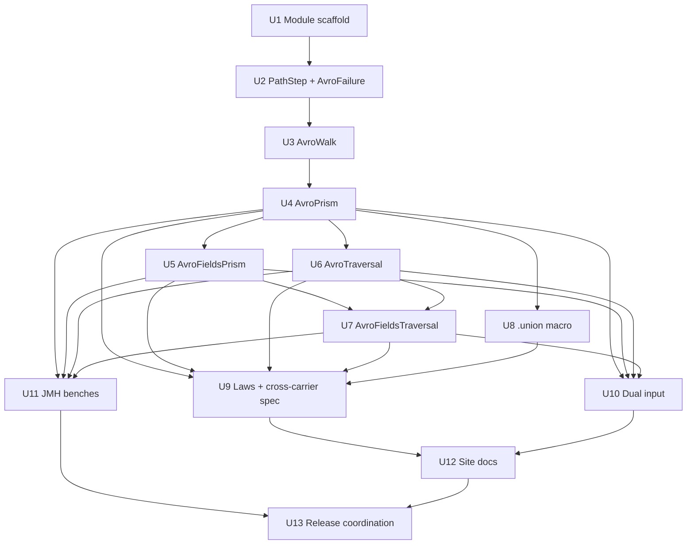

# feat: `eo-avro` — cursor-backed optics over Apache Avro records

## Overview

Introduce a new `eo-avro` sub-module that mirrors the feature surface
of [`eo-circe`](../../circe/) for the [Apache Avro](https://avro.apache.org/)
data model. The module ships:

1. **Cursor-backed `AvroPrism[A]`** — a Prism from a generic Avro
   record (and/or an `Array[Byte]` binary wire payload) into a native
   Scala type `A`, backed by a chosen codec library (vulcan / avro4s /
   raw apache; D1 picks one for v0.1.0).
2. **Multi-field `AvroFieldsPrism[A]`** — Scala 3 NamedTuple sibling
   for focusing N fields atomically per a single record (parallel to
   `JsonFieldsPrism`; preserves D4 atomicity from the circe plan).
3. **Array traversals** — `AvroTraversal[A]` and
   `AvroFieldsTraversal[A]` — for Avro `array<T>` iteration with
   prefix/suffix split, structurally identical to the circe pair.
4. **Path-walking macros** — `.field(_.name)`, `.at(i)`,
   `.selectDynamic`, `.fields(_.a, _.b, ...)`, `.each` reused
   verbatim from the circe macro template, plus an Avro-specific
   `.union[Branch]` macro for resolving union alternatives (Avro's
   schema-driven feature with no JSON parallel).
5. **Two call-surface tiers** — default Ior-bearing returning
   `Ior[Chain[AvroFailure], GenericRecord]` (or `Array[Byte]` —
   D5) on the write side and `Ior[Chain[AvroFailure], A]` on the
   read side; `*Unsafe` escape hatches that keep the silent
   pass-through hot path for callers who measured.
6. **`GenericRecord | Array[Byte]` dual input** — the Avro analogue
   of circe's `Json | String`. Strings (Avro JSON wire format) ship
   as a third overload `Avro | Array[Byte] | String` (D6) but the
   binary form is the canonical wire shape.
7. **Structured `AvroFailure` ADT** — schema-resolution failures,
   missing required fields, type mismatches, union resolution
   failures, bad enum symbols, decode failures, deserialisation
   failures, plus the binary-decode parse case (`BinaryParseFailed`).
   Mirrors `JsonFailure`'s Ior-folding helpers (`parseInputIor` /
   `parseInputUnsafe`).
8. **Hot-path direct GenericRecord walking** — bypass the
   schema-aware codec for `modify` / `transform` / `place` paths and
   walk the underlying `IndexedRecord` / `GenericData.Array` /
   `java.util.Map` directly, in the same vein as `JsonPrism`'s direct
   `JsonObject.add` route.
9. **Composes via stock cats-eo `.andThen`** — extends `Optic[Avro,
   Avro, A, A, Either]`, inheriting cross-carrier composition through
   the `Composer` ladder. Cross-carrier `JsonPrism × AvroPrism`
   composition is *not* shipped at v0.1.0 (the carriers represent
   distinct data domains); users go through `decode → modify → encode`
   at the seam.

The module is published as a separate Maven artifact
(`dev.constructive::cats-eo-avro:0.1.0`) on the same release line as
`cats-eo` itself; depends on `cats-eo` and on the chosen Avro codec
library (D1) plus `org.apache.avro:avro:1.11.5` transitively. Out of
root aggregator until the 0.1.0 cut so the core release path is not
blocked by Avro work.

## Problem Frame

### Why Avro, why now

Avro is the dominant *schema-first* serialisation format in the
streaming and data-platform world. Where JSON is the lingua franca of
HTTP APIs, Avro is the lingua franca of Kafka topics, Confluent Schema
Registry pipelines, lakehouse Bronze layers, and any system where the
schema is a first-class artefact rather than an afterthought. A
cats-eo user pulling event data off a Kafka topic, projecting a single
field, and emitting back to a downstream topic is doing *exactly* the
work `JsonPrism` was designed for, but on a different carrier. The
gap between "we have JSON optics" and "we have wire-format optics in
general" is much smaller than it looks — the same path-walk + cursor
machinery applies.

Three concrete pull factors:

- **Streaming gravity.** Kafka, Pulsar, and Kinesis all widely use
  Avro for schema-evolving payloads. The "modify a single field
  in-place without round-tripping through case classes" idiom is
  significantly more useful on Avro than on JSON because Avro
  payloads are typically larger (richer schemas), more
  deeply-nested (event envelopes wrapping domain payloads wrapping
  value objects), and more structurally regular (every record has a
  schema; the payload-shape variance is captured by union types
  with explicit branches).
- **Schema-driven feature surface.** Avro's union types, logical
  types (`decimal`, `uuid`, `timestamp-millis`, …), and enum types
  require a *schema-aware* navigation step that has no JSON
  parallel. This is exactly the territory where the existential
  `Optic` shape pays rent — a `union[Branch]` Prism resolves a
  specific union alternative without the user needing to allocate
  a wrapper type at the codec layer.
- **Schema Registry cookbook gravity.** Confluent Schema Registry's
  binary format prefixes payloads with a 4-byte schema ID; the
  payload itself is regular Avro binary. A cats-eo `AvroPrism`
  paired with a small "registry-aware" wrapper turns "modify field
  X in 100k Kafka messages" into a one-liner that doesn't go
  through `KStream<K, GenericRecord>` materialisation. That
  wrapper is *out of 0.1.0 scope* — see "Stretch / future" — but
  the foundation it would build on is the eo-avro module.

### What `eo-avro` ships concretely

The same three composable scenarios that drove the eo-monocle plan
generalise here, with Avro substituted for Monocle:

**Scenario 1 — Existing Avro stream, single field rewrite.** User
has a Kafka topic with `OrderEvent` payloads (Avro records); they
want to upper-case `OrderEvent.customer.email` for every event in the
topic. The pipeline is:

```scala
val emailPrism: AvroPrism[String] =
  codecPrism[OrderEvent].field(_.customer).field(_.email)

stream
  .mapValues(bytes => emailPrism.modify(_.toUpperCase)(bytes))
  // → Ior[Chain[AvroFailure], Array[Byte]] per event;
  //   Ior.Left becomes a DLQ entry, Ior.Both / Ior.Right
  //   continues into the downstream sink.
```

**Scenario 2 — Schema-evolution cookbook.** A producer added a new
optional field `OrderEvent.customer.loyaltyTier`. Downstream consumer
hasn't redeployed. User wants to backfill events with a default
loyalty-tier value at the proxy layer:

```scala
val tierPrism: AvroPrism[Option[String]] =
  codecPrism[OrderEvent].field(_.customer).field(_.loyaltyTier)

tierPrism.transfer((existing: Option[String]) => existing.orElse(Some("Standard")))(bytes)
```

The `.transfer` surface is byte-identical to circe's, just with
Avro-shaped failure modes flowing through the Ior channel.

**Scenario 3 — Union resolution.** Avro union types `["null", "long",
"string"]` are common; the user wants to focus the `long` branch:

```scala
val amountPrism: AvroPrism[Long] =
  codecPrism[Transaction].field(_.amount).union[Long]

amountPrism.modify(_ + 100L)(record)
// → branches not matching the `long` alternative are left
//   untouched; one AvroFailure.UnionMismatch per skipped record.
```

`.union[Branch]` is the only macro that has no JSON parallel — JSON's
sum types are encoded structurally, not schema-driven.

### Why this is its own module

- `cats-eo-circe` owns the JSON-shaped surface; mixing Avro into it
  would conflate two unrelated wire formats.
- The Avro codec library brings in jackson-databind and the apache
  avro jar; cats-eo users who don't touch Avro shouldn't pay for the
  transitive deps.
- Avro's schema layer adds a class of complexity (union resolution,
  logical types, enum symbols) that doesn't exist on the JSON side;
  isolating it keeps the eo-circe surface understandable in
  isolation and gives the eo-avro surface room to grow new
  schema-specific entry points (e.g. a future `.logicalType[T]`
  macro) without polluting the JSON-shaped optics catalogue.
- Release cadence isolation: Avro 2.0 and Vulcan 2.0 ship on their
  own clocks. eo-avro can rev independently of cats-eo and eo-circe.

## Requirements Trace

- **R1. Cursor-backed `AvroPrism[A]`.** Same shape as `JsonPrism[A]`:
  `Optic[Avro, Avro, A, A, Either]`, where `Avro` is the chosen
  generic-record carrier (D2 picks `IndexedRecord` over
  `GenericRecord`). Constructor `codecPrism[S]` reads `S`'s schema
  via the chosen codec library (D1) and ships an empty path.
- **R2. Multi-field `AvroFieldsPrism[A]`.** NamedTuple sibling of
  R1, atomically focusing N fields per a single record. Carries
  `parentPath: Array[PathStep]`, `fieldNames: Array[String]`, codecs
  for the synthesised NamedTuple. Mirrors `JsonFieldsPrism` byte-for-
  byte at the storage layer; only the "build sub-record" helper
  differs because Avro's record assembly goes through
  `GenericRecordBuilder` rather than `JsonObject.add`.
- **R3. Array traversal `AvroTraversal[A]` + multi-field
  `AvroFieldsTraversal[A]`.** Avro `array<T>` iteration with
  prefix/suffix split. Direct one-to-one parallel with
  `JsonTraversal` / `JsonFieldsTraversal`.
- **R4. Path-walking macros.** `.field(_.name)`, `.at(i)`,
  `.selectDynamic`, `.fields(_.a, _.b, ...)`, `.each` are ported
  from `JsonPrismMacro` near-verbatim. Validation (single-field
  selector, known fields, no duplicates) preserved per circe-plan
  D10.
- **R5. Avro-specific `.union[Branch]` macro.** Schema-aware union-
  alternative resolution. Compiles to a path step that filters
  records whose union branch tag does not match `Branch`. No JSON
  parallel; documented as the module's sole novel macro entry.
- **R6. Two call-surface tiers.** Default Ior-bearing returns
  `Ior[Chain[AvroFailure], Avro]` for write-side and
  `Ior[Chain[AvroFailure], A]` for read-side; `*Unsafe` escape
  hatches keep the silent pass-through hot path. Same shape and
  semantic split as eo-circe (D5 / D7 of the circe plan).
- **R7. Dual input `Avro | Array[Byte]` (and optionally `String`).**
  Default surface accepts a parsed Avro record OR a binary
  payload. Binary payloads are decoded via the codec library's
  binary helper (`vulcan.Codec.fromBinary` / `avro4s.AvroInputStream`
  / `org.apache.avro.io.DecoderFactory`). Failures surface as
  `AvroFailure.BinaryParseFailed`. The `String` overload is
  optional (D6) — Avro JSON wire format is rare in practice, but
  shipping the third overload makes the surface symmetric with
  circe's `Json | String`.
- **R8. Structured `AvroFailure` ADT.** Cases at minimum:
  `PathMissing`, `NotARecord`, `NotAnArray`, `IndexOutOfRange`,
  `DecodeFailed`, `BinaryParseFailed`, `JsonParseFailed`,
  `SchemaResolutionFailed`, `MissingRequiredField`, `TypeMismatch`,
  `UnionMismatch`, `BadEnumSymbol`. Each carries a `PathStep` (or
  `Array[PathStep]` for schema-resolution context) so the surfaced
  failure points at the cursor position that refused. Mirrors
  `JsonFailure` plus the schema-driven cases.
- **R9. Hot-path direct `IndexedRecord` walking.** `modify` /
  `transform` / `place` walks the underlying record (positional
  `get(i)` / `put(i, v)` calls) without re-decoding or re-encoding
  through the codec layer. The codec layer is invoked only at the
  leaf — once per `modify` call, not per step. Same speedup
  pattern as `JsonPrism`'s direct `JsonObject.add` route.
- **R10. Composes via stock cats-eo `.andThen`.** The four
  carrier classes (`AvroPrism`, `AvroFieldsPrism`, `AvroTraversal`,
  `AvroFieldsTraversal`) extend `Optic[…, Either]` and inherit
  cross-carrier composition through the existing `Composer` ladder.
  No new Composer instances needed; the existing ones for
  `Either ∘ F` carry through unchanged.
- **R11. Generic vs Specific records — Generic by default.** v0.1.0
  ships only the Generic carrier (D3). Specific (case-class-mapped)
  records are reachable through the user's chosen codec library's
  derivation; the cats-eo optic surface targets the generic shape
  for consistency with `JsonPrism`'s "Json is opaque structure"
  philosophy.
- **R12. Logical types are transparent.** `decimal`, `uuid`, `date`,
  `timestamp-millis`, `timestamp-micros`, `local-timestamp-millis` —
  the codec library handles the conversion; the eo-avro optic
  surface focuses the *Scala* type the codec produces. User writes
  `.field(_.timestamp)` and `_.timestamp` is `Instant`; the optic
  doesn't care that the on-the-wire layer is `long` with
  `logicalType=timestamp-millis`.
- **R13. Map fields.** Avro `map<T>` is a top-level type distinct
  from `record`. `.at("key")` is the macro entry; the path step
  uses `PathStep.Field(name)` shape but the walk dispatches on the
  parent's runtime type (record-vs-map) and routes accordingly.
  Documented as a feature-flag in the cookbook.
- **R14. Round-trip property tests.** Every macro entry produces
  an optic that passes the eo lens / prism / traversal laws (run
  via discipline-specs2). Plus property tests for binary-roundtrip:
  `AvroPrism[S].modify(identity)(bytes) ≡ Right(bytes)` for all
  randomly-generated `S` values that encode cleanly.
- **R15. JMH benchmarks.** New `AvroOpticsBench` in `benchmarks/`,
  with paired `eoModify` / `nativeModify` (raw codec round-trip)
  per family. Goal: prove the `IndexedRecord`-direct hot path is
  within 2× of the unwrapped baseline.
- **R16. Site documentation.** New `site/docs/avro.md` mirroring
  `site/docs/circe.md`'s structure (concept overview + Mermaid D5
  diagram + per-macro examples). Cookbook recipe for the Kafka
  scenario.
- **R17. MiMa baseline = empty.** First-publish module; MiMa
  enforcement begins on `eo-avro 0.1.1+` against `0.1.0`.

## Scope Boundaries

**In scope.** Everything required by R1–R17.

- New sub-module `avro/` with package `dev.constructive.eo.avro`.
- Four optic classes, the macro entry points, the `AvroFailure`
  ADT, the dual-input parsing helpers.
- Discipline-style law-bearing test suites at
  `avro/src/test/scala/eo/avro/` parallel to the circe corpus.
- One JMH bench class, `AvroOpticsBench`, in `benchmarks/`.
- One site page + one cookbook recipe.

**Out of scope (explicit non-goals).**

- **No Schema Registry integration.** The 4-byte schema-ID prefix
  format and the dynamic schema fetch (Confluent / Apicurio) are
  proxy concerns that don't compose cleanly with the optics layer.
  Defer to a hypothetical `eo-avro-registry` add-on. (Stretch
  question OQ-avro-future-1.)
- **No Specific-record carrier.** v0.1.0 targets Generic only (D3).
  Specific records are user-derived through the chosen codec
  library; cross-compose with eo-avro happens at the codec
  boundary.
- **No `eo-avro × eo-circe` cross-carrier composition.** The two
  carriers represent distinct wire formats. Users converting
  between them go through `decode → modify → encode` explicitly.
- **No multi-codec-library support at v0.1.0.** D1 picks one codec
  library (vulcan recommended); the others are documented as
  "future support" in the open-questions section.
- **No protobuf, MessagePack, CBOR.** Each is its own data model
  and would warrant its own module. eo-avro is the prototype the
  others can copy from.
- **No Scala 2 cross-compile.** cats-eo is Scala 3 only.
- **No Avro IDL macro.** Reading `.avdl` files at compile time is
  out of scope; users supplied `.avsc` schemas (or codec-library
  derivation from case classes).

## Context & Research

### Avro Scala ecosystem — library candidates

The three realistic options for the codec layer are vulcan, avro4s,
and raw apache. Below are the surface shapes captured verbatim from
`cellar get-external` against the most recent published artifacts.

#### Candidate A — Vulcan (`com.github.fd4s:vulcan_3:1.13.0`)

Functional, cats-friendly, schema-derived-from-codec library.
Maintained by the FD4S group (formerly Spotify FOSS, now
community).

```scala
class vulcan.Codec[A]                     // sealed, abstract
  def schema: Either[AvroError, Schema]
  def encode(a: A): Either[AvroError, AvroType]
  def decode(value: Any, schema: Schema): Either[AvroError, A]
  def imap[B](f: A => B)(g: B => A): Codec.Aux[AvroType, B]
  def imapTry[B](f: A => Try[B])(g: B => A): Codec.Aux[AvroType, B]
  // ... + withLogicalType, withTypeName
```

Companion provides:
- Primitive codecs: `boolean`, `byte`, `bytes`, `char`, `double`,
  `float`, `int`, `long`, `short`, `string`, `unit`, `uuid`,
  `decimal(precision, scale)`, `instant`, `instantMicros`,
  `localDate`, `localTimeMillis`, `localTimeMicros`,
  `localDateTime`.
- Container codecs: `option`, `either`, `list`, `set`, `vector`,
  `seq`, `map`, `nonEmptyChain`, `nonEmptyList`, `nonEmptySet`,
  `nonEmptyVector`, `nonEmptyMap`, `chain`.
- Record builder: `Codec.record[A](name, namespace)(f: FieldBuilder[A] => FreeApplicative[Field[A, *], A])`.
- Enum builder: `Codec.enumeration`.
- Union builder: `Codec.union[A](f: AltBuilder[A] => Chain[Alt[A]])`.
- Fixed builder: `Codec.fixed`.
- Binary helpers: `Codec.toBinary` / `fromBinary` / `toJson` /
  `fromJson` (visible in the `Companion members` list).
- A first-class `vulcan.Prism[S, A]` for union-alternative
  resolution: `getOption: S => Option[A]`, `reverseGet: A => S`.

```scala
class vulcan.AvroError                    // sealed, abstract
  def message: String
  def throwable: Throwable
  // Companion: decodeMissingRecordField, decodeUnexpectedType,
  //   decodeMissingUnionAlternative, decodeSymbolNotInSchema,
  //   decodeNameMismatch, decodeUnexpectedRecordName,
  //   decodeNotEqualFixedSize, encodeExceedsFixedSize, ...
```

Macro derivation: vulcan is *not* macro-derived. Codecs are
hand-written via the `record` / `union` / `enumeration` / `fixed`
builders. The third-party `magnolify-avro` provides Magnolia-based
auto-derivation for those who want it. Schema is derived from the
codec, not from the case class.

Cats-effect / fs2 integration: vulcan ships `vulcan-enumeratum` for
enum integration; fs2-kafka integrates via `fs2-kafka-vulcan`. No
direct cats-effect dep on `vulcan-core`.

Dependencies: `cats-core_3:2.13.0`, `cats-free_3:2.13.0`,
`apache:avro:1.11.5`, `jackson-databind:2.21.2`, `slf4j-api:1.7.36`.

Binary stability: vulcan uses tasty-mima; the `Codec` class is
sealed, the builder methods are stable.

**Verdict.** Most aligned with cats-eo's philosophy (cats-native,
explicit codec construction, `Either`-based failure surface). The
schema-from-codec approach matches eo-circe's "user supplies a
codec, we build optics from it." Recommended for v0.1.0. **D1
candidate.**

#### Candidate B — Avro4s (`com.sksamuel.avro4s:avro4s-core_3:5.0.14`)

Sksamuel's full-featured library. Three typeclasses instead of one:

```scala
trait com.sksamuel.avro4s.Encoder[T]
  def encode(schema: Schema): T => Any
  def contramap[U](f: U => T): Encoder[U]

trait com.sksamuel.avro4s.Decoder[T]
  def decode(schema: Schema): Any => T
  def map[U](f: T => U): Decoder[U]

trait com.sksamuel.avro4s.SchemaFor[T]
  def schema: Schema
  def withFieldMapper(mapper: FieldMapper): SchemaFor[T]
  def map[U](fn: Schema => Schema): SchemaFor[U]
  def forType[U]: SchemaFor[U]
```

Auto-derivation via Magnolia (Scala 3 macro) on the
`SchemaFor[T]` / `Encoder[T]` / `Decoder[T]` triple. Schema is
derived *from* the case class, not from a hand-written codec.

Annotations: `AvroDoc`, `AvroNamespace`, `AvroProp`, `AvroError`,
`AvroFixable`, `AvroJavaProp`, `AvroJavaEnumDefault`,
`AvroNoDefault`, `AvroTransient`, `AvroScalePrecision`. Rich
schema customisation; closer to "ship me the schema for this case
class" than vulcan's "build the schema explicitly."

Failure model: `Encoder.encode` and `Decoder.decode` *throw* on
failure (no `Either` wrapping in the public surface). The
hot-path `Function1[Any, T]` shape is fast but loses the
structured-failure channel.

Macro derivation: compile-time via Magnolia (Scala 3 quoted
macros). Uses `magnolia_3:1.1.4`.

Cats-effect / fs2 integration: `avro4s-fs2` provides streaming
support; no direct cats-core dep.

Dependencies: `apache:avro:1.11.4`, `magnolia_3:1.1.4`,
`jackson-databind:2.14.3`. Lighter on the cats stack than vulcan
(no `cats-core` transitive in `core`).

Binary stability: looser than vulcan; sksamuel ships major
versions more frequently. The 5.x line is current at the time of
writing (April 2026); the 4.x → 5.x transition was a major API
break.

**Verdict.** More popular in the Scala ecosystem, more
feature-rich (annotation-driven schema customisation). But:
throws-on-failure surface is a poor match for cats-eo's Ior-
bearing failure-accumulation philosophy; the three-typeclass
shape is more boilerplate than vulcan's single-codec shape.
Defer to "future support" pointer.

#### Candidate C — Raw Apache (`org.apache.avro:avro:1.11.5`)

Direct use of `org.apache.avro.{Schema, generic.GenericRecord,
generic.GenericData, io.BinaryDecoder, io.BinaryEncoder}`. We
write our own codec layer on top.

```scala
class org.apache.avro.Schema       // abstract, JsonProperties + Serializable
  def getType(): Schema.Type       // RECORD, ENUM, ARRAY, MAP, UNION,
                                    // FIXED, STRING, BYTES, INT, LONG,
                                    // FLOAT, DOUBLE, BOOLEAN, NULL
  def getFields(): java.util.List[Schema.Field]
  def getField(name: String): Schema.Field
  def getElementType(): Schema     // ARRAY only
  def getValueType(): Schema       // MAP only
  def getTypes(): java.util.List[Schema]   // UNION only
  def getEnumSymbols(): java.util.List[String]
  def getLogicalType(): LogicalType
  def isUnion(): Boolean
  // ... + parser machinery, JSON serialisation

trait org.apache.avro.generic.GenericRecord extends IndexedRecord
  def put(name: String, value: Any): Unit
  def get(name: String): Any
  // IndexedRecord:
  def put(i: Int, v: Any): Unit
  def get(i: Int): Any
  def getSchema: Schema

class org.apache.avro.generic.GenericRecordBuilder
  def set(field: Schema.Field, value: Any): GenericRecordBuilder
  def set(field: String, value: Any): GenericRecordBuilder
  def build(): GenericData.Record
```

Pros: zero codec abstraction; eo-avro owns the entire surface.
No transitive jackson-databind dep beyond what apache-avro itself
brings.

Cons: we have to write the codec layer (case-class derivation,
union resolution, logical type handling, schema-evolution rules)
ourselves. That's vulcan's reason for existing. Reinventing
it is a 10x scope expansion.

**Verdict.** Use raw apache for the *direct hot path* (D8, R9 —
walking `IndexedRecord` positionally without going through
the codec on every step), but rely on a codec library for
serialisation / deserialisation. Don't build our own codec.

### Library matrix summary

| Property | Vulcan | Avro4s | Raw Apache |
|---|---|---|---|
| `Schema` rep | `org.apache.avro.Schema` | `org.apache.avro.Schema` | `org.apache.avro.Schema` |
| Codec typeclass | `Codec[A]` (one) | `Encoder[A]` + `Decoder[A]` + `SchemaFor[A]` (three) | (none — raw API) |
| Failure shape | `Either[AvroError, A]` | throws | throws |
| Derivation | hand-built; magnolify-avro for auto | Magnolia (Scala 3 macros) | hand-built |
| Schema source | from codec | from case class | from `.avsc` parser or hand-built |
| tasty-mima | yes | not enforced | n/a |
| Cats integration | native (cats-core dep) | external (fs2 add-on) | none |
| fs2-kafka integration | `fs2-kafka-vulcan` | `fs2-kafka-avro4s` (third-party) | direct |
| 1.x-line stability | 1.13.x current; 1.x stable since 2021 | 5.x current; 4 → 5 broke | 1.11.x stable since 2022 |
| Pulls in jackson-databind | yes (transitively via avro) | yes | yes |
| Recommended for v0.1.0 | **yes** | future support | future direct integration |

### Avro schema types — the family table

Every `Schema.Type` reachable in Avro 1.11.x:

| `Schema.Type` | Avro shape | Carrier in Java | eo-avro path step |
|---|---|---|---|
| `RECORD` | named record | `GenericRecord` / `IndexedRecord` | `PathStep.Field(name)` (record dispatch) |
| `ARRAY` | `array<T>` | `GenericData.Array[T]` / `java.util.List` | `PathStep.Index(i)` |
| `MAP` | `map<T>` | `java.util.Map[String, T]` | `PathStep.Field(key)` (map dispatch) |
| `UNION` | `[Branch1, Branch2, ...]` | `Any` (the matched alternative) | `PathStep.UnionBranch(idx)` (new) |
| `ENUM` | enum symbol | `GenericData.EnumSymbol` | leaf — no walk step |
| `FIXED` | fixed-byte | `GenericData.Fixed` | leaf |
| `STRING` | utf-8 | `CharSequence` (typically `Utf8`) | leaf |
| `BYTES` | byte sequence | `java.nio.ByteBuffer` | leaf |
| `INT` / `LONG` / `FLOAT` / `DOUBLE` / `BOOLEAN` / `NULL` | primitive | unboxed JVM primitive | leaf |

The new `PathStep.UnionBranch(idx)` extends `PathStep` with a third
case — necessary because Avro union resolution requires picking a
branch by index, not by name. (The branch *name* is the type name,
which is captured in the codec layer; the path step needs the
positional index for the runtime dispatch.) See D9 below.

### Relevant code (cats-eo side)

- `circe/src/main/scala/dev/constructive/eo/circe/JsonPrism.scala` —
  the cursor-backed Prism shape; eo-avro mirrors the storage layout
  (`path: Array[PathStep]`, `encoder` / `decoder`) and the
  two-tier surface.
- `circe/src/main/scala/dev/constructive/eo/circe/JsonFieldsPrism.scala` —
  multi-field NamedTuple Prism; eo-avro mirrors verbatim.
- `circe/src/main/scala/dev/constructive/eo/circe/JsonTraversal.scala`
  / `JsonFieldsTraversal.scala` — array iteration with prefix/suffix
  split; eo-avro mirrors verbatim.
- `circe/src/main/scala/dev/constructive/eo/circe/JsonPrismMacro.scala`
  — `.field` / `.at` / `.selectDynamic` / `.fields` / `.each` macros;
  eo-avro ports them with one new entry (`.union[Branch]`) and one
  argument-shape change (codec lookup goes through
  `vulcan.Codec[B]` instead of `(Encoder[B], Decoder[B])`).
- `circe/src/main/scala/dev/constructive/eo/circe/JsonFailure.scala`
  — failure ADT + `parseInputIor` / `parseInputUnsafe` helpers;
  eo-avro mirrors with the schema-driven cases added.
- `circe/src/main/scala/dev/constructive/eo/circe/JsonWalk.scala` —
  shared FP walk helpers (foldLeftM); eo-avro ports the algorithmic
  shape with the parent-type dispatch generalised to record / array
  / map / union.
- `circe/src/main/scala/dev/constructive/eo/circe/PathStep.scala` —
  enum of `Field(name)` and `Index(i)`; eo-avro adds
  `UnionBranch(idx)` and the dispatch-aware walker.
- `circe/src/main/scala/dev/constructive/eo/circe/JsonOpticOps.scala`
  — shared trait with the Ior surface; eo-avro reuses the pattern
  with `Avro` substituted for `Json` and `AvroFailure` for
  `JsonFailure`.
- `docs/plans/2026-04-23-005-feat-circe-multi-field-plus-observable-failure-plan.md`
  — D1 through D13 of the circe plan are the canonical reference for
  every parallel decision in this plan.

### Relevant code (Avro side)

- `vulcan.Codec[A]` — single codec typeclass, `schema` /
  `encode` / `decode` / `imap` operations.
- `vulcan.Codec.record[A]` — record codec builder via FreeApplicative.
- `vulcan.Codec.union[A]` — union codec builder with branch alternatives.
- `vulcan.Prism[S, A]` — union-branch Prism (used internally by the
  codec; eo-avro's `.union[Branch]` macro ultimately threads through
  this if D1 picks vulcan).
- `vulcan.AvroError` — sealed failure ADT; ~20 cases covering
  decode / encode / schema-resolution failures.
- `org.apache.avro.Schema` — reflection on schema structure (type,
  fields, element type for arrays, value type for maps, enum
  symbols, union alternatives).
- `org.apache.avro.generic.IndexedRecord` — positional `get(i)` /
  `put(i, v)` on records; the hot-path direct walk uses these.
- `org.apache.avro.generic.GenericRecordBuilder` — builder for
  emitting a new record; used by the rebuild-up phase.
- `org.apache.avro.io.{BinaryEncoder, BinaryDecoder, EncoderFactory,
  DecoderFactory}` — binary serialisation primitives. Used at the
  `Avro | Array[Byte]` parsing boundary.

### External references

- Apache Avro 1.11 specification — <https://avro.apache.org/docs/1.11.1/specification/>.
- Vulcan README — <https://github.com/fd4s/vulcan>.
- Avro4s README — <https://github.com/sksamuel/avro4s>.
- Confluent Schema Registry binary format —
  <https://docs.confluent.io/platform/current/schema-registry/fundamentals/serdes-develop/index.html#wire-format>.
- *Designing Data-Intensive Applications* (Kleppmann, ch. 4) — the
  canonical pitch for schema-first formats.
- The cats-eo circe plan
  (`docs/plans/2026-04-23-005-feat-circe-multi-field-plus-observable-failure-plan.md`)
  — every D-level decision in this plan has a "circe-D-N parallel"
  citation.

### Institutional learnings

None yet specific to Avro. Once Unit 1 is underway, any Avro
codec / schema-resolution gotchas land in `docs/solutions/` as they
accrue. Likely candidates: union resolution by index vs by tag
name, logical-type pluggability (`Conversions` registration),
schema-evolution defaults for missing fields.

## Key Technical Decisions

- **D1. Codec library — Vulcan.** v0.1.0 ships against
  `com.github.fd4s:vulcan_3:1.13.0`. Rationale: cats-native
  failure model (`Either[AvroError, A]`), tasty-mima enforcement,
  single-typeclass `Codec[A]` shape that mirrors circe's
  `Encoder[A]` + `Decoder[A]` pair more closely than avro4s'
  three-typeclass shape, and explicit codec construction that
  matches the eo-circe philosophy. Avro4s and raw-apache support
  is documented as future work; the macro layer is structured so
  a future codec-library adapter is a swap-out at the codec
  summon site, not a rewrite. **Open for user review — see
  OQ-avro-1.**
- **D2. Carrier type — `IndexedRecord` (typedef'd as `Avro`).**
  v0.1.0 uses `org.apache.avro.generic.IndexedRecord` as the
  carrier — `GenericRecord`'s superclass, exposing positional
  `get(i)` / `put(i, v)` that map cleanly to a path-step
  navigation. Rationale: `GenericRecord` adds named `get(name)`
  / `put(name, v)` that we don't need at the walk layer (the
  path step already names the field; the schema gives us the
  positional index). `IndexedRecord` is the minimal carrier
  shape — keeps the cross-implementation surface narrow.
  Public surface uses a `type Avro = IndexedRecord` alias for
  documentation symmetry with circe's `Json`.
- **D3. Generic by default; Specific deferred.** v0.1.0 ships
  only the Generic-record carrier. Specific-record use is
  reachable through the user's chosen codec library (vulcan
  doesn't ship Specific by default; users who want Specific
  pull in `com.sksamuel.avro4s:avro4s-core` and bridge at the
  call site). Cross-compose with eo-avro happens at the codec
  boundary. (Parallel to the eo-circe philosophy "Json is opaque
  structure" — circe's `Json.JString` etc. are the analogue of
  `IndexedRecord`'s positional fields; the typed view is built
  on top via codec.)
- **D4. NamedTuple atomic-read.** Same as eo-circe D4: a
  partial NamedTuple is not expressible, so any missing
  selected field on a multi-field read returns
  `Ior.Both(chain, inputAvro)` (modify) or `Ior.Left(chain)`
  (read) — never `Ior.Both(chain, partialNT)`. The atomicity
  is per-element on `AvroFieldsTraversal` exactly as on
  `JsonFieldsTraversal`.
- **D5. Failure carrier — `Ior[Chain[AvroFailure], _]`.**
  Default surface returns `Ior[Chain[AvroFailure], A]` (read)
  or `Ior[Chain[AvroFailure], Avro]` (write); `*Unsafe` escape
  hatches return `Option[A]` / `A` / `Avro`. Direct parallel
  to eo-circe D3 / D7. The `Avro` write-side carrier choice
  (`Avro` vs `Array[Byte]`) is **D6**.
- **D6. Write-side carrier — return `Avro` (`IndexedRecord`),
  not `Array[Byte]`.** v0.1.0's default surface returns the
  modified `IndexedRecord`; binary serialisation is a separate
  step the user invokes (`vulcan.Codec.toBinary` or whatever
  the codec library exposes). Rationale: composing two
  `AvroPrism`s via `.andThen` produces another optic that
  expects an `Avro` carrier, not an `Array[Byte]`. Forcing
  the optic to roundtrip-encode at every step destroys the
  hot-path direct-walk advantage (R9). Users who want the
  one-shot `bytes => Ior[…, bytes]` surface call
  `Codec.toBinary` after the `.modify` and we ship an
  extension method `.modifyBinary` that does the
  decode-modify-encode dance for them. See OQ-avro-2 for
  whether to provide a typed `AvroBytes` opaque alias around
  `Array[Byte]` so the input dual is `Avro | AvroBytes`
  rather than `Avro | Array[Byte]`.
- **D7. Macro lookup — single-codec summons.** Where
  `JsonPrismMacro.summonCodecs` summons two givens
  (`Encoder[B]`, `Decoder[B]`), `AvroPrismMacro.summonCodecs`
  summons a single `Codec[B]`. The error message catalogue
  (parallel to circe's D10) collapses 2 → 1 in the
  "no codec in scope" row.
- **D8. Hot-path direct walk uses `IndexedRecord.get(i)` /
  `put(i, v)` and `GenericData.Array.get(i)` /
  `set(i, v)`.** No round-trip through the codec layer for
  intermediate steps. Codec is invoked only at the leaf
  (decode the leaf to `A`, apply `f`, re-encode to `Any`,
  splice back). Same speedup as `JsonPrism`'s direct
  `JsonObject.add` route.
- **D9. `PathStep` extended with `UnionBranch(idx)`.** New
  case in the `PathStep` enum (eo-avro's local copy, not
  shared with circe — see D11). The walker dispatches:
  `Field(name)` for record fields, `Field(key)` for map
  entries (parent-type-dispatched), `Index(i)` for array
  elements, `UnionBranch(idx)` for union resolution. The
  branch index is captured at macro time from the schema's
  ordered union alternatives; runtime dispatch checks
  `GenericData.get().resolveUnion(unionSchema, value)
  == idx`.
- **D10. `AvroFailure` ADT shape.** Mirrors `JsonFailure`
  with these additions:
  - `BinaryParseFailed(cause: Throwable)` — failed to decode
    `Array[Byte]` to a record. Throwable wrapped because
    apache avro's binary decoder can throw a wide variety
    of exception types.
  - `JsonParseFailed(cause: org.apache.avro.AvroRuntimeException)`
    — failed to parse Avro JSON wire format. Optional
    surface, behind D6 / OQ-avro-3.
  - `SchemaResolutionFailed(reader: Schema, writer: Schema)`
    — schema-evolution incompatibility. Surfaces when the
    reader and writer schemas don't align per Avro's resolution
    rules.
  - `MissingRequiredField(step: PathStep)` — Avro fields are
    typed (no implicit nullable); a missing field that the
    schema declares required is a hard fail, not a "lenient
    Json.Null fallback" like circe.
  - `TypeMismatch(step: PathStep, expected: Schema.Type,
    actual: Schema.Type)` — the walked value's runtime type
    doesn't match the schema-declared type (data corruption
    or schema-mismatch).
  - `UnionMismatch(step: PathStep, expected: Int, actual:
    Int)` — union-branch dispatch picked a branch other
    than the one `.union[Branch]` resolves.
  - `BadEnumSymbol(step: PathStep, symbol: String)` — enum
    symbol not in the schema's symbol set.
  - `DecodeFailed(step: PathStep, cause: AvroError)` — codec
    decode failed at the leaf.
- **D11. `PathStep` is package-local to eo-avro, not shared
  with eo-circe.** The two enums share two cases (`Field` and
  `Index`) and diverge on the third (`UnionBranch` is Avro-only).
  Sharing the type would force `UnionBranch` into the eo-circe
  dependency, which is wrong (circe has no union concept).
  Explicit duplication; one-line copy in eo-avro's
  `PathStep.scala`.
- **D12. Optional `String` overload (Avro JSON wire format) —
  ship behind a feature flag.** R7's third overload is
  optional. Reasons: Avro JSON wire format is rare in
  practice; supporting it doubles the parsing-layer surface
  area and adds a `JsonParseFailed` case to `AvroFailure`.
  Decision: ship a separate `AvroJsonInput` type wrapper
  (`opaque type AvroJsonInput = String`) so callers opt in
  explicitly, and keep `Avro | Array[Byte]` as the canonical
  dual. See OQ-avro-3.
- **D13. Macro validation timing — runtime, not compile-time.**
  `.field(_.fieldName)` validates the field exists *at runtime*
  on the record's schema, not at compile time. Rationale:
  schemas can be loaded from `.avsc` files at runtime (the
  user calls `codecPrism[GenericRecord](schema)`); the macro
  can't see the schema unless the user pins it as a literal
  `given Schema[Foo]`. Compile-time validation is reachable
  for the case-class-derived path (`.field` on a vulcan
  `Codec[Person]` derived from the `Person` case class —
  the macro reads `Person`'s case fields as today, and
  validation works), but the schema-supplied path defers
  validation to runtime. Fail-fast behaviour: at construction
  time, before the first walk. Open for review — see
  OQ-avro-4.
- **D14. `.union[Branch]` macro returns an `AvroPrism[Branch]`,
  not an `AvroPrism[Either[Other, Branch]]`.** Rationale:
  the prism-shaped `to: Avro => Either[…, Branch]` already
  expresses partiality; lifting the union shape into the focus
  type would force users to pattern-match an Either at every
  call site. Same reasoning as eo-circe's prism-on-sum-types
  shape.
- **D15. `IndexedRecord` direct mutation vs builder.** Apache
  Avro's `IndexedRecord.put(i, v)` mutates in place; the
  hot-path walk could go either way. Decision: **immutable**
  — clone the record via `GenericData.deepCopy` at the
  rebuild boundary so successive `.modify` calls don't
  corrupt the input. Cost: one deep copy per `modify`.
  Alternative ("opt-in mutate" via `modifyMutating`) deferred
  until benchmark numbers force the question.

## Family-by-family Avro shape table

The macro and walker arithmetic per Avro `Schema.Type`. Compare
against circe's "every Json shape ↔ every macro" coverage. "—"
means the shape has no eo-avro entry at v0.1.0.

| Avro shape | Schema.Type | Optic family | Macro entry | Notes |
|---|---|---|---|---|
| Record (named) | `RECORD` | `AvroPrism` | `.field(_.x)`, `.selectDynamic("x")` | Field-by-name, dispatched to positional `IndexedRecord.get(i)` |
| Multi-field record | `RECORD` | `AvroFieldsPrism` | `.fields(_.a, _.b, ...)` | NamedTuple atomic-read (D4) |
| Array `array<T>` | `ARRAY` | — at root; `AvroTraversal` after `.each` | `.at(i)`, `.each` | Element type from schema's `getElementType()` |
| Multi-field array | `ARRAY` | `AvroFieldsTraversal` | `.each.fields(_.a, _.b, ...)` | Per-element NamedTuple atomic-read |
| Map `map<T>` | `MAP` | `AvroPrism` | `.at("key")` | Key-by-string, dispatched to `java.util.Map.get(key)`. R13 |
| Union `[Br1, Br2, ...]` | `UNION` | `AvroPrism` (partial) | `.union[Branch]` | Schema-aware branch resolution. R5, D9, D14 |
| Enum | `ENUM` | leaf — codec handles | n/a | `Codec[E]` summoned at the leaf field |
| Fixed | `FIXED` | leaf | n/a | Same |
| String / Bytes / primitives | various | leaf | n/a | Same |
| Logical types | various | leaf — transparent | n/a | Codec library handles. R12 |

The table is the single source of truth for macro coverage; the
Implementation Units below cross-reference rows when naming which
file lands which entry.

## Implementation Units

Unit granularity matches eo-monocle: each unit is roughly one atomic
commit's worth of work. Effort tiers: **S** = ½ day, **M** = 1–2
days, **L** = 3–5 days, **XL** = a week+. Total: ~3-5 weeks of
part-time work.

### Unit 1: Module scaffold + sbt sub-project + library choice

**Goal:** Stand up a new `avro/` sub-project that depends on `core`
+ vulcan + `apache:avro:1.11.5` + (Test only) `laws`. Empty package
object `dev.constructive.eo.avro.package`. No optic logic yet —
plumbing plus the codec-library import surface.

**Requirements:** R17.

**Dependencies:** none — foundational.

**Files:**
- Modify: `build.sbt` — add `lazy val avro: Project = project.in(file("avro")) …` mirroring the `circeIntegration` shape.
- Modify: lazy val declarations — add `vulcan = "com.github.fd4s" %% "vulcan" % "1.13.0"`.
- Create: `avro/src/main/scala/eo/avro/package.scala` — empty package object with module-level Scaladoc; declares `type Avro = IndexedRecord` alias.
- Create: `avro/src/test/scala/eo/avro/SmokeSpec.scala` — single test that confirms vulcan + apache-avro are on the classpath.
- Modify: root `aggregate(...)` — decision deferred to OQ-avro-9.

**Approach.** Mirror the `circeIntegration` sub-project setup:
`dependsOn(LocalProject("core"), LocalProject("laws") % Test)`,
`libraryDependencies += vulcan`. Do NOT enable `-opt-inline:<sources>`
(crosses into vulcan, where we must not bake internals — same
rationale as `circeIntegration`).

**Effort:** S.

**Patterns to follow:** `circeIntegration` setup in `build.sbt`
lines 387–410.

**Test scenarios:**
- Smoke: `import vulcan.Codec; import org.apache.avro.generic.IndexedRecord` compiles in the smoke spec.
- Smoke: `cats-eo-avro_3-0.1.0-SNAPSHOT.jar` is produced by `sbt avro/publishLocal`.

**Verification:**
- `sbt "clean; avro/compile; avro/test"` green.
- `sbt avro/publishLocal` produces the jar.

### Unit 2: `PathStep` + `AvroFailure` ADT + dual-input parsing helpers

**Goal:** Ship the foundational types — `PathStep` enum (with
`UnionBranch`), `AvroFailure` enum, the `parseInputIor` /
`parseInputUnsafe` helpers for the `Avro | Array[Byte]` dual.

**Requirements:** R7, R8, D9, D10.

**Dependencies:** Unit 1.

**Files:**
- Create: `avro/src/main/scala/eo/avro/PathStep.scala` — enum copying eo-circe's, plus the new `UnionBranch(idx: Int)` case (D11).
- Create: `avro/src/main/scala/eo/avro/AvroFailure.scala` — enum + `parseInputIor` / `parseInputUnsafe` companions. All R8 cases.
- Create: `avro/src/test/scala/eo/avro/AvroFailureSpec.scala` — exercises every constructor, the `Eq` instance, and the parse-helper round-trip.

**Approach.** Same shape as `JsonFailure.scala`. The
`parseInputIor` helper switches on the input type:
- `IndexedRecord` → pass through.
- `Array[Byte]` → call `vulcan.Codec.fromBinary[GenericRecord](bytes, schema)`. Failures land as `AvroFailure.BinaryParseFailed(cause)`.
- (D12) `String` (`AvroJsonInput`) → call `vulcan.Codec.fromJson[GenericRecord](str, schema)`. Failures land as `AvroFailure.JsonParseFailed(cause)`.

The schema needs to be in scope at parse time. Approach: the
parse helper takes an implicit `Schema` parameter; the optic
constructors thread it through. **Open for review — OQ-avro-5.**

**Effort:** M.

**Execution note.** Vulcan's `Codec.fromBinary` returns
`Either[AvroError, A]`; map this onto `AvroFailure.BinaryParseFailed`
preserving the original `AvroError` for diagnostic surfacing.
`AvroError.message` and `AvroError.throwable` round-trip cleanly.

**Patterns to follow:** `JsonFailure.scala` line-by-line.

**Test scenarios:**
- Every `AvroFailure` case is constructible and prints a sensible `message`.
- `parseInputIor(record)` returns `Ior.Right(record)`.
- `parseInputIor(bytes-that-encode-a-record-correctly)` returns `Ior.Right(record)`.
- `parseInputIor(bytes-that-fail-to-decode)` returns `Ior.Left(Chain(BinaryParseFailed))`.
- `parseInputUnsafe(bad-bytes)` returns the schema's default empty record (or throws — D-decision needed).
- `Eq[AvroFailure]` is total.

**Verification:** `sbt avro/test` green; spec passes.

### Unit 3: `AvroWalk` shared helpers

**Goal:** Ship the shared walker that the four optic classes
delegate to. Mirrors `JsonWalk` with parent-type dispatch
generalised to record / array / map / union.

**Requirements:** R9, D8, D9.

**Dependencies:** Unit 2.

**Files:**
- Create: `avro/src/main/scala/eo/avro/AvroWalk.scala` — `stepInto`, `stepIntoLenient`, `walkPath`, `walkPathLenient`, `terminalOf`, `rebuildPath`, `rebuildStep`. The `State` type carries `(Any, Vector[AnyRef])` since Avro's walked values are `IndexedRecord` / `java.util.List[Any]` / `java.util.Map[String, Any]` / unboxed primitives — we lose the `Json` ADT structure.
- Create: `avro/src/test/scala/eo/avro/AvroWalkSpec.scala` — direct walker tests.

**Approach.** The walker's `stepInto` does runtime dispatch on
the parent's type:
- `IndexedRecord` → field by name (look up positional index from
  `schema.getField(name).pos()`), get via `record.get(idx)`.
- `java.util.Map` → key by string.
- `java.util.List` → index by int.
- For `UnionBranch(idx)` step: check `GenericData.get().resolveUnion(unionSchema, value)`, fail with `UnionMismatch` if mismatch, otherwise the value passes through unchanged (union is a presentation layer; the underlying value is the alternative directly).

Rebuild is similarly type-dispatched. For records, use
`GenericRecordBuilder.set(field, value).build()` (D15 — immutable
deep-copy at rebuild). For arrays / maps, build a new
`GenericData.Array` / `java.util.HashMap`.

**Effort:** L.

**Execution note.** Avro's runtime types are loose — strings come
in as `org.apache.avro.util.Utf8` (subtype of `CharSequence`), enums
as `GenericData.EnumSymbol`, fixeds as `GenericData.Fixed`. The
walker needs to be lenient about these (e.g. `cur.isInstanceOf[CharSequence]` for the string branch) and let the codec layer handle the conversion to Scala types at the leaf.

**Patterns to follow:** `JsonWalk.scala`'s `foldLeftM`-based walk
shape; replace `Json.asObject` / `Json.asArray` calls with
type-dispatched casts.

**Test scenarios:**
- Walk a 3-deep record path → terminal value matches `record.get(idx).get(idx).get(idx)` direct call.
- Walk into an array element → terminal value matches `list.get(i)`.
- Walk into a map entry → terminal value matches `map.get(key)`.
- Walk into a union branch (matching) → terminal value passes through.
- Walk into a union branch (mismatch) → `Left(UnionMismatch(step, expected, actual))`.
- Walk into a missing record field → `Left(PathMissing(step))`.
- Walk into an array index OOB → `Left(IndexOutOfRange(step, size))`.
- Rebuild: round-trip a walk + identity-rebuild yields a structurally-equal record.

**Verification:** `sbt avro/test` green.

### Unit 4: `AvroPrism[A]` (single-field) — class shape, macros, hot-path walks

**Goal:** Ship the foundational single-field Prism. Class shape
mirrors `JsonPrism`. Macros: `.field(_.x)`, `.selectDynamic`,
`.at(i)`. Two-tier surface: Ior + `*Unsafe`.

**Requirements:** R1, R4, R6, R9, R10, D2, D5, D6, D7, D8.

**Dependencies:** Unit 3.

**Files:**
- Create: `avro/src/main/scala/eo/avro/AvroPrism.scala` — class + companion. ~270 LoC parallel to `JsonPrism.scala`.
- Create: `avro/src/main/scala/eo/avro/AvroPrismMacro.scala` — `fieldImpl`, `selectFieldImpl`, `atImpl`, helper `summonCodec[B]`. ~250 LoC parallel to `JsonPrismMacro.scala` (smaller because we summon one codec, not two).
- Create: `avro/src/main/scala/eo/avro/AvroOpticOps.scala` — shared trait with the Ior-bearing `modify` / `transform` / `place` / `transfer` forwarders + the `*Unsafe` family. Parallel to `JsonOpticOps.scala`.
- Create: `avro/src/test/scala/eo/avro/AvroPrismSpec.scala` — behaviour spec parallel to `JsonPrismSpec.scala`. Both Ior + Unsafe paths exercised.
- Create: `avro/src/main/scala/eo/avro/package.scala` — add `def codecPrism[S](using Codec[S]): AvroPrism[S]`.

**Approach.** `AvroPrism[A]` constructor takes
`(path: Array[PathStep], codec: vulcan.Codec[A])` plus an
implicit `Schema` (the root record's schema, for path-walk
type dispatch). The two abstract `Optic` members `to` / `from`
mirror `JsonPrism`'s — `to` decodes the leaf via codec; `from`
re-encodes. Hot-path methods (`modifyImpl`, `modifyIor`, etc.)
go through `AvroWalk.walkPath` and rebuild via
`AvroWalk.rebuildPath`, never touching the codec for
intermediate steps.

**Effort:** L.

**Execution note.** Vulcan's `Codec.encode(a: A): Either[AvroError, AvroType]` returns the `Any` payload; we splice it into the parent record's positional slot directly. The parent's existing slot type and the encoded value's type *must* line up — this is enforced by the schema, but if a user-supplied codec emits a wrong-typed value, the walk's rebuild phase silently corrupts the record. **Disposition: validate the encoded value's runtime type against the schema's expected type at the rebuild boundary; surface `TypeMismatch` if mismatched.** This is one of the schema-driven failure modes that has no JSON parallel.

**Patterns to follow:** `JsonPrism.scala` for the storage layout;
`JsonPrismMacro.scala` for the macro shape (with codec-summoning
collapsed to a single given).

**Test scenarios:**
- Round-trip `modify`: `codecPrism[Person].field(_.name).modify(_.toUpperCase)(record)` returns `Ior.Right(record-with-upper-case-name)`.
- Round-trip via `*Unsafe`.
- Decode failure on `modify`: bad-shape leaf returns `Ior.Both(chain, originalRecord)`.
- Path miss: missing field returns `Ior.Both(chain-of-PathMissing, originalRecord)`.
- Type mismatch: schema says int, value is string → `Ior.Both(chain-of-TypeMismatch, originalRecord)`.
- Hot-path direct walk: `modify`-on-deep-path doesn't allocate a new codec instance per step (verified via JMH in Unit 11).
- `.field` then `.field` chains correctly.
- `.at(i)` extends path with `Index`.
- `.at(i)` on out-of-range index returns `Ior.Both(chain-of-IndexOutOfRange, originalRecord)`.
- `.at("key")` on a map field works (R13).

**Verification:** `sbt avro/test` green.

### Unit 5: `AvroFieldsPrism[A]` (multi-field NamedTuple)

**Goal:** Ship the multi-field sibling. NamedTuple atomic-read
semantics. Macro `.fields(_.a, _.b, ...)` parallel to
`JsonPrism.fields`.

**Requirements:** R2, R4, R6, D4.

**Dependencies:** Unit 4.

**Files:**
- Create: `avro/src/main/scala/eo/avro/AvroFieldsPrism.scala` — class parallel to `JsonFieldsPrism.scala`. ~250 LoC.
- Modify: `avro/src/main/scala/eo/avro/AvroPrismMacro.scala` — add `fieldsImpl`, the shared `fieldsCommon` helper, the `selectDynamic` shared backbone. Direct port of `JsonPrismMacro`'s shared helpers with `Codec[B]` substituted for `(Encoder[B], Decoder[B])`.
- Create: `avro/src/test/scala/eo/avro/AvroFieldsPrismSpec.scala` — behaviour spec parallel to `JsonFieldsPrismLawsSpec`.
- Create: `avro/src/test/scala/eo/avro/FieldsMacroErrorSpec.scala` — exact-message tests for the `.fields` validation catalogue (parallel to circe's `FieldsMacroErrorSpec`).

**Approach.** Storage: `(parentPath, fieldNames, codec)`. The
"build sub-record" helper differs from circe's because Avro
records require a known schema at construction time — we synthesise
a `Schema.Type.RECORD` for the NamedTuple at macro time (or pass
the user-derived NamedTuple's `Codec[NT]` schema through). Read
flow: walk to parent record; pull each selected field from the
positional slot; assemble a `GenericRecordBuilder` with the
selected fields; let the NamedTuple codec decode.

**Effort:** L.

**Execution note.** Vulcan's `Codec.record[A]` builder takes a
`FreeApplicative[Field[A, *], A]` describing each field; the
NamedTuple's codec is summoned via `kindlings-vulcan-derivation`
(if such a thing exists; if not, the user supplies it manually
or vulcan's record builder is used directly). **Open question
OQ-avro-6:** does kindlings ship a vulcan-derivation companion
to its circe-derivation library? If not, the user supplies the
NamedTuple codec manually, and the docs cookbook explains the
shape.

**Patterns to follow:** `JsonFieldsPrism.scala` line-by-line.

**Test scenarios:**
- Round-trip multi-field modify on `Person.fields(_.name, _.age)`.
- Atomic-read: missing one of the selected fields returns `Ior.Both(chain-of-PathMissing, originalRecord)` — NEVER `Ior.Both(chain, partialNT)`.
- Atomic-read on `*Unsafe` returns the input record unchanged on partial miss.
- Macro errors (per circe-D10 catalogue): selector arity 1 → "use `.field` instead"; duplicate field → exact-message error; unknown field → exact-message error; non-case-class → exact-message error.

**Verification:** `sbt avro/test` green.

### Unit 6: `AvroTraversal[A]` (array iteration)

**Goal:** Ship the array-iteration optic. Direct port of
`JsonTraversal[A]`; macros `.each` (entry from a parent prism),
`.field(_.x)` and `.at(i)` and `.selectDynamic` on a traversal
extend the suffix.

**Requirements:** R3, R4, R6.

**Dependencies:** Unit 4 (Prism must be ready to produce the
traversal via `.each`).

**Files:**
- Create: `avro/src/main/scala/eo/avro/AvroTraversal.scala` — class parallel to `JsonTraversal.scala`. ~340 LoC.
- Modify: `avro/src/main/scala/eo/avro/AvroPrismMacro.scala` — add `eachImpl`, `fieldTraversalImpl`, `atTraversalImpl`, `selectFieldTraversalImpl`.
- Create: `avro/src/test/scala/eo/avro/AvroTraversalSpec.scala` — parallel to `JsonTraversalSpec`.

**Approach.** Same prefix/suffix split as `JsonTraversal`. Per-
element walk uses `AvroWalk.walkPath(elem, suffix)` and rebuilds
via `AvroWalk.rebuildPath`. The `Vector[Json]` of `JsonTraversal`
becomes `java.util.List[Any]` (Avro's runtime array type).

**Effort:** L (the per-element accumulation logic mirrors
`JsonTraversal`'s `mapElementsIor`).

**Patterns to follow:** `JsonTraversal.scala`.

**Test scenarios:**
- Round-trip `.each.modify(_+1)` on an array<int>.
- Per-element accumulation: one bad element among 5 returns `Ior.Both(chain-of-one, modifiedArrayWithOneElementUnchanged)`.
- Empty-array round-trip (`Vector.empty`-style).
- Nested `.each.field(_.x).each.field(_.y)` chain.

**Verification:** `sbt avro/test` green.

### Unit 7: `AvroFieldsTraversal[A]` (multi-field per element)

**Goal:** Ship the multi-field-traversal sibling. Direct port of
`JsonFieldsTraversal`; macro entry `.each.fields(_.a, _.b)`.

**Requirements:** R3, R4, R6, D4.

**Dependencies:** Units 5, 6.

**Files:**
- Create: `avro/src/main/scala/eo/avro/AvroFieldsTraversal.scala` — class parallel to `JsonFieldsTraversal.scala`. ~290 LoC.
- Modify: `avro/src/main/scala/eo/avro/AvroPrismMacro.scala` — add `fieldsTraversalImpl`.
- Create: `avro/src/test/scala/eo/avro/AvroFieldsTraversalSpec.scala`.

**Approach.** Per-element NamedTuple atomic-read (D4); chain
accumulation across elements with one
`AvroFailure.PathMissing` per missing field per failing element.

**Effort:** M.

**Patterns to follow:** `JsonFieldsTraversal.scala`.

**Test scenarios:**
- Round-trip `.each.fields(_.a, _.b).modify(...)` on an array<record>.
- Per-element atomicity: element 5's selected field misses → element 5 left unchanged in output, one failure in chain.
- Chain length: 10-element array with k failing fields per bad element yields a Chain of length Σ(failing fields per bad element).

**Verification:** `sbt avro/test` green.

### Unit 8: `.union[Branch]` macro and union resolution

**Goal:** Ship the Avro-only macro for union-branch resolution.
The macro emits a `PathStep.UnionBranch(idx)` step; the walker
dispatches via `GenericData.get().resolveUnion`.

**Requirements:** R5, D9, D14.

**Dependencies:** Unit 4.

**Files:**
- Modify: `avro/src/main/scala/eo/avro/AvroPrismMacro.scala` — add `unionImpl[A, Branch]`.
- Modify: `avro/src/main/scala/eo/avro/AvroPrism.scala` — add the `widenPathUnion[B](idx: Int)` helper and the macro extension `union[Branch]`.
- Create: `avro/src/test/scala/eo/avro/AvroUnionSpec.scala`.

**Approach.** Macro: extracts the schema from the parent prism's
focus type at compile time (requires a `given Schema.Builder[A]`
or a `Codec[A]`'s `schema` value); finds the index of `Branch`
in the union's alternatives; emits `parent.widenPathUnion[Branch](idx)`.
Runtime: walker's `stepInto` for `UnionBranch(idx)` checks
`GenericData.get().resolveUnion(unionSchema, value) == idx`,
fails with `UnionMismatch` if not matching, passes the value
through if matching.

**Effort:** M.

**Execution note.** Vulcan's union codec (`Codec.union`) carries
a `Chain[Alt[A]]` of branch alternatives; `Alt[A]` exposes the
type and the `vulcan.Prism[A, Branch]` for partial extraction.
The macro can either:
- Walk vulcan's `Codec[A]` structure at compile time (fragile —
  vulcan's internal codec structure is not part of its tasty-mima
  stability story).
- Take a separate compile-time-evident `Schema[A]` (user-supplied
  via `given`).
- Defer the index lookup to runtime via the schema (most robust;
  costs one branch-search per `.union` call).

Recommend the **runtime lookup** path; the cost is one
`.indexOf` on a small list (Avro union arity is typically ≤4),
amortised over the whole walk.

**Test scenarios:**
- Round-trip `.field(_.amount).union[Long].modify(_+1)` on a record where `amount` is union<null, long, string> with the long branch.
- Branch mismatch: same prism on a record where `amount` is the string branch → `Ior.Both(chain-of-UnionMismatch, originalRecord)`.
- Union not in schema: `.union[NotInSchema]` is a compile error.
- Non-union focus: `.union[X]` on a non-union focus is a compile error with a clear message.

**Verification:** `sbt avro/test` green.

### Unit 9: Discipline-style law tests + cross-carrier composition spec

**Goal:** Run the eo lens / prism / traversal laws against the
four optic classes via discipline-specs2. Plus a
`CrossCarrierCompositionSpec` parallel to circe's that verifies
`.andThen` against other eo carriers (Tuple2 outer + AvroPrism
inner, Either outer + AvroPrism inner, etc.).

**Requirements:** R10, R14.

**Dependencies:** Units 4, 5, 6, 7, 8.

**Files:**
- Create: `avro/src/test/scala/eo/avro/laws/AvroPrismLawsSpec.scala` — discipline rule sets.
- Create: `avro/src/test/scala/eo/avro/CrossCarrierCompositionSpec.scala` — parallel to circe's spec.

**Approach.** Same shape as `tests/`'s law spec wiring. The
property generators produce random `IndexedRecord`s from a
schema (the spec's fixture battery). For cross-carrier
composition: build an outer eo `SimpleLens`, an inner
`AvroPrism`, run `.andThen`, exercise `.modify` / `.get` /
`.replace` against the law fixtures.

**Effort:** M.

**Patterns to follow:** `tests/src/test/scala/eo/OpticsLawsSpec.scala`
for discipline-specs2 wiring; `circe/src/test/scala/dev/constructive/eo/circe/CrossCarrierCompositionSpec.scala`
for the cross-carrier spec shape.

**Test scenarios:**
- Lens laws on `AvroPrism` constructed from a path that always hits.
- Prism laws on `AvroPrism.union[Branch]`.
- Traversal laws on `AvroTraversal`.
- Cross-carrier: `simpleLens(_.user).andThen(codecPrism[User].field(_.email))` works and obeys composed laws.

**Verification:** `sbt avro/test` green.

### Unit 10: `Avro | Array[Byte]` dual input + `String` opt-in overload

**Goal:** Wire the binary-payload path through every `modify` /
`get` entry. Add the `*Binary` extension methods that compose
the parse → modify → serialise round trip.

**Requirements:** R7, D6, D12.

**Dependencies:** Units 4, 5, 6, 7.

**Files:**
- Modify: `avro/src/main/scala/eo/avro/AvroOpticOps.scala` — extend the surface with `Avro | Array[Byte]` accepting overloads (parallel to circe's `Json | String`).
- Create: `avro/src/main/scala/eo/avro/AvroBytes.scala` — opaque type wrapper, plus the `.modifyBinary` / `.getBinary` extension methods that round-trip through the codec.
- (D12) Create: `avro/src/main/scala/eo/avro/AvroJsonInput.scala` — opaque type for the optional Avro-JSON-wire-format overload.
- Create: `avro/src/test/scala/eo/avro/StringInputSpec.scala` (parallel to circe's), exercising binary payloads.

**Approach.** Same shape as circe's `parseInputIor` /
`parseInputUnsafe` helpers in `JsonFailure.scala`, switching on
the input type and threading parse failures through the Ior
channel.

**Effort:** M.

**Execution note.** Avro binary parsing requires the schema; we
either:
- Pin the schema via the implicit `given Schema` from the
  `Codec[S]` companion at construction time.
- Take a `Schema` parameter on the `*Binary` extension methods.
- Defer schema acquisition to a registry callback (out of
  scope, OQ-avro-future-1).

Recommend: **option 1** — the `Codec[S]` carries `schema:
Either[AvroError, Schema]` already; we summon the schema once at
prism construction time and cache it.

**Test scenarios:**
- `prism.modify(f)(bytes)` with `f` = identity returns `Ior.Right(bytes)` (binary round-trip).
- `prism.modify(f)(badBytes)` returns `Ior.Left(chain-of-BinaryParseFailed)`.
- `.modifyBinary` round-trips: `modify-then-emit-bytes` yields a parseable byte sequence.
- (D12) `.modifyJson(jsonStr)` returns `Ior.Left(chain-of-JsonParseFailed)` on bad input.

**Verification:** `sbt avro/test` green.

### Unit 11: JMH benchmarks — direct-walk hot path

**Goal:** Quantify the eo-avro overhead vs raw vulcan codec
round-trip. New `AvroOpticsBench` class. Goal per R15: ≤ 2× the
unwrapped baseline at deep paths.

**Requirements:** R15.

**Dependencies:** Units 4, 5, 6, 7.

**Files:**
- Create: `benchmarks/src/main/scala/eo/bench/AvroOpticsBench.scala`.
- Modify: `benchmarks/build.sbt` — add `dependsOn(LocalProject("avro"))`.
- Modify: `site/docs/benchmarks.md` — add a section reporting interop overhead numbers.

**Approach.** Four benchmark methods per family — `eoModifyShallow`,
`eoModifyDeep`, `nativeModifyShallow`, `nativeModifyDeep` — on
shared fixtures (1-deep, 3-deep, 6-deep record nesting). JMH
defaults: `@Fork(3) @Warmup(5) @Measurement(5) @BenchmarkMode(AverageTime)
@OutputTimeUnit(NANOSECONDS)`.

**Effort:** S.

**Execution note.** Reference baseline: vulcan's `Codec.decode`
+ Scala-side modify + `Codec.encode` round-trip. eo-avro's
hot-path direct walk should be 2-5× faster on deep paths because
intermediate codecs aren't invoked.

**Patterns to follow:** `benchmarks/src/main/scala/eo/bench/OpticsBench.scala`'s LensBench / PrismBench shape.

**Test scenarios:**
- Compile-only — JMH runs explicit per CLAUDE.md.

**Verification:**
- `sbt benchmarks/compile` green.
- Manual run: `sbt "benchmarks/Jmh/run -i 1 -wi 1 -f 1 AvroOpticsBench.eoModifyDeep"` produces a number.

### Unit 12: Site docs — `site/docs/avro.md` + cookbook recipe

**Goal:** Ship user-facing documentation. New `avro.md` mirroring
`circe.md`'s structure (concept overview + Mermaid D5 diagram +
per-macro examples). Cookbook recipe for the Kafka scenario.

**Requirements:** R16.

**Dependencies:** Units 4-10.

**Files:**
- Create: `site/docs/avro.md` — long-form module docs.
- Modify: `site/docs/cookbook.md` — add the Kafka recipe.
- Modify: `site/docs/directory.conf` — add `avro.md` to the Laika nav.
- Modify: `site/build.sbt` (or root `build.sbt`'s docs project) — add `LocalProject("avro")` to `dependsOn` so mdoc compiles snippets against the avro module.

**Approach.** mdoc-verified runnable examples throughout. Three
sections at minimum: "Why Avro optics" (the streaming gravity
pitch), "API tour" (per-macro examples on a worked
`OrderEvent` schema), "Failure model" (the 8 `AvroFailure`
cases with one example each). Plus a Mermaid D5 diagram (parallel
to circe's) showing the path-walk → leaf-decode → Ior surface.

**Effort:** M.

**Patterns to follow:** `site/docs/circe.md`.

**Test scenarios:**
- mdoc verification: every fenced code block compiles against the live `avro/` jar.

**Verification:**
- `sbt docs/mdoc; sbt docs/laikaSite` green.

### Unit 13: Release coordination — version, MiMa baseline, CHANGELOG

**Goal:** Wire `eo-avro` into the same `tlBaseVersion`-driven
release flow as cats-eo. First publish: v0.1.0 alongside
cats-eo 0.1.0. MiMa baseline empty for 0.1.0; enforced from 0.1.1.

**Requirements:** R17.

**Dependencies:** Units 1-12.

**Files:**
- Modify: `build.sbt` — confirm `avro` sub-project is in the publish-set.
- Modify: `CHANGELOG.md` — add the eo-avro 0.1.0 release notes.
- Modify: `README.md` — add an "Interop with Avro" pointer.
- Create (optional): `avro/README.md` — module-local README.

**Approach.** Same `sbt-typelevel-ci-release` flow as cats-eo. The
0.1.0 tag publishes cats-eo + cats-eo-monocle + cats-eo-avro
simultaneously.

**Effort:** S.

**Patterns to follow:** existing `circeIntegration` publish
settings.

**Verification:**
- `sbt "clean; +test"` green.
- `sbt avro/publishLocal` produces `cats-eo-avro_3-0.1.0-SNAPSHOT.jar`.
- README and CHANGELOG mention the new module.

## Effort summary

| Unit | Title | Effort |
|---|---|---|
| 1 | Module scaffold + sbt sub-project + library choice | S |
| 2 | `PathStep` + `AvroFailure` + dual-input parsing | M |
| 3 | `AvroWalk` shared helpers | L |
| 4 | `AvroPrism[A]` (single-field) | L |
| 5 | `AvroFieldsPrism[A]` (multi-field NamedTuple) | L |
| 6 | `AvroTraversal[A]` (array iteration) | L |
| 7 | `AvroFieldsTraversal[A]` | M |
| 8 | `.union[Branch]` macro + union resolution | M |
| 9 | Discipline laws + cross-carrier composition spec | M |
| 10 | `Avro \| Array[Byte]` dual input + `*Binary` helpers | M |
| 11 | JMH benchmarks | S |
| 12 | Site docs + cookbook | M |
| 13 | Release coordination | S |

Tier conversion: S = ½ day, M = 1-2 days, L = 3-5 days. Total: 3 S
+ 6 M + 4 L = 1.5 + (6-12) + (12-20) = **19.5-33.5 days** of
part-time work. Realistically **3-5 weeks** for a single
contributor working part-time. Slightly heavier than eo-monocle's
12-20 day envelope because:

- The schema-driven failure modes (D10) add ~3-5 cases beyond
  circe's; each costs test-corpus and walker-dispatch surface.
- The `.union[Branch]` macro (Unit 8) has no precedent in the
  cats-eo codebase; circe's equivalent doesn't exist.
- The dual-input layer (Unit 10) is more involved than circe's
  `Json | String` because Avro binary parsing requires a schema
  and the parse-failure surface is richer (vulcan's `AvroError`
  has ~20 cases vs circe's `ParsingFailure`'s ~3).

The lower bound assumes the codec-library decision (D1 / OQ-avro-1)
locks in vulcan early and the macro porting goes smoothly; the
upper bound buffers for codec surface-area surprises that surface
during Unit 4's hot-path direct-walk implementation.

## Dependency graph



Critical path: U1 → U2 → U3 → U4 → U5 / U6 → U7 → U9 → U12 → U13
(nine units, includes the heaviest ones). Parallel opportunities:
U5 / U6 can run in parallel after U4. U8 is independent of U5 /
U6 / U7 once U4 is done. U10 can start after U4 and run alongside
U5 / U6 / U7.

## Cats-eo-side gaps uncovered while researching

These are concerns surfaced by the eo-avro design that block, or
significantly complicate, clean implementation. They should be
addressed in cats-eo `core` *before* eo-avro Unit 1 starts, or at
the latest before the unit that depends on them. (Format mirrors
the eo-monocle plan's Gap-1 SetterF gap.)

- **Gap-1. `PathStep` is duplicated, not shared.** As decided in
  D11 above, eo-avro's `PathStep` enum is a near-copy of eo-
  circe's with one extra case (`UnionBranch`). **Disposition:** by
  design — sharing the type would force `UnionBranch` into eo-
  circe's dependency graph, which is wrong (circe has no union
  concept). The duplication is one file, ~15 LoC, and the
  divergence is intentional. Documented in the migration page.
- **Gap-2. `JsonOpticOps` is not reusable for eo-avro.** The
  trait is currently `private[circe]`. eo-avro needs the same
  shape (Ior surface + `*Unsafe` family + abstract `*Ior` /
  `*Impl` per carrier) but for `Avro` instead of `Json`.
  **Disposition:** generalise the trait to `OpticOps[Carrier,
  Failure, A]` in `core` — a one-time refactor that benefits
  any future cursor-backed module (eo-protobuf, eo-cbor, ...).
  Estimated cost: 1-2 days; can land before eo-avro Unit 1 or
  alongside Unit 4. **Open for review — see OQ-avro-7.**
- **Gap-3. `kindlings-vulcan-derivation` may not exist.**
  eo-circe leans on `kindlings-circe-derivation` for the
  `KindlingsCodecAsObject.derive` shape that the multi-field
  macros summon at compile time. If kindlings doesn't ship a
  vulcan companion, the user-facing API for `.fields` requires
  the user to hand-write the NamedTuple codec via
  `Codec.record`. **Disposition:** check kindlings' release
  catalogue at Unit 5 start (OQ-avro-6); if absent, document
  the manual-codec workaround in the cookbook and file an
  upstream feature request to kindlings.
- **Gap-4. `vulcan.Codec` has no `Eq` / `Show` instance.** This
  matters for property-test fixtures where we want to compare
  generated codecs structurally. **Disposition:** the codec
  itself isn't compared in tests; only the encoded *value* is.
  No cats-eo change needed.
- **Gap-5. Avro's `IndexedRecord` is a Java interface; equality
  is reference-based by default.** Property-test comparisons
  (`record1 === record2`) need a structural `Eq[IndexedRecord]`
  instance. **Disposition:** ship `Eq[IndexedRecord]` in
  eo-avro's test scope (compares schema + positional values
  recursively). If the typeclass is reusable downstream,
  promote to a public `given` in eo-avro main.
- **Gap-6. `org.apache.avro.util.Utf8` is the runtime string
  type.** Strings come back from the walker as `Utf8` (a
  subtype of `CharSequence`); the codec layer converts to
  `String`. The walker's type-dispatch needs to be lenient —
  `instanceof CharSequence` rather than `instanceof String`.
  **Disposition:** documented in Unit 3's execution notes;
  no cats-eo-core change.

No outstanding pre-Unit-1 blockers in cats-eo core itself
(Gap-2 is a refactor we could do but isn't load-bearing — eo-avro
can ship its own `AvroOpticOps` and we generalise later if the
third cursor module appears). The plan is ready to start whenever
the user resolves OQ-avro-1 / OQ-avro-3 / OQ-avro-5.

## Open questions

### Resolved during planning

- **OQ-avro-resolved-1. Scala 2 cross-compile?** → No. cats-eo
  is Scala 3 only.
- **OQ-avro-resolved-2. Is the `.union[Branch]` macro
  compile-time or runtime validation?** → Both. The branch index
  lookup happens at runtime against the schema (D8 of Unit 8);
  the *type* `Branch` is checked at compile time (it must be
  one of the union's alternative types).

### Deferred — need user input before Unit 1

These are the questions where the user's call genuinely changes
the plan. Listed in the order they affect work.

- **OQ-avro-1. Codec library — vulcan vs avro4s vs raw apache?**
  Recommendation: vulcan (D1). The cats-native failure model and
  single-typeclass shape match cats-eo's philosophy. Vulcan is
  also what eo-circe's KindlingsCodec ecosystem most closely
  parallels. *User picks.* If avro4s is preferred (e.g. for
  the annotation-driven schema customisation), the macro layer
  needs to summon `Encoder[B]` + `Decoder[B]` + `SchemaFor[B]`
  instead of `Codec[B]`, and the failure surface needs a
  try-catch wrapper at every boundary because avro4s throws.
  **Schedule impact:** changing to avro4s adds ~2 days for
  the failure-surface adapter; raw apache adds ~10 days for the
  hand-rolled codec layer.
- **OQ-avro-2. `Avro | Array[Byte]` carrier shape — opaque
  `AvroBytes` wrapper or raw `Array[Byte]`?** Tradeoff:
  opaque type is type-safe (callers can't accidentally pass a
  random `Array[Byte]` and get a confusing error); raw
  `Array[Byte]` matches user expectations from any
  serde-handling library. Recommendation: raw `Array[Byte]`,
  matching circe's `Json | String`. Opaque type adds friction
  without commensurate value.
- **OQ-avro-3. Avro JSON wire format support — ship at v0.1.0
  or defer?** The `Avro | Array[Byte] | String` triple is the
  symmetric surface; the third overload doubles the parsing
  layer. Recommendation: defer the `String` overload to v0.2,
  ship `Avro | Array[Byte]` only at v0.1.0. The `AvroJsonInput`
  opaque type stays in the API for forward-compatibility but
  isn't wired up to the optic surface yet. Costs ~½ day to
  defer.
- **OQ-avro-4. Macro validation timing — compile-time or
  runtime?** Recommendation: D13 — runtime, because schemas can
  be loaded from `.avsc` at runtime. Open for review: should
  the macro emit a *warning* at compile time when the field
  cannot be statically resolved (e.g. when the focus type is
  `GenericRecord` rather than a case class)? Default: yes,
  emit a one-line `report.warning` advising the user to pin
  a `given Schema[…]` or to derive from a case class.
- **OQ-avro-5. Schema acquisition — codec-side `schema:
  Either[AvroError, Schema]` or user-supplied `given Schema[A]`?**
  Tradeoff: codec-side acquisition is implicit (schema is
  derived from the codec), no extra `given` in scope; user-
  supplied is explicit and also handles the case where the
  schema is loaded from a `.avsc` file at runtime
  (`Schema.parse(file)`). Recommendation: support both. The
  `codecPrism[S]` constructor summons `Codec[S]` and reads
  `codec.schema`; the `codecPrism[GenericRecord](schema)`
  variant takes the schema explicitly. Schedule impact:
  ~½ day for the second overload.
- **OQ-avro-6. Vulcan-derivation companion — does kindlings
  ship one, or do we depend on `magnolify-avro`?** Affects
  Unit 5's NamedTuple codec story. If kindlings has no vulcan
  package, users hand-roll the NamedTuple codec via
  `Codec.record` — the docs cookbook explains the shape. If
  magnolify-avro is preferred, we add a transitive dep.
  Recommendation: hand-rolled NamedTuple codec for v0.1.0 (no
  new dep); revisit if user demand for auto-derivation
  surfaces.
- **OQ-avro-7. `JsonOpticOps` generalisation — refactor before
  Unit 4 or copy-paste-and-generalise-later?** Tradeoff:
  refactor is the right long-term shape but costs 1-2 days
  upfront (and risks circular dep: eo-circe imports
  cats-eo-core, but if cats-eo-core gains an `OpticOps[…]`
  trait, the visibility model needs to permit eo-circe's
  `JsonOpticOps` to extend it). Copy-paste is the fast path
  but creates two `OpticOps`-shaped traits. Recommendation:
  copy-paste at v0.1.0; refactor when the third cursor module
  appears.
- **OQ-avro-8. Aggregate or out-of-aggregate?** Default:
  aggregate (matches `circeIntegration`). Alternative: keep
  `avro/` out of root aggregate (like `benchmarks/`),
  invoke explicitly. Tradeoff: in-aggregate exercises every
  `sbt compile` / `sbt test`; out-of-aggregate keeps the
  release cycle isolated if Avro / vulcan ever ships a
  release-blocking bug. Recommendation: in-aggregate at
  v0.1.0; switch to out-of-aggregate only if vulcan stability
  becomes an issue.
- **OQ-avro-9. Eq[IndexedRecord] — public or test-only?**
  Affects Gap-5. Test-only is the conservative shape (callers
  shouldn't compare records by reference, but cats-eo
  shouldn't presume to ship the canonical structural Eq).
  Public is the convenient shape for downstream property tests.
  Recommendation: ship as public; users who don't want it
  don't import it. Cost: ~1 hour.

### Stretch / future

- **OQ-avro-future-1. Schema Registry integration
  (`eo-avro-registry`).** Confluent / Apicurio / AWS Glue
  Schema Registry support. Wire format includes a 4-byte
  schema ID prefix; dynamic schema fetch at parse time.
  Not in scope for v0.1.0; would be its own module.
- **OQ-avro-future-2. Avro4s / raw-apache codec library
  support.** v0.1.0 ships against vulcan only (D1). Adding
  avro4s as a second supported library means duplicating the
  macro's codec-summon site. A typeclass abstraction
  (`CodecRole[Lib, A]`) could hide the difference, but pays
  rent only when both libraries are realistic targets. Defer
  until user demand.
- **OQ-avro-future-3. Specific records.** v0.1.0 ships Generic
  only (D3). Specific records require the user-derived
  `SpecificRecord` case-class binding; cats-eo's macro layer
  would need to thread the SpecificRecord type through the
  walker. Not a 0.1.0 concern.
- **OQ-avro-future-4. Logical-type-aware optics.**
  `.logicalType[Decimal]` or `.logicalType[UUID]` macros
  that explicitly project through a logical type. Today
  the codec library handles the conversion transparently
  (R12); a future macro could expose the underlying primitive
  alongside the logical view (`prism.amount.logicalType.bytes`
  for the raw `decimal` byte form). Defer until a use case
  surfaces.
- **OQ-avro-future-5. fs2-kafka integration recipe.** A cookbook
  recipe showing eo-avro composed with `fs2-kafka` /
  `fs2-kafka-vulcan` for end-to-end stream processing. Not in
  scope at v0.1.0 (cookbook recipe only, no code), but a
  natural follow-up.

## Future considerations

If `eo-avro` is well-received and pulls in users from the
Kafka / streaming ecosystem:

- Consider promoting "schema-first wire-format optics" to a
  top-level pitch in the README. Today the README is JSON-
  cookbook-heavy; if the audience reach is via Avro / streaming
  migration, the README's first paragraph should reflect that.
- Add `eo-protobuf` and `eo-cbor` modules using eo-avro as
  the template. Each new wire format costs ~2-3 weeks if the
  `OpticOps` generalisation (Gap-2) lands first.
- A "Confluent Schema Registry" integration page — handles the
  4-byte prefix / fetch-on-id idiom that any production Kafka
  consumer needs.
- Promote `eo-avro` to first-class status in the library matrix
  on the cats-eo home page, alongside cats-eo and cats-eo-circe.
