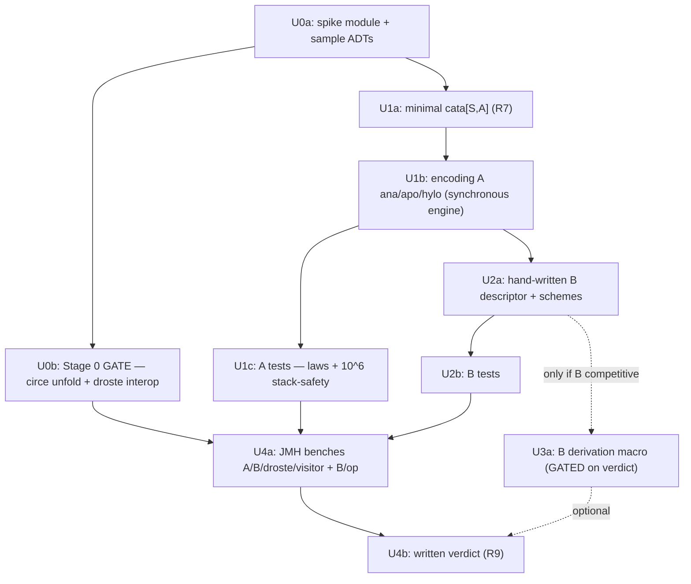

# Corecursion (generate) spike — encoding A vs B

## Overview

A **staged, reversible spike** that adds the missing *generate* leg
(`ana`/`apo`/`hylo`) to cats-eo and answers two questions empirically:
(1) **should generation ship at all** vs recommending droste interop, and
(2) if so, **which API encoding** — closure-carrying (A) or derived descriptor
(B) — is primary. Spike code lives outside the published artifacts so the
verdict, not the build, decides what (if anything) graduates into `core`.

This is **not** the production feature. It is the experiment that lets us commit
(or decline) with measured evidence: ergonomics, the surviving no-pattern-functor
promise, derivability, fused-`hylo` stack-safety at depth 10⁶, allocation (B/op),
and a head-to-head against droste interop. "Recommend interop, don't build" is a
permitted, successful outcome (see origin: Why-now / go-no-go gate).

## Problem Frame

eo has **navigate** (`children`/`universe`) and a *restricted* **destroy**
(`transform` is `S=>S`; there is no fold-to-arbitrary-`A` cata) but **no
generate** — `Plated.rebuild` only swaps children into an existing node; there is
no `embed`-from-seed. Generation is the only leg eo entirely lacks. The driver is
an acknowledged conceptual/learning bet (confirmed in origin) with **no logged
user demand**, so the spike is gated: it must produce a convincing domain example
or conclude "don't build." (see origin: Problem Frame, Why-now.)

The hard asymmetry: destruction has a source `S` to deconstruct/reconstruct;
generation starts from a seed, so *someone* must name the node shape — and "a node
with holes where children go" **is** the pattern functor. Two encodings answer
"who names it":

- **A — closure-carrying** (`coalg: Seed => (PSVec[Seed], PSVec[S] => S)`): the
  user inlines the constructor per node. Pattern-functor-free, core-only, no
  macro. Its own ceremony: the constructor is re-spelled per call site.
- **B — derived descriptor ("Coplated")**: `eo-generics` derives the node
  descriptor; canonical/reusable, fuses `hylo` — but reintroduces the pattern
  functor. "No pattern functor" survives **only in A**.

## Requirements Trace

- R1. Build on `Plated` (latent project+embed) and `transform` (`S=>S`); do **not**
  assume `Recursive`/`Corecursive` or a fold-to-`A` cata exist — they don't.
- R2. Add the generate leg; treat `Coplated`~`Review` as naming intuition only
  (verified: `Review` is **not** an `Optic`), decide independently if it's an optic.
- R3. Stage the spike (Stage 0 gate → 1 encoding A → 2 hand-written B → 3 B
  derivation, gated) so cost tracks the verdict.
- R4. Two showcase types — arithmetic `Expr` + circe `Json` (domain) — **both
  homogeneous-children**, which is all a `PSVec[S]` (single-sorted) engine can
  represent. **Engine-scope finding (do not fight it):** B's typed-sum-descriptor
  advantage over A's per-node closure only manifests on *heterogeneous*/typed-hole
  ASTs (children of differing static types), which the monomorphic `PSVec[S]` engine
  cannot express without widening to a common supertype (collapsing back to the
  homogeneous case). So **the A-vs-B verdict is inherently scoped to
  homogeneous-children self-similar types**; the heterogeneous case where B would
  win requires a *multi-sorted* engine that is **out of spike scope** (named as
  future work, not a fixture). R9 must state this scope explicitly — and that on
  this engine A is the likely default winner, with B's case deferred to whether
  multi-sorted recursion is ever worth building.
- R5. B-derivation probe (Stage 3 only); resolve the test-only `Tree[N]` / classpath
  + parameterless-case blockers (prefer `Expr`).
- R6. `apo` demonstrates structure-sharing generation (graft pre-built subtrees).
- R7. `hylo` demonstrates fusion — **constructs no persistent intermediate `S`-tree
  (deforestation)**; transient O(depth) engine state is expected. Requires a minimal
  fold-to-`A` `cata` (pulled into scope — `transform` is `S=>S` only).
- R8. Grade A vs B vs droste-interop on ergonomics, surviving no-PF promise,
  derivability, **fused-`hylo` stack-safety @ 10⁶**, hylo-fusion cost, B/op, plus a
  go/no-go axis (would a circe/Avro user switch?).
- R9. Written verdict: ship-vs-interop, primary encoding, surviving positioning.

## Scope Boundaries

- **In scope (new):** a minimal fold-to-`A` `cata` (R7 needs it).
- **Not** building the exotic tail (`para`/`histo`/`futu`/`zygo`/`chrono`).
- **Not** building the `eo-generics` Coplated *derivation macro* until Stage 3 is
  reached (verdict-gated); hand-written descriptors carry Stages 1–2.
- **Not** competing with droste as a framework; interop is a partner baseline.
- **Not** graduating any code into `core`/`generics`/published artifacts in this
  spike — module placement of the winner is post-verdict productionizing.
- Remaining read-side wins (`para`, `universe`→`Fold` optic/`cosmos`) stay follow-on.

## Context & Research

### Relevant Code and Patterns

- **`core/.../optics/Plated.scala`** — `transform` (`:108-121`) + `transformMachine`
  (`:128-147`, `java.util.ArrayDeque[Frame]`, post-order, `transformRecursionLimit
  = 512`) is the machine to generalize into `cata[S,A]` (retype `out`/`ret` `S`→`A`,
  swap `f:S=>S` for `alg:(S,PSVec[A])=>A`). `rewrite` (`:178-181`, `Eval.defer(...)
  .flatMap`) is the trampoline model for the unfold axis. `childrenVec`/`rebuild`
  (`:41`,`:51-53`); `everywhere` (`:163-164`) is precedent for surfacing a scheme as
  an optic.
- **`core/.../data/PSVec.scala`** — coalgebra builds/consumes via `empty`/`singleton`/
  `fromIterable`/`unsafeWrap` + `apply(i)`/`length`/`isEmpty`/`head`; `Empty`/`Single`/
  `Slice` variants (no per-vec alloc at 0/1). `map` is external (`MultiFocus.scala:136`).
- **`core/.../optics/Review.scala`** — `final case class Review[S,A](reverseGet: A => S)`,
  does NOT extend `Optic`, no `compose` (plain function composition). Confirms the
  `Coplated~Review` analogy does not transfer `andThen`.
- **`circe/.../package.scala:41-65`** — `given platedJson: Plated[Json]` with
  `immediateChildJson` (project) + `rebuildJsonFromChildren` (embed via
  `Json.fromValues`/`Json.fromJsonObject`). Direct foundation for the R4 circe
  unfold and the droste-interop `Basis`. circe is wired into `benchmarks`
  (build.sbt:639).
- **`generics/.../PlateMacro.scala:118-191`** — `selfFieldVec` + `reconstructFields`
  via Hearth `CaseClass.construct[Id]` (emits `new V(...)`, not `.copy`) + `Enum.matchOn`.
  A Stage-3 Coplated derivation inverts this (per-variant `Seed=>(PSVec[Seed],builder)`),
  reusing the same surface. `PrismMacro.scala:78` reconstruct is a plain upcast (not
  construction) — the construct path, not the prism path, is what B reuses.
- **Stack-safety test exemplar** — `tests/.../PlatedSpec.scala:162-205` (depth `100000`,
  specs2 `>>` boolean block, assert by node count) and `:207-248` (both axes: 100k
  descent + 200k re-fire). Template for the 10⁶ fused-`hylo` test.
- **JMH exemplar** — `benchmarks/.../bench/PlatedBench.scala:44-50`: full 6-annotation
  preamble **repeated per class** (JMH ignores inherited/trait annotations in Scala 3 —
  empirically verified), paired `eo*`/`m*`/`visitor*` methods, fixtures in `bench/fixture/`
  (top-level ADTs). For the spike: `eoA*`/`eoB*`/`droste*`/`visitor*`, `-prof gc`.

### Institutional Learnings

- **Stack-safety gotcha (load-bearing)** — the team tried sharing `transform`'s
  synchronous machine for `rewrite`; safe on descent, **overflows on fixpoint
  re-firing** (a node re-firing 200k× puts `go` back on the JVM stack). `rewrite` kept
  `Eval` for exactly that. The lesson transfers as *method*, not as *axis*: ana/hylo have
  **no** fixpoint axis, but they have a descent dimension (deep spine) and a wide-fanout
  *combine* dimension — prove stack-safety on **both** shapes with an adversarial scratch
  test against the stack-safe oracle, don't assert.
  (`memory/verify-stacksafety-claims.md`, `docs/plans/2026-06-07-010-...`.)
- **Bench methodology** — local box can't resolve <10% timing (scoreError ±15-50%,
  sign-flips). **B/op (`gc.alloc.rate.norm`) is trustworthy**; ns only on `benchmarks.yml`
  CI, f≥3. `sbt "Jmh/run … -prof async:…"` is broken (splits on `;`) — run via `java -cp
  $(sbt 'export benchmarks/Jmh/fullClasspath')`. (`memory/bench-box-too-noisy-for-timing.md`.)
- **EA elides carriers** — B/op parity ≠ no cost: escape analysis scalarizes B's
  descriptor on warm monomorphic paths, so A-vs-B *speed* and the `hylo`-fusion claim
  must be settled on **CI ns**, not B/op. (`memory/fold-matches-monocle-ea-elides-carrier.md`.)
- **Closures are `==`-unequal** — encoding A (closure-carrying) can't be law-checked via
  structural equality; verify **extensionally** (sample the built structure), as
  `SetterFLaws` does. (`docs/research/2026-04-29-{powerseries,fixedtraversal}-fold-spike.md`.)
- **Inline recursive composers** — if the schemes add same-carrier composition, mark the
  recursive overload `inline` or C2 trips "recursive inlining is too deep" (slow-at-depth,
  fine-shallow). (`memory/point-free-closures-already-inlined.md`.)
- **Sample ADTs must be top-level** — macro-emitted `new V(...)` loses outer-accessor
  wiring if nested ("missing outer accessor"). `Tree[N]` is test-only (Stage-3 blocker).

### External References

- **droste `io.higherkindness:droste-core_3:0.9.0-M3`** (milestone, Scala 3 via
  cast-based erased `Fix`; alive but pre-1.0/low-velocity — spike-only dep, no prod dep).
  `Algebra=F[A]=>A`, `Coalgebra=A=>F[A]`, `apo` lives at `scheme.zoo.apo` with
  `RCoalgebra = A => F[Either[R,A]]`, `hylo(alg,coalg)` needs neither `Embed` nor `Project`.
  Default `hylo` is **not** stack-safe (plain self-recursion); `hyloM` with `M=Eval` is the
  escape hatch. Interop adapter ≈ pattern functor `SF[A]` + `Functor[SF]` + `Basis.Default`
  from project/embed (~3 defs) — **but** the honest cost is recovering the *typed* base
  functor eo's untyped `(skeleton,children)` abstracts away; homogeneous children → viable
  low-LOC baseline, heterogeneous → you hand-write the pattern functor anyway.
- droste hylo fusion = deforestation: one `F`-layer live at a time, no persistent tree;
  per-node transient `F` allocs remain (the win is *absence of the persistent intermediate*,
  visible on deep structures via `-prof gc`).

## Key Technical Decisions

- **Spike lives in a dedicated un-aggregated `spike` sbt module** (deps:
  `core`,`laws`,`generics`,`circeIntegration`,`droste-core_3`; both `main` =
  impls and `test` = specs2/discipline). `benchmarks` depends on it for the JMH
  classes. Rationale: benches (must be in/visible to `benchmarks`) and specs2
  stack-safety/correctness tests need to share the candidate implementations;
  keeping them out of `core`/published artifacts makes the whole spike reversible
  and respects the `generics → core` direction. Graduation location (core vs
  generics) is the post-verdict productionizing decision.
- **One engine for all four schemes: the synchronous ArrayDeque/512-hybrid
  post-order machine** (generalizing `transform`/`transformMachine`), **not `Eval`.**
  *Corrected after architecture review:* the `rewrite` re-fire regression is
  **inapplicable** to cata/ana/apo/hylo — **no scheme re-feeds output as input**, so
  there is no fixpoint axis (unlike `rewrite`). **Safety at unbounded generate depth
  comes specifically from the `≥512` HEAP-MACHINE fallback** — *not* from the frame
  mechanism alone: the `<512` fast path is genuine JVM-stack recursion (`rec`), benign
  on the consume side where input depth is structurally bounded, but on the generate
  side depth is bounded only by coalgebra termination, so the heap fallback is what
  caps on-stack depth at 512 regardless of coalgebra. (Corecursion has **no**
  decreasing-measure guarantee — a coalgebra may emit child seeds no smaller than its
  input; given termination, enter-calls = node count, live frames = O(depth).) The
  U1c 10⁶ test must therefore *cross the 512 boundary* (exercise the heap path), or it
  proves nothing about the mechanism that actually provides safety.
  cata, ana, hylo are **the same post-order machine** differing only in the *enter*
  step (cata reads `childrenVec(s)` from an existing `S`; ana/hylo *expand* a seed
  via `coalg`) and the *close* step. `apo`'s `Left(s)` graft is just a precomputed
  subtree stashed into the `out` array — still no feedback. So the synchronous
  machine is sound for all four, and is **faster + leaner** than `Eval` (plain
  mutable frames vs defer/flatMap thunk chains) with a free on-stack fast path below
  depth 512.
- **`Eval` is kept only as a cross-check oracle** in the adversarial stack-safety
  test, not as the production engine — and the oracle must be built on the repo's
  **stack-safe `pSVecTraverse` combine** (MultiFocus.scala:171-188, safe on `.value`),
  **not** droste's hylo or a naive `traverse`, or it would overflow on the wide-fanout
  case it is supposed to adjudicate (you can't diff a result against a `StackOverflowError`).
  (Empirical proof of the synchronous machine deferred to implementation — see the
  adversarial shapes in U1c.)
- **The three close-step signatures differ** (engine-sharing is precise, not
  aspirational): cata `(S, PSVec[A]) => A` (paramorphism-flavored, reads the node);
  ana/apo builder `PSVec[S] => S` (cannot read the seed); hylo `(layer, PSVec[A]) => A`.
- **`transformRecursionLimit = 512` is reused but re-justified, not copied verbatim.**
  On the consume side depth is bounded by the input `S` ("a balanced billion-node
  tree is ~30 deep"); on the *generate* side depth is bounded only by coalgebra
  termination (caller's responsibility), so generation hits the heap-machine path
  far more readily — another reason the synchronous machine's allocation profile matters.
- **Discriminate with `apo`+`hylo`; `ana` is the base, carried into the comparison
  only if it changes the verdict.** (see origin: Key Decisions.)
- **Verdict measurement split:** B/op locally for A-vs-B *allocation* (the shared
  engine's O(depth) frame cost is common-mode and **cancels** in the A−B delta, so the
  delta cleanly isolates A's per-node closures vs B's descriptor); CI ns (f≥3) for
  A-vs-B *speed*, because EA hides B's descriptor in B/op. **The fusion ("no persistent
  `S`-tree") B/op proof must run on a WIDE/bushy structure (nodes ≫ depth)** — on a
  linear spine `nodes == depth`, so the persistent-tree saving is the same order as the
  unavoidable engine state and the fusion win is masked. Stack-safety uses the deep
  spine; fusion uses the wide tree — two different fixtures.
- **Encoding A laws checked extensionally** (closures are `==`-unequal).

## Open Questions

### Resolved During Planning
- *Trampoline: `Eval` vs heap machine?* → **all four** (cata/ana/apo/hylo) use the
  synchronous ArrayDeque/512-hybrid machine; `Eval` is only a cross-check oracle.
  (The `rewrite` re-fire precedent does not apply — no scheme here has a fixpoint;
  corrected after architecture review.)
- *Module placement for the spike?* → dedicated un-aggregated `spike` module;
  winner's graduation deferred to productionizing.
- *Domain showcase?* → circe `Json` (reuse `platedJson` project/embed).
- *Is the premise a real driver?* → no; acknowledged conceptual bet, go/no-go gate
  stands (see origin).

### Deferred to Implementation
- *Proof* the synchronous machine is safe for ana/apo/hylo — settle by the adversarial
  test in U1c (deep spine crossing the 512 boundary + wide fanout; stack-safe
  `pSVecTraverse`-based `Eval` oracle as differential cross-check) before claiming 10⁶
  safety. The oracle must itself descend levels stack-safely, not just combine one node.
- Which hylo fusion variant eo adopts — layer=S (cata-reuse, droste-parity B/op) vs
  skeleton-alg (true deforestation, no transient S, but not literally cata∘ana). U1b/U4a
  measure both; U4b reports the delta and picks.
- `apo`'s `Left(s)` graft: confirm it is a stashed *constant* (leaf in the unfold) and
  does **not** re-enter the consume machine to re-fold the grafted `S` — if it must be
  folded, that is a second descent the safety argument has to cover.
- Whether `apo`'s `Either[S,Seed]` graft path fits the shared machine's `out`-array
  fill as cleanly as expected (it should — `Left(s)` is a stashed constant) — confirm
  when implementing.
- Final shape of encoding B's hand-written descriptor (typed sum vs untyped pair) —
  emerges from the Expr/circe attempts; this *is* part of what the spike measures.
- Whether `Expr` can double as the Stage-3 derivation probe (vs adding a main-side
  sample) — decide when Stage 3 is reached, if it is.
- Whether a winning scheme should be an `Optic` (carrier-composable) — out of spike
  scope; flagged for productionizing.
- All bench-shared impls must live in `spike/src/main` (a `benchmarks.dependsOn(spike)`
  main→main edge); if any shared fixture lands in `spike/src/test`, add an explicit
  `dependsOn(spike % "compile->test")` edge or the bench won't see it.
- Whether hand-written encoding-B descriptors (Stage 2) hit the same top-level/outer-accessor
  constraint as macro-emitted `new V(...)` — confirm when placing the Stage-2 descriptors.

## High-Level Technical Design

> *This illustrates the intended approach and is directional guidance for review, not implementation specification. The implementing agent should treat it as context, not code to reproduce.*

The two encodings share the same recursion engine; they differ only in **who supplies the node constructor**:

```
ana (unfold)            Seed ──coalg──► one layer ──recurse on child seeds──► S
  A: coalg : Seed => (PSVec[Seed], PSVec[S] => S)     // builder inlined here
  B: coalg : Seed => Descriptor[Seed]                 // builder from derived/handwritten descriptor

apo (structure-sharing) child slot = Either[S, Seed]  // Left = graft existing S; Right = keep unfolding

hylo (fused)            Seed ──coalg──► layer ──alg──► B     // NO persistent S-tree (deforestation)
  = cata-algebra ∘ (one coalg layer); close: (layer, PSVec[A]) => A

cata (R7, fold-to-A)    generalize transform's ArrayDeque machine: out:Array[A], ret:A,
                        alg:(S, PSVec[A]) => A   // post-order, synchronous, 512-hybrid
```

**Engine: ONE synchronous ArrayDeque/512-hybrid post-order machine for all four** —
they differ only in *enter* (cata reads `childrenVec(s)`; ana/hylo *expand* a seed via
`coalg`; apo's `Left(s)` stashes a constant subtree) and *close* (cata `(S,PSVec[A])=>A`;
ana/apo `PSVec[S]=>S`; hylo's close is **an open fork the spike measures, not a
settled choice**: **(i)** `layer = transient per-node S` → hylo's `alg` is literally
cata's `(S,PSVec[A])=>A` and `hylo==cata∘ana` is near-definitional, *but* it allocates
O(nodes) transient `S` exactly like droste, so the "fusion" is retention-only and the
A/B/droste fusion B/op delta is expected **≈ zero (parity, not a win)**; **(ii)**
`alg` consumes the coalg's **skeleton** (non-recursive payload) + `PSVec[A]`, allocating
**no per-node `S` at all** → genuine deforestation and a real B/op win over droste,
*but* `hylo == cata∘ana` no longer holds literally (distinct close step). U1b/U4a build
and measure both; R9 reports which fusion story eo actually delivers. (Note: in a fused
hylo the children are already folded to `A`, so the ana builder `PSVec[S]=>S` cannot
produce layer-(i) from real children — variant (i) needs a skeleton/placeholder-children
constructor, which is itself an argument for variant (ii).) No scheme has a
fixpoint/feedback axis, so none needs `Eval` (kept only as a test oracle — and it must be the repo's
stack-safe `pSVecTraverse`-based combine, **not** droste's hylo or a naive `traverse`,
which would overflow on the very wide-fanout case it is meant to check). Deforestation
means **no *persistent* O(nodes) `S`-tree is retained**; transient per-node `S` allocs
remain (as in droste). droste-interop baseline = `SF[A]` pattern functor + `Functor` +
`Basis.Default` from `platedJson`'s project/embed.

## Implementation Units



### Phase / Stage 0 — Premise gate (cheapest kill-switch first)

- [ ] **Unit 0a: Spike module scaffold + top-level sample ADTs**

**Goal:** A reversible home for the spike that both specs2 tests and JMH benches can share.

**Requirements:** R3, R4

**Dependencies:** None

**Files:**
- Modify: `build.sbt` (add un-aggregated `spike` project: deps `core`,`laws`,`generics`,`circeIntegration`, `io.higherkindness:droste-core_3:0.9.0-M3`; add `benchmarks.dependsOn(spike)`; do NOT add to root aggregate)
- Modify: `project/plugins.sbt` only if a resolver is needed for droste (likely not)
- Create: `spike/src/main/scala/dev/constructive/eo/spike/samples/package.scala` (top-level `Expr` enum `Lit|Neg|Add|Mul`; reuse circe `Json` directly via `platedJson`)
- Create: `spike/src/test/scala/dev/constructive/eo/spike/` (specs2 wiring)

**Approach:**
- Mirror `benchmarks` project settings (not aggregated, not published). Keep ADTs top-level (outer-accessor rule).
- Confirm droste 0.9.0-M3 `_3` resolves; if not, pin a working milestone and note it.

**Patterns to follow:** `build.sbt:634-640` (benchmarks project shape); `generics/.../samples/package.scala` (top-level ADT placement + comment).

**Test scenarios:**
- Happy path: `sbt spike/compile` and `sbt spike/Test/compile` succeed; a trivial `Expr` value round-trips through the existing `Plated`-derived `plate[Expr]`.
- Edge case: nested-in-spec ADT is rejected at compile (document the outer-accessor failure so future contributors recognize it).

**Verification:** `spike` compiles, is absent from `sbt root/test` aggregation, and `benchmarks` sees `spike` classes.

- [ ] **Unit 0b: Stage 0 GATE — circe `Json` unfold + droste-interop baseline**

**Goal:** Prove a *convincing domain generation example* exists, and stand up the droste-interop baseline the verdict grades against. If neither is convincing and interop suffices, the spike may stop here with a "don't build" verdict.

**Requirements:** R4, R8 (go/no-go axis), R6/R7 conceptually

**Dependencies:** U0a

**Files:**
- Create: `spike/src/main/scala/dev/constructive/eo/spike/DomainUnfold.scala` (a seed→`Json` unfold: e.g. expand a config/spec seed into a nested `Json` object/array tree, reusing `Json.fromValues`/`Json.fromJsonObject`)
- Create: `spike/src/main/scala/dev/constructive/eo/spike/DrosteInterop.scala` (`SF[A]` pattern functor + `Functor[SF]` + `Basis.Default[SF, Json]` from `platedJson`'s project/embed; drive `scheme.ana`/`scheme.hylo`)
- Test: `spike/src/test/scala/dev/constructive/eo/spike/Stage0GateSpec.scala`

**Approach:**
- Build the same circe-`Json` unfold **three** ways: (1) hand-written recursion (the "what users do today" baseline), (2) droste interop, (3) a sketch of the eo encoding-A unfold. Capture LOC + setup friction for each (especially the typed-pattern-functor recovery cost droste forces).
- **Falsifiable gate criterion, evaluated NOW (before Stage 1), not deferred to U4b:** proceed to Stage 1 *only if* the eo unfold (3) is materially lower-ceremony than **both** baselines (1) and (2) on the domain type — concretely, meaningfully fewer lines / less setup to a first working unfold, with the no-pattern-functor advantage visible. **If droste-interop is within ~comparable ceremony of (3), STOP** with a "recommend interop, don't build" verdict. This is the real kill-switch; making an unfold merely *work* is not sufficient to pass (it always can).

**Execution note:** This gate must be able to fail. Record the decision and its basis in the verdict doc before any Stage-1 code is written.

**Technical design:** *(directional)* interop adapter is the ~3-def `SF`/`Functor`/`Basis` shape from research §2; the friction to record is whether `Json`'s heterogeneous children (object vs array vs scalar) force a sum-typed `SF`.

**Patterns to follow:** `circe/.../package.scala:41-65` (project/embed for `Json`); research §2 (interop adapter).

**Test scenarios:**
- Happy path: unfolding a known seed produces the expected `Json` (assert structural equality on a small fixture).
- Happy path: the droste-interop unfold produces the *same* `Json` as the hand-written/eo unfold for the same seed.
- Edge case: empty seed → `Json.Null`/empty array; single-node seed → leaf.
- Integration: a seed that expands to a nested object-of-arrays exercises both `Json.fromJsonObject` and `Json.fromValues` embeds.

**Verification:** All three unfolds produce identical output; LOC + ceremony measured for each; **the falsifiable gate criterion above is evaluated and the continue/stop decision recorded with its basis** — Stage 1 begins only if eo materially beats both baselines, otherwise the spike stops at "recommend interop, don't build."

### Stage 1 — Encoding A (closure-carrying, no macro)

- [ ] **Unit 1a: Minimal `cata[S,A]` (fold-to-arbitrary-`A`)**

**Goal:** Provide the fold-to-`A` that `hylo` (U1b) needs and that `transform`'s `S=>S` cannot give.

**Requirements:** R7, R1

**Dependencies:** U0a

**Files:**
- Create: `spike/src/main/scala/dev/constructive/eo/spike/Cata.scala`
- Test: `spike/src/test/scala/dev/constructive/eo/spike/CataSpec.scala`

**Approach:**
- Copy `transform`/`transformMachine` (Plated.scala:108-147) and generalize: `out:Array[AnyRef]` now holds child *results* `A`; `ret:A`; leaf close `alg(s, PSVec.empty)`; internal close `alg(node, results)`. Algebra shape `(S, PSVec[A]) => A` (node + folded children — paramorphism-flavored, ergonomic because the user can read the node via existing lenses). Keep the `512` call-stack/heap hybrid.
- Reads only `childrenVec`; no embed needed.

**Execution note:** Start from a failing test that folds `Expr` to its `Double` value (the eval the `hylo` demo needs).

**Patterns to follow:** `Plated.transform`/`transformMachine` verbatim structure; return-free imperative loop style (DisableSyntax bans `return`).

**Test scenarios:**
- Happy path: `cata` over `Expr` to `Double` evaluates `Add(Lit 1, Mul(Lit 2, Lit 3))` → 7.0.
- Happy path: `cata` to `Int` computes node count and max depth.
- Edge case: leaf-only `Expr` (`Lit`) folds without entering the rebuild path.
- Edge case (stack-safety): a 10⁶-deep left-spine `Expr` folds without `StackOverflowError` (heap machine engaged past 512).
- Integration: `cata` result type `A ≠ S` (e.g. `String` pretty-print) confirms the generalization is real, not `S=>S` in disguise.

**Verification:** `cata` folds `Expr` to non-`S` results; 10⁶-deep fold completes; mirrors `transform`'s allocation shape on shallow trees.

- [ ] **Unit 1b: Encoding A — `ana`/`apo`/`hylo` (closure-carrying, synchronous engine)**

**Goal:** The generate trio under encoding A on the shared synchronous post-order machine, stack-safe across both descent and combine dimensions.

**Requirements:** R3, R6, R7

**Dependencies:** U1a (shares the ArrayDeque/512-hybrid engine generalized in U1a)

**Files:**
- Create: `spike/src/main/scala/dev/constructive/eo/spike/SchemesA.scala`
- Test: covered by U1c

**Approach:**
- `ana[Seed,S](coalg: Seed => (PSVec[Seed], PSVec[S] => S)): Seed => S` — the **same post-order ArrayDeque machine as `cata`/U1a**, with `enter` = *expand a seed* (`coalg(seed)._1`) instead of *read children* (`childrenVec(s)`), and `close` = apply the builder `PSVec[S]=>S` instead of `alg`. `apo` widens the child slot to `Either[S,Seed]`: `Left(s)` stashes the pre-built subtree directly into the `out` array (a leaf in the unfold — no recursion); `Right(seed)` enters as normal. `hylo[Seed,A](coalg, alg): Seed => A` is the *same machine* with `close` = U1a's `alg:(layer,PSVec[A])=>A`, so it builds **no persistent `S`** — only the transient layer + O(depth) frames.
- **No `Eval`.** No scheme here has a fixpoint, so the synchronous machine is sound and leaner; the array-fill `close` step also sidesteps the wide-fanout combine overflow that an `Eval.traverse` descent would risk.
- Consume/produce `PSVec` via `empty`/`singleton`/`fromIterable`/`unsafeWrap`/`apply`/`length`.
- If any same-carrier composition is introduced, mark the recursive overload `inline`.

**Execution note:** Before claiming 10⁶ safety, run the adversarial scratch test (U1c): deep linear spine (descent) and pathological direct fanout (one node ~10⁶ children — the combine/allocation dimension), differentially cross-checked against the **stack-safe `pSVecTraverse`-based `Eval` oracle** (not droste/naive). The synchronous machine's wide-fanout `close` is non-recursive (array fill), so its stack-safety there is by construction; the test exists to catch the oracle/allocation, not a machine overflow.

**Technical design:** *(directional)* one `Frame(childSlots, out:Array, i)` machine; `enter(seed)` runs `coalg`, pushes a frame whose `childSlots` are the child seeds (or `Either`s for apo); when `i` reaches the end, `close` fills `ret` via builder/alg and pops. Below depth 512 it stays on the call stack (fast path); past 512 it is pure heap. Schematic only.

**Patterns to follow:** `Plated.transformMachine` (Plated.scala:128-147) — the machine to reuse; `PSVec` factories.

**Test scenarios:** (see U1c)

**Verification:** `ana` builds `Expr`/`Json` from seeds; `apo` grafts existing subtrees; `hylo` evaluates a seed to a value building no persistent `S`-tree; the synchronous machine matches the `Eval` oracle on all adversarial shapes.

- [ ] **Unit 1c: Encoding A correctness + laws + stack-safety tests**

**Goal:** Prove A correct, lawful (extensionally), and stack-safe at the R8 bar.

**Requirements:** R3, R6, R7, R8 (stack-safety)

**Dependencies:** U1b

**Files:**
- Create: `spike/src/test/scala/dev/constructive/eo/spike/SchemesASpec.scala`

**Approach:**
- Extensional law checks (closures are `==`-unequal): `cata . ana` round-trips (hylo law) sampled by evaluating the built structure; `ana` then `universe` reproduces the seed's intended shape.
- Stack-safety mirrors `PlatedSpec.scala:207-248`: build seeds imperatively, assert by cheap invariant in specs2 `>>` boolean blocks. **Run the synchronous machine differentially against an `Eval` oracle** on the adversarial shapes so a divergence (not just an overflow) is caught.

**Test scenarios:**
- Happy path: `ana` builds the expected `Expr` from a token list; `ana` builds the expected `Json` from a spec seed.
- Happy path: `apo` regenerates a tree grafting an unchanged subtree, asserting the grafted node is reference-identical (structure sharing) where expected.
- Happy path: `hylo` evaluates "expression seed → `Double`" equal to `cata(ana(seed))` (the engine-unification makes this near-definitional, but assert it).
- Edge case (fused hylo @ 10⁶, **deep spine**): a seed unfolding to a 10⁶-deep linear spine evaluated via `hylo` completes without `StackOverflowError` and yields the right terminal value — **the R8 descent bar**.
- Edge case (**wide fanout**): a seed producing one node with ~10⁶ *direct* children (tree depth 1). The synchronous machine's `close` is a non-recursive array fill, so it is stack-safe *by construction* — this case exists to (a) confirm the **`pSVecTraverse`-based oracle** is also safe here (a naive `Eval.traverse`/droste hylo would overflow, invalidating the differential check) and (b) exercise the O(width) ~8 MB `out`-array allocation (set adequate `-Xmx` so an OOM here reads as a heap-size issue, not the property under test).
- Edge case (materializing ana): ana to a 10⁵-deep structure completes (the unfold *loop* doesn't recurse on the JVM stack; O(depth) output heap is expected — explicitly a lower bar than fused hylo).
- Edge case (deforestation, **wide tree**): `hylo` on a bushy seed (nodes ≫ depth) under `-prof gc` shows the absent O(nodes) `S`-tree — run on the *wide* fixture, not the spine, or the win is masked (see Key Decisions).
- Error path: a coalgebra that never terminates is out of scope; document that totality is the caller's responsibility (no productionized guard in the spike).
- Integration: `apo`'s `Left`-graft path with a real pre-built `Expr` subtree appears unchanged in the output.

**Verification:** All A schemes correct on `Expr`+`Json`; fused `hylo` proven stack-safe at 10⁶ on the deep spine *and* under pathological fanout, both matching the `Eval` oracle; deforestation shown on the wide fixture; structure-sharing demonstrated.

### Stage 2 — Encoding B (hand-written descriptor, no macro)

- [ ] **Unit 2a: Hand-written `Coplated` descriptor + `apo`/`hylo` under B**

**Goal:** Stand up encoding B without the macro, to compare ergonomics/fusion against A on the discriminating schemes.

**Requirements:** R3, R6, R7

**Dependencies:** U1b (shares the engine/`cata`)

**Files:**
- Create: `spike/src/main/scala/dev/constructive/eo/spike/Coplated.scala` (descriptor type + hand-written instances for `Expr` and the circe sample)
- Create: `spike/src/main/scala/dev/constructive/eo/spike/SchemesB.scala`
- Test: covered by U2b

**Approach:**
- Define the node descriptor (the spike *measures* whether a typed sum or an untyped pair is the right shape — see deferred question). Hand-write its instances for `Expr` (and the circe sample) — no `eo-generics`.
- **Reuse the same synchronous ArrayDeque/512-hybrid machine as A** (Eval is the test oracle only); only the descriptor layer that names the node differs. Build `apo`+`hylo` (the discriminators); add `ana` under B only if U4b finds it changes the verdict.
- **This unit is justified by the A-vs-B *allocation/fusion* delta** (the closures-vs-descriptor signal EA may hide), not by completeness. The no-PF-promise delta and ergonomics are recorded here; if those alone settle A-vs-B, U2b and B's slice of U4a become confirmatory and may be cut.
- Record ergonomics: LOC, per-call-site ceremony, and explicitly **whether the no-pattern-functor promise survives** (it should not — capture the honest delta).

**Patterns to follow:** the descriptor inverts `PlateMacro.scala:159-191`'s reconstruct (by hand here); `SchemesA.scala` engine.

**Test scenarios:** (see U2b)

**Verification:** B's `apo`/`hylo` produce identical results to A on the same seeds; ergonomics + surviving-promise notes captured.

- [ ] **Unit 2b: Encoding B correctness + stack-safety tests**

**Goal:** Prove B matches A behaviorally and at the stack-safety bar.

**Requirements:** R3, R8

**Dependencies:** U2a

**Files:**
- Create: `spike/src/test/scala/dev/constructive/eo/spike/SchemesBSpec.scala`

**Approach:** Primarily **differential testing** — cross-check B output equals A output for the same seeds. Because B reuses the *same engine* as A, stack-safety is a property of that engine (already proven in U1c) — **do not re-run the full 10⁶ bar**; assert it once in U1c and cite it, with only a single sanity-depth run under B as defense-in-depth. The decision-driving signal from B is ergonomics + allocation, not a second stack-safety proof.

**Test scenarios:**
- Happy path: B's `hylo` eval equals A's `hylo` eval on shared `Expr`/`Json` seeds.
- Happy path: B's `apo` grafting matches A's structure-sharing behavior.
- Edge case (sanity depth): a moderate-depth (~10⁵) `hylo` under B completes — confirms B drives the same engine; the 10⁶ proof is inherited from U1c, not repeated.
- Integration: descriptor-driven build of the circe `Json` sample equals the U0b output.

**Verification:** B is behaviorally indistinguishable from A across shared seeds; engine-shared stack-safety cited from U1c (not re-proven).

### Stage 3 — Encoding B derivation (VERDICT-GATED)

- [ ] **Unit 3a: `eo-generics` `Coplated` derivation macro** *(only if Stage 2 shows B competitive on R8)*

**Goal:** Auto-derive the B descriptor, the capability B's whole case rests on.

**Requirements:** R5, R8 (derivability)

**Dependencies:** U2a/U2b **and** an explicit "B is competitive" gate from interim U4 measurement

**Files:**
- Create: `generics/src/main/scala/dev/constructive/eo/generics/CoplatedMacro.scala` (+ a `coplated[S]` entry in the generics `package.scala`)
- Create/Modify: a **main-visible** sample for the probe — either reuse top-level `Expr`, or add `generics/src/main`-visible sample (the test-only `Tree[N]` is NOT macro-visible).
- Test: `generics/src/test/scala/dev/constructive/eo/generics/CoplatedSpec.scala`

**Approach:**
- **Only the construct half of `PlateMacro` inverts cleanly.** `CaseClass.construct[Id]` (emits `new S(...)`) builds the per-variant node — reuse it. **`Enum.matchOn` does NOT transfer:** it matches on an *existing `S` scrutinee* to discover a value's variant, but a coalgebra `Seed => Descriptor[Seed]` has no `S` yet — variant selection is seed-driven. Derive by enumerating *all* variants' builders at derivation time (`Enum.parse` elements + per-element `construct`), not by `matchOn` dispatch. (This is the architectural decision the original draft wrongly presented as settled.)
- **Resolve R5 blockers first:** the probe ADT must be main-classpath-visible to the macro; prefer reusing `Expr`. The parameterless-variant path (`eqValue`) is only exercised if a parameterless case exists.

**Execution note:** `Execution target: external-delegate` is reasonable for the macro body once the descriptor shape is fixed.

**Patterns to follow:** `PlateMacro.scala:30-191` (`CaseClass.construct[Id]` is the reusable half; `Enum.parse` for variant enumeration); CLAUDE.md Hearth notes.

**Test scenarios:**
- Happy path: `coplated[Expr]`-derived descriptor drives `ana` to the same output as the hand-written B (U2a).
- Edge case: a parameterless enum case (add one to the probe ADT) derives correctly via `eqValue` matching.
- Edge case: a recursive parameterised ADT (`Tree[Int]`-shaped, main-visible) derives.
- Error path: a non-ADT / open class fails the macro with a clear message (not a crash).
- Integration: derived descriptor + `hylo` evaluates identically to hand-written B + `hylo`.

**Verification:** Derivation works for the probe ADT(s); derivability axis (R8) is graded on real evidence, not a feasibility guess.

### Measurement & verdict

- [ ] **Unit 4a: JMH benches — A / B / droste-interop / visitor + B/op**

**Goal:** Allocation + (CI) timing evidence for R8.

**Requirements:** R8

**Dependencies:** U1c, U2b, U0b (U3a optional)

**Files:**
- Create: `benchmarks/src/main/scala/dev/constructive/eo/bench/SchemesBench.scala`
- Create/Modify: `benchmarks/src/main/scala/dev/constructive/eo/bench/fixture/` (top-level seeds/ADTs)

- Paired `eoA*`/`eoB*`/`droste*`/`visitor*` methods for `ana`, `apo`, `hylo`, at `@Param` sizes (mirror `PlatedBench`). **Repeat the full 6-annotation preamble** (no inheritance). Capture B/op via `-prof gc`.
- B/op locally decides *allocation* (esp. whether A's per-node closures or B's descriptor allocate — don't pre-assume; the shared engine's frame cost is common-mode and cancels in A−B). A-vs-B *speed* is flagged **CI-ns (f≥3)** because EA hides the descriptor; bench authored now, ns verdict from `benchmarks.yml`.
- **The `hylo` deforestation claim needs a separate WIDE/bushy fixture** (nodes ≫ depth) benched as `hylo` vs `cata∘ana` — on a linear spine the absent tree is masked by O(depth) engine state. Provide both a deep-spine fixture (stack-safety) and a wide fixture (deforestation B/op).
- Run via `java -cp $(sbt 'export benchmarks/Jmh/fullClasspath')`, not the broken `sbt … -prof async`.

**Patterns to follow:** `PlatedBench.scala:44-50`; `bench/fixture/PlatedTrees.scala`.

**Test scenarios:** `Test expectation: none — JMH benchmark code; correctness is covered by U1c/U2b. Verify benches run (`benchQuick`) and `-prof gc` reports B/op for every paired method.`

**Verification:** `benchQuick` runs all paired methods; B/op captured for A/B/droste/visitor across sizes; CI-ns runs flagged for the fusion/speed claims.

- [ ] **Unit 4b: Written verdict (R9)**

**Goal:** The deliverable: ship-vs-interop, primary encoding, surviving positioning.

**Requirements:** R8, R9

**Dependencies:** U4a (+ U0b gate notes, U1c/U2b ergonomics, U3a if reached)

**Files:**
- Create: `docs/research/2026-06-08-corecursion-encoding-spike.md`

**Approach:**
- A comparison table across the R8 axes (A / B / droste-interop) + prose verdict answering both R9 questions and **which positioning promise survives** on the recommendation. Explicitly allow and document a "recommend interop, don't build" conclusion. Separate B/op (local, trustworthy) from ns (CI) claims; never assert stack-safety/fusion — cite the empirical test/profile.

**Patterns to follow:** `docs/research/2026-04-29-*-fold-spike.md` (prior spike write-ups).

**Test scenarios:** `Test expectation: none — research/verdict document.`

**Verification:** Verdict is decisive, evidence-backed (B/op + CI-ns + ergonomics + gate notes), and states the surviving positioning. A reader can decide whether to open a productionizing plan.

## System-Wide Impact

- **Interaction graph:** Spike is isolated in an un-aggregated `spike` module + `benchmarks`; **no** change to `core`/`generics`/published artifacts. `root/test` is unaffected (spike not aggregated). Only `benchmarks` gains a `dependsOn(spike)` edge.
- **Error propagation:** Schemes assume total coalgebras; non-termination is the caller's responsibility in the spike (documented, not guarded).
- **State lifecycle risks:** `apo` structure-sharing relies on reference reuse of grafted subtrees — assert reference identity where the sharing claim is made.
- **API surface parity:** None — nothing published changes. If/when a winner graduates, the `generics → core` direction constrains where derivation can live (descriptor type in `core`, macro in `generics`).
- **Integration coverage:** circe `Json` unfold (U0b) and the `platedJson`-backed bench exercise a real downstream type, not only `Expr`.
- **Unchanged invariants:** `Plated`, `transform`/`rewrite`, `Review`, all carriers and published optics are untouched; `cata` is a *new spike-local* function, not a change to `transform`.

## Risks & Dependencies

| Risk | Mitigation |
|------|------------|
| droste 0.9.0-M3 is a pre-1.0 milestone; transitively pins cats-core_3:2.6.1 + scala3-library_3:3.0.0 (vs the project's 2.13.0 / 3.8.3), so eviction-upgrade or API drift could break the interop baseline | Spike-only dependency (never prod); expect eviction to the project versions and treat any droste compile/link error against cats 2.13 as the trigger for the hand-written "what users do today" baseline fallback |
| Local box can't resolve ns; A-vs-B speed / hylo-fusion verdict could be mis-called from noisy local timing | B/op locally only; defer speed/fusion claims to CI-ns (f≥3) per memory; author benches now, gate the ns verdict on `benchmarks.yml` |
| Synchronous machine assumed safe for ana/apo/hylo but not yet proven; the genuinely novel risk is the wide-fanout *combine* dimension (no analogue in the `rewrite` precedent) | Three-shape adversarial test (deep spine + pathological fanout) differentially cross-checked vs an `Eval` oracle, before any 10⁶ claim (U1b/U1c) |
| Building encoding B's macro (U3a) before B is shown competitive = sunk cost | U3a is explicitly verdict-gated; Stages 1–2 use hand-written descriptors; macro only if interim U4 shows B competitive |
| Stage-3 probe blocked by test-only `Tree[N]` / parameterless-case gap | Resolve by reusing `Expr` or adding a main-visible sample before touching the macro (R5) |
| Encoding A laws falsely "fail" via structural equality of closures | Extensional law checks (sample the built structure), per SetterFLaws precedent |
| circe `Json` heterogeneous children force a sum-typed `SF`, inflating the interop baseline's cost | That inflation *is* signal — record it as the honest droste-interop cost in the verdict |

## Documentation / Operational Notes

- Verdict doc (`docs/research/2026-06-08-corecursion-encoding-spike.md`) is the durable artifact; it gates any future productionizing plan.
- No rollout/monitoring impact — nothing ships from the spike.
- If the verdict is "build," a follow-on `/ce:plan` covers productionizing: module placement (respecting `generics → core`), discipline laws, docs/mdoc, and graduating benches.

## Sources & References

- **Origin document:** [docs/brainstorms/2026-06-08-recursion-schemes-in-eo-requirements.md](../brainstorms/2026-06-08-recursion-schemes-in-eo-requirements.md)
- Core machine: `core/src/main/scala/dev/constructive/eo/optics/Plated.scala:108-181`
- circe Plated: `circe/src/main/scala/dev/constructive/eo/circe/package.scala:41-65`
- Generics macro surface: `generics/src/main/scala/dev/constructive/eo/generics/PlateMacro.scala:118-191`
- Stack-safety test exemplar: `tests/.../PlatedSpec.scala:162-248`
- JMH exemplar: `benchmarks/.../bench/PlatedBench.scala:44-50`
- Prior spikes: `docs/research/2026-04-29-powerseries-fold-spike.md`, `docs/research/2026-04-29-fixedtraversal-fold-spike.md`
- Memory: `verify-stacksafety-claims`, `bench-box-too-noisy-for-timing`, `fold-matches-monocle-ea-elides-carrier`, `point-free-closures-already-inlined`
- External: droste `io.higherkindness:droste-core_3:0.9.0-M3` (https://github.com/higherkindness/droste)
