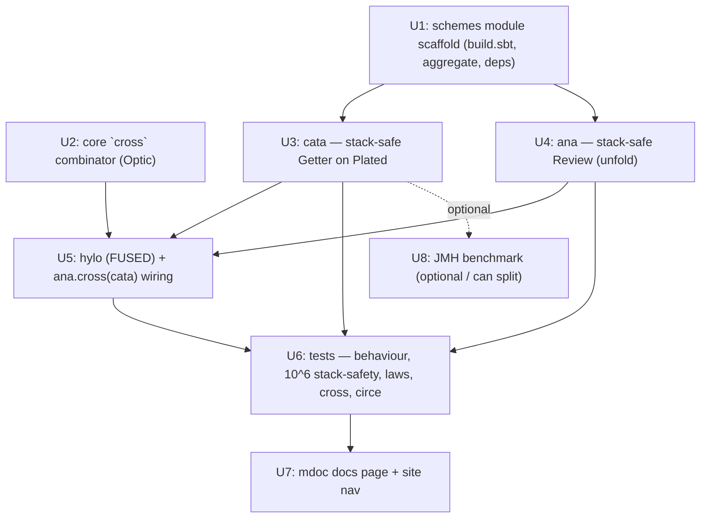

# cats-eo-schemes — recursion schemes as composable optics

## Overview

Introduce a new, published `cats-eo-schemes` module that makes the core recursion schemes —
**`cata`**, **`ana`**, **`hylo`** — first-class, composable members of eo's optic surface,
productionizing the validated spike (see origin). The schemes are *optics*: `cata` is a
`Getter`, `ana` is a `Review`, and `hylo` is their composition (a `hylo(ana, cata)` combinator,
ideally sugared as `ana.andThen(cata)` — see the resolution caveat in Key Technical Decisions).
Because they produce core optic types, they `andThen`-compose with the rest of the library (lenses,
prisms, folds) — the eo-distinctive capability droste's free-standing schemes lack.

The module is built entirely on **public `core` APIs** (`Plated.childrenVec`, `PSVec`,
`Review`, `Getter`/`DirectGetter`) and requires **zero changes to `core`**.

## Problem Frame

eo has navigate (`children`/`universe`) and a restricted destroy (`Plated.transform`, `S=>S`),
but no first-class *fold-to-`A`* (`cata`), *unfold* (`ana`), or *refold* (`hylo`). The spike
proved these belong in eo as optics — and that expressing them as optics (so they compose with
the optic algebra) is the only reason to build them in eo rather than depend on droste (see
origin: Conclusions). `Review` was already upgraded to a proper `Optic` (PR #22), unblocking
`ana`. This plan ships the rest as a dedicated module.

## Requirements Trace

- R1. `cata[S, A](alg: (S, PSVec[A]) => A)(using Plated[S]): Getter[S, A]` — a stack-safe
  structural fold returning a composable `Getter`; the algebra sees the node `S` plus its
  folded children (paramorphism-flavored). Generalises `Plated.transform` from `S=>S` to `S=>A`.
- R2. `ana[Seed, S](coalg): Review[S, Seed]` — a stack-safe unfold returning a `Review`
  (encoding A: the closure coalgebra `Seed => (PSVec[Seed], PSVec[S] => S)` carries its own
  node builder; no pattern functor).
- R3. `hylo[Seed, A](coalg)(alg): Getter[Seed, A]` — the **fused** refold: builds **no
  intermediate `S`** (coalgebra expands seeds, algebra folds in one post-order pass). The
  materializing `ana.cross(cata)` is also provided as the composition; the hylo law
  `hylo == cata ∘ ana` (fused == materializing) holds.
- R3b. `cross` — a new general composition combinator on core `Optic`: composes optics meeting
  at a shared middle type (first's build-output → second's read-input). v1 instantiation:
  `Review[M, A].cross(Getter[M, B]): Getter[A, B]`. Distinct name (no `andThen` clash).
- R4. The schemes compose with the wider optic surface: a `cata` `Getter` `andThen`s onto an
  outer optic ending in `S`; `ana.cross(cata)` composes build→read; demonstrated on the real
  circe `Plated[Json]`.
- R5. Stack-safe at depth 10⁶: `cata` over a deep structure AND the **fused `hylo`** over a
  depth-10⁶ seed (no `S` built — the fusion case); the materializing-`ana` unfold loop must not
  recurse on the JVM stack (O(depth) output heap is expected).
- R6. Property-based laws (ScalaCheck): `hylo == cata ∘ ana`; `cata` matches a reference fold;
  round-trips. (Full discipline `RuleSet`s are a v2 nicety, not v1.)
- R7. mdoc-checked docs page introducing the schemes and their composition story.
- R8. Published module `cats-eo-schemes`, in the root aggregate, `core`-only main dependency.

## Scope Boundaries

- **In scope (decisions, 2026-06-09):** ship the **fused** `hylo` (no intermediate `S`; the
  spike's stack-safe closure machine) so the name is honest; and add **one principled `core`
  change** — a general `cross` combinator on `Optic` (the build-output-meets-read-input
  composition) — so `ana.cross(cata)` works as a member (distinct name, no `andThen` clash).
  Schemes still live in the dedicated `cats-eo-schemes` module.
- **Not** the effectful engine: no `tailRecM`-driven `hyloM` (any-monad, short-circuit,
  fail-able). Deferred to v2 (the arbo-shaped effectful case). The verdict proved it viable.
- **Not** encoding B (typed descriptor / `Coplated`) — desugars to A; opt-in typed layer (v2).
- **Not** the exotic zoo (`para`/`apo`/`histo`/`futu`/`zygo`) — v2+.
- **Core changes are limited to the additive `cross` combinator.** `Plated.transform` /
  `Review` / `Getter` are otherwise untouched; `cata`/`ana`/`hylo` themselves live in the module.

## Context & Research

### Relevant Code and Patterns

- **`core/.../optics/Plated.scala`** — `childrenVec(s): PSVec[S]` (public; cata reads through
  it). `transform`/`transformMachine` (`:108-147`, `transformRecursionLimit = 512`, ArrayDeque
  post-order) is the **structure to mirror** for cata's stack-safe machine, generalized to a
  result type `A`. `rewrite` (Eval) is *not* needed (no fixpoint axis).
- **`core/.../optics/Review.scala`** (post-PR#22) — `final class Review[S,A] extends
  Optic[Unit, S, Unit, A, Direct]`, with member `andThen(inner: Review[A,B])`. `ana` returns
  this. The build-output→read-input composition (`ana.cross(cata)`) is added to core as the new
  general `cross` combinator (distinct name ⇒ no clash with `andThen`).
- **`core/.../optics/Optic.scala`** — the `Optic[S,T,A,B,F]` trait + the `andThen`/`morph`
  composition surface; the new `cross` combinator lives here (or as a core extension), composing
  optics that meet at a shared middle type (one optic's *result*/build-output = the next's
  *source*/read-input). v1 needs the `Direct`-carrier `Review[M,A] cross Getter[M,B] => Getter[A,B]`
  case; design to generalize.
- **`core/.../optics/Getter.scala`** — `Getter[S,A](get): DirectGetter[S,A]`; fused
  `DirectGetter.andThen(DirectGetter)`. `cata` and fused `hylo` construct via `Getter[..](fn)`.
- **`core/.../data/PSVec.scala`** — companion factories `empty`/`singleton`/`fromIterable`/
  `unsafeWrap` (build result vectors); instance `apply(i)` is indexed child read, `length`/
  `isEmpty` accessors. The children/results vector type. (No varargs/seq `PSVec.apply` factory.)
- **`circe/.../package.scala`** — `given platedJson: Plated[Json]`; the real downstream target
  for R4 (cata over `Json`, ana building `Json`). Used in tests (`circeIntegration % Test`).
- **`generics/.../package.scala`** — `inline def plate[S]: Plated[S]`; derives `Plated[Expr]`
  for the showcase ADT in tests (`generics % Test`).
- **`build.sbt`** — module shape: published modules (core/laws/generics/circeIntegration) in
  `root.aggregate`; `laws` uses `disciplineCore`/`scalacheck`; `tests` uses `discipline % Test`.
  The new module mirrors a published module (aggregated, not `publish/skip`), unlike the spike's
  un-aggregated `benchmarks`.

### Institutional Learnings

- Stack-safety must be **proven empirically**, not asserted (the spike's central lesson; the
  first verdict was wrong because capability was asserted). Test cata at depth 10⁶ directly.
  (`memory/verify-stacksafety-claims`, origin doc Lesson.)
- The synchronous ArrayDeque machine is the right engine for these schemes — none has a
  fixpoint/feedback axis, so `Eval` is unnecessary (origin: corrected engine decision).
- Spike `OpticsSpec` (now deleted, recoverable from PR #22 branch history) is the reference for
  the exact assertions: cata eval, `outerGetter.andThen(cata)`, `ana.andThen(cata)` == fused,
  cata @ 10⁶.

### External References

- droste (`io.higherkindness:droste-core`) — the comparison baseline; **not** a dependency.
  eo's value is compositional (schemes are optics), not the pattern-functor zoo (origin).

## Key Technical Decisions

- **Dedicated published module `cats-eo-schemes`, depending only on `core`** (per user
  decision). Aggregated + published. Test-only deps: `generics` (derive `Plated[Expr]`),
  `circeIntegration` (`platedJson`), `scalacheck`/`disciplineCore` (laws), `discipline % Test`.
  Rationale: a clean, opt-in unit; `core`-only main dep respects the `generics → core` direction
  and keeps the schemes off `core`'s critical path. Trade-off (noted): it sits beside, not
  inside, `core/optics` — mitigated because the schemes *produce core optic types*, so
  composition is unaffected; only discoverability is a docs concern (addressed in R7).
- **`cata` reuses the `transform`/`transformMachine` shape, generalized to `A`** (its own copy
  in the schemes module): `out: Array[A]`, `ret: A`, close = `alg(node, results)`; keep the
  512 call-stack/heap hybrid. Reads only `Plated.childrenVec`. Returns `Getter[S,A]` so it
  composes. Accepts mild machine duplication (core can't depend on schemes to share it).
- **`ana` = the closure-encoding unfold** (encoding A, the verdict's primary), stack-safe via
  the same ArrayDeque post-order machine (enter = expand a seed instead of read children),
  wrapped as a `Review`.
- **`cross` — a new general composition combinator on core `Optic`** (decision 2026-06-09):
  composes two optics meeting at a shared *middle* type — the first optic's result/build-output
  feeds the second's source/read-input (vs `andThen`, which composes focus→source). Its
  **distinct name dissolves the member-vs-extension `andThen` problem entirely** — no overload
  clash, so it can be a clean core member/extension that resolves unambiguously. v1 needs the
  `Direct`-carrier case `Review[M, A].cross(Getter[M, B]): Getter[A, B]` (= `Getter(a =>
  g.get(r.reverseGet(a)))`); design it to generalize but scope the v1 implementation to what's
  needed. This is the one principled `core` change.
- **`hylo` is the FUSED refold** (decision 2026-06-09): the spike's stack-safe closure machine,
  `Seed => A` with **no intermediate `S` materialized** (coalgebra expands seeds, algebra folds
  in the same post-order pass), exposed as `Getter[Seed, A]`. This makes the name honest (`hylo`
  ⇒ deforestation). Built on the same ArrayDeque/512-hybrid machine as cata/ana, closing to `A`
  directly instead of building `S`.
- **`ana.cross(cata)` is the materializing reference** the fused `hylo` is proven equal to —
  the hylo law `hylo == cata ∘ ana` (fused == materializing), tested. Both are shipped:
  `hylo` (efficient, no `S`) and the composition `ana.cross(cata)` (composable, builds `S`).
- **Laws as property tests** (scalacheck) in the module's test source, not full discipline
  `RuleSet`s — right-sized for v1; the schemes are functions producing optics, not typeclass
  instances. (Full `RuleSet`s are a v2 nicety.)

## Open Questions

### Resolved During Planning
- *Module vs core/optics?* → **dedicated `cats-eo-schemes` module** (user), with the one
  composition primitive (`cross`) added to `core` so the module composes cleanly. The earlier
  "headline sugar wants core" tension is resolved by `cross` living in core while the schemes
  stay in the module.
- *How to deliver `ana ∘ cata` composition?* → **a general `cross` member on core `Optic`**
  (user decision), NOT a `Review.andThen(Getter)` extension. Distinct name ⇒ no overload/
  member-vs-extension problem; the prior high-risk finding is dissolved.
- *`hylo` naming / materializing vs fused?* → **ship the FUSED `hylo`** (user decision); the
  name is honest (no intermediate `S`). The materializing `ana.cross(cata)` is also shipped as
  the composition + the hylo-law reference.
- *Effectful `hyloM` / encoding B / exotic zoo in v1?* → no, deferred (user: minimal).
- *Engine?* → synchronous ArrayDeque/512-hybrid (no `Eval`; no fixpoint axis).

### Deferred to Implementation
- Exact generality of `cross` on `Optic` — v1 needs only `Direct`-carrier `Review[M,A] cross
  Getter[M,B] => Getter[A,B]`; decide whether to define it minimally for the read/build optics
  or as a broader trait combinator, when coding. (It is a new core surface — keep it small and
  well-named; a too-clever fully-general signature is a v2 concern.)
- Exact shared-machine factoring within the module (one parameterized post-order machine for
  both cata's enter=childrenVec and ana's enter=coalg, vs two copies) — note: ana's frames carry
  *seeds* down and built `S` up, structurally different from cata's `S`-throughout frames, so the
  "one machine" factoring may not be as clean as implied; decide when coding.
- Whether to derive `Plated[Expr]` via `generics.plate[Expr]` or hand-write it in the test —
  prefer the macro (exercises the full stack); fall back to hand-written if the macro fights
  the test ADT placement (outer-accessor rule).

## High-Level Technical Design

> *This illustrates the intended approach and is directional guidance for review, not implementation specification. The implementing agent should treat it as context, not code to reproduce.*

```
core: cross — general "build-output meets read-input" composition (distinct from andThen)
    Review[M, A].cross(Getter[M, B]) : Getter[A, B]    // = Getter(a => g.get(r.reverseGet(a)))

cata[S,A](alg: (S, PSVec[A]) => A)(using Plated[S]) : Getter[S, A]
    // stack-safe post-order over Plated.childrenVec; ArrayDeque machine (à la transformMachine),
    // out:Array[A], close = alg(node, foldedChildren). Returns a composable Getter.

ana[Seed,S](coalg: Seed => (PSVec[Seed], PSVec[S] => S)) : Review[S, Seed]
    // stack-safe unfold (same machine, enter = expand a seed); wrapped as a Review.

hylo[Seed,A](coalg)(alg) : Getter[Seed, A]                 // FUSED — no intermediate S built
    // one post-order pass: expand seed -> recurse on child seeds -> alg(folded children).
    // hylo == cata ∘ ana == ana.cross(cata) (the hylo law; materializing == fused), tested.

composition (the point):  someLens.andThen(cata(alg))      // fold a recursive field in a pipeline
                          ana.cross(cata)                  // build then read (materializing)
                          cataOverJson = cata(jsonAlg)      // on circe's Plated[Json]
```

Engine: ONE synchronous ArrayDeque/512-hybrid post-order machine, parameterized by the *enter*
step (cata: `Plated.childrenVec`; ana/hylo: `coalg`) and *close* step (cata/hylo: `alg` → `A`;
ana: builder → `S`). Fused `hylo` closes to `A` and never builds `S`. No `Eval` (no fixpoint
axis). Schemes produce **core** optic types; `cross` (a small core addition) supplies the one
build→read composition.

## Implementation Units



- [ ] **Unit 1: `schemes` module scaffold**

**Goal:** A published `cats-eo-schemes` module, aggregated into root, `core`-only main dep.

**Requirements:** R8

**Dependencies:** None

**Files:**
- Modify: `build.sbt` (add `lazy val schemes` project: `.dependsOn(core)` at main; test deps
  `discipline % Test` (specs2 + discipline), `scalacheck % Test`, `generics % Test`,
  `circeIntegration % Test`; add `schemes` to `root.aggregate`; `name := "cats-eo-schemes"`;
  apply `commonSettings` + `scala3LibrarySettings`)
- Create: `schemes/src/main/scala/dev/constructive/eo/schemes/` (package scaffold)
- Create: `schemes/src/test/scala/dev/constructive/eo/schemes/` (test scaffold)

**Approach:**
- Mirror a published module (e.g. `laws`/`generics`), NOT the un-aggregated `benchmarks`.
- Confirm `core/test`-style settings; no `publish/skip`.

**Patterns to follow:** `build.sbt` `laws`/`generics` project blocks; `root.aggregate` line.

**Test scenarios:**
- Happy path: `sbt schemes/compile` + `sbt schemes/Test/compile` succeed (scaffold compiles).
- Edge case: `sbt projects` lists `schemes` and it is in `root.aggregate` (not `publish/skip`),
  resolving `core` transitively. (That `sbt root/test` runs the module's tests is verified in U6,
  once tests exist.)

**Verification:** `schemes` compiles, is aggregated, and depends only on `core` at main scope.

- [ ] **Unit 2: core `cross` combinator**

**Goal:** A general `cross` composition on core `Optic` — first optic's build-output meets the
second's read-input — so `ana.cross(cata)` composes build→read. Distinct name ⇒ no `andThen` clash.

**Requirements:** R3b, R4

**Dependencies:** None (core change; can land first)

**Files:**
- Modify: `core/src/main/scala/dev/constructive/eo/optics/Optic.scala` (or a focused core
  extension file) — add `cross`
- Test: `core/src/test/...` or `tests/.../OpticsBehaviorSpec.scala` (a `cross` case)

**Approach:**
- v1 instantiation: `Review[M, A].cross(getter: DirectGetter[M, B]): DirectGetter[A, B]` =
  `Getter(a => getter.get(reverseGet(a)))`. Decide minimal-vs-general signature when coding
  (Open Questions); keep it small and clearly named. It is a NEW core surface — additive only.

**Patterns to follow:** `DirectGetter.andThen` (fused, inline) for the shape; `Review`/`Getter`
carriers; `Optic` trait composition methods.

**Test scenarios:**
- Happy path: `Review[Int, String](_.length).cross(Getter[Int, Int](_ + 1)).reverseGet`/`get`
  composes build→read correctly (e.g. `"abc"` → 3 → 4).
- Edge case: type inference — `cross` resolves without the `andThen` member interfering (it's a
  distinct name; confirm no ambiguity).

**Verification:** `cross` compiles and composes a `Review` into a `Getter`; no clash with
`andThen`; root suite stays green.

- [ ] **Unit 3: `cata` — stack-safe `Getter` on `Plated`**

**Goal:** `cata[S, A](alg)(using Plated[S]): Getter[S, A]` — the structural fold, stack-safe.

**Requirements:** R1, R4, R5

**Dependencies:** U1

**Files:**
- Create: `schemes/src/main/scala/dev/constructive/eo/schemes/Cata.scala` (or `Schemes.scala`)
- Test: covered by U6

**Approach:**
- Generalize `transform`/`transformMachine` (Plated.scala:108-147) to fold to `A`: `out:
  Array[AnyRef]` holds child *results* `A`; `ret: A`; leaf close `alg(s, PSVec.empty)`; internal
  close `alg(node, PSVec.unsafeWrap(out))`; keep the 512 call-stack/heap hybrid. Read children
  via `summon[Plated[S]].childrenVec`.
- Wrap as `Getter[S, A](root => <fold>)` so the result is a composable `DirectGetter`.

**Patterns to follow:** `Plated.transformMachine` (verbatim structure, retyped to `A`);
return-free imperative loops (scalafix `DisableSyntax` bans `return`); `null.asInstanceOf[AnyRef]`
sentinel for `ret` under `-Yexplicit-nulls`.

**Test scenarios:** (in U6)

**Verification:** `cata` folds `Expr` to `Double`/`Int`/`String`; composes via `andThen`;
depth-10⁶ fold completes.

- [ ] **Unit 4: `ana` — stack-safe `Review` (unfold)**

**Goal:** `ana[Seed, S](coalg: Seed => (PSVec[Seed], PSVec[S] => S)): Review[S, Seed]`.

**Requirements:** R2, R5

**Dependencies:** U1

**Files:**
- Create: `schemes/src/main/scala/dev/constructive/eo/schemes/Ana.scala` (or in `Schemes.scala`)
- Test: covered by U6

**Approach:**
- Stack-safe unfold via the same ArrayDeque post-order machine as cata, with *enter* = run
  `coalg(seed)` (expand to child seeds + builder) instead of reading children, and *close* =
  apply the builder to the built children. Wrap the resulting `Seed => S` as `Review(_)`.
- Note: materializing `ana` is O(depth) output heap by nature; the *loop* must be heap-driven
  (no JVM-stack recursion), but the built `S` is unavoidably O(nodes).

**Patterns to follow:** the cata machine (U3) with the enter/close swap; `PSVec` factories;
`core` `Review.apply`.

**Test scenarios:** (in U6)

**Verification:** `ana` builds the expected `Expr`/`Json` from seeds; the unfold loop is
stack-safe (no SO on a deep-but-bounded spine).

- [ ] **Unit 5: `hylo` (FUSED) + `ana.cross(cata)` wiring**

**Goal:** The **fused** refold `hylo[Seed, A](coalg)(alg): Getter[Seed, A]` — no intermediate
`S` built — plus exposing the materializing `ana.cross(cata)` composition (via the U2 `cross`).

**Requirements:** R3

**Dependencies:** U2 (cross), U3 (cata), U4 (ana)

**Files:**
- Create: `schemes/src/main/scala/dev/constructive/eo/schemes/Hylo.scala` (or in `Schemes.scala`)
- Test: covered by U6

**Approach:**
- **Fused `hylo`** (primary): the spike's stack-safe closure machine — the same ArrayDeque
  post-order engine, but the coalgebra is `Seed => (PSVec[Seed], PSVec[A] => A)` (closure
  encoding A, folding directly to `A`), so **no `S` is ever built**. Wrap the `Seed => A` as
  `Getter[Seed, A]`. This is recoverable from the spike's removed `Schemes.hylo` (PR #22 history).
- **Materializing composition:** `ana(coalgS).cross(cata(alg))` (via core `cross`) builds `S`
  then folds — the reference the fused `hylo` is proven equal to (the hylo law, tested in U6).

**Technical design:** *(directional)* fused hylo's frame holds the combiner `PSVec[A] => A` and
an `out: Array[A]`; on close it applies the combiner — never constructing an `S`. Contrast cata
(reads an existing `S`) and ana (builds `S`).

**Patterns to follow:** the cata/ana machine (U3/U4); the spike's fused `Schemes.hylo`.

**Test scenarios:** (in U6)

**Verification:** fused `hylo` evaluates a seed to a value building no `S`; equals
`ana.cross(cata)` and `cata ∘ ana` on shared seeds (hylo law); the result is a `Getter` that
composes further.

- [ ] **Unit 6: Tests — behaviour, stack-safety, laws, cross, circe**

**Goal:** Prove the schemes correct, composable, stack-safe, and lawful.

**Requirements:** R1–R6, R3b

**Dependencies:** U3, U4, U5

**Files:**
- Create: `schemes/src/test/scala/dev/constructive/eo/schemes/SchemesSpec.scala` (specs2)
- Create: `schemes/src/test/scala/dev/constructive/eo/schemes/SchemesLawsSpec.scala` (specs2 +
  ScalaCheck)
- Create: `schemes/src/test/scala/dev/constructive/eo/schemes/samples/` (top-level `Expr` ADT —
  outer-accessor rule)

**Approach:**
- Derive `Plated[Expr]` via `generics.plate[Expr]`; use circe `platedJson` for the Json target.
- Behaviour + stack-safety in `SchemesSpec`; property laws in `SchemesLawsSpec`.

**Test scenarios:**
- Happy path (cata): eval `Add(Lit 1, Mul(Lit 2, Lit 3))` → 7.0; node-count to `Int`;
  pretty-print to `String` (proves `A ≠ S`).
- Happy path (cata composition): `Getter[Wrapped, Expr](_.expr).andThen(cata(eval)).get(...)`
  == eval — proves schemes compose with the optic surface (R4).
- Happy path (circe, R4): `cata` over `platedJson` sums all JSON numbers / collects strings in a
  document; `ana` builds a nested `Json` from a seed (reuses `Json.fromValues`/`fromJsonObject`).
- Happy path (ana): build the expected `Expr` from a token/int seed.
- Happy path (cross, R3b): `ana(buildCoalg).cross(cata(eval)).get(seed)` == seed-derived value
  (build→read composition through the new core `cross`).
- Happy path (fused hylo): `hylo(fusedCoalg)(eval).get(seed)` == the same value, building **no
  `S`** (verify via allocation/by-construction — the fused machine never constructs an `Expr`).
- Edge case (leaf): `cata` on a `Lit`-only `Expr`; `ana` producing an immediate leaf.
- Edge case (stack-safety, R5): `cata` over a depth-10⁶ `Neg`-spine `Expr` completes (heap
  machine past 512); **fused `hylo` over a depth-10⁶ seed completes** (no `S` built — the fusion
  case); `ana` over a 10⁵ seed completes (loop not on the JVM stack).
- Integration (hylo as Getter): `hylo(...)(...).andThen(Getter[Double,String](_.toString))` composes.
- Law (R6, ScalaCheck): `∀ seed. hylo(fuse(c, a))(...).get(seed) == ana(c).cross(cata(a)).get(seed)
  == cata(a).get(ana(c).reverseGet(seed))` (fused == materializing == cata∘ana);
  `∀ expr. cata(referenceAlg).get(expr) == referenceFold(expr)`.

**Verification:** all specs green under `sbt schemes/test`; 10⁶ stack-safety empirically shown;
laws hold across generated inputs.

- [ ] **Unit 7: Docs — mdoc page + site nav**

**Goal:** An mdoc-checked docs page introducing the schemes and the composition story.

**Requirements:** R7

**Dependencies:** U6 (docs reflect tested behaviour)

**Files:**
- Create: `site/docs/schemes.md` (mdoc; cata/ana/fused-hylo + `cross` composition; circe example)
- Modify: site nav/config + `site/docs/optics.md` cross-link (incl. the new `cross` combinator);
  a row in `site/docs/migration-from-monocle.md` if natural.

**Approach:**
- Live `scala mdoc` snippets (compiled by the pre-commit `docs/mdoc` gate): cata eval, cata
  composed onto a Getter, ana build, fused `hylo`, and `ana.cross(cata)`. Mirror the doc style of
  `optics.md`. Keep snippets minimal.

**Patterns to follow:** `site/docs/optics.md` (mdoc blocks, prose density); the Plated/generics
doc cross-links.

**Test scenarios:** `Test expectation: none — docs; correctness via mdoc compilation.` Verify
`sbt docs/mdoc` + `docs/laikaSite` pass.

**Verification:** `docs/mdoc` compiles the snippets; the page renders and is linked from nav.

- [ ] **Unit 8: JMH benchmark (optional — may split to a follow-up PR)**

**Goal:** Allocation/representative timing for `cata` and fused `hylo` vs a hand visitor (and
the materializing `ana.cross(cata)`, to show the fusion saving), on the `benchmarks` ADTs.

**Requirements:** (perf signal; not a correctness requirement)

**Dependencies:** U3, U5

**Files:**
- Modify: `build.sbt` (`benchmarks.dependsOn(schemes)`)
- Create: `benchmarks/src/main/scala/dev/constructive/eo/bench/SchemesBench.scala`

**Approach:**
- Paired `eoCata*` / `eoHyloFused*` / `eoHyloMaterializing*` / `visitor*` methods; full
  6-annotation preamble (not inherited); `-prof gc` for B/op (the fused-vs-materializing
  saving shows as the absent O(nodes) `S` on a wide structure). Per memory: trust B/op locally,
  ns only on CI; run JMH via `java`, not sbt.

**Execution note:** Lowest priority; if it risks bloating the PR, split to a follow-up — the
correctness/composition story (U1–U7) is the reviewable core.

**Test scenarios:** `Test expectation: none — JMH harness; verify `benchQuick` runs and `-prof
gc` reports B/op.`

**Verification:** `benchQuick` runs the new benches; B/op captured.

## System-Wide Impact

- **Interaction graph:** New leaf module + one **additive** core addition (the `cross`
  combinator on `Optic`); no existing core behaviour changes. Only `benchmarks` gains a
  `dependsOn(schemes)` edge (U8, optional). `root.aggregate` grows by one module (so `sbt
  compile`/`test` now build/test `schemes`); `core`'s own test suite gains the `cross` case.
- **Error propagation:** Schemes assume total algebras/coalgebras; non-termination is the
  caller's responsibility (documented, not guarded) — same posture as `Plated.transform`.
- **State lifecycle risks:** None (pure, immutable; the ArrayDeque machine is local per call).
- **API surface parity:** Schemes produce `core` optic types (`Getter`/`Review`), so they
  inherit the existing `andThen`/`morph` composition — no parallel surface to keep in sync.
- **Integration coverage:** The circe `platedJson` tests exercise schemes on a real downstream
  recursive type, not only the `Expr` sample.
- **Unchanged invariants:** the only core change is the **additive** `cross` combinator;
  `Plated.transform`/`rewrite`, `Review`, `Getter`, and all carriers keep their existing
  behaviour. `Plated.transform` remains the `S=>S` rewrite (cata is a *new* fold beside it).

## Risks & Dependencies

| Risk | Mitigation |
|------|------------|
| `ana.andThen(cata)` sugar may not compile: a module **extension** on `Review` vs its existing `andThen(Review)` **member** is not plain overload resolution, and the spike only ever validated a class *member* overload (never an extension on core `Review`) | Primary surface is the guaranteed `hylo(anaR, cataG)` function; the sugar is verify-first (U4, before prose). If the extension fails, either ship function-only or add a one-line `andThen(DirectGetter)` member to core `Review` (spike-proven) — a placement decision (Open Questions) |
| Machine duplication between `cata` (schemes) and `transform` (core) drifts over time | Accept for v1 (core can't depend on schemes); note as a future consolidation candidate; both are small and covered by stack-safety tests |
| Depth-10⁶ `cata` test needs heap headroom (ArrayDeque frames) | Set adequate `-Xmx` for the test JVM; spine is the cheap case (one frame per level) |
| `generics.plate[Expr]` test derivation trips the outer-accessor rule | Keep the `Expr` sample top-level in `schemes/.../samples/`; fall back to a hand-written `Plated[Expr]` |
| New aggregated module lengthens `sbt test` / CI | Acceptable; the module is small. Benchmarks (U7) stay out of the aggregate |
| Scope creep toward the effectful engine / fused hylo / encoding B | Explicit Scope Boundaries; those are v2 with the verdict as their grounding |

## Documentation / Operational Notes

- New published artifact `cats-eo-schemes` — note it in the module table (CLAUDE.md/README) and
  the site nav. No runtime/operational surface (pure library).
- v2 follow-ups (record, do not build): effectful `hyloM` (tailRecM, any monad), encoding B
  (`Coplated` + `eo-generics` derivation), the exotic zoo (`para`/`apo`/`histo`/`futu`), full
  discipline `RuleSet`s, and a dedicated fused-`hylo` *carrier* (v1 ships fused `hylo` as a
  `Getter[Seed, A]` closure machine — a first-class carrier is a later refinement).

## Sources & References

- **Origin (verdict):** [docs/research/2026-06-08-corecursion-encoding-spike.md](../research/2026-06-08-corecursion-encoding-spike.md)
- Brainstorm: [docs/brainstorms/2026-06-08-recursion-schemes-in-eo-requirements.md](../brainstorms/2026-06-08-recursion-schemes-in-eo-requirements.md)
- Spike plan: [docs/plans/2026-06-08-001-feat-recursion-schemes-generation-spike-plan.md](2026-06-08-001-feat-recursion-schemes-generation-spike-plan.md)
- Core: `core/.../optics/{Plated,Review,Getter}.scala`, `core/.../data/PSVec.scala`
- Merged groundwork: PR #22 (`Review` → `Optic`); spike code recoverable from its branch history
- Related: circe `platedJson` (`circe/.../package.scala`), generics `plate[S]`
