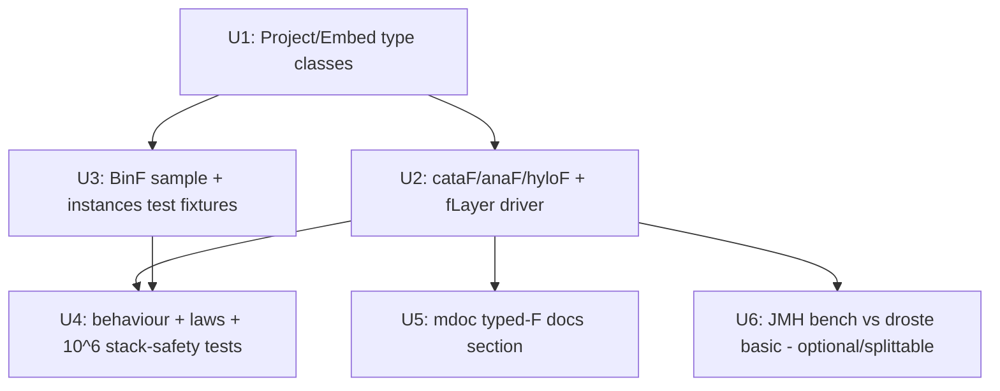

# feat: Typed pattern-functor recursion schemes (cataF/anaF/hyloF)

## Overview

Add an **opt-in, typed** recursion-scheme path to `cats-eo-schemes`, complementing — not
replacing — PR #23's Plated-driven `Schemes.cata/ana/hylo`. The user supplies a pattern functor
`F[_]` (e.g. `enum BinF[A] { case LeafF(n: Int); case BranchF(l: A, r: A) }`) plus its
`Traverse[F]`, and hand-writes two instances, `Project[F, S]` (`project: S => F[S]`) and
`Embed[F, S]` (`embed: F[S] => S`). From those, `Schemes.cataF/anaF/hyloF` give recursion schemes
whose algebra/coalgebra **pattern-match `F`'s named constructors** — no `PSVec[AnyRef]`, no
positional indexing, no `IndexOutOfBounds`. The driver is stack-safe via a `cats.Eval` trampoline
over `Traverse[F]` (droste's stack-safe `hyloM` shape), and the returned optics are the same
`DirectGetter`/`Review` types #23 produces, so they compose with the rest of the optic algebra via
`andThen`/`cross`.

This is **encoding B** from the corecursion spike (see origin and
`docs/research/2026-06-08-corecursion-encoding-spike.md`): a *thin opt-in typed layer*, justified
solely by two differentiators over droste's **basic** schemes — **stack-safety** (droste's
`kernel.hylo` is naive recursion) and **optic-composability**. It is not eo's "no pattern functor"
story; that remains #23/encoding A.

## Problem Frame

#23's schemes thread children through `PSVec[AnyRef]`: stack-safe and fast, but **type-unsafe** —
the algebra receives an erased `PSVec[A]` and indexes it positionally, so an arity mismatch is a
runtime `IndexOutOfBounds` or a silently-dropped subtree, not a compile error. Users who want
**named-constructor type safety** on a recursion scheme have nothing in eo today. droste is typed
but its *basic* schemes are stack-unsafe and don't compose as optics. The gap: a typed path that is
*also* stack-safe and optic-composable. (see origin: Problem Frame.)

## Requirements Trace

- **R1.** `project`/`embed` form an `Optic[S, S, S, S, Forget[F]]` using the **existing** `Forget[F]`
  carrier, with **no change to the `Optic` trait** (spike-proven G2). Realized as a `Schemes.fLayer`
  constructor and verified by a test that it is a usable `Optic` over `Forget[F]`.
- **R2.** A stack-safe driver over `to`/`from` provides `cataF`/`anaF`/`hyloF`, **empirically**
  stack-safe to 10⁶ in **O(depth) auxiliary space**. (The 2026-06-09 carrier-fit spike's *typed
  `Eval` cata* reached 10⁵; #23's `PSVec` machine reached 10⁶ but via a **different** engine
  (`ArrayDeque`/`tailRecM`, not `Traverse[F]`+`Eval`). 10⁶ on the `Eval` driver is therefore a *new
  bar to test, not assert* — and "stack-safe" here must mean **space-safe under a bounded heap**, not
  merely trampolined off the JVM call stack; see U4.)
- **R3.** Type-safe **at the algebra seam**: `gather`/`alg`/`coalg` pattern-match `F`'s typed
  constructors, so child-*arity* mismatches are compile errors (no `PSVec[AnyRef]`, no positional
  indexing). The honest scope of the claim: the `S`↔`F` *constructor correspondence* lives in the
  hand-written `Project`/`Embed` and is **not** compiler-checked — a non-exhaustive `project` is a
  runtime `MatchError`, a swapped mapping is silently wrong — guarded only by the user-run coherence
  laws (U4). So R3 is "type-safe destructure + law-checked correspondence", **not** "every mismatch
  structurally impossible". This is still a strict improvement over #23's positional `PSVec[AnyRef]`.
- **R4.** #23's `Schemes.cata/ana/hylo` and the `PSVec` engines stay **byte-for-byte unchanged** —
  the default path. Not subsumed.
- **R5.** New methods: `cataF(gather: (S, F[A]) => A)`, `anaF(coalg: Seed => F[Seed])`,
  `hyloF(coalg, alg)`. Gather is para-flavored `(S, F[A]) => A` (dual of droste's `(A, F[S]) => S`);
  pure `F[A] => A` is the degenerate case (ignore the `S`).
- **R6.** The user **writes `F` and its `Traverse[F]`** and **hand-writes** `Project[F, S]` /
  `Embed[F, S]` (droste's model). Derivation of `Project`/`Embed` is **deferred to a follow-up PR**.
- **R7.** Typed schemes compose with the optic algebra via `andThen` (and `cross`) — `cataF` returns
  `DirectGetter`, `anaF` returns `Review`, like #23 — so composition works through the `Direct`
  carrier with **no new core carrier instances**.
- **R8.** v1 = `cataF`/`anaF`/`hyloF` only. The zoo (para/apo/histo/futu) is deferred; the
  Gather/Scatter shape supports it later.

### Success Criteria

- A user-supplied `F` + `Traverse[F]` + hand-written `Project`/`Embed` yields `cataF`/`anaF`/`hyloF`
  that are typed (pattern-match `F`'s ctors) and **empirically** stack-safe at 10⁶.
- The typed schemes compose with the optic algebra via `andThen` (and `cross` for the materializing
  hylo law).
- #23's API compiles and behaves unchanged (regression suite green).
- Allocation (extend `SchemesBench`, `-prof gc`, **B/op**): typed-F path **at parity with droste's
  basic schemes** — net-better because eo also delivers the stack-safety droste's basic path lacks.
  (Beating droste needs a specialized `F`; out of scope.) **This parity is a *measured target* (U6),
  not a v1 merge gate** — if the `Eval` driver misses it, v1 still ships and the explicit-heap-machine
  fallback is filed as a follow-up (consistent with Key Technical Decisions and U6). What v1 *must*
  demonstrate to merge: typed correctness, the laws, and empirical 10⁶ space-safety.

## Scope Boundaries

- **Complement, not subsume/replace** #23 — #23 stays primary and untouched.
- The pattern functor `F` is **user-written**; eo does **not** derive the `F` type (proven
  impossible — G3) and, per the chosen scope, does **not** derive `Project`/`Embed` in v1 either.
- v1 schemes: `cataF`/`anaF`/`hyloF`. The zoo is deferred.
- Not chasing a boxing/allocation *win* over droste — parity with droste **basic** is the bar.
- No `core`, `generics`, or `build.sbt` module changes; no CI workflow regeneration (everything
  lands inside the existing `cats-eo-schemes` module).

## Context & Research

### Relevant Code and Patterns

- **`core/src/main/scala/dev/constructive/eo/data/Forget.scala`** — `type Forget[F[_]] = [X, A] =>> F[A]`
  (transparent, `X` phantom). Capability ladder, all gated on a type class of `F`: `Functor →
  ForgetfulFunctor` (`.modify`), `Foldable → ForgetfulFold` (`.foldMap`), `Traverse →
  ForgetfulTraverse` (`.modifyA`), `Applicative → ForgetfulApplicative` (`.put`), `Monad →
  AssociativeFunctor` (same-carrier `.andThen`). **Deliberately lacks `Accessor`/`ReverseAccessor`**
  — a `Forget[F]` optic has no `.get`/`.reverse`. This is why the recursive schemes return `Direct`
  carriers, and `Forget[F]` is only the home of the single-*layer* project/embed optic.
- **`schemes/src/main/scala/dev/constructive/eo/schemes/Schemes.scala`** — the path being complemented.
  `cata` = `Getter` via `foldInPlace(Plated.childrenArray, alg)`; `ana` = `Review` via
  `unfoldCoalg`; `hylo` = fused `Getter` via `unfoldFold`. All on a 512-deep on-stack / `ArrayDeque`
  heap-fallback hybrid. The typed `cataF/anaF/hyloF` are added to **this same `Schemes` object** for
  discoverability next to their `PSVec` counterparts.
- **`core/.../optics/Plated.scala`** — `rewrite` (lines ~191) is the **`cats.Eval`-trampolined**
  precedent (`Eval.defer` + `plate.modifyA[Eval]`); the typed driver mirrors *this* pattern, not the
  explicit `ArrayDeque` machine (see Key Decisions for why the engine choice differs from #23).
- **`core/.../optics/{Getter,Review,Fold}.scala`** — read-only optics use the honest `B = Unit`
  convention; `cataF`/`hyloF` return `DirectGetter[S, A]`, `anaF` returns `Review[S, Seed]`, exactly
  as #23.
- **`schemes/src/test/scala/dev/constructive/eo/schemes/samples/`** — top-level sample ADTs (the
  generics macro's outer-accessor rule forbids nesting them in the spec). New `Bin`/`BinF` sample
  lands here.
- **droste** (benchmark baseline, already a `benchmarks` dep from #23) — `Scatter[F,A,S] = S =>
  Either[A, F[S]]` ≈ `Optic.to`; `Gather[F,S,A] = (A, F[S]) => S` ≈ `Optic.from`. Its basic
  `kernel.hylo` is naive recursion (stack-unsafe); its `hyloM` (Traverse + Monad) is the stack-safe
  shape this plan's `Eval` driver matches.

### Institutional Learnings

- **`docs/research/2026-06-08-corecursion-encoding-spike.md`** — *governing verdict.* Encoding B (this
  feature) must be "a thin opt-in typed layer over A, not a second engine," justified by
  stack-safety + optic-composability. Honored throughout.
- **MEMORY `verify-stacksafety-claims`** — stack-safety must be **tested empirically**, never
  asserted. The 10⁶ bar (R2) is a real test (U4), not a claim.
- **MEMORY `bench-box-too-noisy-for-timing`** — local JMH ns/op is ±15–50%; **trust B/op**, run JMH
  via `java` not sbt. The driver-mechanism decision (Eval vs heap) is a **B/op** call (U6), not a
  local-ns call.
- **MEMORY `eo-schemes-slower-than-droste`** — #23's per-node `Frame`/array + `childrenVec`
  allocation already makes eo ~15–20× slower than droste/hand on this box. An `Eval`-node-per-node
  driver **compounds** that; the B/op parity bar is non-trivial, and the heap-machine fallback
  (deferred) exists precisely for this risk.
- **MEMORY `read-only-optics-should-have-b-unit`** — the `fLayer` project/embed optic is read+write
  (an `S ≅ F[S]` one-layer iso worn as `Forget[F]`), **not** read-only; do not give it `B = Unit`.
- **`docs/solutions/2026-04-17-coverage-baseline.md`** — new sources must be reached by the coverage
  command. New code is under `schemes/`, already covered by the existing `schemes/test` call — no
  coverage-command change needed.

### External References

- droste `Basis`/`Project`/`Embed`/`Scatter`/`Gather` (the `Project`/`Embed` type-class names and
  the para-flavored gather shape follow droste's vocabulary deliberately).

## Key Technical Decisions

- **Schemes return `Direct` carriers; `Forget[F]` is the single-layer home.** `cataF`/`hyloF` return
  `DirectGetter`, `anaF` returns `Review` — identical to #23 — so they compose via `andThen`/`cross`
  with **zero new core carrier instances** (resolves origin R7's deferred question). `Forget[F]` is
  used only for the `fLayer` one-layer project/embed optic (R1's concrete realization of the
  spike's G2), where the existing capability ladder already supplies everything obtainable.
- **`Traverse[F]` is required, sharpening R6's "Functor[F]".** A generic *stack-safe* driver must
  extract children, fold them under a trampoline, and rebuild the layer. `Functor[F]` alone forces
  naive recursion (droste's stack-unsafe basic path). `Traverse[F]` + `Eval` is the lawful
  stack-safe primitive. So the honest user obligation is `Traverse[F]` (which implies `Functor[F]`).
  Because the deep recursion is driven by the array machine (below) and `Traverse[F]` is used only
  *per layer* (bounded fanout), **any lawful `Traverse[F]` works** — stack-safety does not depend on
  the user's `foldRight` being `Eval`-lazy.
- **Driver mechanism: the explicit typed heap machine (`foldLayered`) — shipped, not `Eval`.**
  *(Updated during implementation — see the resolved Open Question and `site/docs/benchmarks.md`.)*
  v1 first shipped a `cats.Eval` trampoline (simplest), but U6's `-prof gc` showed it cost ~8–16×
  droste basic (~316 B/node of `Eval` machinery). It was replaced with the pre-planned explicit
  machine: the **same `< 512`-on-stack / heap-`ArrayDeque` hybrid as #23's `PSVec` engines**, but
  keeping `F` typed at the algebra seam — `foldLeft` reads a node's children into a per-node array
  (reused as the result accumulator, folded in place), the deep recursion runs on the machine, and
  `map` rebuilds the typed `F[result]` for the algebra (leaf layers skip the rebuild via a phantom
  recast). That cut allocation ~7× to **~1.1–2.2× droste basic** (hylo at parity), stack-safe to
  10⁶ in the default heap (no `Eval`, no test fork). The residual `cata` gap is the inherent
  native-`Bin`-vs-`Fix` cost (eo `project`s a layer per node; droste's `unfix` is free), the same
  cost eo's `PSVec` `cata` pays.
- **Everything in `cats-eo-schemes`, hand-written instances.** Per the chosen scope: no derive macro
  in v1, so `Project`/`Embed` type classes live in `schemes/` (not `core/`), no `generics` Compile
  dep, no module add, no CI regen. The derive macro (feasible — it generalizes `PlateMacro`) is a
  clean follow-up that would later promote the type classes to `core/`.
- **Typed hylo law as the correctness anchor — stated carefully.** The fused-equals-materializing
  law `hyloF(coalg, alg).get(seed) == anaF(coalg).cross(cataF(gather)).get(seed)` holds **as a
  `forAll` law only for the *pure* algebra** (`F[A] => A`, first argument ignored). For the
  para-flavored `(node, F[A]) => A`, `hyloF` threads the **seed** at each layer while `cataF` (after
  `anaF` materializes the tree) threads the rebuilt **`S = embed(...)`** — so for a gather that
  *reads* its first argument the two diverge unless `alg` and `gather` agree on the
  seed↔`embed(coalg(seed))` correspondence. #23's existing hylo-law test sidesteps this with
  hand-tuned functions that coincide at one point; this plan instead tests the **pure** flavor
  generically via `forAll` and the **para** flavor at specific points (U4). The law depends on the
  Project/Embed coherence laws (`embed(project(s)) == s`, `project(embed(fs)) == fs`), also tested.

## Open Questions

### Resolved During Planning

- **Carrier instances for composition (origin R7):** None needed. Schemes are `Direct`-carried; the
  `Forget[F]` layer optic uses only existing ladder instances.
- **`Functor[F]` vs `Traverse[F]` (origin R6):** `Traverse[F]` required (see Key Decisions).
- **Module placement / derivation (origin R6):** Hand-written instances in `schemes/`; derive macro
  deferred to a follow-up PR (user decision, 2026-06-09).
- **Does `hyloF` need `Project`/`Embed`?** No — it threads `F` directly (`coalg: Seed => F[Seed]`,
  `alg: (Seed, F[A]) => A`), needing only `Traverse[F]`. `cataF` needs `Project[F, S]`; `anaF` needs
  `Embed[F, S]`.

### Resolved During Implementation

- **Eval vs explicit heap machine (origin R2, B/op-gated): RESOLVED — the explicit heap machine
  ships.** U6's `-prof gc` first showed the `Eval` trampoline at **~8–16× droste basic** B/op (~316
  B/node of `Eval` machinery). Per the B/op gate, the driver was replaced with the pre-planned
  explicit typed heap machine (`foldLayered` — the `< 512`-on-stack / heap-`ArrayDeque` hybrid, `F`
  kept typed at the algebra seam). That cut allocation ~7× to **~1.1–2.2× droste basic** (`cata`
  2.2×, `hylo` 1.1× = parity, `ana` 1.6×, now even beating eo's own `PSVec` `ana`) — typed,
  stack-safe to 10⁶, no `Eval`, no test fork. No follow-up needed for parity. Table +
  rationale: `site/docs/benchmarks.md`.
- **Whether `Eval` reaches 10⁶ cleanly: RESOLVED — yes.** All three (`cataF`/`anaF`/`hyloF`) fold/
  build a 10⁶-deep spine without `StackOverflowError` (U4). `anaF` (the OOM frontier) needs ~1 GB at
  10⁶, so the module forks its tests with `-Xmx2g`.
- **Whether `Eval` reaches 10⁶ cleanly** (the *typed `Eval`* spike verified 10⁵; #23's distinct
  `PSVec` engine reached 10⁶; #23's own `ana` stack-safety test only goes to 100k). `anaF` is the
  least-proven path — it materializes an O(nodes) `S` *and* holds the `Eval` chain simultaneously, so
  its risk at 10⁶ is **OOM/heap-pressure**, not `StackOverflowError`. Expected to pass (Eval is a
  heap trampoline), but U4 confirms empirically under a bounded heap; a miss escalates to the
  heap-machine fallback.
- **Exact `Project`/`Embed` type-class shape** (two single-method traits vs a combined `Basis[F, S]`
  convenience) — settle when writing U1; the methods are fixed (`project`, `embed`).
- **One shared parameterised `Eval`-driver helper vs three per-scheme helpers** — affects duplication
  vs clarity; settle when writing U2.
- **Degenerate (non-para) gather ergonomics** — provide a pure `F[A] => A` overload, or expect users
  to write `(_, fa) => …` ignoring the node? Settle when writing U2/U5.

## High-Level Technical Design

> *This illustrates the intended approach and is directional guidance for review, not implementation
> specification. The implementing agent should treat it as context, not code to reproduce.*

The single-layer optic (R1) — `project`/`embed` worn as the existing `Forget[F]` carrier:

```
// to = project (S => F[S]);  from = embed (F[S] => S);  Forget[F][X,A] = F[A]
fLayer[F[_], S](using Project[F,S], Embed[F,S]): Optic[S, S, S, S, Forget[F]]
```

The recursive drivers — `Eval`-trampolined over `Traverse[F]` (mirrors `Plated.rewrite`):

```
// cataF: fold S to A. gather = (node: S, folded_children: F[A]) => result: A
//        (node FIRST — distinct from droste's dual Gather `(A, F[S]) => S` where the result is first)
cataF[F[_]: Traverse, S, A](gather: (S, F[A]) => A)(using P: Project[F, S]): DirectGetter[S, A]
  go(s) : Eval[A] =
    Traverse[F].traverse(P.project(s))(child => Eval.defer(go(child)))  // Eval[F[A]]
      .map(folded => gather(s, folded))    // user PATTERN-MATCHES F[A]'s named ctors (typed!)
  Getter(s => go(s).value)

// anaF: build S from a seed (materializing), embed assembles each typed layer
anaF[F[_]: Traverse, S, Seed](coalg: Seed => F[Seed])(using E: Embed[F, S]): Review[S, Seed]
  go(seed) : Eval[S] =
    Traverse[F].traverse(coalg(seed))(child => Eval.defer(go(child))).map(E.embed)
  Review(seed => go(seed).value)

// hyloF: fused refold, NO intermediate S, NO Project/Embed — F threaded directly
hyloF[F[_]: Traverse, Seed, A](coalg: Seed => F[Seed], alg: (Seed, F[A]) => A): DirectGetter[Seed, A]
  go(seed) : Eval[A] =
    Traverse[F].traverse(coalg(seed))(child => Eval.defer(go(child))).map(fa => alg(seed, fa))
  Getter(seed => go(seed).value)
```

The type-safety win (R3): `gather`/`alg` receive a typed `F[A]` and destructure by constructor —
`case (_, BranchF(l, r)) => l + r` — where `l, r: A` are named, not `kids(0)/kids(1): AnyRef`.

## Implementation Units



- [ ] **Unit 1: `Project[F, S]` / `Embed[F, S]` type classes**

**Goal:** Define the two hand-written instances the typed path is built on.

**Requirements:** R1, R6.

**Dependencies:** None.

**Files:**
- Create: `schemes/src/main/scala/dev/constructive/eo/schemes/Basis.scala`

**Approach:**
- `trait Project[F[_], S] { def project(s: S): F[S] }` and `trait Embed[F[_], S] { def embed(fs:
  F[S]): S }`. Optionally a combined `Basis[F, S] extends Project[F, S] with Embed[F, S]` convenience
  (decide at implementation; keep `project`/`embed` as the fixed method names).
- Pure definitions, no instances shipped (the user/tests supply them). Scaladoc states the coherence
  laws (`embed(project(s)) == s`, `project(embed(fs)) == fs`) that U4 tests.

**Patterns to follow:** droste `Project`/`Embed` naming; eo's single-method type-class style (e.g.
`core/.../Accessors.scala`).

**Test scenarios:** `Test expectation: none -- pure type-class definitions; exercised via U3/U4.`

**Verification:** `schemes` compiles with the new file; no other module affected.

- [ ] **Unit 2: `cataF` / `anaF` / `hyloF` + `fLayer` (the `Eval` driver)**

**Goal:** The feature — typed, stack-safe, optic-returning recursion schemes.

**Requirements:** R1, R2, R3, R5, R7.

**Dependencies:** U1.

**Files:**
- Modify: `schemes/src/main/scala/dev/constructive/eo/schemes/Schemes.scala` (add `cataF`/`anaF`/`hyloF`/`fLayer` to the existing `Schemes` object + private `Eval` driver helpers)

**Approach:**
- Add the three public methods + `fLayer` per the High-Level Technical Design. Private `Eval`-driver
  helpers (`Eval.defer` + `Traverse[F].traverse`), one per scheme (or one shared parameterised
  helper). `cataF` requires `Project[F, S]`; `anaF` requires `Embed[F, S]`; `hyloF` requires neither;
  all require `Traverse[F]`.
- `fLayer` constructs an anonymous `Optic[S, S, S, S, Forget[F]]` with `to = project`, `from = embed`
  — the concrete realization of spike G2 (R1). Read+write (not `B = Unit`).
- Leave #23's `cata`/`ana`/`hylo` and all `PSVec` engines **untouched** (R4).

**Execution note:** Implement the driver, then immediately drive U4's 10⁶ stack-safety test against
it — do not declare stack-safety until the test passes.

**Technical design:** see High-Level Technical Design (directional).

**Patterns to follow:** `Plated.rewrite` (the `Eval.defer` trampoline); #23's `Schemes` method
shapes and Scaladoc tone; `Getter`/`Review` constructors.

**Test scenarios:** *(behaviour proven in U4; this unit ships the implementation)*
- Happy path: `cataF` over `BinF`/`Bin` sums leaves; `anaF` builds a `Bin` from an `Int` seed;
  `hyloF` computes leaf-count fused. (Asserted in U4.)
- Edge case: a leaf node (`F` with no recursive positions) — `traverse` visits no children, gather
  sees the empty-of-children typed layer. (Asserted in U4.)

**Verification:** `schemes` compiles; `cataF`/`anaF`/`hyloF`/`fLayer` are callable with a
user-supplied `F` + `Traverse[F]` + `Project`/`Embed`; #23 API unchanged.

- [ ] **Unit 3: Sample pattern functor + hand-written instances (test fixtures)**

**Goal:** A representative typed `F` to exercise the schemes — grounded in a real recursive ADT.

**Requirements:** R3, R6.

**Dependencies:** U1.

**Files:**
- Create: `schemes/src/test/scala/dev/constructive/eo/schemes/samples/Bin.scala` (top-level `Bin`
  recursive ADT + `BinF[_]` pattern functor + `given Traverse[BinF]`, `given Project[BinF, Bin]`,
  `given Embed[BinF, Bin]`)

**Approach:**
- `enum Bin { case Leaf(n: Int); case Branch(l: Bin, r: Bin) }` and `enum BinF[A] { case LeafF(n:
  Int); case BranchF(l: A, r: A) }`. **Hand-write `Traverse[BinF]`** — cats 2.13 ships no automatic
  `Traverse` derivation for a Scala-3 `enum`, and its `foldRight` must be **`Eval`-based** to stay
  lazy (the driver's stack-safety depends on it). Then `Project[BinF, Bin]` (`Branch(l,r) =>
  BranchF(l,r)`; `Leaf(n) => LeafF(n)`), `Embed[BinF, Bin]` (inverse). Keep **top-level**
  (outer-accessor rule).
- Add a second, **wide-and-deep** shape — an N-ary `RoseF[A]` (e.g. `case NodeF(label: Int, kids:
  List[A])`) with `Bin`-style `Project`/`Embed`/`Traverse` — so U4 can exercise the
  high-fanout-*and*-deep case that a binary spine alone won't (guards the `Traverse`-instance
  failure mode in Key Technical Decisions). This is now in-scope (not optional) because it covers a
  distinct stack-safety risk.

**Patterns to follow:** #23's `schemes/.../samples/` top-level ADTs; droste's `Basis` examples.

**Test scenarios:** `Test expectation: none -- test fixtures; behaviour asserted in U4.`

**Verification:** `schemes/test` compiles with the fixtures; instances resolve.

- [ ] **Unit 4: Behaviour + laws + stack-safety tests**

**Goal:** Prove typed correctness, the 10⁶ stack-safety bar, the coherence + hylo laws, composition,
and the cross-path equivalence to #23.

**Requirements:** R1, R2, R3, R4, R5, R7 (+ all success criteria).

**Dependencies:** U2, U3.

**Files:**
- Create: `schemes/src/test/scala/dev/constructive/eo/schemes/SchemesFSpec.scala` (behaviour)
- Create: `schemes/src/test/scala/dev/constructive/eo/schemes/SchemesFLawsSpec.scala` (ScalaCheck laws)

**Approach:** specs2 + ScalaCheck, mirroring #23's `SchemesSpec`/`SchemesLawsSpec`.

**Execution note:** Write the 10⁶ stack-safety test to actually run and pass — empirical, not
asserted (per `verify-stacksafety-claims`). A failure escalates to the deferred heap-machine driver.

**Patterns to follow:** #23's `SchemesSpec` (behaviour) and `SchemesLawsSpec` (ScalaCheck hylo law).

**Test scenarios:**
- *Happy path* — `cataF` typed gather sums all leaf values of a `Bin`; `anaF` builds the expected
  `Bin` from a seed; `hyloF` fused computes leaf-count == `cataF` over the built tree.
- *Edge case* — single `Leaf` (no recursion); a `Branch(Leaf, Leaf)` (depth 1); empty-of-children
  layer handled.
- *Stack/space-safety (R2)* — `cataF`, `anaF`, and `hyloF` each on a **10⁶**-deep left-nested
  `Bin`/seed spine complete without `StackOverflowError`, **run under a bounded heap** (a modest
  `-Xmx`, e.g. via a JVM fork option for these cases) so a pass certifies O(depth) *space-safety*,
  not merely a trampolined call stack; assert completion within a generous wall-clock bound (guards
  the known ~15–20× slowdown). Treat the **`anaF` 10⁶** run as the OOM frontier (it holds the `Eval`
  chain *and* the materialized `S`).
- *Wide-and-deep stack-safety* — `cataF`/`hyloF` on a `RoseF` that is **both** high-fanout (long
  `kids` lists) and deep, to exercise the `Traverse`-instance sequencing path the binary spine
  doesn't.
- *Type-safety (R3)* — the gather/coalg destructure `BinF`'s named constructors (`case BranchF(l, r)
  => l + r`); include a brief comment/compile-time note that a wrong-arity match is a compile error
  (no `kids(2)` runtime path exists). Optionally a `compileErrors`/`typecheck`-style negative check.
- *Coherence laws (ScalaCheck)* — `forAll(s: Bin)`: `embed(project(s)) == s`; `forAll(fs: BinF[Bin])`:
  `project(embed(fs)) == fs`.
- *Typed hylo law — pure flavor (ScalaCheck)* — with a **pure** algebra (`alg`/`gather` ignore the
  node argument), `forAll(seed)`: `hyloF(coalg, alg).get(seed) ==
  anaF(coalg).cross(cataF(gather)).get(seed)` (fused == materializing). This is the generically-valid
  law.
- *Typed hylo law — para flavor (point tests)* — for a para-flavored `alg`/`gather` that *reads* the
  node, assert equality at **specific** seeds where the seed↔`embed(coalg(seed))` correspondence is
  arranged to hold (mirroring #23's approach), **not** via arbitrary `forAll` — document why the
  generic `forAll` does not apply to the para flavor (the first arguments differ: seed vs rebuilt
  `S`).
- *Cross-path equivalence* — `cataF` over `BinF`/`Bin` equals #23's `Schemes.cata` with a
  hand-written `Plated[Bin]` on the same algebra (bridges the typed and `PSVec` paths).
- *Composition (R7)* — `Getter[Wrapper, Bin](_.bin).andThen(cataF(...))` reads through; the
  materializing `anaF(...).cross(cataF(...))` type-checks and computes.
- *fLayer (R1)* — `fLayer[BinF, Bin]` is a usable `Optic[Bin, Bin, Bin, Bin, Forget[BinF]]`:
  `to`/`from` round-trip one layer (`from(to(b)) == b`), and (given `Foldable[BinF]`) `.foldMap`
  reads the layer's foci.
- *Regression (R4)* — existing `SchemesSpec`/`SchemesLawsSpec` remain green (run the module suite).

**Verification:** `schemes/test` green, including the 10⁶ cases; all laws hold under ScalaCheck;
#23's suites unchanged and passing.

- [ ] **Unit 5: mdoc docs — typed-F section**

**Goal:** Document the opt-in typed path next to the existing schemes docs.

**Requirements:** R5, R6 (user obligations), R8 (scope).

**Dependencies:** U2.

**Files:**
- Modify: `site/docs/schemes.md` (add a "Typed pattern-functor schemes (`cataF`/`anaF`/`hyloF`)"
  section; mdoc-compiled)

**Approach:**
- Show the `BinF`/`Bin` sample, the hand-written `Traverse`/`Project`/`Embed`, then `cataF`/`anaF`/
  `hyloF` with `mdoc` output. State plainly: typed (named constructors) + stack-safe + composable;
  user writes `F` + `Traverse[F]` + `Project`/`Embed`; derivation is future work; this **complements**
  the default `PSVec` schemes (when to reach for which). Update the existing "exploratory / type
  safety" caveat at the top to point at this typed path as the type-safe option.

**Patterns to follow:** the existing `site/docs/schemes.md` mdoc style (`mdoc:silent` setup +
`mdoc` eval blocks).

**Test scenarios:** `Test expectation: none -- mdoc compiles the snippets (build-time check).`

**Verification:** `docs/mdoc` succeeds (the pre-commit gate), 0 errors; snippets render expected
output.

- [x] **Unit 6: JMH benchmark — typed-F vs droste basic** ✅ done (in this PR)

**Result:** eoF `cataF`/`hyloF`/`anaF` rows added to `SchemesBench`; `-prof gc` shows the `Eval`
path at ~8–16× droste-basic B/op — misses parity, so the heap-machine driver is a tracked follow-up.
See `site/docs/benchmarks.md` and the resolved Open Question above.

**Goal:** Measure B/op against droste's basic schemes (the success-criterion bar) and decide the
driver mechanism.

**Requirements:** Success criterion (allocation parity).

**Dependencies:** U2.

**Files:**
- Modify: `benchmarks/src/main/scala/dev/constructive/eo/bench/SchemesBench.scala` (+ fixtures) — add
  eo `cataF`/`hyloF` rows alongside the existing eo `PSVec` / droste / hand rows.

**Approach:**
- Add paired benchmark methods for `cataF`/`hyloF` over `BinF` vs droste basic `cata`/`hylo` on the
  same 2¹² leaf-sum tree. Run `-prof gc`, **via `java` not sbt**, B/op the signal. Record the result
  and the Eval-vs-heap decision in a benchmark-docs note (as #23 did). If `Eval` misses droste-basic
  parity, file the heap-machine fallback as the follow-up (do not block v1).

**Execution note:** Splittable into a follow-up PR if the core feature (U1–U5) is ready first;
trusts B/op, not local ns (`bench-box-too-noisy-for-timing`).

**Patterns to follow:** #23's `SchemesBench` (paired `eo*`/`droste*`/`hand*` methods, JMH annotations).

**Test scenarios:** `Test expectation: none -- benchmarks are not part of test; verified by a clean
JMH run producing B/op numbers.`

**Verification:** `benchmarks` compiles; a smoke `Jmh/run -i 1 -wi 1 -f 1 .*cataF.*` produces numbers;
B/op recorded against droste basic.

## System-Wide Impact

- **Interaction graph:** Additive — new methods on the `Schemes` object + one new `schemes/` source
  file + test fixtures/specs. No existing call sites change. `core`, `generics`, `circe`, `avro`,
  `jsoniter` untouched.
- **Error propagation:** A non-terminating `coalg`/`project` exhausts the heap (Eval thunks) →
  `OutOfMemoryError`, mirroring #23's heap-machine behaviour for non-terminating `expand`. Document
  in Scaladoc, consistent with #23.
- **State lifecycle risks:** None — pure functions, no persistence, no shared mutable state (the
  `Eval` driver allocates per-call thunks, no caches).
- **API surface parity:** The typed path mirrors the `PSVec` path's three entry points
  (`cata↔cataF`, `ana↔anaF`, `hylo↔hyloF`) on the same object — discoverability parity.
- **Integration coverage:** U4's composition + cross-path-equivalence + fLayer tests exercise the
  real optic-algebra seam (not mocks): `andThen`, `cross`, and the `Forget[F]` carrier ladder.
- **Unchanged invariants:** #23's `cata`/`ana`/`hylo`, all `PSVec` engines, the `Optic` trait, and
  every core carrier instance are explicitly **not** changed (R4). The typed path adds no core
  carrier instances; it rides `Direct` (schemes) and the existing `Forget[F]` ladder (fLayer).

## Risks & Dependencies

| Risk | Mitigation |
|------|------------|
| `Eval`-per-node allocation misses droste-basic B/op parity (known: eo schemes already ~15–20× droste) | U6 measures B/op explicitly; deferred explicit-typed-heap-machine fallback is pre-planned and non-blocking; success bar is *basic* droste (also non-specialized), and eo additionally delivers stack-safety droste-basic lacks |
| `Eval` doesn't reach 10⁶ — and `anaF` is the OOM frontier (it holds the Eval chain *and* an O(nodes) materialized `S`); the typed `Eval` spike only verified 10⁵ and #23's `ana` test only 100k | U4 tests 10⁶ empirically **under a bounded heap** (certifies space-safety, not just trampolined stack), with a wall-clock bound; `anaF` tested explicitly; a miss escalates to the heap-machine fallback |
| Hand-written `Traverse[F]` that is naively recursive / non-`Eval`-lazy reintroduces stack growth a binary-spine test misses | Key Decisions states the sequencing obligation; U4 adds a wide-and-deep `RoseF` test; docs recommend deriving `Traverse[F]` |
| `Traverse[F]` burden surprises users expecting just `Functor[F]` (origin R6 said Functor) | Documented as a resolved decision + shown in U5 docs + the `BinF` sample provides a copyable `Traverse` instance; it's exactly droste's stack-safe obligation |
| Hand-written `Project`/`Embed` can violate coherence (silently wrong schemes) | U4 ScalaCheck coherence laws (`embed∘project == id`, `project∘embed == id`) catch incoherent instances; Scaladoc states the laws |
| Scope creep toward deriving `F` or `Project`/`Embed` | Explicit scope boundary; derivation is a named follow-up PR, feasibility already assessed (generalizes `PlateMacro`) |

## Documentation / Operational Notes

- `site/docs/schemes.md` typed-F section (U5); update the top-of-page "type safety" caveat to point
  at the typed path. No runtime/ops surface (pure library).
- Coverage: new sources are under `schemes/`, already in the `schemes/test` coverage call — no
  coverage-command change.
- Pre-commit gate runs `scalafmtCheckAll` + `mdoc` + `laikaSite`; pre-push runs `sbt test`. No
  module/CI changes (no `githubWorkflowGenerate`).

## Alternative Approaches Considered

- **Wrap droste's stack-safe schemes instead of re-implementing the driver.** droste already ships
  `cataM`/`anaM`/`hyloM[Eval]` (Traverse + Monad) which *are* stack-safe — so eo's stack-safety
  differentiator is over droste's *basic* `kernel.hylo`, not droste wholesale. A ~thin
  `Getter(s => droste.scheme.cataM[Eval](alg).apply(s).value)` would deliver both differentiators
  (stack-safe + optic-composable) with near-zero engine code. **Rejected** because the origin
  brainstorm settled that **droste is a benchmark baseline, not a runtime dependency** (see origin:
  Dependencies / Assumptions) — adding droste to the published `cats-eo-schemes` runtime surface is
  excluded. Secondary reasons: the para-flavored gather `(S, F[A]) => A` differs from droste's
  `Gather`; eo wants optic-native return types and to avoid `Fix[F]`; and not coupling the public API
  to droste's evolution. **This no-runtime-droste-dependency constraint is the load-bearing premise
  for building rather than wrapping** — if it were relaxed, wrapping would be the cheaper path.
- **Ship `fLayer` + a single demonstrating `cataF`; defer `anaF`/`hyloF`.** The single-layer
  `Forget[F]` optic (R1) is the cheap, low-risk deliverable; the recursive driver carries all the
  stack-safety / allocation / hylo-law risk. **Rejected** because the origin fixed v1 =
  `cataF`/`anaF`/`hyloF` (R8); the recursive driver *is* the feature's reason to exist (automatic
  deep recursion with named constructors). Noted so the risk concentration is explicit, not hidden.

## Sources & References

- **Origin document:** [docs/brainstorms/2026-06-09-pattern-functor-carrier-requirements.md](docs/brainstorms/2026-06-09-pattern-functor-carrier-requirements.md)
- Governing verdict: [docs/research/2026-06-08-corecursion-encoding-spike.md](docs/research/2026-06-08-corecursion-encoding-spike.md)
- Complemented path (#23): [docs/plans/2026-06-09-001-feat-schemes-module-plan.md](docs/plans/2026-06-09-001-feat-schemes-module-plan.md) — merged PR #23
- Related code: `core/.../data/Forget.scala`, `core/.../optics/Plated.scala` (`rewrite`),
  `schemes/.../Schemes.scala`, `schemes/.../samples/`, `benchmarks/.../SchemesBench.scala`
- Baseline: droste `Basis`/`Project`/`Embed`/`Scatter`/`Gather`, `kernel.hylo`/`hyloM`
