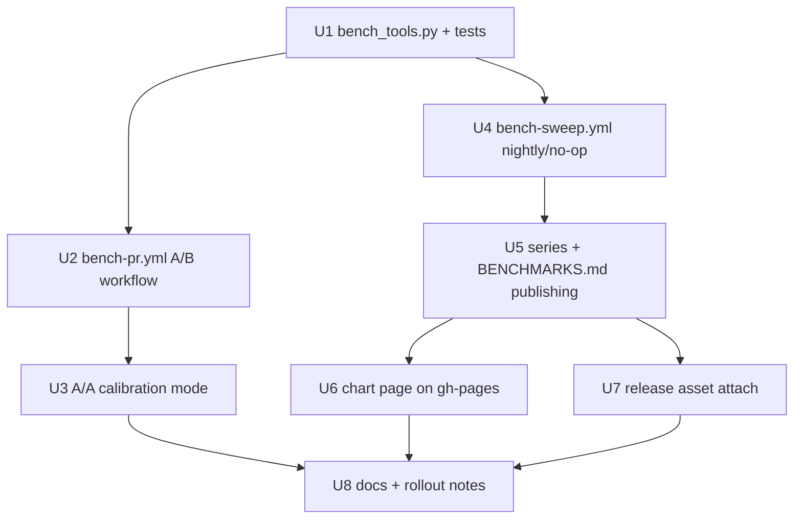

# feat: Benchmark CI pipeline — PR A/B deltas, generated BENCHMARKS.md, release history

## Overview

Turn the existing manual-dispatch JMH workflow into a three-legged pipeline:
(1) an automatic same-job A/B benchmark delta on PRs that touch
benchmark-mapped code, posted as a sticky comment; (2) a nightly-if-changed
full sweep on main that appends to an append-only results series, renders and
bot-commits `BENCHMARKS.md`, and serves a custom chart page; (3) release-tag
sweeps whose `jmh-results.json` is attached to the GitHub release.

Doctrine (measured, not asserted): on shared runners `-prof gc` B/op is
deterministic, ns/op is ±15–50% noise — **B/op gates (after calibration),
ns/op advises**. Rollout is advisory-first.

## Problem Frame

Perf regressions are currently discovered ad hoc, long after the offending
merge; there is no published record of current or historical performance and
no benchmark signal on PRs. See origin document for the full frame and the
research basis (rustc-perf, Go benchstat, asv/Lucene, conbench,
github-action-benchmark, CodSpeed evaluation).

## Requirements Trace

From the origin document (R-numbers preserved):

- R1–R3: auto A/B job on same-repo PRs touching mapped paths; same-VM
  base/head runs; sticky comment with B/op + directional ns/op, new/removed/
  rename handling, escaped untrusted content, explicit failure states.
- R2: transitive path→bench mapping (core/ ⇒ all benches), reduced PR JMH
  profile, full sweep on `build.sbt`/`project/`/harness changes, mapping
  validation on every run, both sides compiled before running.
- R4–R5: advisory-first; A/A calibration mode; calibration bound to the
  measurement profile; gate flips only after empirical thresholds exist.
- R6: `perf:full` label escalates to full sweep.
- R7–R8: generated `BENCHMARKS.md` at repo root, bot-committed by the sweep
  job only, never hand-edited, commit must not trigger CI or another sweep.
- R9: nightly full sweep, no-oping via recorded swept source SHA (bot
  commits excluded); release tags always sweep.
- R10: append-only hosted JSON series with provenance; custom chart page
  (B/op first-class); only the trusted sweep workflow writes it.
- R11: `jmh-results.json` attached to each GitHub release.
- R12–R15: provenance on every published number; workflows stay out of
  generated ci.yml; runs fit runner limits; least-privilege permissions.

## Scope Boundaries

Carried from origin: allocation-only gate (CPU-timing blind spot named and
accepted, ns/op advisory as backstop; dedicated runner is future work); fork
PRs get no run/comment; no third-party bench service; no historical
backfill; no change to benchmark content or JMH annotation defaults beyond
what CI budgets force; per-commit main resolution is a non-goal.

## Context & Research

### Relevant Code and Patterns

- `.github/workflows/update-readme-version.yml` — **proves the two riskiest
  mechanics already work here**: (a) a GITHUB_TOKEN bot commit pushed
  directly to main (`contents: write`, `github-actions[bot]` identity), and
  (b) the `workflow_run`-on-"Continuous Integration"-completion trigger
  filtered to successful `v*` tag builds — the release hook that needs zero
  ci.yml changes. Mirror both.
- `.github/workflows/deploy-site.yml` — same-repo fork guard expression
  (`github.event.pull_request.head.repo.full_name == github.repository`),
  minimal `permissions` block with rationale comment, per-PR concurrency
  group, and `marocchino/sticky-pull-request-comment@v3` with a `header`
  key for in-place comment updates.
- `.github/workflows/benchmarks.yml` — existing manual JMH run: sbt
  invocation shape, `-rf json -rff jmh-results.json`, inline Python render
  step, artifact upload. The new workflows generalize this file's patterns;
  it stays as the ad-hoc escape hatch.
- `build.sbt:749` — `bench` (`-i 5 -wi 3 -f 3`) and `benchQuick`
  (`-i 3 -wi 2 -f 1`) aliases; the reduced PR profile extends `benchQuick`.
- `benchmarks/src/main/scala/dev/constructive/eo/bench/JmhDefaults.scala` —
  per-class JMH preamble is structurally required (documented probe); do
  not touch bench annotations, override via CLI flags only.
- Bench class naming is regular (`*Bench.scala`, one class per file, Avro/
  Circe/Jsoniter/Schemes/Generics in the name) — the mapping can be
  filename-regex based.

### Institutional Learnings (memories + docs)

- B/op via `-prof gc` is the trustworthy metric on noisy boxes; run JMH
  measurements with real forks for ns/op to mean anything; CI is where ns
  wins are measured.
- ci.yml is generated (`sbt githubWorkflowGenerate`) and must never be
  hand-edited; hand-written workflows are the established side channel.
- `git push origin <branch>` trap: always use explicit refspecs in
  automation.
- Escape analysis (C2) elides allocations — insufficient warmup shifts
  B/op for non-code reasons; the reduced profile must be A/A-validated.

### External References

- github-action-benchmark ruled out for charts (JMH mode charts
  primaryMetric ns/op only — would drop the gating metric).
- CodSpeed ruled out (JVM support is Maven/Gradle walltime-only, 2026-05).
- Go benchstat doctrine motivates same-job A/B; rustc-perf motivates
  deterministic-metric gating + opt-in depth.

## Key Technical Decisions

- **One stdlib-only Python tool, `.github/bench/bench_tools.py`, with
  subcommands** (`affected`, `validate-mapping`, `diff`, `comment-md`,
  `benchmarks-md`, `append-series`, `noise-report`): the pipeline's logic
  lives in one testable file instead of being smeared across workflow YAML.
  Python-in-workflow is already the repo's pattern (benchmarks.yml render
  step). Stdlib-only (json/argparse/pathlib/html) — no pip install step.
- **Mapping lives in the tool as data** (module-dir → bench-class regex,
  plus the transitive rule core/ ⇒ all, and full-sweep triggers
  `build.sbt`/`project/`/`benchmarks/`): a separate YAML would need a
  parser; a dict next to the code that validates it doesn't. Validation
  enumerates `benchmarks/src/main/scala/**/ *Bench.scala` and fails if any
  class is unreachable or any mapped path is missing.
- **A/B = two sbt `Jmh/run` invocations in one job**, base first
  (`git merge-base origin/main HEAD`), then head, `-rff base.json` /
  `-rff head.json`, diffed by the tool. Double sbt startup (~10–15 min
  total) is accepted for v1; a shared assembly jar is a deferred
  optimization. Same-VM pairing is the point (Go doctrine).
- **Reduced PR profile: `benchQuick` params + `-prof gc`**
  (`-i 3 -wi 2 -f 1 -t 1 -prof gc`) as the starting point — legitimate for
  the deterministic gate metric, calibrated per-profile (R5); final params
  set by A/A validation (deferred), specifically checking B/op stability
  under reduced warmup (escape-analysis caveat).
- **Release hook via `workflow_run` on "Continuous Integration" success for
  `v*` head branches** — copied from update-readme-version.yml. No ci.yml
  edit, no race with the publish build, and workflow_run always executes
  trusted main-branch workflow code (R15-clean).
- **Bot commit via GITHUB_TOKEN** (`github-actions[bot]`, `contents:
  write`, push to main) — proven by update-readme-version.yml. The commit
  message carries `[skip ci]` (R8: must not trigger CI); the nightly no-op
  additionally keys on the swept *source* SHA recorded in the series, so
  the bot commit can never retrigger a sweep. Fallback if branch protection
  later blocks GITHUB_TOKEN: fine-grained PAT/App (deferred until needed).
- **Series = `bench/series.jsonl` on a new `gh-pages` branch** (append-only
  JSON Lines: one sweep per line with full provenance). JSONL makes append
  a file-append, not a read-modify-write of a growing JSON array. GitHub
  Pages serves the chart page from the same branch; gh-pages is entirely
  unused today (site is on Cloudflare) so there is no coexistence problem.
  Only the nightly/release sweep workflow pushes to it (R10/R15).
- **Chart page = one static `bench/index.html`** (vanilla JS + an inlined
  or CDN chart lib) reading `series.jsonl`: per-benchmark history lines,
  B/op as the default metric, ns/op behind a toggle marked directional.
- **Gate stays advisory until calibrated**: `diff` takes an optional
  threshold config file (`.github/bench/thresholds.json`); absent file =
  advisory-only. Flipping to gating after calibration is a one-file commit,
  not a workflow change.

## Open Questions

### Resolved During Planning

- Mapping format/location → data inside `bench_tools.py`, self-validating
  (see decisions).
- A/B mechanics → two sbt runs in one job, merge-base first; JSON pairs
  diffed by benchmark FQN + params key; rename = removed+new flag.
- Release hook → `workflow_run` on CI success for `v*` (proven pattern);
  `gh release upload`, creating a draft release if the object doesn't
  exist yet (release objects are created manually today).
- Series host → gh-pages + GitHub Pages (new one-time repo setting);
  Cloudflare stays the docs-site host, unmixed.
- Bot identity → GITHUB_TOKEN (proven); PAT/App only as fallback.
- Calibration shape → a `mode=aa` dispatch path of the PR workflow (runs
  the same ref twice), not standing infrastructure; `noise-report`
  subcommand aggregates run artifacts.

### Deferred to Implementation

- Final reduced-profile params: needs real A/A runs showing B/op is stable
  under `-wi 2` (EA/C2 warmup risk); bump warmup if not.
- Gate threshold values and ns/op advisory statistical form: needs the A/A
  noise-floor data (per bench family, quantile-based rather than mean).
- Full-sweep wall time and sharding: first nightly runs measure it; shard
  by bench-class groups across a matrix (with a JSON merge step) only if
  measured over ~5h. The workflow is written single-job first.
- Chart lib choice (inline SVG vs small CDN lib): decided when building
  `index.html`; requirement is only B/op-first + directional ns/op.
- sbt-vs-assembly for the A/B runs: revisit if the double startup proves
  painful in practice.

## High-Level Technical Design

> *Directional guidance for review, not implementation specification.*

```text
.github/bench/bench_tools.py        one stdlib-only CLI, subcommands:
  affected <changed-files>          -> JMH class regex (or "FULL")
  validate-mapping                  -> exit 1 + message on drift
  diff base.json head.json          -> deltas.json (paired by FQN+params;
                                       new / removed / rename-suspect)
  comment-md deltas.json            -> sticky-comment markdown (escaped,
                                       failure states, provenance footer)
  benchmarks-md sweep.json          -> BENCHMARKS.md content
  append-series sweep.json          -> one JSONL line w/ provenance
  noise-report a.json b.json ...    -> per-family noise floor table

workflows (all hand-written, ci.yml untouched):
  bench-pr.yml      pull_request (same-repo guard, mapped paths)
                    + workflow_dispatch (mode=aa | manual A/B)
                    job: checkout(fetch-depth 0) -> merge-base run ->
                         head run -> diff -> sticky comment
                    permissions: contents: read, pull-requests: write
  bench-sweep.yml   schedule (nightly) + workflow_run (CI success, v*)
                    + workflow_dispatch
                    job: no-op check (swept SHA from series) -> full sweep
                         -> append series + push gh-pages
                         -> render + [skip ci] bot-commit BENCHMARKS.md
                         -> if v*: gh release upload jmh-results.json
                    permissions: contents: write
```

## Implementation Units



### Phase 1 — PR early warning

- [ ] **Unit 1: `bench_tools.py` — mapping, diff, and render tool**

**Goal:** All pipeline logic (affected-selection, mapping validation, JSON
pair diffing, comment/BENCHMARKS.md/series rendering, noise report) in one
tested, stdlib-only Python file.

**Requirements:** R2, R3, R7, R10, R12

**Dependencies:** None

**Files:**
- Create: `.github/bench/bench_tools.py`
- Test: `.github/bench/test_bench_tools.py` (stdlib `unittest`, run in CI
  by bench-pr.yml when `.github/bench/` changes, and runnable locally)

**Approach:**
- Mapping as an in-file dict: leaf module dir → bench filename regex;
  `core/`, `build.sbt`, `project/`, `benchmarks/` → FULL. `affected` takes
  the changed-file list on stdin, emits a JMH include regex or `FULL`.
- `diff` pairs benchmarks by `benchmark` FQN + sorted `params`; classifies
  unpaired entries as new/removed and flags removed+new pairs as
  rename-suspects (R3). Reads both primaryMetric (ns/op) and the
  `·gc.alloc.rate.norm` secondary metric (B/op) — this is why
  github-action-benchmark was ruled out.
- `comment-md` escapes all benchmark-derived strings (html.escape +
  backtick fencing), renders B/op deltas first, ns/op marked directional,
  provenance footer (SHA pair, JDK, runner, JMH params), and explicit
  failure states when a side is missing.
- Threshold file support: if `.github/bench/thresholds.json` exists,
  `diff` exits non-zero on B/op regressions beyond threshold (the future
  gate); absent = advisory.

**Patterns to follow:** the Python render step in
`.github/workflows/benchmarks.yml` (JMH JSON shape handling).

**Test scenarios:**
- Happy path: two synthetic JMH JSON docs with overlapping benchmarks →
  `diff` pairs them, computes B/op and ns/op deltas with correct signs.
- Happy path: `affected` with `avro/src/...` → Avro-bench regex only;
  with `core/src/...` → FULL; with `docs/...` only → empty (skip signal).
- Edge: head-only benchmark → "new"; base-only → "removed"; simultaneous
  removed+new → rename-suspect flag in the rendered comment.
- Edge: benchmark with `params` axes pairs by param set, not just FQN.
- Error path: malformed/empty JSON on one side → `diff` produces the
  explicit failure state, non-silent; `comment-md` renders it as ❌.
- Error path: `validate-mapping` against a temp tree containing an
  unmapped `FooBench.scala` → exit 1 with the class named; a mapped path
  that doesn't exist → exit 1.
- Security: benchmark name containing `](x)` / `<script>` / pipe chars →
  rendered comment contains it escaped, never raw.
- Gate: thresholds.json present + B/op regression beyond threshold →
  non-zero exit; within threshold → zero exit; file absent → zero exit
  regardless (advisory).

**Verification:** `python3 -m unittest` passes in `.github/bench/`; running
`affected`/`validate-mapping` against the real repo tree maps every
existing `*Bench.scala` class.

- [ ] **Unit 2: `bench-pr.yml` — same-job A/B workflow with sticky comment**

**Goal:** The automatic PR delta: same-repo guard, path filter, merge-base
run then head run on one VM at the reduced profile, diff, sticky comment
with failure states; `perf:full` label escalation.

**Requirements:** R1, R2, R3, R4 (advisory), R6, R13, R14, R15

**Dependencies:** Unit 1

**Files:**
- Create: `.github/workflows/bench-pr.yml`

**Approach:**
- Triggers: `pull_request` (types incl. `labeled`) with the deploy-site
  same-repo guard; job-level path decision via `affected` (a cheap first
  step computes the regex from the PR diff; empty → job exits early as
  skipped success). `perf:full` label or FULL mapping result ⇒ full-sweep
  regex at the reduced profile.
- Steps: checkout fetch-depth 0 → run tool tests if `.github/bench/`
  changed → `git checkout $(git merge-base origin/main HEAD)` → sbt
  `Jmh/run` (reduced profile, `-prof gc`, `-rf json -rff base.json`) →
  `git checkout` head → same for `head.json` → `diff` → `comment-md` →
  `marocchino/sticky-pull-request-comment@v3` (header: `bench-ab`).
  Compile failure on either side short-circuits to a failure-state
  comment (R3) — the sbt run step's failure is caught, not swallowed.
- `permissions: contents: read, pull-requests: write`; concurrency group
  per PR with cancel-in-progress (deploy-site pattern). Timeout generous
  but bounded (R14); reduced profile keeps core-PR full runs ~1–2h.
- Advisory: the diff step never fails the job while thresholds.json is
  absent; the comment is the deliverable.

**Patterns to follow:** `deploy-site.yml` (guard, permissions, sticky
comment, concurrency); `benchmarks.yml` (sbt/JMH invocation, setup steps).

**Test scenarios:** *(workflow logic lives in Unit 1's tested tool; the
workflow itself is verified by drills)*
- Integration: PR touching only `docs/` → job skips (no comment).
- Integration: PR touching `jsoniter/` → only Jsoniter benches run; comment
  appears with B/op table and provenance.
- Integration: induced-regression drill — branch adding a gratuitous
  allocation on a benched path → comment shows the positive B/op delta.
- Integration: PR breaking bench compilation on head → ❌ failure-state
  comment, job green (advisory), nothing silent.
- Integration: `perf:full` label on a one-module PR → full sweep runs.

**Verification:** the drills above pass on a scratch PR; fork-PR simulation
(dispatch from a fork or trigger-condition review) confirms the guard.

- [ ] **Unit 3: A/A calibration mode + noise floors**

**Goal:** `workflow_dispatch` mode on bench-pr.yml benchmarking the same
ref twice in one job; `noise-report` aggregates artifacts into per-family
noise floors; thresholds derived from data (R5), recorded in
`.github/bench/thresholds.json` *only when* the numbers justify gating.

**Requirements:** R4, R5

**Dependencies:** Unit 2

**Files:**
- Modify: `.github/workflows/bench-pr.yml` (dispatch inputs: `ref`,
  `mode=aa`, profile params)
- Modify: `.github/bench/bench_tools.py` (`noise-report`), tests alongside

**Approach:** A/A reuses the exact A/B steps with base=head — this
validates the pipeline itself (any nonzero B/op delta in A/A is a bug or
noise floor). Report emits per-family quantiles for both metrics; the
profile (JMH params, JDK, runner image) is stamped into the report so
calibration is bound to it (R5). Repeat runs are manual dispatches —
no standing scheduled calibration.

**Test scenarios:**
- Happy path: `noise-report` over N synthetic A/A pairs → per-family
  quantile table; identical inputs → zero floor.
- Edge: reports from mismatched profiles → refuses to aggregate (profile
  binding, R5).

**Verification:** ≥3 real A/A dispatches produce a noise report; B/op
floor is ~0 (else the reduced profile gets more warmup and re-runs);
documented in the report artifact.

### Phase 2 — history and publication

- [ ] **Unit 4: `bench-sweep.yml` — nightly-if-changed full sweep**

**Goal:** Scheduled nightly + `workflow_run` (CI success on `v*`) +
manual dispatch workflow that runs the full sweep on main with full-rigor
params and uploads the results artifact; no-ops when the last non-bot
commit equals the swept source SHA recorded in the series.

**Requirements:** R9, R12, R13, R14

**Dependencies:** Unit 1

**Files:**
- Create: `.github/workflows/bench-sweep.yml`

**Approach:**
- Trigger block copied from update-readme-version.yml for the release
  path (`workflow_run` on "Continuous Integration", success + `v*`
  head_branch) plus `schedule:` and `workflow_dispatch:`.
- No-op check: fetch `series.jsonl` from gh-pages, compare its last
  `sourceSha` against `git rev-list` of main excluding bot BENCHMARKS.md
  commits; exit-skip when equal (R9). First run (no series yet) sweeps.
- Sweep: `bench` alias params (`-f 3 -wi 3 -i 5`) + `-prof gc`, full
  suite, `-rf json`; single job first, measured; matrix sharding with a
  JSON merge step only if it exceeds ~5h (deferred).
- Provenance JSON (sourceSha, date, JDK, runner image, JMH params,
  profile name) written next to results; artifact uploaded either way.

**Test scenarios:**
- Integration: manual dispatch with main unmoved since last series entry
  → job exits as no-op.
- Integration: dispatch after a real merge → sweep runs, artifact
  contains results + provenance.
- Test expectation for trigger conditions: none — trigger-expression
  behavior is verified by the drills and mirrors a proven workflow.

**Verification:** one full sweep completes on CI within the job timeout;
measured wall time recorded in the PR description for the sharding
decision.

- [ ] **Unit 5: series append + BENCHMARKS.md bot commit**

**Goal:** The sweep publishes: append one provenance-stamped JSONL line to
`bench/series.jsonl` on gh-pages (creating the orphan branch on first
run), then render `BENCHMARKS.md` (per-family tables, eo vs Monocle side
by side, provenance header, JMH disclaimer, B/op authoritative / ns/op
directional marking) and bot-commit it to main with `[skip ci]`.

**Requirements:** R7, R8, R10 (series half), R12, R15

**Dependencies:** Unit 4

**Files:**
- Modify: `.github/workflows/bench-sweep.yml`
- Modify: `.github/bench/bench_tools.py` (`benchmarks-md`,
  `append-series`), tests alongside

**Approach:**
- gh-pages push: checkout gh-pages into a subdir, append line, push with
  explicit refspec (memory: push.default trap). Concurrency group on the
  workflow serializes sweeps so appends can't race each other.
- Main commit: update-readme-version.yml's bot-identity commit block,
  message `docs(benchmarks): sweep <shortsha> [skip ci]`; fetch-rebase-
  retry once on push rejection (human-merge race).
- BENCHMARKS.md renders from the sweep JSON just appended (the series
  stays the machine-readable source of truth, R10).

**Test scenarios:**
- Happy path: `benchmarks-md` over a real sweep JSON → tables grouped by
  family, eo/Monocle paired rows, provenance header, disclaimer, ns/op
  columns marked directional.
- Edge: bench with no Monocle counterpart renders unpaired without a
  blank column pair.
- Happy path: `append-series` emits exactly one line, valid JSON, with
  all provenance fields; appending twice = two lines (no rewrite).
- Error path: sweep JSON missing gc metric → render fails loudly, no
  partial BENCHMARKS.md.

**Verification:** after one real sweep: series has one valid line on
gh-pages; BENCHMARKS.md is on main via bot commit; no CI run was
triggered by it; the next nightly no-ops (proves R8+R9 interplay
end-to-end).

- [ ] **Unit 6: chart page**

**Goal:** `bench/index.html` on gh-pages: per-benchmark history charts
from `series.jsonl`, B/op as the default metric, ns/op behind a toggle
labeled directional; GitHub Pages enabled on gh-pages (one-time setting).

**Requirements:** R10 (chart half)

**Dependencies:** Unit 5

**Files:**
- Create: `bench/index.html` (on the gh-pages branch; source-of-truth
  copy under `.github/bench/chart/index.html` in main, deployed by the
  sweep workflow so gh-pages stays bot-written-only)

**Approach:** single static file, no build step; fetches the JSONL,
groups by benchmark FQN, renders line charts (chart lib choice deferred);
family filter + metric toggle. B/op first-class per origin decision.

**Test scenarios:**
- Happy path: page over a series with ≥2 entries renders a line per
  benchmark family with B/op values.
- Edge: single-entry series renders points, not a JS error.
- Edge: entries with mixed profiles render with a profile-change marker
  (provenance visible), not silently merged trend lines.

**Verification:** the GitHub Pages URL renders the real series; a
regression step introduced in test data is visible as a step in the
B/op line.

- [ ] **Unit 7: release asset attachment**

**Goal:** On the `workflow_run` `v*` path, upload the sweep's
`jmh-results.json` (+ provenance file) to the GitHub release for that
tag, creating a draft release if the object doesn't exist yet.

**Requirements:** R11, R12

**Dependencies:** Unit 4 (same workflow, release path)

**Files:**
- Modify: `.github/workflows/bench-sweep.yml`

**Approach:** `gh release view <tag> || gh release create <tag> --draft`,
then `gh release upload <tag> --clobber`; needs `contents: write` (already
held by the sweep workflow). Release objects are created manually today
(origin assumption) — draft-create covers the gap; a re-dispatch covers a
failed sweep after a release exists.

**Test scenarios:**
- Integration: dispatch against an existing tag with a release → asset
  appears on the release.
- Integration: tag without a release object → draft created with asset.
- Error path: upload failure leaves the job red (visible), not swallowed.

**Verification:** next real release carries `jmh-results.json` named with
the version.

### Phase 3 — rollout

- [ ] **Unit 8: docs, label, and gate-flip runbook**

**Goal:** Make the pipeline discoverable and its rollout explicit:
CONTRIBUTING.md + CLAUDE.md sections (what runs when, how to read the
comment, BENCHMARKS.md is generated — never hand-edit, mapping lives in
bench_tools.py), README link to BENCHMARKS.md and the chart, create the
`perf:full` label, and a short gate-flip runbook (when A/A data justifies
it: commit thresholds.json; any profile/JDK/runner change deletes it back
to advisory until recalibrated).

**Requirements:** R4, R6, R7 (doctrine), R12

**Dependencies:** Units 3, 6, 7

**Files:**
- Modify: `CONTRIBUTING.md`, `CLAUDE.md`, `README.md`
- Create: `.github/bench/README.md` (runbook: calibration, gate flip,
  sharding decision record)

**Test scenarios:** Test expectation: none — documentation and a label;
no behavioral change.

**Verification:** a contributor can answer "why did my PR get/not get a
bench comment" and "how do I flip the gate" from the docs alone.

## System-Wide Impact

- **Interaction graph:** three hand-written workflows (bench-pr, bench-sweep,
  existing benchmarks.yml) + two existing ones sharing triggers:
  bench-sweep's `workflow_run` on CI completion runs alongside
  update-readme-version's — they are independent and both filter on `v*`
  success. Generated ci.yml is untouched (invariant, R13).
- **Error propagation:** PR job is advisory — tool/bench failures surface as
  ❌ comment states, never silent green and never a blocked merge (until the
  deliberate gate flip). Sweep failures leave the job red and BENCHMARKS.md
  simply stale (success criterion tolerates one-nightly staleness).
- **State lifecycle risks:** the series is append-only and single-writer
  (sweep workflow, serialized by concurrency group); BENCHMARKS.md bot
  commit races a human merge → fetch-rebase-retry; nightly no-op keys on
  sourceSha so bot commits can't self-trigger sweeps (R8/R9).
- **API surface parity:** none — no library code changes; benchmarks module
  and JMH annotations untouched.
- **Integration coverage:** the end-to-end proofs are the drills — induced
  B/op regression visible on a PR comment; sweep→series→BENCHMARKS.md→
  no-op chain verified on the first real nightly.
- **Unchanged invariants:** ci.yml generated-only doctrine; benchmarks
  outside the root aggregate; existing benchmarks.yml dispatch behavior;
  Cloudflare docs-site deploy untouched.

## Risks & Dependencies

| Risk | Mitigation |
|------|------------|
| Full sweep exceeds job budget | Measure on first runs (U4 verification); shard-by-family matrix + JSON merge is the designed fallback; reduction recorded in provenance (R14) |
| B/op unstable under reduced warmup (EA/C2) | A/A validation (U3) gates the gate; bump warmup until floor ~0; calibration bound to profile (R5) |
| GITHUB_TOKEN push to main blocked by future branch protection | Proven working today (update-readme-version.yml); fallback fine-grained PAT/App documented in runbook |
| PR A/B on core changes still slow (~1–2h) | Accepted: advisory comment lands before human review completes; `benchQuick`-derived profile; assembly-jar optimization deferred |
| Sticky-comment action supply chain (holds pull-requests:write) | Pin action by SHA; PR job holds no other write scope (R15) |
| gh-pages series corruption | Append-only JSONL, single writer, serialized; series recoverable from release assets + artifacts if ever lost |
| Double sbt startup wastes PR budget | Accepted v1 (~10–15 min); revisit with assembly jar if it dominates measured job time |

## Documentation / Operational Notes

- One-time repo settings: enable GitHub Pages (gh-pages branch), create
  `perf:full` label — both in U8/U6.
- Advisory period: watch comments for false alarm patterns before any gate
  flip; the flip itself is a one-file commit (thresholds.json) per runbook.
- Runner-minute cost lands only on PRs touching mapped paths + one nightly;
  quiet days cost nothing (no-op check is seconds).

## Sources & References

- **Origin document:** [docs/brainstorms/2026-07-10-benchmark-ci-pipeline-requirements.md](../brainstorms/2026-07-10-benchmark-ci-pipeline-requirements.md)
- Patterns: `.github/workflows/update-readme-version.yml`,
  `.github/workflows/deploy-site.yml`, `.github/workflows/benchmarks.yml`,
  `build.sbt` bench aliases
- External: github-action-benchmark (ruled out for charts),
  CodSpeed changelog 2026-05 Java support (ruled out), Go benchstat / rustc-perf doctrine
