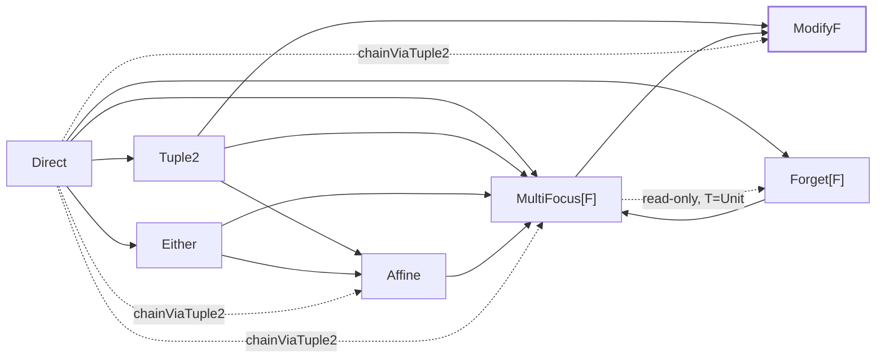

# Concepts

cats-eo unifies every optic family behind one trait:

```scala
trait Optic[S, T, A, B, F[_, _]]:
  type X
  def to:   S      => F[X, A]
  def from: F[X, B] => T
```

Every family — Lens, Prism, Iso, Optional, Modify, Getter, Fold,
Traversal — is a specialisation of this shape differing only in
the **carrier** `F[_, _]`. Composition crosses families by
morphing from one carrier to another rather than hand-rolling
`.andThen` overloads for every pair.

## Existential vs. profunctor encoding

The classical profunctor presentation quantifies *universally*
over a profunctor:

```scala
type Optic[S, T, A, B] = [P[_, _]] => Profunctor[P] ?=> P[A, B] => P[S, T]
```

Each optic is a polymorphic method. Every call site re-runs the
profunctor argument through the universal quantifier.

The **existential** presentation flips the quantifier: a carrier
`F[_, _]` and an existential witness `X` are *exposed* rather
than quantified over. The optic is then a plain pair of
functions:

```scala
(S => F[X, A], F[X, B] => T)
```

Written as a value — not a method. That one shift has three
consequences:

1. **Every optic is a plain `trait` instance.** No polymorphic
   method invocation at the call site, no inlining-visible
   typeclass dispatch through a forall.
2. **The carrier exposes capability.** Whether you can `get`
   depends on whether `F` has an `Accessor[F]` — not on an
   abstract ProfunctorThing. One capability typeclass per
   operation, one instance per carrier.
3. **Cross-family composition is a bridge problem, not a
   polymorphism problem.** Lens → Optional composition comes
   from a `Composer[Tuple2, Affine]` value, not from cleverness
   in the Optic trait itself.

## Carriers

A carrier `F[_, _]` answers: "what shape does the *middle* of
this optic have?"

| Carrier         | Shape                                          | Family                 |
|-----------------|------------------------------------------------|------------------------|
| `Direct`        | `A` — identity; no leftover (forgetful functor) | `Iso`, `Getter`, `Review` |
| `Tuple2`        | `(X, A)` — both halves always present          | `Lens`                 |
| `Either`        | `Either[X, A]` — branch present or absent      | `Prism`                |
| `Affine`        | `Either[Fst[X], (Snd[X], A)]`                  | `Optional`, `AffineFold` |
| `MultiFocus[F]` | `(X, F[A])` — pair leftover with an `F`-wrapped focus vector | unified successor of `AlgLens[F]` + `Kaleidoscope` + `Grate` + `PowerSeries` + `FixedTraversal[N]`; sub-shapes selected by `F` (`PSVec` ⇒ `Traversal.each`; `Function1[Int, *]` ⇒ `Traversal.{two,three,four}` and `MultiFocus.tuple` / `representable`); `.collectMap` / `.collectList` Kaleidoscope universals — see [MultiFocus](multifocus.md) |
| `Forget[F]`     | `F[A]` — an `F`-layer with no leftover         | `Fold` (read-only, `F: Foldable`), `Unfold` (build-only, `embed: F[B] => T`) |
| `ModifyF`       | `(Fst[X], Snd[X] => A)`                        | `Modify`               |

What a carrier supports is *exactly* what its typeclass
instances provide:

| Typeclass                            | Unlocks on `Optic[…, F]`                 |
|--------------------------------------|------------------------------------------|
| `Accessor[F]`                        | `.get(s)`                                 |
| `ReverseAccessor[F]`                 | `.reverseGet(b)`                          |
| `ForgetfulFunctor[F]`                | `.modify(f)`, `.replace(b)`               |
| `ForgetfulApplicative[F]`            | `.put(f)`                                 |
| `ForgetfulTraverse[F, Applicative]`  | `.modifyA[G]`, `.all(s)`                  |
| `ForgetfulFold[F]`                   | `.foldMap[M](f)`                          |
| `AssociativeFunctor[F, X, Y]`        | `.andThen(other)` under the same `F`      |
| `Composer[F, G]`                     | cross-carrier `.andThen` bridge `F → G`   |
| `Morph[F, G]`                        | picks the morph direction for `.andThen`  |

One optic trait, one instance per operation per carrier. Adding
a new carrier means supplying the typeclass instances the
operations it wants to support need — not rewriting `Optic` or
the existing families.

One **standalone** type — the circe-specific `JsonTraversal` —
deliberately sits *outside* the Optic trait: it has no need for
`AssociativeFunctor`, and [extending as little as you
need](extensibility.md) is cheaper than fabricating trait members
you won't use. (`Review` once sat outside too, on the grounds that
"a pure builder has no `to`" — but with source `Unit` the read side
is exactly as vestigial as `Getter`'s write side, so it was folded
in as a full `Optic`; `Unfold` followed the same pattern on the
many rung.)

## Composition

### Same-carrier: `Optic.andThen`

When two optics share `F`, `Optic.andThen` composes them under
that carrier:

```scala mdoc:silent
import dev.constructive.eo.optics.Lens

case class Address(street: String)
case class Person(address: Address)

val personAddress =
  Lens[Person, Address](_.address, (p, a) => p.copy(address = a))
val addressStreet =
  Lens[Address, String](_.street, (a, s) => a.copy(street = s))

val streetL = personAddress.andThen(addressStreet)
```

Both pieces live in `Tuple2`; `.andThen` requires
`AssociativeFunctor[Tuple2, X, Y]`, which is defined globally
for any `X, Y`.

### Cross-family: `.andThen` across carriers

The point of the implicit morph layer is that cross-carrier
composition reads *exactly* like same-carrier composition. You
write the same `.andThen(inner)` whether `inner` shares your
carrier or not — there is no `.morph`, no lift, no carrier
annotation, no "which direction" decision at the call site. A
Lens-then-Optional chain looks the same as a Lens-then-Lens
chain, and the result type is inferred to whichever carrier the
two ends bridge into. The seam exists only in the implicit
search, never in the surface syntax:

```scala mdoc:silent
import dev.constructive.eo.optics.Optional

case class Maybe(flag: Option[String])
case class Wrapped(maybe: Maybe)

val mainOnly = Optional[Maybe, Maybe, String, String](
  getOrModify = m => m.flag.filter(_.startsWith("M")).toRight(m),
  reverseGet  = { case (m, s) => m.copy(flag = Some(s)) },
)

val wrappedMaybe =
  Lens[Wrapped, Maybe](_.maybe, (w, m) => w.copy(maybe = m))

// The Lens (Tuple2) and the Optional (Affine) compose directly;
// cross-carrier `.andThen` summons `Morph[Tuple2, Affine]`, which
// in turn picks up `Composer[Tuple2, Affine]` and lifts the Lens
// into the Affine carrier so the result is an `Optic[..., Affine]`.
val mainStreet = wrappedMaybe.andThen(mainOnly)
```

`Composer[Tuple2, Affine]` is one of the stdlib instances;
[`dev.constructive.eo.data.Affine`](https://javadoc.io/doc/dev.constructive/cats-eo_3/latest/api/eo/data/Affine$.html)
ships it. Other bridges: `Tuple2 → ModifyF`, `Tuple2 →
MultiFocus[F]`, `Either → Affine`, `Either → MultiFocus[F]`,
`Affine → MultiFocus[F]`, `Direct → Tuple2`, `Direct →
Either`, `Direct → MultiFocus[F]`.

The transitive `Composer.chainViaTuple2` given lets you hop
across two bridges using `Tuple2` as the fixed intermediate.
`Morph`'s four instances (`same`, `leftToRight`, `rightToLeft`,
and the low-priority `bothViaAffine`) are what let `.andThen`
auto-select the morph direction from the available `Composer`s
between `F` and `G`. `bothViaAffine` fills the gap for pairs
that have no direct bridge in either direction — a Prism
(`Either`) composed with a Lens (`Tuple2`), for instance — by
lifting both sides into `Affine`, which both carriers reach.

All of that resolution happens during implicit search at compile
time and collapses to a single composed `Optic` value — so from
the caller's side the carrier is an implementation detail the
compiler reconciles, not a concept they have to track. Adding a
new carrier that ships the right `Composer` bridges makes it
compose with everything reachable through the lattice, again with
no change to call sites. That is the whole payoff of treating
composition as a bridge problem (consequence 3 of the
[existential encoding](#existential-vs-profunctor-encoding)): the
ergonomics of one carrier, extended across all of them.

### Composition lattice

Every edge below is a shipping `Composer[F, G]` given; solid
arrows are tier-1 atomic bridges, dashed arrows are tier-2
transitive derivations via `Composer.chainViaTuple2`. `ModifyF`
is the only true sink — no outbound `Composer`. `MultiFocus[F]`
is near-terminal: its only outbound bridges are `→ ModifyF`
(write) and a restricted `→ Forget[F]` read-only escape
(`multifocus2forget`, available only when `T = Unit`) — so
chains effectively land there last.



`Forget[F]` has one outbound bridge (`→ MultiFocus[F]`) and two
inbound: `Direct → Forget[F]` (`direct2forget`, for
`F: Applicative: Foldable` — `pure` lifts the read side, a
singleton pick closes the build side, which `Unfold` chains
exercise) and the restricted `MultiFocus[F] → Forget[F]`
(the `T = Unit` read-only escape). Chains otherwise reach it via
`Fold` / `Unfold` at construction time.
`MultiFocus[F]` covers five v1 carriers (`AlgLens[F]`,
`Kaleidoscope`, `Grate`, `PowerSeries`, `FixedTraversal[N]`) post-
fold; sub-shapes are selected by the choice of `F` (e.g.
`MultiFocus[PSVec]` for `Traversal.each`,
`MultiFocus[Function1[Int, *]]` for `Traversal.{two,three,four}` and
`MultiFocus.tuple` / `representable`).

## Why the existential encoding suits an eager language

The profunctor encoding and the existential encoding describe the
same optics — the choice between them is really a choice about
*when binding happens*, and that lands very differently on a lazy
runtime than on an eager one.

In the profunctor form, an optic is a polymorphic function
`[P] => Profunctor[P] ?=> P[A, B] => P[S, T]`. The concrete
behaviour isn't chosen until a call site fixes `P` and threads its
`Profunctor` instance through the universal quantifier; a composed
optic is a tower of such forall-quantified functions, each
deferring its work behind that instance. This is a natural fit for
**Haskell**: GHC specialises polymorphic code aggressively
(`SPECIALIZE`, cross-module inlining, rewrite rules), and laziness
means the intermediate profunctor structure is never forced into
existence — the late binding is erased before it costs anything.

On an **eager JVM language like Scala** that erasure doesn't
happen. The forall-threaded instance becomes a real interface
dispatch, a deeply composed optic is a real chain of allocated
closures, and the call sites the JIT sees are megamorphic — so the
optimisations that matter on the JVM (monomorphic inlining, escape
analysis / scalar replacement of the intermediate `P[_, _]`
values, devirtualisation) are exactly the ones the encoding
defeats. You get back an opaque `S => T` that the compiler can't
see through.

The existential encoding moves the binding *earlier*. By exposing
the carrier `F` and witness `X` as a plain value
`(S => F[X, A], F[X, B] => T)` instead of quantifying over them,
each optic is a concrete `trait` instance with a known carrier,
and each family ships a concrete specialisation
([`GetReplaceLens`](https://javadoc.io/doc/dev.constructive/cats-eo_3/latest/api/eo/optics/GetReplaceLens.html),
[`MendTearPrism`](https://javadoc.io/doc/dev.constructive/cats-eo_3/latest/api/eo/optics/MendTearPrism.html),
[`BijectionIso`](https://javadoc.io/doc/dev.constructive/cats-eo_3/latest/api/eo/optics/BijectionIso.html))
that stores `get` / `replace` / `reverseGet` as plain fields and
fuses its hot-path `modify`. The result is monomorphic call sites
the JIT inlines, intermediate carrier values escape analysis can
stack-allocate or remove, and no per-call re-instantiation through
a quantifier — the shape an eager runtime can actually optimise.
The [benchmarks](benchmarks.md) bear this out: EO matches or beats
Monocle's hand-specialised classes on the single-optic hot paths,
without writing a bespoke method per family.

And the unification is the same win at the source level: `.modify`,
`.getOption`, `.reverseGet` are written *once* on `Optic` against a
capability typeclass (`ForgetfulFunctor[F]` for `.modify`), and any
family whose carrier supplies the instance gets the method — no
per-family surface to maintain.
