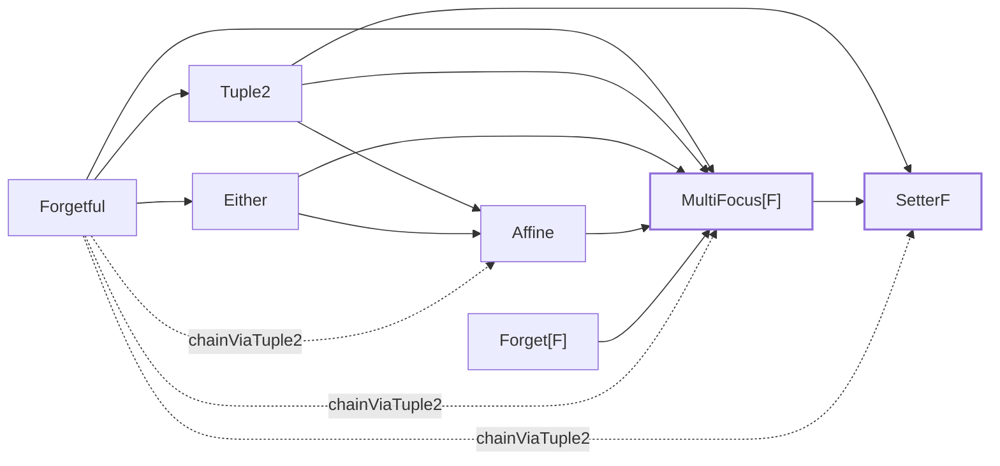

# Concepts

cats-eo unifies every optic family behind one trait:

```scala
trait Optic[S, T, A, B, F[_, _]]:
  type X
  def to:   S      => F[X, A]
  def from: F[X, B] => T
```

Every family — Lens, Prism, Iso, Optional, Setter, Getter, Fold,
Traversal — is a specialisation of this shape differing only in
the **carrier** `F[_, _]`. Composition crosses families by
morphing from one carrier to another rather than hand-rolling
`.andThen` overloads for every pair.

## Existential vs. profunctor encoding

The classical profunctor presentation quantifies *universally*
over a profunctor:

```scala
type Optic[S, T, A, B] = [P[_, _]] => Profunctor[P] ?=> P[A, B] => P[S, T]
```

Each optic is a polymorphic method. Every call site re-runs the
profunctor argument through the universal quantifier.

The **existential** presentation flips the quantifier: a carrier
`F[_, _]` and an existential witness `X` are *exposed* rather
than quantified over. The optic is then a plain pair of
functions:

```scala
(S => F[X, A], F[X, B] => T)
```

Written as a value — not a method. That one shift has three
consequences:

1. **Every optic is a plain `trait` instance.** No polymorphic
   method invocation at the call site, no inlining-visible
   typeclass dispatch through a forall.
2. **The carrier exposes capability.** Whether you can `get`
   depends on whether `F` has an `Accessor[F]` — not on an
   abstract ProfunctorThing. One capability typeclass per
   operation, one instance per carrier.
3. **Cross-family composition is a bridge problem, not a
   polymorphism problem.** Lens → Optional composition comes
   from a `Composer[Tuple2, Affine]` value, not from cleverness
   in the Optic trait itself.

## Carriers

A carrier `F[_, _]` answers: "what shape does the *middle* of
this optic have?"

| Carrier         | Shape                                          | Family                 |
|-----------------|------------------------------------------------|------------------------|
| `Tuple2`        | `(X, A)` — both halves always present          | `Lens`                 |
| `Either`        | `Either[X, A]` — branch present or absent      | `Prism`                |
| `Forgetful`     | `A` — identity; no leftover                    | `Iso`, `Getter`        |
| `Affine`        | `Either[Fst[X], (Snd[X], A)]`                  | `Optional`, `AffineFold` |
| `SetterF`       | `(Fst[X], Snd[X] => A)`                        | `Setter`               |
| `Forget[F]`     | `F[A]` — a `Foldable`/`Traverse` container     | `Fold`                 |
| `MultiFocus[F]` | `(X, F[A])` — pair leftover with an `F`-wrapped focus vector | unified successor of `AlgLens[F]` + `Kaleidoscope` + `Grate` + `PowerSeries` + `FixedTraversal[N]`; sub-shapes selected by `F` (`PSVec` ⇒ `Traversal.each`; `Function1[Int, *]` ⇒ `Traversal.{two,three,four}` and `MultiFocus.tuple` / `representable`); `.collectMap` / `.collectList` Kaleidoscope universals — see [MultiFocus](multifocus.md) |

What a carrier supports is *exactly* what its typeclass
instances provide:

| Typeclass                            | Unlocks on `Optic[…, F]`                 |
|--------------------------------------|------------------------------------------|
| `Accessor[F]`                        | `.get(s)`                                 |
| `ReverseAccessor[F]`                 | `.reverseGet(b)`                          |
| `ForgetfulFunctor[F]`                | `.modify(f)`, `.replace(b)`               |
| `ForgetfulApplicative[F]`            | `.put(f)`                                 |
| `ForgetfulTraverse[F, Applicative]`  | `.modifyA[G]`, `.all(s)`                  |
| `ForgetfulFold[F]`                   | `.foldMap[M](f)`                          |
| `AssociativeFunctor[F, X, Y]`        | `.andThen(other)` under the same `F`      |
| `Composer[F, G]`                     | cross-carrier `.andThen` bridge `F → G`   |
| `Morph[F, G]`                        | picks the morph direction for `.andThen`  |

One optic trait, one instance per operation per carrier. Adding
a new carrier means supplying the typeclass instances the
operations it wants to support need — not rewriting `Optic` or
the existing families.

Two **standalone** types — `Review` and the circe-specific
`JsonTraversal` — deliberately sit *outside* the Optic trait.
Both would have to invent an artificial `to` to satisfy the
trait contract (`Review` has no read; `JsonTraversal` has no
need for `AssociativeFunctor`), and [extending as little as you
need](extensibility.md) is cheaper than fabricating trait
members you won't use.

## Composition

### Same-carrier: `Optic.andThen`

When two optics share `F`, `Optic.andThen` composes them under
that carrier:

```scala mdoc:silent
import dev.constructive.eo.optics.Lens

case class Address(street: String)
case class Person(address: Address)

val personAddress =
  Lens[Person, Address](_.address, (p, a) => p.copy(address = a))
val addressStreet =
  Lens[Address, String](_.street, (a, s) => a.copy(street = s))

val streetL = personAddress.andThen(addressStreet)
```

Both pieces live in `Tuple2`; `.andThen` requires
`AssociativeFunctor[Tuple2, X, Y]`, which is defined globally
for any `X, Y`.

### Cross-family: `.andThen` across carriers

When the downstream optic uses a different carrier, the same
`.andThen` still works — no explicit morph step:

```scala mdoc:silent
import dev.constructive.eo.data.Affine
import dev.constructive.eo.optics.Optional

case class Maybe(flag: Option[String])
case class Wrapped(maybe: Maybe)

val mainOnly = Optional[Maybe, Maybe, String, String, Affine](
  getOrModify = m => m.flag.filter(_.startsWith("M")).toRight(m),
  reverseGet  = { case (m, s) => m.copy(flag = Some(s)) },
)

val wrappedMaybe =
  Lens[Wrapped, Maybe](_.maybe, (w, m) => w.copy(maybe = m))

// The Lens (Tuple2) and the Optional (Affine) compose directly;
// cross-carrier `.andThen` summons `Morph[Tuple2, Affine]`, which
// in turn picks up `Composer[Tuple2, Affine]` and lifts the Lens
// into the Affine carrier so the result is an `Optic[..., Affine]`.
val mainStreet = wrappedMaybe.andThen(mainOnly)
```

`Composer[Tuple2, Affine]` is one of the stdlib instances;
[`dev.constructive.eo.data.Affine`](https://javadoc.io/doc/dev.constructive/cats-eo_3/latest/api/eo/data/Affine$.html)
ships it. Other bridges: `Tuple2 → SetterF`, `Tuple2 →
MultiFocus[F]`, `Either → Affine`, `Either → MultiFocus[F]`,
`Affine → MultiFocus[F]`, `Forgetful → Tuple2`, `Forgetful →
Either`, `Forgetful → MultiFocus[F]`.

The transitive `Composer.chainViaTuple2` given lets you hop
across two bridges using `Tuple2` as the fixed intermediate.
`Morph`'s four instances (`same`, `leftToRight`, `rightToLeft`,
and the low-priority `bothViaAffine`) are what let `.andThen`
auto-select the morph direction from the available `Composer`s
between `F` and `G`. `bothViaAffine` fills the gap for pairs
that have no direct bridge in either direction — a Prism
(`Either`) composed with a Lens (`Tuple2`), for instance — by
lifting both sides into `Affine`, which both carriers reach.

### Composition lattice

Every edge below is a shipping `Composer[F, G]` given; solid
arrows are tier-1 atomic bridges, dashed arrows are tier-2
transitive derivations via `Composer.chainViaTuple2`. Terminal
nodes (`SetterF`, `MultiFocus[F]`) sink — they have no outbound
`Composer` instance other than `MultiFocus[F] → SetterF` — so
chains must land there last.



`Forget[F]` has one outbound bridge (`→ MultiFocus[F]`) but no
inbound, so chains reach it only via `Fold` at construction time.
`MultiFocus[F]` covers five v1 carriers (`AlgLens[F]`,
`Kaleidoscope`, `Grate`, `PowerSeries`, `FixedTraversal[N]`) post-
fold; sub-shapes are selected by the choice of `F` (e.g.
`MultiFocus[PSVec]` for `Traversal.each`,
`MultiFocus[Function1[Int, *]]` for `Traversal.{two,three,four}` and
`MultiFocus.tuple` / `representable`).

## Why the existential machinery is worth it

Unifying every optic behind a single trait collapses the usual
per-family surface ten-fold: no `Lens.modify`,
`Prism.getOption`, `Iso.reverseGet` each written separately.
Extensions on `Optic` are written once against a capability
typeclass (`ForgetfulFunctor[F]` for `.modify`) and any family
whose carrier supplies the instance gets the method for free.

The runtime cost is also neutral. Each carrier's
concrete-class specialisation
([`GetReplaceLens`](https://javadoc.io/doc/dev.constructive/cats-eo_3/latest/api/eo/optics/GetReplaceLens.html),
[`MendTearPrism`](https://javadoc.io/doc/dev.constructive/cats-eo_3/latest/api/eo/optics/MendTearPrism.html),
[`BijectionIso`](https://javadoc.io/doc/dev.constructive/cats-eo_3/latest/api/eo/optics/BijectionIso.html))
stores `get`/`replace`/`reverseGet` as plain fields so the hot
path bypasses typeclass dispatch entirely. See the
[benchmark notes](https://github.com/Constructive-Programming/eo/blob/main/benchmarks/README.md)
for side-by-side numbers against Monocle.
