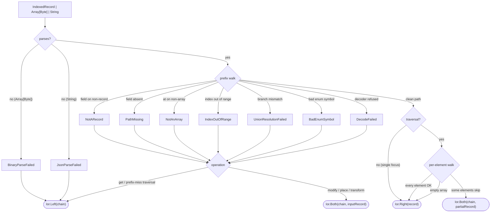

# Avro integration

The `cats-eo-avro` module adds two cursor-backed optics for
editing [Apache Avro](https://avro.apache.org/) records without
paying the cost of a full decode / re-encode round-trip.

```scala
libraryDependencies += "dev.constructive" %% "cats-eo-avro" % "@VERSION@"
```

## Why this exists

Avro lives in streaming pipelines: Kafka topics, S3 sinks, Schema
Registry-backed services. Payloads arrive on the wire as
`Array[Byte]` (binary) or `String` (Avro JSON), each one carrying
its own schema. The classical Scala edit pattern is:

```scala
codec.decode(bytes).map { p =>
  p.copy(name = p.name.toUpperCase)
}.map(codec.encode)
```

That decodes every field of `Person`, allocates a fresh
instance, and re-encodes every field — even when only one
leaf is changing. For wide records the work is mostly wasted,
and the whole pipeline budget is spent on serialisation rather
than on whatever business logic the consumer actually wants to
run.

`AvroPrism` is a byte-carried optic
(`Optic[Array[Byte], Array[Byte], A, A, Affine]`): it locates the
focused field's byte span in the binary payload, decodes only that
slice on read, and splices the re-encoded focus back in place on
write — no record materialised. When you hold a parsed
[`IndexedRecord`](https://avro.apache.org/docs/current/api/java/org/apache/avro/generic/IndexedRecord.html)
instead, `.record` flips the same drilled optic to a record-carried
face (`AvroRecordPrism` / `AvroRecordTraversal`) that walks the record,
modifying only the focused leaf and rebuilding the parents on the
way up. The
[`OrderAvroBench`](https://github.com/Constructive-Programming/eo/blob/main/benchmarks/src/main/scala/dev/constructive/eo/bench/OrderAvroBench.scala)
suite documents the speedup against the kindlings-avro-derivation
codec round-trip — see the [benchmarks page](../benchmarks.md) for the
full table.

The codec backend is
[kindlings-avro-derivation](https://github.com/MateuszKubuszok/kindlings-avro-derivation)
0.1.2, which pins apache-avro 1.12.1. cats-eo-avro wraps the
kindlings `AvroEncoder[A]` / `AvroDecoder[A]` / `AvroSchemaFor[A]`
triplet in a single [`AvroCodec[A]`](https://github.com/Constructive-Programming/eo/blob/main/avro/src/main/scala/dev/constructive/eo/avro/AvroCodec.scala)
typeclass so user code summons one thing per type.

## AvroPrism

```scala mdoc:silent
import dev.constructive.eo.avro.{AvroCodec, codecPrism}
import hearth.kindlings.avroderivation.{AvroDecoder, AvroEncoder, AvroSchemaFor}

case class Address(street: String, zip: Int)
object Address:
  given AvroEncoder[Address] = AvroEncoder.derived
  given AvroDecoder[Address] = AvroDecoder.derived
  given AvroSchemaFor[Address] = AvroSchemaFor.derived

case class Person(name: String, age: Int, address: Address)
object Person:
  given AvroEncoder[Person] = AvroEncoder.derived
  given AvroDecoder[Person] = AvroDecoder.derived
  given AvroSchemaFor[Person] = AvroSchemaFor.derived
```

Construct a Prism to the root type, then drill into fields.
The `.address.street` sugar is macro-powered — it compiles to
`.field(_.address).field(_.street)`. The input at hand below is a
parsed `GenericRecord`, so the examples flip to the record-carried
face with `.record` (bytes input needs no flip — the prism itself
is the byte optic):

```scala mdoc
import org.apache.avro.generic.GenericRecord

val alice   = Person("Alice", 30, Address("Main St", 12345))
val record  = summon[AvroCodec[Person]].encode(alice).asInstanceOf[GenericRecord]
val streetP = codecPrism[Person].address.street

streetP.record.modifyUnsafe(_.toUpperCase)(record)
  .asInstanceOf[GenericRecord].get("address")
```

On the record face the default `modify` returns
`Ior[Chain[AvroFailure], IndexedRecord]` — failures are surfaced
rather than silently swallowed, mirroring `JsonPrism`'s default
surface. The `*Unsafe` variants ship the silent-pass-through hot
path used by Kafka consumers that have measured and don't want
the diagnostic allocation.

Other operations (all the silent escape hatches):

```scala mdoc
streetP.record.getOptionUnsafe(record)
streetP.record.placeUnsafe("Broadway")(record)
  .asInstanceOf[GenericRecord].get("address")
streetP.record.transformUnsafe(any => any)(record).getSchema.getName
```

Forgiving semantics on the `*Unsafe` surface — missing paths leave
the record unchanged:

```scala mdoc
import org.apache.avro.generic.GenericData

// A stump record carrying only `name` and `age` — the `address`
// slot is null at the schema-allocated position.
val stumpSchema = summon[AvroCodec[Person]].schema
val stump = new GenericData.Record(stumpSchema)
stump.put(stumpSchema.getField("name").pos, "Alice")
stump.put(stumpSchema.getField("age").pos, 30)
// `address` left null — the walker hits `NotARecord` at that step.

streetP.record.modifyUnsafe(_.toUpperCase)(stump).asInstanceOf[GenericRecord].get("address")
```

## Field navigation is by SCHEMA name — `.fieldNamed` is the escape hatch

`.field(_.x)` (and the `.fields(...)` / dynamic-sugar siblings)
resolve the case-class field `x` to whatever schema field the codec
actually emitted for it — by declaration position: the i-th case
field maps to the i-th schema field, read off the cached schema at
construction time, at zero per-operation cost. That makes
navigation robust under any field-name transform — a kindlings
snake / kebab / custom `transformFieldNames` config, or a vulcan
per-field override map — so a renamed schema field is never a miss
cause on a derived codec. The one shape position resolution cannot
handle is a hand-written codec whose schema field **order**
diverges from case-class declaration order: there, drill with
`.fieldNamed[B]("schema_name")`, which navigates by the explicit
schema name and bypasses position resolution entirely. Map keys are
data, not schema-named fields — they keep their literal key.

## Array indexing

`.at(i)` drills into the `i`-th element of an Avro `array<T>`:

```scala mdoc:silent
case class Order(name: String)
object Order:
  given AvroEncoder[Order] = AvroEncoder.derived
  given AvroDecoder[Order] = AvroDecoder.derived
  given AvroSchemaFor[Order] = AvroSchemaFor.derived

case class Basket(owner: String, items: List[Order])
object Basket:
  given AvroEncoder[Basket] = AvroEncoder.derived
  given AvroDecoder[Basket] = AvroDecoder.derived
  given AvroSchemaFor[Basket] = AvroSchemaFor.derived
```

```scala mdoc
val basket = Basket("Alice", List(Order("X"), Order("Y"), Order("Z")))
val basketRec =
  summon[AvroCodec[Basket]].encode(basket).asInstanceOf[GenericRecord]
val secondName = codecPrism[Basket].items.at(1).name

secondName.record.getOptionUnsafe(basketRec)
secondName.record.modifyUnsafe(_.toUpperCase)(basketRec)
  .asInstanceOf[GenericRecord].get("items").toString
```

Out-of-range / negative / non-array positions surface as
`Ior.Both(chain, inputRecord)` on the default surface — the
walker accumulates `IndexOutOfRange` / `NotAnArray` /
`PathMissing` and threads the original record back through.

## AvroTraversal (`.each`)

`.each` splits the path at the current array focus and returns
an `AvroTraversal` that walks every element. Further `.field` /
`.at` / `.union[Branch]` / `.fields(...)` / selectable-sugar
calls on the traversal extend the per-element suffix — the same
drill surface as the prism, applied per element (e.g.
`entries.each.union[Cash]` narrows every element to its `Cash`
branch, folding the ones that are `Cash` and leaving the rest).
Like the prism, the traversal is byte-carried
by default — `.foldMap` / `.modify` operate on `Array[Byte]`
directly, splicing every element's focus in one pass — and `.record`
flips to the record-carried Ior surface:

```scala mdoc
val everyName = codecPrism[Basket].items.each.name

everyName.record.modifyUnsafe(_.toUpperCase)(basketRec)
  .asInstanceOf[GenericRecord].get("items").toString
everyName.record.getAllUnsafe(basketRec)
```

Empty arrays and missing prefixes leave the record unchanged on
the silent surface; on the record face's default Ior surface,
prefix-walk failures land in `Ior.Left` (nothing to iterate) and
per-element skips accumulate one `AvroFailure` per refused element
into `Ior.Both(chain, partialRecord)`. Payloads whose arrays use
the byte-sized (negative-count) block framing are readable as-is
and RE-FRAMED on write: the array region is rebuilt as one
canonical positive-count block with the splices applied.

## Multi-field focus — `.fields(_.a, _.b)`

`.fields(selector1, selector2, ...)` focuses a bundle of named
case-class fields as a Scala 3 `NamedTuple`. Selectors arrive in
selector-order; the NamedTuple type reflects that. Arity must be
≥ 2 — use `.field(_.x)` for a single-field focus.

```scala mdoc:silent
type NameAge = NamedTuple.NamedTuple[("name", "age"), (String, Int)]
given AvroEncoder[NameAge] = AvroEncoder.derived
given AvroDecoder[NameAge] = AvroDecoder.derived
given AvroSchemaFor[NameAge] = AvroSchemaFor.derived
```

```scala mdoc
val nameAge = codecPrism[Person].fields(_.name, _.age)

nameAge
  .record
  .modifyUnsafe(nt => (name = nt.name.toUpperCase, age = nt.age + 1))(record)
  .asInstanceOf[GenericRecord].get("name")
```

Full-cover selection — spanning every field of `Person` — still
returns an `AvroPrism` (fields-focused), **not** an `Iso`. Avro decode can
always fail (the input may not even be record-shaped, the codec
may refuse a field, the union branch may not match) so totality
isn't witnessable, and an Iso would misleadingly advertise a
guarantee we cannot provide.

Per-element multi-field focus via `.each.fields` focuses a
NamedTuple on every element of an array — same shape as
`JsonTraversal`'s `.each.fields`, just over the Avro carrier.

## Union branches — `.union[Branch]`

Avro's schema-driven `union<...>` types — including the standard
`Option[A]` encoding as `union<null, A>` and sealed-trait sums —
demand a per-branch resolution step. cats-eo-avro spells this as
`.union[Branch]`:

```scala mdoc:silent
case class Transaction(id: String, amount: Option[Long])
object Transaction:
  given AvroEncoder[Transaction] = AvroEncoder.derived
  given AvroDecoder[Transaction] = AvroDecoder.derived
  given AvroSchemaFor[Transaction] = AvroSchemaFor.derived
```

```scala mdoc
val txRec = summon[AvroCodec[Transaction]]
  .encode(Transaction("t-1", Some(42L))).asInstanceOf[GenericRecord]

val amountP = codecPrism[Transaction].field(_.amount).union[Long]

amountP.record.modifyUnsafe(_ + 1L)(txRec)
  .asInstanceOf[GenericRecord].get("amount")
```

`.union[Branch]` works against `Option[A]` (`union<null, A>`),
sealed-trait sums (`union<RecordA, RecordB, ...>`), Scala 3 enums,
and Scala 3 untagged unions `A | B | C` (`Branch` must be one of the
members). Kindlings derives the same `union<...>` schema for an
untagged-union field as for a sealed trait, so the branch resolves at
runtime off `AvroCodec[Branch].schema.getFullName` the same way. When
the runtime value sits on a different branch than the requested one,
the walker surfaces `AvroFailure.UnionResolutionFailed` carrying the
schema-declared alternatives so the caller can route on the mismatch.

## Reading diagnostics from the default Ior surface

The default `modify` / `transform` / `place` / `transfer` / `get`
methods on the record-carried faces — `.record` on a drilled
`AvroPrism` or `AvroTraversal` (`AvroRecordPrism` /
`AvroRecordTraversal`) — all return
`Ior[Chain[AvroFailure], IndexedRecord]` (or `, A]` /
`, Vector[A]]` for the reads). Three observable shapes:

- `Ior.Right(record)` — clean success.
- `Ior.Both(chain, record)` — partial success. The `record`
  reflects every update that did succeed; the `chain` lists
  every skip.
- `Ior.Left(chain)` — no result producible. Typical for `get`
  misses, parse failures, and traversal-prefix misses where
  there's nothing to iterate.

### Failure flow

The diagram below traces the path an
`IndexedRecord | Array[Byte] | String` input takes through a
default-surface read/modify, showing which `AvroFailure` case
lands in the chain at each refusal point and which `Ior` shape
the caller observes.



- Parse-step failures (`BinaryParseFailed`, `JsonParseFailed`)
  surface as `Ior.Left` regardless of operation — there's no
  record to thread back.
- Prefix-walk failures (the `NotARecord` / `PathMissing` /
  `NotAnArray` / `IndexOutOfRange` / `UnionResolutionFailed` /
  `BadEnumSymbol` / `DecodeFailed` branches) surface as
  `Ior.Left` on read operations and `Ior.Both(chain, inputRecord)`
  on modify operations — the unchanged input record rides along
  so the caller can keep walking.
- Per-element traversal skips (the `.each` path) accumulate one
  `AvroFailure` per refused element and land in `Ior.Both`
  together with the partially-updated record.

## Failure model

Eleven `AvroFailure` cases cover every refusal point on a walk.
Each carries the `PathStep` at which the walker refused, plus
case-specific context. The first five mirror `JsonFailure`
case-for-case; the schema-driven and wire-format cases are
Avro-only.

```scala mdoc:silent
import dev.constructive.eo.avro.{AvroFailure, PathStep}
```

**`PathMissing`** — named field absent from its parent record.
Mirrors `JsonFailure.PathMissing`:

```scala mdoc
val pm: AvroFailure = AvroFailure.PathMissing(PathStep.Field("street"))
pm.message
```

**`NotARecord`** — parent wasn't a record at the walk position
(so the walker couldn't look up a field by name). Avro's
schema-driven analogue of `JsonFailure.NotAnObject`:

```scala mdoc
val nr: AvroFailure = AvroFailure.NotARecord(PathStep.Field("address"))
nr.message
```

**`NotAnArray`** — parent wasn't an array at the walk position
(so the walker couldn't index). Mirrors `JsonFailure.NotAnArray`:

```scala mdoc
val na: AvroFailure = AvroFailure.NotAnArray(PathStep.Index(2))
na.message
```

**`IndexOutOfRange`** — index outside `[0, size)`. The actual
array length rides along on the failure case so callers can
route on it:

```scala mdoc
val oor: AvroFailure = AvroFailure.IndexOutOfRange(PathStep.Index(7), 3)
oor.message
```

**`DecodeFailed`** — the kindlings codec refused at the focused
leaf. The wrapped `Throwable` is whatever the underlying decoder
threw — typically an `AvroRuntimeException`, `AvroTypeException`,
or `ClassCastException` when the runtime payload doesn't line up
with the schema:

```scala mdoc
val cause = new RuntimeException("missing record field 'name'")
val df: AvroFailure = AvroFailure.DecodeFailed(PathStep.Field("name"), cause)
df.message
```

**`BinaryParseFailed`** — input `Array[Byte]` didn't parse as
Avro binary under the supplied reader schema. Surfaced only by
the dual-input overloads; when the caller passes a parsed
`IndexedRecord` directly this case cannot fire:

```scala mdoc
val binCause = new RuntimeException("EOF before record complete")
val bpf: AvroFailure = AvroFailure.BinaryParseFailed(binCause)
bpf.message
```

**`JsonParseFailed`** — input `String` didn't parse as Avro JSON
wire format under the supplied reader schema. Surfaced only by
the triple-input overloads; record / bytes input cannot trigger
this case. Distinct from circe's general-purpose JSON parser —
this is apache-avro's `JsonDecoder`, which expects the
schema-aware Avro JSON encoding (with branch-tagged unions
etc.):

```scala mdoc
val jsonCause = new RuntimeException("Expected int. Got VALUE_STRING")
val jpf: AvroFailure = AvroFailure.JsonParseFailed(jsonCause)
jpf.message
```

**`UnionResolutionFailed`** — walker reached a `union<...>` value
but none of the candidate branches matched the runtime type. The
schema-declared alternatives ride along so the caller can route
on the mismatch. Schema-driven; no JSON analogue:

```scala mdoc
val urf: AvroFailure = AvroFailure.UnionResolutionFailed(
  branches = List("null", "long"),
  step    = PathStep.UnionBranch("long"),
)
urf.message
```

**`BadEnumSymbol`** — walker reached an enum value whose runtime
symbol isn't a member of the schema's declared symbol set.
Schema-driven; no JSON analogue. Reserved for the enum-aware
walker hooks:

```scala mdoc
val bes: AvroFailure = AvroFailure.BadEnumSymbol(
  symbol = "MAGENTA",
  valid  = List("RED", "GREEN", "BLUE"),
  step   = PathStep.Field("color"),
)
bes.message
```

Pattern-match on the case to route to per-cause log / metric
streams; the structured `PathStep` is the same shape across
every case so a single `step` accessor in user code is enough
for "which cursor position refused":

```scala mdoc
def route(chain: cats.data.Chain[AvroFailure]): List[String] =
  chain.toList.map {
    case AvroFailure.PathMissing(step)            => s"miss:    $step"
    case AvroFailure.NotARecord(step)             => s"shape:   $step (not record)"
    case AvroFailure.NotAnArray(step)             => s"shape:   $step (not array)"
    case AvroFailure.IndexOutOfRange(step, n)     => s"bounds:  $step (size=$n)"
    case AvroFailure.DecodeFailed(step, c)        => s"decode:  $step: ${c.getMessage}"
    case AvroFailure.BinaryParseFailed(c)         => s"bytes:   ${c.getMessage}"
    case AvroFailure.JsonParseFailed(c)           => s"json:    ${c.getMessage}"
    case AvroFailure.UnionResolutionFailed(bs, s) => s"union:   $s (branches: ${bs.mkString(",")})"
    case AvroFailure.BadEnumSymbol(sym, valid, s) => s"enum:    $s '$sym' valid=${valid.mkString(",")}"
    case AvroFailure.UnsupportedSpanStep(step)    => s"span:    $step (no byte span)"
    case AvroFailure.NotConfluentFramed(reason)   => s"framing: $reason"
    case AvroFailure.SchemaResolutionFailed(id, c) => s"resolve: id $id: ${c.getMessage}"
    case AvroFailure.SchemaMismatch(id, w, r)      => s"drift:   id $id (writer=$w reader=$r)"
    case AvroFailure.EncodeFailed(c)               => s"encode:  ${c.getMessage}"
    case AvroFailure.ResolveFailed(c)              => s"resolve: ${c.getMessage}"
  }
```

## Bytes / String / record input — parse on the fly

For plain binary payloads the prism itself is the whole story:
`.modify` / `.replace` / `.getOption` take `Array[Byte]` and give
`Array[Byte]` back, splice-style, with silent pass-through on any
failure. When you want DIAGNOSTICS — or your input is a `String`
(Avro JSON wire format) or an already-parsed `IndexedRecord` — the
record face steps in: every edit and read method behind `.record`
(on prisms and traversals alike) accepts
`IndexedRecord | Array[Byte] | String` as the source. Bytes parse
through apache-avro's `BinaryDecoder` under the reader schema
cached on the prism; strings go through apache-avro's
`JsonDecoder`. Parse failures surface through the same
`AvroFailure` accumulator as every other failure mode.

The triple-input shape is the streaming-pipeline diagnostic tier:
Kafka consumers receive `Array[Byte]`, REST handlers receive
`String`, and intermediate stages pass parsed `IndexedRecord`
forward — one optic surface, three call sites.

```scala mdoc:silent
import java.io.ByteArrayOutputStream
import org.apache.avro.io.EncoderFactory
import org.apache.avro.generic.GenericDatumWriter

def toBinary(rec: GenericRecord): Array[Byte] =
  val out = new ByteArrayOutputStream()
  val encoder = EncoderFactory.get().binaryEncoder(out, null)
  val writer = new GenericDatumWriter[GenericRecord](rec.getSchema)
  writer.write(rec, encoder)
  encoder.flush()
  out.toByteArray

val incomingBytes: Array[Byte] = toBinary(record)
val upperName = codecPrism[Person].field(_.name).record.modify(_.toUpperCase)
```

```scala mdoc
// Happy path: parsed, modified, Ior.Right.
upperName(incomingBytes).map(
  _.asInstanceOf[GenericRecord].get("name").toString
)

// Bad bytes: Ior.Left(Chain(AvroFailure.BinaryParseFailed(_))).
upperName(Array(0.toByte))
```

```scala mdoc
// Same prism, Avro JSON string input.
val incomingJson: String = """{"name":"Alice","age":30,"address":{"street":"Main St","zip":12345}}"""
upperName(incomingJson).map(
  _.asInstanceOf[GenericRecord].get("name").toString
)
```

Handing in an `IndexedRecord` directly still works unchanged —
the widened `(IndexedRecord | Array[Byte] | String) => _`
signature is a supertype of the parsed-input shape, and the
parse cost is zero when the input is already a record.

On the `*Unsafe` surface, unparseable bytes / strings fall back
to a synthetic empty record built from the reader schema —
there's no meaningful "input unchanged" semantic for bytes that
aren't Avro, and the whole point of `*Unsafe` is to drop failure
detail. Callers who need parse diagnostics stay on the default
Ior-bearing surface.

## Schema discipline — the byte walk trusts the reader schema absolutely

The byte-carried optics perform **no writer/reader schema
resolution**: `locate` consumes bytes purely by the prism's cached
reader schema. Three consequences to respect in a pipeline:

- a payload written under a **structurally different** schema
  Misses — reads are `None`, writes pass the input through
  unchanged, silently;
- a **same-typed field reorder** between writer and reader is
  undetectable from the bytes: the walk reads the *wrong field*
  with full confidence (this is why the requirement is absolute,
  not "usually fine");
- Confluent-framed payloads must be de-framed before the walk —
  the 5-byte header parses as plausible varints. Compose
  `ConfluentWire.confluent` (below) in front rather than
  hand-stripping.

Mixed-schema topics therefore need a resolving decode per payload
(the record face with the correct writer schema), not the byte
walk. The laws also hold **up to canonical re-encoding** of the
focused slice: `.modify` re-encodes the focus, so spec-legal but
non-canonical encodings (byte-sized array blocks, non-minimal
varints) come back canonicalised — byte-for-byte identity is
guaranteed only for payloads from conformant writers.

## Confluent-framed payloads — the header is its own Prism

The Confluent strip + writer-resolve + fingerprint-gate is
**decode-agnostic** and lives *before* the normal optic: it hands
you the header-stripped, writer-resolved, fingerprint-gated body
bytes, and you decode them however you own it — kindlings
(`codecPrism[A]`), vulcan `Codec.fromBinary`, a generic-record →
JSON walk, anything. Two shapes, same core:

`ConfluentWire.confluent` is a composable eo **Prism**
`Array[Byte]` (framed) ↔ `Array[Byte]` (body). Drop it in front of
any byte optic with `.andThen`:

```scala
import dev.constructive.eo.avro.ConfluentWire

// Your registry client / cache, resolved to a synchronous lookup.
val schemaById: ConfluentWire.SchemaById = id => registryCache(id)

val cf = ConfluentWire.confluent(schemaById, readerSchema, frameId = readerSchemaId)

cf.andThen(codecPrism[Person].field(_.name)).getOption(framedBytes) // Option[String]
cf.getOption(framedBytes)  // Option[Array[Byte]] — the resolved body, decode it yourself
```

`getOption` runs strip + resolve + gate and classifies by Avro
parsing-canonical-form fingerprint
(`SchemaNormalization.parsingFingerprint64`, computed once at
construction for the reader): on a **writer == reader** fingerprint
the body is byte-identical under both schemas and passes through;
on a **mismatch** it is `None` (no silent misread). `reverseGet`
re-frames via `attach` under `frameId` — only touched by
`modify` / `replace`; a read-only pipeline never calls it.

When you want the *reason* rather than `None`, the one-shot
primitive returns it:

```scala
ConfluentWire.resolve(framedBytes, schemaById, readerSchema)
// Either[AvroFailure, Array[Byte]] — Right(body), or
// NotConfluentFramed / SchemaResolutionFailed / SchemaMismatch(writerFp, readerFp)
```

`confluent` / `resolve` **gate** — they refuse (`SchemaMismatch`)
when the writer and reader schemas differ. When you'd rather
**translate** the drift than refuse, use the resolving reader
below. The hook is synchronous by design — eo ships no registry
client and wraps no effect, so the caller owns the cache.

## The no-hassle resolving reader — `ConfluentWire.reader`

For a Kafka consumer, the one-call form drops straight into an
fs2 `Stream.evalMap`. It strips the header, looks the **read
schema** up by id (the schema the bytes were written under —
effectfully), and *resolves* it into your type via Avro's
`ResolvingDecoder` (reorder / default / promotion / aliases) rather
than gating:

```scala
import cats.MonadThrow
import org.apache.avro.Schema
import dev.constructive.eo.avro.ConfluentWire

// Your registry client, resolved to an effectful lookup (id → read schema).
val schemaById: Int => F[Schema] = id => registry.fetch(id)

val read: Array[Byte] => F[Person] = ConfluentWire.reader[F, Person](schemaById)

// in a pipeline:
stream.evalMap(read)   // Stream[F, Array[Byte]] => Stream[F, Person]
```

Naming is optic-centric: **`readSchema`** is the schema the bytes are
read in (apache-avro's *writer* schema), **`writeSchema`** the shape
they resolve into / are written under (apache-avro's *reader* schema).

- Effectful lookup `Int => F[Schema]` (`MonadThrow[F]`, cats-core —
  no cats-effect dependency). A framed payload has its read schema
  looked up and is resolve-decoded into `A` (the write schema =
  the codec's own schema).
- **Strict on the frame**: an unframed payload raises
  `NotConfluentFramed` — no silent fallback to a direct decode, which
  could accidentally succeed on corrupt bytes. On a topic with mixed
  framed / unframed producers, catch that failure and decode directly
  (`AvroCodec.decodeValue[A]`) — the fallback is yours to opt into.
- Failures are **raised in `F`**: `AvroFailureException(
  NotConfluentFramed | ResolveFailed | DecodeFailed | …)`; a
  `schemaById` failure propagates as `F`'s own error. Dead-letter by
  catching in `F`.
- **No case class?** `ConfluentWire.recordReader[F](schemaById,
  writeSchema): Array[Byte] => F[IndexedRecord]` resolves to a generic
  record under a caller-supplied write schema.

For a single-schema topic or a producer, the pure per-read-schema
optic is `ConfluentWire.resolving[A](readSchema, frameId)` — an
`Affine` `Prism` (`to` resolve-decodes, `from` re-encodes + re-frames),
`Either[AvroFailure, Array[Byte]]` on the write side.

## Migrating between schema versions — `AvroBridge`

When two *versions* of a model coexist on the wire — `PersonV1` and a
later `PersonV2` that added a field — `AvroBridge.between[A, B]` is an
optic that reads the old bytes, lets you migrate, and writes the new
bytes:

```scala
val bridge = AvroBridge.between[PersonV1, PersonV2]

bridge.getOption(v1Bytes)                              // Option[PersonV1]
bridge.modify(v1 => PersonV2(v1.name, age = 0))(v1Bytes)
//   : AvroBridge.BridgedBytes                         // = Either[AvroFailure, Array[Byte]]
```

Its carrier is `Affine` and its type is

```scala
Optic[Array[Byte],    // writer bytes (version A)
      BridgedBytes,   // = Either[AvroFailure, Array[Byte]] — reader bytes (version B), or the failure
      A, B,           // writerFocus A, readerFocus B
      Affine]
```

`to` decodes the source under the **writer** codec's schema (a
**`Miss`** — `getOption` `None` — when the bytes don't decode as `A`);
the `A ⇒ B` migration is the function you hand to `.modify`; `from`
re-encodes the `B` under the **reader** codec's schema. The write can
itself fail (the `B` doesn't encode), and eo has no carrier whose `from`
is fallible — so that outcome lives in `T = BridgedBytes =
Either[AvroFailure, Array[Byte]]` (a single `AvroFailure`:
`EncodeFailed` / `BinaryParseFailed` / `DecodeFailed`), simulating a
fallible build without a new carrier.

It's **directed** — read = writer version, write = reader version — and
`bridge.reverse` swaps the codecs to give the `B ⇒ A` bridge
(`AvroBridge[B, A]`). A fully symmetric encoding would be a
`BijectionIso` `Optic[BridgedBytes, BridgedBytes, A, B, Direct]`, but we
favour the directedness and don't implement it.

Each side decodes / encodes under its **own exact schema**, so this is
an *explicit, user-driven* migration between two versions — distinct
from Avro's automatic writer→reader compatibility resolution.

## Schema sourcing — always the codec's

`codecPrism[S]` reads the wire schema off the in-scope
`AvroCodec[S]` (which kindlings derives from the case-class
shape). There is **no explicit-schema overload**: a reader
schema allowed to diverge from its codec is a footgun — the
byte walk would read fields by a schema the bytes weren't
written under, misreading silently on structural drift.

For the streaming case where the schema arrives at runtime
(an `.avsc` file, a Schema Registry lookup), carry it *on the
codec* — provide a `given AvroCodec[S]` whose `schema` is the
loaded one — so the read and the schema can't drift apart. For
Confluent-framed, writer-vs-reader drift is handled explicitly
by `ConfluentWire.confluent` / `.resolve` (above), not by
swapping in a bare schema.

## vulcan codecs — `AvroVulcan`

Every typed entry point above is keyed on eo's `AvroCodec[A]`. A
codebase whose codecs are [vulcan](https://fd4s.github.io/vulcan/)
bridges them once instead of hand-writing an adapter per use site:

```scala
import dev.constructive.eo.avro.vulcan.given
// every in-scope vulcan.Codec[A] now serves as AvroCodec[A]:
val countL = codecPrism[ClickInfo].field(_.count)
```

or, named and explicit,
`given AvroCodec[ClickInfo] = AvroVulcan.codec`. The schema is
resolved once at construction (an invalid vulcan schema fails at
the `given` site, not on the first record); encode errors throw
(eo's `encode` is total — an encode failure under a matching
schema is a codec-definition bug); decode errors surface as
`Left` like every other `AvroCodec`.

vulcan is an `Optional` dependency of `cats-eo-avro` — add it to
your own build to use this sub-package; avro-only users never
load it.

## circe bridge — `AvroJson`

`dev.constructive.eo.avro.circe.AvroJson` is the structural
Avro ↔ circe bridge: it moves between an Avro generic runtime
value and a circe `Json` document with **no case class in the
middle**. `AvroJson.record(schema)` is a lawful
`Prism[Json, IndexedRecord]` per schema — `getOption` is the
strict schema-guided parse (misses on any shape the schema does
not pin), `reverseGet` the total structural walk back to `Json`.
Around it sits the codec diagonal family — `valuePrism` /
`bytesPrism` / `recordPrism` — tearing generic values / payload
bytes / records into a typed `A` and mending back out as `Json`.
The walk is defined by the wire shape, so logical types render
their **runtime** shape: a timestamp-millis `Instant` is a `long`
at runtime and renders as `Json.fromLong`, not the ISO-8601
string a circe `Encoder[Instant]` would emit.

Like vulcan above, circe is an `Optional` dependency of
`cats-eo-avro` — add `circe-core` to your own build to use this
sub-package. A failing `io.circe` import at compile time means
your build lacks that dependency, not that the module is broken.

## Ignoring failures (the `*Unsafe` escape hatch)

For Kafka consumers and other hot-path call sites where the
caller has measured and knows they don't want the Ior
allocation, every default method has a sibling `*Unsafe` variant
that ships the silent-pass-through hot path:

```scala mdoc
val nameP = codecPrism[Person].field(_.name).record

// Hot-path: silent pass-through on miss.
nameP.modifyUnsafe(_.toUpperCase)(stump).asInstanceOf[GenericRecord].get("name")

// Equivalent via the default surface:
nameP
  .modify(_.toUpperCase)(stump)
  .getOrElse(stump)
  .asInstanceOf[GenericRecord].get("name")
```

Both spellings produce the same record. The first pays nothing
for diagnostics; the second gives an observable `Ior` at the
price of one allocation. Pick the surface that matches the
call-site budget — every prism / traversal class ships both.

## Surface summary

`AvroPrism[A]` and `AvroTraversal[A]` themselves are the byte
optics — `modify(f)` / `replace(a)` / `getOption` / `foldMap` take
and return `Array[Byte]`, silent pass-through on failure (plus
`sliceBytes` / `graftBytes` on the prism for raw fragments). The
Ior-bearing record surface lives behind `.record`:

| Class                     | Default (Ior-bearing)                                                          | `*Unsafe` (silent)            |
|---------------------------|--------------------------------------------------------------------------------|-------------------------------|
| `AvroPrism[A].record`     | `modify(f): In => Ior[Chain[AvroFailure], IndexedRecord]`                      | `modifyUnsafe(f)`             |
| `AvroPrism[A].record`     | `transform(f): In => Ior[...]`                                                 | `transformUnsafe(f)`          |
| `AvroPrism[A].record`     | `place(a): In => Ior[...]`                                                     | `placeUnsafe(a)`              |
| `AvroPrism[A].record`     | `transfer(f): In => C => Ior[...]`                                             | `transferUnsafe(f)`           |
| `AvroPrism[A].record`     | `get(in): Ior[..., A]`                                                         | `getOptionUnsafe`             |
| `AvroPrism[A].fields(…).record` | same five                                                                    | same five                     |
| `AvroTraversal[A].record` | `modify(f) / transform(f) / place(a) / transfer(f) / getAll(in): Ior[...]`     | `modifyUnsafe / ... / getAllUnsafe` |
| `AvroTraversal[A].fields(…).record` | same five                                                                | same five                     |

`In` = `IndexedRecord | Array[Byte] | String` everywhere.

## Migrating a codec-first model (optics-as-evidence)

There are two ways to use this module — pick deliberately:

1. **Layer on an existing codec**: keep decoding to your case class
   elsewhere; point a prism at the one or two hot-path fields.
2. **Replace the materialised model**: the wire `Array[Byte]` *is*
   the data structure. `codecPrism[Person]` uses the in-scope
   `AvroCodec[Person]` as **schema evidence only** — the root
   decode never runs on the byte path; only the drilled leaf's
   codec decodes its slice. Do **not** look for an avro4s-style
   whole-record mapping API here: the point is that no `Person` is
   ever materialised.

The consuming code then follows the standard doctrine —
[consume via capability, construct via optic](../capabilities.md).
Signatures demand the weakest capability that covers what they do;
the drilled prism *is* the evidence, so the raw payload slots into
functions that never name Avro, the optic, or the wire format:

```scala mdoc:silent
import dev.constructive.eo.*
import dev.constructive.eo.avro.AvroPrism

// Knows NOTHING about Avro, codecs, or Array[Byte] — only that a
// String street can be rewritten inside a T.
def upgradeStreet[T](t: T)(using cm: CanModify[T, String]): T =
  cm.modify(_.toUpperCase)(t)

// The drilled prism IS the capability evidence for T = Array[Byte]
// (one optic given per (S, A) pair — the coherence rule applies):
given AvroPrism[String] = streetP
```

```scala mdoc
upgradeStreet(incomingBytes).length   // T = Array[Byte]; no Person materialised
streetP.record.getOptionUnsafe(upgradeStreet(incomingBytes))
```

And the same consumer serves the mode-1 materialised model
unchanged — an [eo-generics lens](../generics.md) on the case
class is equally valid evidence, which is also the natural way to
unit-test it without Avro fixtures.

## Recursive edits — `Plated[IndexedRecord]`

For edits that recurse through every nested record rather than
sitting at a fixed path — redact a field in every sub-record,
rewrite a value at any depth — `Plated[IndexedRecord]` (from
`dev.constructive.eo.avro.given`) makes the record tree a recursive
self-traversal. The [`Plated`](../cookbook.md) combinators
(`transform`, `rewrite`, `children`, `universe`) then walk it,
stack-safely. The immediate children of a record are its
directly-record-valued fields; records nested inside array / map /
union fields are leftover skeleton in this version. This is the
Avro mirror of [`Plated[Json]`](circe.md).

`Plated.everywhere[IndexedRecord]` is the composable form: an ordinary
`Modify` you can `.andThen` a Lens / Prism onto so a single `.modify`
rewrites that focus at every depth — composing exactly as it does for
[`Plated[Json]`](circe.md). See the circe page and the
[cookbook recipe](../cookbook.md) for the runnable `everywhere.andThen(...)`
shape.

## When to reach for which

| Task                                                       | Use                                                |
|------------------------------------------------------------|----------------------------------------------------|
| Edit one leaf deep in an Avro record                       | `AvroPrism` via `.address.street` sugar            |
| Edit element `i` of an Avro array                          | `codecPrism[…].items.at(i).…`                      |
| Edit every element of an Avro array                        | `codecPrism[…].items.each.…` + `modify`            |
| Read every element's focus                                 | `codecPrism[…].items.each.…` + `getAll`            |
| Edit multiple fields atomically                            | `codecPrism[…].fields(_.a, _.b).modify(...)`       |
| Resolve an `Option[A]` / sealed-trait branch               | `codecPrism[…].field(_.amount).union[A]`           |
| Observe why a modify was a silent no-op                    | default Ior `.modify(...)` — inspect the chain     |
| Edit Kafka payloads in place (binary in, binary out)       | `AvroPrism.modifyUnsafe(...)` on `Array[Byte]`     |
| Parse + edit Avro JSON wire payloads                       | `AvroPrism.modify(...)` on `String`                |
| Read a Confluent-framed topic into a typed `A`             | `ConfluentWire.reader[F, A](schemaById)`           |
| Compose a byte optic over Confluent-framed payloads        | `ConfluentWire.confluent(...).andThen(codecPrism[…]...)` |
| Migrate a payload between schema versions                  | `AvroBridge.between[A, B]` + `.modify`             |
| Hand-written codec with divergent schema field order       | `.fieldNamed[B]("schema_name")`                    |
| Slice / graft a field's raw encoding, decode-free          | `sliceBytes` / `graftBytes` (`ConfluentWire.graftGated` when framed) |
| Render an Avro record as circe `Json`                      | `AvroJson.record(schema)` — `eo.avro.circe`        |

For the Kafka end-to-end recipe (read bytes, modify, re-emit),
see the [Cookbook → Serdes free pipes](../cookbook.md#serdes-free-pipes).
For the full failure-mode matrix and the per-case behaviour
specs, see
[`AvroPrismSpec`](https://github.com/Constructive-Programming/eo/blob/main/avro/src/test/scala/dev/constructive/eo/avro/AvroPrismSpec.scala)
and siblings in the `avro/src/test/scala/` tree.
