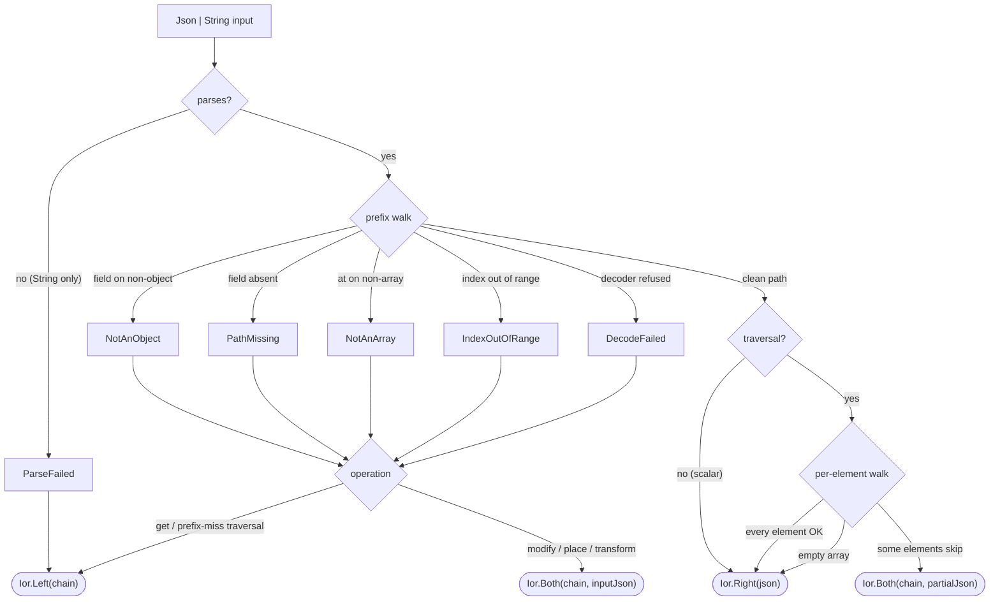

# circe integration

The `cats-eo-circe` module adds two path-walking optics for
editing [circe](https://circe.github.io/circe/) JSON without
paying the cost of a full decode / re-encode round-trip.

Coming from circe-optics, monocle-circe, or raw cursors, the
vocabulary maps directly: `codecPrism[Person].address.street` is
the counterpart of `JsonPath.root.address.street.string` and of an
`hcursor.downField("address").downField("street")` chain. The
differences: paths are compile-time checked against the case-class
schema, every step carries a typed `Encoder` / `Decoder` rather
than a stringly key, and writes rebuild in a single walk with
[`Ior` diagnostics](#reading-diagnostics-from-the-default-ior-surface)
on the default surface. There is deliberately no dynamic
string-path API — for shapes unknown at compile time, stay on
cursors or reach for `Plated[Json]` (below).

```scala
libraryDependencies += "dev.constructive" %% "cats-eo-circe" % "@VERSION@"
```

## Why this exists

The classical Scala JSON-edit pattern is:

```scala
json.as[Person]                       // decode
    .map(p => p.copy(name = p.name.toUpperCase))
    .map(_.asJson)                    // re-encode
```

That decodes every field of `Person`, allocates a fresh
instance, and re-encodes every field — even if only one
leaf is changing. For wide records the work is mostly wasted.

`JsonPrism` / `JsonTraversal` walk a flat path directly through
circe's `JsonObject` / array representation, modifying only
the focused leaf and rebuilding the parents on the way up.
The
[`OrderCirceBench`](https://github.com/Constructive-Programming/eo/blob/main/benchmarks/src/main/scala/dev/constructive/eo/bench/OrderCirceBench.scala)
suite shows the payoff is a *scaling* one, not a constant factor: a
deep scalar edit is **flat in document size** (~1.3 µs whether the record
carries 8 or 512 line items), while `decode → modify → re-encode` scales with
the whole payload — so the gap grows from ~3× on a tiny record to ~160× on a
large one. For a write that touches *every* element of an array, though, both
sides are O(elements) and the cursor walk has no edge (it is in fact slightly
slower) — reach for the traversal there for composition and diagnostics, not
raw throughput. See the [benchmarks page](../benchmarks.md)
for the full tables.

## JsonPrism

```scala mdoc:silent
import dev.constructive.eo.circe.codecPrism
import io.circe.Codec
import io.circe.syntax.*
import hearth.kindlings.circederivation.KindlingsCodecAsObject

case class Address(street: String, zip: Int)
object Address:
  given Codec.AsObject[Address] = KindlingsCodecAsObject.derived

case class Person(name: String, age: Int, address: Address)
object Person:
  given Codec.AsObject[Person] = KindlingsCodecAsObject.derived
```

Construct a Prism to the root type, then drill into fields.
The `.address.street` sugar is macro-powered — it compiles to
`.field(_.address).field(_.street)`.

A note before the examples: they use the `*Unsafe` variants for
brevity. In application code, start on the default `Ior` surface —
`Ior.Right` is clean success, `Ior.Both` partial success plus the
failure chain, `Ior.Left` nothing producible (see
[Reading diagnostics from the default Ior surface](#reading-diagnostics-from-the-default-ior-surface))
— and reach for `*Unsafe` only where you've measured and don't
want the `Ior` allocation.

```scala mdoc
val alice   = Person("Alice", 30, Address("Main St", 12345))
val json    = alice.asJson
val streetP = codecPrism[Person].address.street

streetP.modifyUnsafe(_.toUpperCase)(json).noSpacesSortKeys
```

The default `modify` returns `Ior[Chain[JsonFailure], Json]` —
failures are surfaced rather than silently swallowed. The
`*Unsafe` variants preserve the pre-v0.2 silent behaviour.
Full coverage of both surfaces lives in the "Observable-by-default
failures" section of the v0.2 release notes.

One law-level caveat: a *drilled* prism like `streetP` is an
Optional, not a lawful Prism. The focus lives inside a document,
so rebuilding needs the siblings — they are kept on the `Affine`
seam captured during the walk, which is why `modify` / `place`
preserve them. Only the root `codecPrism[S]` is a lawful
full-cover Prism, and `reverseGet` is a genuine build *only*
there — never use it as the write path on a drilled prism (it
would fabricate a document from the focus alone, dropping every
sibling).

Other operations (all the silent escape hatches):

```scala mdoc
streetP.getOptionUnsafe(json)
streetP.placeUnsafe("Broadway")(json).noSpacesSortKeys
streetP.transformUnsafe(_.mapString(_.reverse))(json).noSpacesSortKeys
```

Forgiving semantics on the `*Unsafe` surface — missing paths leave
the Json unchanged:

```scala mdoc
import io.circe.Json
val stump = Json.obj("name" -> Json.fromString("Alice"))
streetP.modifyUnsafe(_.toUpperCase)(stump).noSpacesSortKeys
```

## Array indexing

`.at(i)` drills into the `i`-th element of a JSON array:

```scala mdoc:silent
case class Order(name: String)
object Order:
  given Codec.AsObject[Order] = KindlingsCodecAsObject.derived

case class Basket(owner: String, items: Vector[Order])
object Basket:
  given Codec.AsObject[Basket] = KindlingsCodecAsObject.derived
```

```scala mdoc
val basket     = Basket("Alice", Vector(Order("X"), Order("Y"), Order("Z")))
val basketJson = basket.asJson
val secondName = codecPrism[Basket].items.at(1).name

secondName.modifyUnsafe(_.toUpperCase)(basketJson).noSpacesSortKeys
```

Out-of-range / negative / non-array positions pass through
unchanged.

## JsonTraversal (`.each`)

`.each` splits the path at the current array focus and returns
a `JsonTraversal` that walks every element. Further `.field` /
`.at` / selectable-sugar calls on the traversal extend the
per-element suffix:

```scala mdoc
val everyName = codecPrism[Basket].items.each.name

everyName.modifyUnsafe(_.toUpperCase)(basketJson).noSpacesSortKeys
everyName.getAllUnsafe(basketJson)
```

Empty arrays and missing paths leave the Json unchanged.

## Multi-field focus — `.fields(_.a, _.b)`

`.fields(selector1, selector2, ...)` focuses a bundle of named
case-class fields as a Scala 3 `NamedTuple`. Selectors arrive in
selector-order; the NamedTuple type reflects that. Arity must be
≥ 2 — use `.field(_.x)` for a single-field focus.

The focused NamedTuple needs a `Codec.AsObject` of its own, and
neither circe's generic derivation nor this module provides one —
you bring it. The kindlings derivation used throughout this page
(`import hearth.kindlings.circederivation.KindlingsCodecAsObject`,
already in scope from the first fence) does the job, given the
dependency:

```scala
libraryDependencies += "com.kubuszok" %% "kindlings-circe-derivation" % "0.3.0"
```

A hand-written codec works just as well. Miss it and the `.fields`
macro aborts at compile time, naming the import and dependency in
its hint:

```scala mdoc:silent
type NameAge = NamedTuple.NamedTuple[("name", "age"), (String, Int)]
given Codec.AsObject[NameAge] = KindlingsCodecAsObject.derived
```

```scala mdoc
val nameAge = codecPrism[Person].fields(_.name, _.age)

nameAge
  .modifyUnsafe(nt => (name = nt.name.toUpperCase, age = nt.age + 1))(json)
  .noSpacesSortKeys
```

Full-cover selection — spanning every field of `Person` — still
returns a `JsonFieldsPrism`, **not** an `Iso`. JSON decode can
always fail (the input may not even be a JSON object) so totality
isn't witnessable, and an Iso would misleadingly advertise a
guarantee we cannot provide.

```scala mdoc:silent
type Full = NamedTuple.NamedTuple[("name", "age", "address"), (String, Int, Address)]
given Codec.AsObject[Full] = KindlingsCodecAsObject.derived
```

```scala mdoc
val fullL = codecPrism[Person].fields(_.name, _.age, _.address)
// `fullL` is a JsonFieldsPrism, not a JsonIso — the return type is
// unchanged when coverage is complete.
```

Per-element multi-field focus via `.each.fields` focuses a
NamedTuple on every element of an array:

```scala mdoc:silent
case class Item(name: String, price: Double, qty: Int)
object Item:
  given Codec.AsObject[Item] = KindlingsCodecAsObject.derived

case class MultiBasket(owner: String, items: Vector[Item])
object MultiBasket:
  given Codec.AsObject[MultiBasket] = KindlingsCodecAsObject.derived

type NamePrice = NamedTuple.NamedTuple[("name", "price"), (String, Double)]
given Codec.AsObject[NamePrice] = KindlingsCodecAsObject.derived
```

```scala mdoc
val mbJson = MultiBasket(
  "Alice",
  Vector(Item("x", 1.0, 1), Item("y", 2.0, 2)),
).asJson

codecPrism[MultiBasket]
  .items
  .each
  .fields(_.name, _.price)
  .modifyUnsafe(nt => (name = nt.name.toUpperCase, price = nt.price * 2))(mbJson)
  .noSpacesSortKeys
```

## Reading diagnostics from the default Ior surface

The default `modify` / `transform` / `place` / `transfer` / `get`
methods on `JsonPrism`, `JsonFieldsPrism`, `JsonTraversal`, and
`JsonFieldsTraversal` all return `Ior[Chain[JsonFailure], Json]`
(or `, A]` / `, Vector[A]]` for the reads). Three observable
shapes:

- `Ior.Right(json)` — clean success.
- `Ior.Both(chain, json)` — partial success. The `json` reflects
  every update that did succeed; the `chain` lists every skip.
- `Ior.Left(chain)` — no result producible. Typical for `get`
  misses and for traversal-prefix misses where there's nothing
  to iterate.

### Failure flow

The diagram below traces the path a `Json | String` input takes
through a default-surface read/modify, showing which
`JsonFailure` case lands in the chain at each refusal point and
which `Ior` shape the caller observes.



- Prefix-walk failures (the `NotAnObject` / `PathMissing` /
  `NotAnArray` / `IndexOutOfRange` / `DecodeFailed` branches) surface
  as `Ior.Left` on read operations and `Ior.Both(chain, inputJson)`
  on modify operations — the unchanged input Json rides along so
  the caller can keep walking.
- Per-element traversal skips (the `.each` path) accumulate one
  `JsonFailure` per refused element and land in `Ior.Both`
  together with the partially-updated Json — every element that
  *did* succeed is reflected in the payload.
- `ParseFailed` is the only case that can fire on string inputs;
  when the caller hands in a `Json` directly, that branch is
  unreachable.

```scala mdoc
import cats.data.Ior
import dev.constructive.eo.circe.{JsonFailure, PathStep}

val stumpJson = Json.obj("name" -> Json.fromString("Alice"))

// default modify returns Ior.Both on a failure — the Json is
// unchanged, the chain documents the miss
streetP.modify(_.toUpperCase)(stumpJson)
```

Each `JsonFailure` case carries the `PathStep` at which the walk
refused, plus (for `DecodeFailed`) the underlying circe
`DecodingFailure`:

```scala mdoc
val miss: JsonFailure = JsonFailure.PathMissing(PathStep.Field("street"))
miss.message
```

Traversal-side accumulation collects one `JsonFailure` per
skipped element — on a mixed-failure array, the `Ior.Both` Json
reflects the successful updates and the chain lists every element
that was left unchanged:

```scala mdoc
val brokenArr = Json.arr(
  Order("x").asJson,
  Json.fromString("oops"), // not an Order
  Order("z").asJson,
)
val brokenBasket =
  Json.obj("owner" -> Json.fromString("Alice"), "items" -> brokenArr)

codecPrism[Basket]
  .items
  .each
  .name
  .modify(_.toUpperCase)(brokenBasket)
```

## String input — parse on the fly

Every edit and read method on `JsonPrism` / `JsonFieldsPrism` /
`JsonTraversal` / `JsonFieldsTraversal` accepts `Json | String` as
the source. When you hand in a `String`, the library parses it
first and surfaces parse errors through the same `JsonFailure`
accumulator as every other failure mode.

```scala mdoc:silent
val incoming: String =
  """{"name":"Alice","age":30,"address":{"street":"Main St","zip":12345}}"""

val upperName = codecPrism[Person].field(_.name).modify(_.toUpperCase)
```

```scala mdoc
// Happy path: parsed, modified, Ior.Right.
upperName(incoming).map(_.noSpacesSortKeys)

// Parse failure: Ior.Left(Chain(JsonFailure.ParseFailed(_))).
upperName("not json at all")
```

Handing in a `Json` directly still works unchanged — the widened
`(Json | String) => _` signature is a supertype of the old `Json =>
_`, so every pre-existing call site compiles without change. The
parse cost is zero when the input is already a `Json`; it's one
`io.circe.parser.parse` invocation when it's a `String`.

On the `*Unsafe` surface, unparseable strings fall back to
`Json.Null` — there's no meaningful "input unchanged" semantic for
text that isn't JSON, and the whole point of `*Unsafe` is to drop
failure detail. Callers who need parse diagnostics stay on the
default Ior-bearing surface.

## Ignoring failures (the `*Unsafe` escape hatch)

For callers who have measured and know they don't want the Ior
allocation, every default method has a sibling `*Unsafe` variant
that preserves the pre-v0.2 silent-forgiving behaviour
byte-for-byte:

```scala mdoc
// Pre-v0.2 shape: modifyUnsafe, silent pass-through on miss.
streetP.modifyUnsafe(_.toUpperCase)(stumpJson).noSpacesSortKeys

// Equivalent via the default surface:
streetP.modify(_.toUpperCase)(stumpJson).getOrElse(stumpJson).noSpacesSortKeys
```

Both spellings produce the same Json. The first pays nothing for
diagnostics; the second gives an observable `Ior` at the price of
one allocation.

## Migration notes (v0.2 rename)

v0.2 renames the silent methods to `*Unsafe` and repurposes the
clean name for the Ior-bearing surface. The mechanical replacement
is: swap the method name for its `*Unsafe` sibling if you want
the pre-v0.2 behaviour preserved exactly.

| Class                     | v0.1 (silent)  | v0.2 default (Ior-bearing)              | v0.2 `*Unsafe` (silent) |
|---------------------------|-----------------|------------------------------------------|-------------------------|
| `JsonPrism[A]`            | `modify(f)`     | `modify(f): Json => Ior[Chain[JsonFailure], Json]` | `modifyUnsafe(f)`       |
| `JsonPrism[A]`            | `transform(f)`  | `transform(f): Json => Ior[...]`          | `transformUnsafe(f)`    |
| `JsonPrism[A]`            | `place(a)`      | `place(a): Json => Ior[...]`              | `placeUnsafe(a)`        |
| `JsonPrism[A]`            | `transfer(f)`   | `transfer(f): Json => C => Ior[...]`      | `transferUnsafe(f)`     |
| `JsonPrism[A]`            | `getOption`     | `get(j): Ior[..., A]`                     | `getOptionUnsafe`       |
| `JsonFieldsPrism[A]`      | (new)           | same five                                 | same five               |
| `JsonTraversal[A]`        | `modify(f)`     | `modify(f): Json => Ior[...]`             | `modifyUnsafe(f)`       |
| `JsonTraversal[A]`        | `transform(f)`  | `transform(f): Json => Ior[...]`          | `transformUnsafe(f)`    |
| `JsonTraversal[A]`        | `getAll`        | `getAll(j): Ior[..., Vector[A]]`          | `getAllUnsafe`          |
| `JsonTraversal[A]`        | (new in v0.2)   | `place(a)` / `transfer(f)` (Ior-bearing)  | `placeUnsafe` / `transferUnsafe` |
| `JsonFieldsTraversal[A]`  | (new)           | same five                                 | same five               |

The `*Unsafe` bodies are byte-identical to the pre-v0.2 silent
shape — no behaviour change, just the rename. The default Ior
surface is a new option: reach for it when you want to see the
path-level diagnostic.

## Recursive edits — `Plated[Json]`

Sometimes the edit isn't at a fixed path but *everywhere*: redact
every field named `ssn` at any depth, uppercase every string,
round every number. `Plated[Json]` makes `Json` a recursive
self-traversal — the immediate children of a node are an array's
elements or an object's field values — so the
[`Plated`](../cookbook.md) combinators walk the whole document:

```scala mdoc:silent
import dev.constructive.eo.circe.given
import dev.constructive.eo.optics.{Plated, Prism}
import io.circe.Json
```

```scala mdoc
val doc = Json.obj(
  "name" -> Json.fromString("alice"),
  "tags" -> Json.arr(Json.fromString("x"), Json.fromString("y")),
)

// Uppercase every string anywhere in the document, recursively.
Plated
  .transform[Json](j => j.asString.fold(j)(s => Json.fromString(s.toUpperCase)))(doc)
  .noSpacesSortKeys

// Every sub-node, self first.
Plated.universe(doc).length
```

Better still, `Plated.everywhere[Json]` turns that whole-tree walk into
a *composable optic*: build the focus once as an ordinary `Prism`, then
`.andThen` it onto `everywhere` and the `.modify` runs at every depth —
the same `.andThen` / `.modify` vocabulary the rest of this page uses
for a single path, now reaching the entire document:

```scala mdoc:silent
// A Prism focusing any Json string leaf.
val jsonString = Prism.optional[Json, String](_.asString, Json.fromString)

// One optic, every depth: uppercase every string in the tree.
val everyString = Plated.everywhere[Json].andThen(jsonString)
```

```scala mdoc
everyString.modify(_.toUpperCase)(doc).noSpacesSortKeys
```

`transform` / `rewrite` / `universe` / `everywhere` are all stack-safe
to any depth (`transform` / `everywhere` on a call-stack/heap-machine
hybrid, `universe` on a worklist, `rewrite` trampolined through
`cats.Eval` so even a long re-fire chain won't overflow), so a deep
document is safe. See the [cookbook Plated recipe](../cookbook.md) for the
data-type side of the same API.

## Working Json-first — migrating a Decoder-materialised model

Two usage modes — pick deliberately:

- **Layer on an existing model** (hot-path edits): keep decoding
  your case class where the whole record matters, and use a prism
  for the one or two fields on the hot path.
- **Replace the materialised model** (optics-as-evidence): the
  `Json` — or the wire `String`, parsed on the fly — *is* the data
  structure. `json.as[Whole]` never runs; do not go looking for a
  whole-document decode step — not needing one is the point. Hold
  the `Json` and read/write individual fields through
  `codecPrism`, and let the consuming code follow the standard
  doctrine —
  [consume via capability, construct via optic](../capabilities.md).

Signatures demand the weakest capability that covers what they do;
the prism *is* the evidence, so the `Json` holder slots into
functions that never name the optic or circe:

```scala mdoc:silent
import dev.constructive.eo.*

// Knows NOTHING about JSON, circe, or this library's optics —
// only that a String street can be rewritten inside a T. That
// generic T is what buys you: unit-testing the logic with a plain
// case class + lens, and re-using the same function for the
// materialised model, the Json, or any other T with the evidence.
def widenStreet[T](t: T)(using cm: CanModify[T, String]): T =
  cm.replace("Broadway")(t)

// The prism given IS the capability evidence for T = Json
// (one optic given per (S, A) pair — the coherence rule applies):
given dev.constructive.eo.circe.JsonPrism[String] = streetP
```

```scala mdoc
widenStreet(json).noSpacesSortKeys
```

The same consumer serves the mode-1 materialised model unchanged —
an [eo-generics lens](../generics.md) on the case class is equally
valid evidence, which is also the natural way to unit-test it.

## When to reach for which

| Task                                                  | Use                       |
|-------------------------------------------------------|---------------------------|
| Edit one leaf deep in a JSON tree                     | `JsonPrism` via `.address.street` sugar |
| Edit element `i` of a JSON array                      | `codecPrism[…].items.at(i).…` |
| Edit every element of a JSON array                    | `codecPrism[…].items.each.…` + `modify` |
| Read every element's focus                            | `codecPrism[…].items.each.…` + `getAll` |
| Edit multiple fields atomically                       | `codecPrism[…].fields(_.a, _.b).modify(...)` |
| Observe why a modify was a silent no-op               | default Ior-bearing `.modify(...)` — inspect the `Ior.Both` / `Ior.Left` chain |
| Edit the whole root record (and you have a Codec)     | `codecPrism[Person].modifyUnsafe(f)` |
| Keep the wire Json as the model (no whole-document decode) | hold `Json` + `codecPrism`; consumers demand `CanGetOption` / `CanModify` |

For the full failure-mode matrix (missing paths, non-array
focuses, empty collections, out-of-range indices), see the
behaviour
[spec](https://github.com/Constructive-Programming/eo/blob/main/circe/src/test/scala/dev/constructive/eo/circe/JsonPrismSpec.scala).
