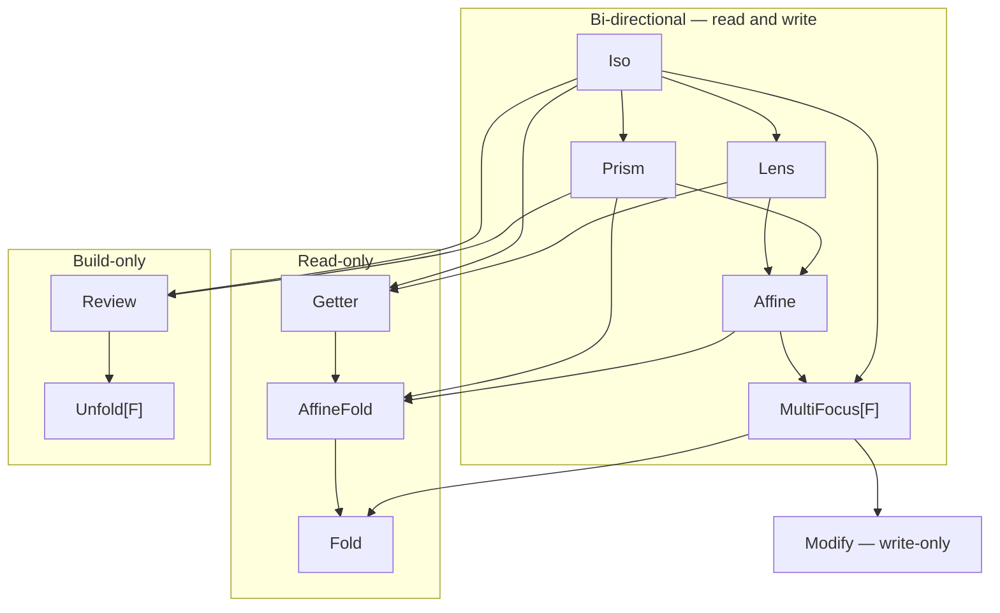

# Optics reference

One section per family — the shape, carrier, primary use case, and a
minimal runnable example. For the per-method reference see the
Scaladoc.

## Family taxonomy

Every family is a specialisation of the same `Optic[S, T, A, B, F]`
trait, differing only in the carrier `F[_, _]` — and the family space
is genuinely **three-axis**:

- **focus arity** — how many foci the read side can produce:
  exactly one, 0-or-1, or many;
- **from side** — what the `from` half does: a *contextual write*
  (needs the leftover `X` to rebuild — Lens-like), a *total build*
  (needs no context — Iso/Review-like), or nothing;
- **read side** — present or absent.


The geometry carries real information:

- **Lens vs Iso** (and Optional vs Prism) differ *only* on the
  from-side axis — write-with-context vs total build. That distinction
  is also why the write-only family is named `Modify`, not "Setter":
  it lives in the *write* column, with the build column belonging to
  Review and Unfold.
- The **read-only rail** (Getter → AffineFold → Fold) and the
  **build-only rail** (Review → Unfold) run parallel along the arity
  axis — `Fold` and `Unfold` are mirror images on the same
  `Forget[F]` carrier.
- The **(0-or-1, build, no-read) cell collapses into Review**: a
  Prism's `mend` is total, so a "partial Review" is just Review.
- The **(many, read, total-build) cell is uninhabited**: nothing
  total-builds from many foci while also reading them — recursive
  structures get there with *contextual* rebuilds instead (`Plated`'s
  `plate` keeps the structural skeleton, so it sits in the Traversal
  cell).
- **Modify spans the arity axis**: `(A => B) => S => T` never
  observes how many foci the function is applied at, so it is the
  carrier-agnostic write-only bottom of the whole family space.

### Composition joins

Composition is easier to read in two dimensions: an edge `A → B`
means *every `A` is a `B`*, so composing two optics lands on their
**join** — the lowest node both reach by following edges down.
`Iso.andThen(Lens) = Lens`; `Lens.andThen(Prism)` lands on the
`Affine` carrier; a read-only chain lands on the read-only rail.



How to read it:

- **Same-family compose** stays in that family: `Lens ∘ Lens = Lens`,
  `Prism ∘ Prism = Prism`, `Iso ∘ Iso = Iso`.
- **Cross-family compose** walks down from each input to where they
  meet: `Lens ∘ Prism` → `Affine`; `Iso ∘ Modify` → `Modify`.
- **The bi-directional spine** (Iso, Lens, Prism, Affine, MultiFocus)
  carries both a read and a write side. **One-way optics** keep only
  one: the read-only rung (Getter → AffineFold → Fold, ordered by how
  many foci a read can produce: exactly one, 0-or-1, many), the
  build-only rung (Review → Unfold, one focus vs. an `F`-layer of
  parts), and write-only Modify.
- Composing **into a read-only inner** (or from a read-only outer)
  drops every write side and lands on the read-only rung at the join
  of the two read strengths — `lens ∘ getter` → Getter,
  `prism ∘ getter` → AffineFold, `traversal ∘ getter` → Fold.
- Composing **through the build side** keeps only build halves:
  reversible outers (Iso / Prism / Review — anything whose carrier has
  a `ReverseAccessor`) compose into Review and Unfold;
  `review ∘ unfold` and `unfold ∘ review` land on Unfold.
- Composing with a write-only Modify collapses the read side:
  `lens ∘ modify` → Modify.

`Affine` is the carrier shared by `Optional` (read and write) and
`AffineFold` (read-only). `MultiFocus[F]` is the multi-focus carrier;
its sub-shapes (PowerSeries, Grate, Kaleidoscope, `AlgLens[F]`) are
selected by `F`. `Forget[F]` is the one-way many carrier shared by
`Fold` (read-only) and `Unfold` (build-only).

### Composition matrix

The full 11-family grid. Every cell is pinned by
[`CompositionMatrixSpec`](https://github.com/Constructive-Programming/eo/blob/main/tests/src/test/scala/dev/constructive/eo/CompositionMatrixSpec.scala):
an inhabited cell composes via plain `.andThen` with **no expected-type
ascription and no `given` imports**, landing at the family shown; ∅
cells do not compile, **by design** (writing through a read-only optic,
reading through a build-only one, building through a write-incapable
one). 87 of 121 cells compose; 34 are void.

| outer ∘ inner | Iso | Lens | Prism | Optional | Traversal | Getter | AffineFold | Fold | Modify | Review | Unfold |
|---------------|-----|------|-------|----------|-----------|--------|------------|------|--------|--------|--------|
| **Iso**       | Iso | Lens | Prism | Optional | Traversal | Getter | AffineFold | Fold | Modify | Review | Unfold |
| **Lens**      | Lens | Lens | Optional | Optional | Traversal | Getter | AffineFold | Fold | Modify | ∅ | ∅ |
| **Prism**     | Prism | Optional | Prism | Optional | Traversal | AffineFold | AffineFold | Fold | Modify | Review | Unfold |
| **Optional**  | Optional | Optional | Optional | Optional | Traversal | AffineFold | AffineFold | Fold | Modify | ∅ | ∅ |
| **Traversal** | Traversal | Traversal | Traversal | Traversal | Traversal | Fold | Fold | Fold | Modify | ∅ | ∅ |
| **Getter**    | Getter | Getter | AffineFold | AffineFold | Fold | Getter | AffineFold | Fold | ∅ | ∅ | ∅ |
| **AffineFold**| AffineFold | AffineFold | AffineFold | AffineFold | Fold | AffineFold | AffineFold | Fold | ∅ | ∅ | ∅ |
| **Fold**      | Fold | Fold | Fold | Fold | Fold | Fold | Fold | Fold | ∅ | ∅ | ∅ |
| **Modify**    | Modify | Modify | Modify | Modify | Modify | ∅ | ∅ | ∅ | Modify | ∅ | ∅ |
| **Review**    | Review | ∅ | Review | ∅ | ∅ | ∅ | ∅ | ∅ | ∅ | Review | Unfold |
| **Unfold**    | Unfold | ∅ | Unfold | ∅ | ∅ | ∅ | ∅ | ∅ | ∅ | Unfold | Unfold |

The structure of the voids is the taxonomy speaking:

- The **Modify column/row corner**: a Modify exposes no focus to read
  and no value to build with, so only write-capable pairs survive.
- The **Review / Unfold columns** are void for every outer that cannot
  build totally (Lens, Optional, Traversal — their write-back needs a
  leftover the build-only inner never produces; Getter / AffineFold /
  Fold — their back-focus is honestly `Unit`, so there is nothing to
  build *with*). Only the reversible outers (Iso, Prism, Review,
  Unfold) reach them.
- The **Review / Unfold rows** mirror the columns: a build-only outer
  exposes no readable focus, so only build halves (Iso / Prism via
  `ReverseAccessor`, Review, Unfold) compose in.

Four mechanisms produce the inhabited cells, all resolved at compile
time: same-carrier `AssociativeFunctor`, cross-carrier
`Morph`/`Composer` bridges, the `ReadCompose` read-collapse (any pair
with a read-only side), and the `ReverseAccessor`-gated build-collapse
(the Review / Unfold cells). See
[Concepts → Composition lattice](concepts.md#composition-lattice) for
the carrier-level bridge graph.

```scala mdoc:silent
import dev.constructive.eo.optics.{Lens, Optic}
import dev.constructive.eo.optics.Optic.*
// `Fold.apply` / `.select` now return the concrete `ForgetFold`, whose eager `foldMap`
// member needs no `import Forget.given` — the carrier's `ForgetfulFold` is no longer summoned.
// (Accessor[Direct] etc. resolve via `object Direct`'s companion scope — `Direct` is an
//  opaque type, so no `import Direct.given` is needed for `.get` on Iso / Getter.)
```

Every page here shows optics constructed by hand. For the
macro-derived `lens[S](_.field)` / `prism[S, A]` flavour, see
[Generics](generics.md).

## Iso

An `Iso[S, A]` is a bijection — every `S` round-trips to exactly
one `A` and back. Carrier: `Direct` (the identity carrier).

```scala mdoc:silent
import dev.constructive.eo.optics.Iso

case class PersonPair(age: Int, name: String)
val pairIso = Iso[(Int, String), (Int, String), PersonPair, PersonPair](
  t => PersonPair(t._1, t._2),
  p => (p.age, p.name),
)
```

```scala mdoc
pairIso.get((30, "Alice"))
pairIso.reverseGet(PersonPair(30, "Alice"))
```

## Lens

A `Lens[S, A]` focuses a single, always-present field of a
product type. Carrier: `Tuple2`.

```scala mdoc:silent
case class Person(name: String, age: Int)
val ageL = Lens[Person, Int](_.age, (p, a) => p.copy(age = a))
```

```scala mdoc
val alice = Person("Alice", 30)
ageL.get(alice)
ageL.replace(31)(alice)
ageL.modify(_ + 1)(alice)
```

Composes via `.andThen` with other Lenses and — transparently,
with no extra syntax — with `Optional` / `Modify` / `Traversal`
optics too. The cross-carrier variant of `.andThen` summons a
`Composer[F, G]` or `Composer[G, F]` to bring both sides under
a common carrier.

## Prism

A `Prism[S, A]` focuses one branch of a sum type — `Some` over
`None`, or a specific case of an enum. Carrier: `Either`.

```scala mdoc:silent
import dev.constructive.eo.optics.Prism

enum Shape:
  case Circle(r: Double)
  case Square(s: Double)

val circleP = Prism[Shape, Shape.Circle](
  {
    case c: Shape.Circle => Right(c)
    case other           => Left(other)
  },
  identity,
)
```

```scala mdoc
circleP.to(Shape.Circle(1.0))
circleP.to(Shape.Square(2.0))

// modify acts only on the Circle branch; Squares pass through
// unchanged.
circleP.modify(c => Shape.Circle(c.r * 2))(Shape.Circle(1.0))
circleP.modify(c => Shape.Circle(c.r * 2))(Shape.Square(2.0))
```

For auto-derivation on enums / sealed traits / union types see
`prism[S, A]` in [Generics](generics.md).

## Affine

The `Affine` carrier focuses a value that may or may not be present —
a 0-or-1 focus. Two families ride it: **Optional** (read and write)
and **AffineFold** (read-only).

### Optional

An `Optional[S, A]` focuses a conditionally-present field — an
`Option[A]` field, a predicate-gated access, a refinement-style
narrowing.

```scala mdoc:silent
import dev.constructive.eo.data.Affine
import dev.constructive.eo.optics.Optional

case class Contact(flag: Option[String])

val presentFlag = Optional[Contact, Contact, String, String, Affine](
  getOrModify = c => c.flag.toRight(c),
  reverseGet  = { case (c, s) => c.copy(flag = Some(s)) },
)
```

```scala mdoc
presentFlag.modify(_.toUpperCase)(Contact(Some("hello")))
presentFlag.modify(_.toUpperCase)(Contact(None))
```

Composition with a Lens is automatic: `lens.andThen(optional)`
summons `Composer[Tuple2, Affine]` under the hood and morphs
the Lens into the Affine carrier. No explicit `.morph` required
on your end.

**Read-only / write-only collapse.** Composing *any* optic with a
read-only `Getter` projects it to its **read-only counterpart**:
the `Getter`'s `Unit` back-focus can't thread through a writable
`B`, so the write side is forgotten (`T = B = Unit`). The
`ReadCompose[F, G]` join picks the result from the two read
strengths — total ∘ total yields a `Getter`, any partial side an
`AffineFold`, any many-focus side a `Fold`:

```scala
lens.andThen(getter)       // Getter
optional.andThen(getter)   // AffineFold  (partial read)
prism.andThen(getter)      // AffineFold
traversal.andThen(getter)  // Fold        (many reads)
```

The same join fires with the read-only optic on the *outside*
(`getter.andThen(lens)` → Getter, `fold.andThen(prism)` → Fold), so
a chain that touches a read-only optic anywhere collapses to the
read-only rung at the join of all its read strengths.

Dually, composing with a write-only `Modify` collapses the *read*
side and yields a `Modify` (`lens.andThen(modify)`,
`optional.andThen(modify)`, …) — it modifies the focus through the
inner modifier. One rule per side, across the whole algebra, rather
than a per-family special case.

### AffineFold (read-only)

The read-only projection of an Affine — a 0-or-1 focus with no
write-back path. `Optional.readOnly` / `Optional.selectReadOnly`
build one from the "read-only Optional" mental model. Full
treatment, with the read-only-direction story, lives in
[Single direction → AffineFold](#affinefold).

## MultiFocus

`MultiFocus[F][X, A] = (X, F[A])` — a structural leftover paired with
an `F`-shaped bundle of foci. It is the carrier for every optic that
focuses more than one value at once; the surface lights up by the
typeclasses `F` admits (`.modify` for `Functor`, `.foldMap` for
`Foldable`, `.modifyA` for `Traverse`, `.at(i)` for `Representable`,
`.collectMap` / `.collectList` for aggregation, and same-carrier
`.andThen`). The sub-shapes below are just different `F`s.

See the [MultiFocus reference](multifocus.md) for the full
typeclass-gated capability matrix and composability profile; the
[Cookbook](cookbook.md) ships runnable recipes for the Grate,
Kaleidoscope, and PowerSeries shapes.

### PowerSeries

`MultiFocus[PSVec]` — the `Traversal.each` / `Traversal.pEach`
carrier. Map, fold, or traverse every element of a collection, and
keep composing past the traversal with `.andThen`. Supports `.modify`
/ `.replace` (`Functor`), `.foldMap` (`Foldable`), `.modifyA` / `.all`
(`Traverse`), and downstream `.andThen` via `mfAssocPSVec`. Overhead
over a naive `copy`/`map` runs ~2-3× for dense chains and ~5× for the
Prism miss-branch shape, amortising down as the collection grows (the
[benchmarks](benchmarks.md#powerseries-traversal-with-downstream-composition)
sweep sizes 4 / 32 / 256 / 1024).

`Plated` — the recursive self-traversal behind `transform` / `universe`
/ `everywhere` — rides this same `MultiFocus[PSVec]` carrier via
`Traversal.selfChildren`; it's a typeclass over the carrier, not a new
family node. See [Generics → `plate[S]`](generics.md), the
[Cookbook](cookbook.md), and the [Modify section](#modify) for
`everywhere`.

```scala mdoc:silent
import dev.constructive.eo.optics.Traversal
import dev.constructive.eo.data.MultiFocus.given  // Functor / Foldable / Traverse for MultiFocus[PSVec]

val listEach = Traversal.pEach[List, Int, Int]
```

```scala mdoc
listEach.modify(_ + 1)(List(1, 2, 3))
listEach.foldMap(identity[Int])(List(1, 2, 3))   // sum
```

`each` shines when the chain continues past the traversal — e.g.
"for every phone, toggle `isMobile`":

```scala mdoc:silent
case class Phone(isMobile: Boolean, number: String)
case class Owner(phones: List[Phone])

val ownerAllPhonesMobile =
  Lens[Owner, List[Phone]](_.phones, (o, ps) => o.copy(phones = ps))
    .andThen(Traversal.each[List, Phone])
    .andThen(Lens[Phone, Boolean](_.isMobile, (p, m) => p.copy(isMobile = m)))
```

```scala mdoc
ownerAllPhonesMobile.modify(!_)(Owner(List(
  Phone(isMobile = false, "555-0001"),
  Phone(isMobile = true,  "555-0002"),
)))
```

### Grate

`MultiFocus[Function1[X0, *]]` — a uniform rewrite across a fixed
shape: homogeneous tuples and Naperian / representable containers,
where every position is rebuilt the same way. The factories are
`MultiFocus.tuple[T <: Tuple, A]` (homogeneous-tuple uniform rewrite),
`MultiFocus.representable[F: Representable, A]` (arbitrary Naperian
rebuild), and `MultiFocus.representableAt` (representative-index
variant). See [MultiFocus reference](multifocus.md) and
[Cookbook → Recipe A](cookbook.md) for a worked example.

### Kaleidoscope

`MultiFocus[F]` for an `F` with `Apply` — the aggregating read: collapse
every focus to a single value with `.collectMap` (Functor-broadcast)
or `.collectList` (List cartesian). Reach for it when you want to read
the foci out as one summary rather than rewrite them in place. See
[MultiFocus reference](multifocus.md) and
[Cookbook → Recipe B](cookbook.md).

### `AlgLens[F]`

`MultiFocus[F]` for `F: Functor / Foldable / Traverse` — an algebraic
("classifier") lens whose focus is computed over the structure: the
read side folds/classifies, the write side broadcasts back. The
`MultiFocus.fromLensF` / `fromPrismF` / `fromOptionalF` factories lift
a single-focus optic over an `F[A]` focus into this shape. See
[MultiFocus reference](multifocus.md) and
[Cookbook → Recipe C](cookbook.md).

## Single direction

Optics that travel one way only — they keep a read side, a write side,
or a build side, but not the round trip.

### Getter

A `Getter[S, A]` is a pure projection — read-only. Carrier:
`Direct` with `T = Unit`.

```scala mdoc:silent
import dev.constructive.eo.optics.Getter

val nameLen = Getter[Person, Int](_.name.length)
```

```scala mdoc
nameLen.get(Person("Alice", 30))
```

Getter → Getter composes via the ordinary `.andThen` (the fused
`Getter.andThen`): `g1.andThen(g2).get(s)` reads
`g2.get(g1.get(s))`.

```scala mdoc
val initial = Getter[Person, String](_.name).andThen(Getter[String, Char](_.head))
initial.get(Person("Alice", 30))
```

### Modify

A `Modify[S, A]` can modify but not read — a write-only focus
for cases where the focus value isn't observable to the caller.
Carrier: `ModifyF`.

```scala mdoc:silent
import dev.constructive.eo.optics.Modify

case class ModifyConfig(values: Map[String, Int])
val bumpAll = Modify[ModifyConfig, ModifyConfig, Int, Int] { f => cfg =>
  cfg.copy(values = cfg.values.view.mapValues(f).toMap)
}
```

```scala mdoc
bumpAll.modify(_ + 1)(ModifyConfig(Map("a" -> 1, "b" -> 2)))
```

Both `lens.andThen(modify)` (a Lens to a focus, then a Modify that
writes into it) and `modify.andThen(modify)` work — `ModifyF` ships an
`AssociativeFunctor[ModifyF, Xo, Xi]` instance, so the standard
`Optic.andThen` resolution picks it up transparently.

```scala mdoc:silent
import dev.constructive.eo.compose.Composer
import dev.constructive.eo.data.ModifyF
import dev.constructive.eo.data.ModifyF.given

final case class Box(value: Int)
final case class Holder(box: Box, tag: String)

val outer = summon[Composer[Tuple2, ModifyF]].to(
  Lens[Holder, Box](_.box, (s, b) => s.copy(box = b))
)
val inner = summon[Composer[Tuple2, ModifyF]].to(
  Lens[Box, Int](_.value, (s, v) => s.copy(value = v))
)
val composed = outer.andThen(inner)
```

```scala mdoc
composed.modify(_ + 1)(Holder(Box(10), "tag"))
```

Modify is a write-side terminal: there is no `Composer[ModifyF, _]`
outbound, so to *escape* a ModifyF chain into a Forget / MultiFocus /
Lens you have to restructure with the Modify on the inside.

#### `everywhere` — a Modify that reaches every depth

`Plated.everywhere[S]` is a `Modify` over a recursive type whose
`.modify` is the bottom-up recursive `transform` (see
[Generics → `plate[S]`](generics.md)).
Because it's an ordinary Modify, the same `.andThen` you'd use to reach
*one* focus now applies that focus at **every** node of the tree — the
"specify once, run everywhere" payoff. Give the type a `Plated`
(by hand here; `plate[S]` from eo-generics derives it):

```scala mdoc:silent
import dev.constructive.eo.optics.Plated

enum Tree:
  case Leaf(n: Int)
  case Branch(l: Tree, r: Tree)

given Plated[Tree] = Plated.fromChildren(
  {
    case Tree.Branch(l, r) => List(l, r)
    case Tree.Leaf(_)      => Nil
  },
  {
    case (Tree.Branch(_, _), l :: r :: Nil) => Tree.Branch(l, r)
    case (leaf, _)                          => leaf
  },
)

// A Modify that writes the Int in a Leaf; everywhere lifts it to all depths.
val leafN = Modify[Tree, Tree, Int, Int] { f =>
  {
    case Tree.Leaf(n) => Tree.Leaf(f(n))
    case other        => other
  }
}

val everyLeaf = Plated.everywhere[Tree].andThen(leafN)
```

```scala mdoc
everyLeaf.modify(_ + 1)(Tree.Branch(Tree.Leaf(1), Tree.Branch(Tree.Leaf(2), Tree.Leaf(3))))
```

`everywhere` composes outward with any inner optic that bridges into
`ModifyF` (Lens / Prism / Optional / Modify), and the `.modify` runs
bottom-up, stack-safe to any depth. For the read side (every sub-term
as a list) use `Plated.universe`; for the full worked Prism-composition
recipe see the [Cookbook](cookbook.md), and for the macro that derives
the `Plated` see [Generics → `plate[S]`](generics.md).

### Review

A `Review[S, A]` is the build-only optic — it wraps an `A => S`
construction function. It is the exact **mirror of `Getter`**: where
`Getter` is `Optic[S, Unit, A, Unit, Direct]` (a real read `to`, vestigial
`from`), `Review` is `Optic[Unit, S, Unit, A, Direct]` — a vestigial `to`
and a real `from` that *builds* `S` from the focus `A`. So it is a full
`Optic` and composes through the fused `andThen`, just like `Getter`.

```scala mdoc:silent
import dev.constructive.eo.optics.Review

val someIntR = Review[Option[Int], Int](Some(_))
```

```scala mdoc
someIntR.reverseGet(42)
```

Compose two Reviews with `andThen` (build `String → Int → Option[Int]`):

```scala mdoc:silent
val lengthR = Review[Int, String](_.length)
val someLen = someIntR.andThen(lengthR)
```

```scala mdoc
someLen.reverseGet("hello")
```

There are no `fromIso` / `fromPrism` factories: an `Iso` or `Prism` already
carries its build direction, so wrap it directly — `Review(iso.reverseGet)`
or `Review(prism.mend)` — or just compose: `iso.andThen(review)` and
`prism.andThen(review)` land a `Review` via the build-collapse. eo has no
`Prism.fromIso` (and the like) for the same reason — a cross-optic conversion
that merely re-exposes a sub-direction the source already has would be
redundant. (A general, non-bijective `Lens` can't reconstruct its source from
the focus alone, so there is deliberately no `Lens`→`Review` path; build a
`Review` with your own `A => S`.)

Review builds one `S` from one focus. For the many-focus build — assemble
one whole from an `F`-layer of parts — see [Unfold](#unfold), Review's
mirror on the many rung.

### Unfold

An `Unfold[T, B, F]` is the build-only **many** optic — the mirror of
[`Fold`](#fold) exactly as `Review` mirrors `Getter`. It wraps the one
real map

```
embed :  F[B] => T        // many → one
```

"assemble one `T` from a layer of parts `F[B]`" — the **algebra** of a
recursion scheme, and the aggregation arrow ("build an order total from
its line items"). Carrier: `Forget[F]` with `S = A = Unit`, the same
carrier as `Fold` with the opposite side vestigial.

```scala mdoc:silent
import dev.constructive.eo.optics.Unfold

val total = Unfold((xs: List[BigDecimal]) => xs.sum)
```

```scala mdoc
total.embed(List(BigDecimal(9.99), BigDecimal(5.00)))
```

Two constructors, because the vestigial read side is not free the way
`Getter`'s vestigial write side is (`Unit` discards for free; producing
an `F[Unit]` needs `pure`):

- `Unfold.apply` — for `Applicative` carriers (`List`, `Option`,
  `Vector`, …). The vestigial `to` is honestly `pure(())`.
- `Unfold.algebra` — constraint-free, for **pattern functors**, which
  admit `Functor` / `Traverse` but no `Applicative` (`pure` cannot pick
  a constructor). Only the build surface is available; forcing a
  read-side operation fails loudly.

```scala mdoc:silent
import cats.Functor

enum ExprF[+A]:
  case NumF(n: Int)
  case AddF(l: A, r: A)

given Functor[ExprF] with
  def map[A, B](fa: ExprF[A])(f: A => B): ExprF[B] = fa match
    case ExprF.NumF(n)    => ExprF.NumF(n)
    case ExprF.AddF(l, r) => ExprF.AddF(f(l), f(r))

// the evaluation algebra of a recursion scheme, carried as an optic
val evalAlg = Unfold.algebra[Int, Int, ExprF] {
  case ExprF.NumF(n)    => n
  case ExprF.AddF(l, r) => l + r
}
```

```scala mdoc
evalAlg.embed(ExprF.AddF(2, 3))
```

Unfold composes along the build rung in both directions — and because
the seams thread plain values (never an `F`-layer), pattern-functor
algebras compose with no extra constraints:

```scala mdoc:silent
import dev.constructive.eo.optics.Review

// post-process the assembled whole: Review ∘ Unfold = Unfold
val render = Review[String, Int](n => s"= $n").andThen(evalAlg)

// pre-process each part: Unfold ∘ Review = Unfold (Functor[F] only)
val fromStrings = evalAlg.andThen(Review[Int, String](_.toInt))
```

```scala mdoc
render.embed(ExprF.AddF(20, 22))
fromStrings.embed(ExprF.AddF("2", "3"))
```

Iso and Prism build halves also compose in (`iso.andThen(unfold)`,
`unfold.andThen(prism)` — the prism *mends* each part); see the
[composition matrix](#composition-matrix) for the full row and column.
An algebra assembled this way drops straight into the recursion-scheme
fold engine — `Schemes.cata` accepts a pure `Unfold[A, A, PSVec]`
algebra; see [Recursion schemes](schemes.md).

### AffineFold

An `AffineFold[S, A]` is the read-only 0-or-1 focus shape: a
partial projection with no write-back path. Type alias for
`Optic[S, Unit, A, Unit, Affine]` — both `T` and the back-focus
`B` are pinned to `Unit`, which statically rules out `.modify` /
`.replace` and leaves `.getOption`, `.foldMap`, and `.modifyA`
(effectful read) as the surface. (Constructors return the concrete
`PickFold` subclass, whose fused `andThen` keeps composed read-only
chains concrete.)

Use this when the source has no natural write-back
(`headOption` on a List, predicate-gated filters), or as an
API-boundary declaration that callers cannot write through the
returned optic.

```scala mdoc:silent
import dev.constructive.eo.optics.AffineFold

case class Adult(age: Int)
val adultAge: AffineFold[Adult, Int] =
  AffineFold(p => Option.when(p.age >= 18)(p.age))
```

```scala mdoc
adultAge.getOption(Adult(20))
adultAge.getOption(Adult(15))
```

`AffineFold.select(p)` is the filtering variant:

```scala mdoc:silent
val evenAF = AffineFold.select[Int](_ % 2 == 0)
```

```scala mdoc
evenAF.getOption(4)
evenAF.getOption(3)
```

Narrow an existing `Optional` or `Prism` to its read-only
projection with `AffineFold(optic.getOption)` — `.getOption` is
defined on both the Affine and Either carriers, so this holds the
matcher while discarding the write / build path. (There is no
bespoke `fromOptional` / `fromPrism` factory: the conversion is a
one-liner, and eo provides no `Getter.fromLens` /
`Fold.fromTraversal` for the same reason.)

**Composition note.** `lens.andThen(affineFold)` composes
directly — the read-only-inner `andThen` overload routes it
through `ReadCompose`, landing an `AffineFold` (see the
[composition matrix](#composition-matrix)). The same holds with
the AffineFold on the outside: `affineFold.andThen(lens)` →
AffineFold.

### Fold

A `Fold[F, A]` summarises every element of a `Foldable[F]` via
`Monoid[M]` — read-only, multi-element. Carrier: `Forget[F]`.

```scala mdoc:silent
import cats.instances.list.given
import dev.constructive.eo.optics.Fold

val listFold = Fold[List, Int]
```

```scala mdoc
listFold.foldMap(identity[Int])(List(1, 2, 3))
listFold.foldMap((i: Int) => i * i)(List(1, 2, 3))
```

`Fold.select(p)` narrows to elements matching a predicate:

```scala mdoc:silent
val positive = Fold.select[Int](_ > 0)
```

```scala mdoc
positive.foldMap(identity[Int])(3)
positive.foldMap(identity[Int])(-3)
```

`Fold` tears an `F`-layer down to a summary; its exact dual —
assembling a `T` *from* an `F`-layer — is [Unfold](#unfold), which
rides the same `Forget[F]` carrier with the opposite side vestigial.

## Composition limits

A few categories of pair are either intentionally **not** bridged or
only bridged through a user-opt-in side-channel. Each entry states the
structural shape, the rationale, and the idiomatic workaround:

**Lens / Prism / Optional × `Fold[F]` when the outer focuses on a
scalar `A`** — the outer never produces an `F`-shape, so there's
nothing for the `Fold` to traverse. Use `fold.foldMap(f)(lens.get(s))`
directly. If your outer *does* focus on an `F[A]` (e.g.
`Lens[Row, List[Int]]`), use one of the `MultiFocus.fromLensF` /
`fromPrismF` / `fromOptionalF` factories to lift into `MultiFocus[F]`
and chain there.

**`Traversal.each` × `MultiFocus[G]` read-write** — `MultiFocus[PSVec]`
(the `Traversal.each` carrier) cannot widen into another `MultiFocus[G]`'s
per-candidate cardinality model without a synthetic count, so the full
read-*write* pairing across different multi-focus carriers doesn't
bridge. The **read side is not limited**: `traversal.andThen(fold)` and
`traversal.andThen(otherReadOnly)` collapse via `ReadCompose` to a
`Fold` (see the [composition matrix](#composition-matrix)). For a
read-write inner, push it under the traversal instead:
`traversal.modify(a => inner.replace(b)(a))(s)`.

**Cross-F `Fold[F].andThen(Fold[G])`** — there is no
`Composer[Forget[F], Forget[G]]` (Composer's signature has no slot for
a per-call natural transformation). The read-collapse covers the
composition anyway: any fold ∘ fold pair lands a List-backed `Fold`
via `ReadCompose`'s many-fold join, and the *same-F* pair takes the
fused `ForgetFold.andThen` fast path (`read(s).flatMap(inner.read)`,
requires `FlatMap[F]`). If you need the result in a specific `G`
(e.g. streaming via `LazyList`), apply your own `F ~> G` to the fold's
output rather than composing carriers.

**`ModifyF` outbound** — Modify is a write-side terminal: there is no
outbound `Composer[ModifyF, _]`, so a chain that reaches Modify cannot
widen back into a Forget / MultiFocus / Lens. Same-carrier
`modify.andThen(modify)` *does* work — `ModifyF.assocModifyF` ships
`AssociativeFunctor[ModifyF, Xo, Xi]` with `Z = (Fst[Xo], Snd[Xi])`,
so the standard `Optic.andThen` resolves transparently.

**Fixed-arity traversal (`Traversal.two` / `.three` / `.four`)** —
these factories produce `MultiFocus[Function1[Int, *]]`-carrier optics,
so they inherit the Grate sub-shape's composability: `Iso ↪
MF[Function1[Int, *]]`, `MF[Function1[Int, *]] ↪ ModifyF`, and
same-carrier `.andThen` via `mfAssocFunction1`. Lens / Prism / Optional
do NOT bridge in (Function1 lacks `Foldable` / `Alternative`).

The authoritative cell-by-cell record is
[`CompositionMatrixSpec`](https://github.com/Constructive-Programming/eo/blob/main/tests/src/test/scala/dev/constructive/eo/CompositionMatrixSpec.scala)
— every inhabited and void cell of the
[composition matrix](#composition-matrix) above is asserted there via
`compiletime.testing.typeChecks`, so a regression in any cell turns the
build red. (The historical derivation lives in
[`docs/research/2026-04-23-composition-gap-analysis.md`](https://github.com/Constructive-Programming/eo/blob/main/docs/research/2026-04-23-composition-gap-analysis.md),
which predates the `ReadCompose` collapse and the `Unfold` family.)
