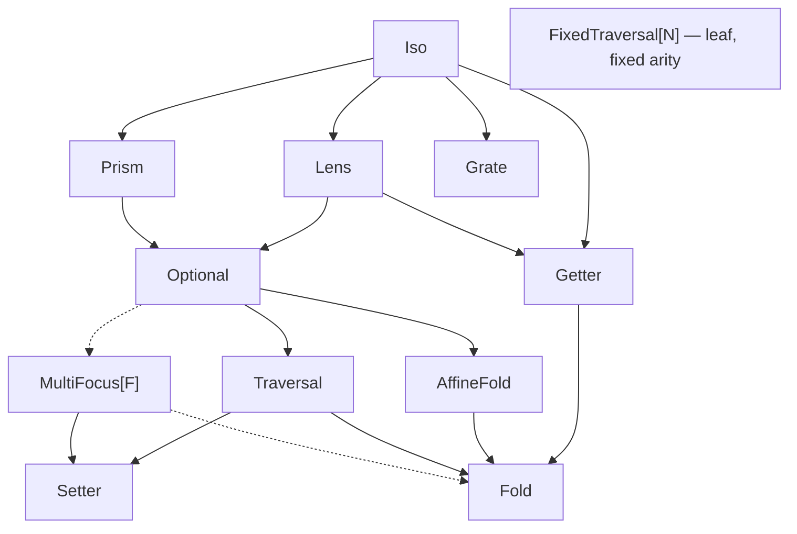

# Optics reference

One section per family, each with the shape, carrier, primary
use case, and a minimal runnable example. For the per-method
reference see the Scaladoc.

## Family taxonomy

Every family is a specialisation of the same `Optic[S, T, A, B, F]`
trait, differing only in the carrier `F[_, _]`. The diagram below is
a Hasse-style **composition lattice**: an edge `A → B` means *every
`A` is a `B`* (the carrier admits the conversion natively, often
with a fused `.andThen` overload). When you compose two optics, the
result family is their **join** — the lowest node both originals can
reach by following edges down. So `Iso.andThen(Lens)` lands on
`Lens`; `Lens.andThen(Prism)` lands on `Optional`;
`Optional.andThen(Traversal)` lands on `Traversal`; any read-only
chain lands on `Fold`. Click a node to jump to its section.



How to read the diagram in practice:

- **Same-family compose**: result stays in that family. `Lens ∘ Lens =
  Lens`, `Prism ∘ Prism = Prism`, `Iso ∘ Iso = Iso`.
- **Cross-family compose**: walk down from each input until they
  meet. `Lens ∘ Prism` walks Lens → Optional and Prism → Optional,
  meet at `Optional`. `Iso ∘ Setter` walks Iso → Lens → Optional →
  Traversal → Setter, meet at `Setter`.
- **Read-only families on the right branch absorb their read-write
  parents**. Composing into a Getter / AffineFold / Fold drops the
  write side; the result stays read-only.
- **Solid edges = native, fused, or `Composer`-resolved**. **Dotted
  edges = degraded conversion** that loses information (documented
  in the MultiFocus section).

The full 14×14 cell-by-cell composition matrix lives in
[`docs/research/2026-04-23-composition-gap-analysis.md`](https://github.com/Constructive-Programming/eo/blob/main/docs/research/2026-04-23-composition-gap-analysis.md);
that's the source of truth — the lattice above is the geometric view
of the same data.

The standalone `Review` family sits outside this tree — it
deliberately doesn't extend `Optic` (no read side to fit the
trait's `to` contract) and lives in its own section below.


```scala mdoc:silent
import dev.constructive.eo.optics.{Lens, Optic}
import dev.constructive.eo.optics.Optic.*
import dev.constructive.eo.data.Forgetful.given    // Accessor[Forgetful] — powers .get on Iso / Getter
import dev.constructive.eo.data.Forget.given       // ForgetfulFunctor / Fold / Traverse for Forget[F] carriers
```

Every page here shows optics constructed by hand. For the
macro-derived `lens[S](_.field)` / `prism[S, A]` flavour, see
[Generics](generics.md).

## Lens

A `Lens[S, A]` focuses a single, always-present field of a
product type. Carrier: `Tuple2`.

```scala mdoc:silent
case class Person(name: String, age: Int)
val ageL = Lens[Person, Int](_.age, (p, a) => p.copy(age = a))
```

```scala mdoc
val alice = Person("Alice", 30)
ageL.get(alice)
ageL.replace(31)(alice)
ageL.modify(_ + 1)(alice)
```

Composes via `.andThen` with other Lenses and — transparently,
with no extra syntax — with `Optional` / `Setter` / `Traversal`
optics too. The cross-carrier variant of `.andThen` summons a
`Composer[F, G]` or `Composer[G, F]` to bring both sides under
a common carrier.

## Grate

A `Grate[S, A]` is the dual of `Lens`: where a Lens decomposes a
product `S` into a focus `A` alongside a leftover, a Grate lifts a
source-reading function through a *distributive* / Naperian shape.
Classical shape `((S => A) => B) => T`; carrier: `Grate` (paired
encoding `(A, X => A)`).

Use this for fixed-shape homogeneous containers — tuple-of-Doubles,
finite-index function records — where every slot holds a value of the
same type. The canonical operation is "apply `A => B` uniformly to
every slot".

After the 2026-04-28 carrier consolidation (see
[`grate-fold-spike`](https://github.com/Constructive-Programming/eo/blob/main/docs/research/2026-04-28-grate-fold-spike.md)),
v1's `Grate` was absorbed into the unified `MultiFocus[F]` carrier as
`MultiFocus[Function1[X, *]]`. The same factories ship under new names
— `MultiFocus.tuple[T <: Tuple, A]` for homogeneous tuples,
`MultiFocus.representable[F: Representable, A]` for arbitrary distributive
containers (Function1-of-index, tuple-of-pair `(A, A)`, user-defined
Naperian shapes).

> Worked-example rewrites for this section are pending the
> post-consolidation docs sweep.

**When to reach for the representable MultiFocus vs Traversal.** Use
`Traversal.each` for container+downstream optic composition
(`lens.andThen(each).andThen(lens)`) — the standard map-over-elements
shape. Use the representable MultiFocus for fixed-shape homogeneous
records where the structure is known at compile time and the operation
is a uniform rewrite — tuples, function-shaped finite records, any
`cats.Representable` container.

**Composition.** `Iso.andThen(MultiFocus[Function1[X, *]])` works via
`Composer[Forgetful, MultiFocus[F]]` — Iso → representable-MultiFocus is
the inbound bridge that survived the consolidation.

**Lens → Grate does NOT compose automatically.** A Lens's source `S`
is not in general `Representable`, so there is no natural way to
broadcast a fresh focus through the Lens's structural leftover. A
user-written `iso.andThen(lens).andThen(grate)` fails with an
implicit-resolution miss for `Morph[Tuple2, Grate]`. The workaround is
to construct the Grate separately at the Lens's focus type and
compose through `Lens.andThen` (staying in `Tuple2`), then apply the
Grate directly.

**Composability — Grate widens to Setter.** A `Composer[Grate, SetterF]`
ships (`grate2setter`, `Grate.scala`), so any Grate can be morphed to
the `SetterF` carrier via `grate.morph[SetterF]`. The lifted Setter's
`.modify(f)` is byte-identical to the Grate's `.modify(f)` — same
broadcast invariant, just exposed through the carrier-erasing Setter
API. This makes Grate uniform with `eo-monocle`-style cross-library
interop and any code consuming the `Optic[…, SetterF]` shape. Like
every other `Composer[X, SetterF]`, this morph does NOT enable
`grate.andThen(setter)` directly — `SetterF` lacks an
`AssociativeFunctor` instance by design, so the cross-carrier value
lives at the morph site, not the chain site.

**Composition limits — Grate to Iso/Getter and Grate to
Traversal/Fold.** Both directions were investigated for v0.1.x; both
turn out to be structurally unsound under cats-eo's resolution rules:

- `Composer[Grate, Forgetful]` (Grate → Iso/Getter) would be type-level
  encodable, but cats-eo already ships the reverse
  (`Composer[Forgetful, Grate]`). Adding the forward direction would
  create a bidirectional Composer pair, which the [`Morph`](https://github.com/Constructive-Programming/eo/blob/main/core/src/main/scala/dev/constructive/eo/Morph.scala)
  resolution explicitly forbids — every `iso.andThen(grate)` call site
  would surface as ambiguous-implicit. Use `grate.to(s)._1` for the
  read, or `Getter(s => grate.to(s)._1)` when interop demands a Getter
  shape.
- `Composer[Grate, Forget[F]]` (Grate → Traversal/Fold) would have to
  produce `F[A]` from arbitrary `S`, but the Grate's existential `X`
  is unrelated to `F` and `S` is opaque. There is no carrier-shaped
  bridge; users wanting fold/traverse semantics on a Grate's slots
  should construct the `Forget[F]`-carrier optic directly.

The full structural rationale lives at the bottom of `Grate.scala` for
future maintainers.

## Prism

A `Prism[S, A]` focuses one branch of a sum type — `Some` over
`None`, or a specific case of an enum. Carrier: `Either`.

```scala mdoc:silent
import dev.constructive.eo.optics.Prism

enum Shape:
  case Circle(r: Double)
  case Square(s: Double)

val circleP = Prism[Shape, Shape.Circle](
  {
    case c: Shape.Circle => Right(c)
    case other           => Left(other)
  },
  identity,
)
```

```scala mdoc
circleP.to(Shape.Circle(1.0))
circleP.to(Shape.Square(2.0))

// modify acts only on the Circle branch; Squares pass through
// unchanged.
circleP.modify(c => Shape.Circle(c.r * 2))(Shape.Circle(1.0))
circleP.modify(c => Shape.Circle(c.r * 2))(Shape.Square(2.0))
```

For auto-derivation on enums / sealed traits / union types see
`prism[S, A]` in [Generics](generics.md).

## Iso

An `Iso[S, A]` is a bijection — every `S` round-trips to exactly
one `A` and back. Carrier: `Forgetful` (the identity carrier).

```scala mdoc:silent
import dev.constructive.eo.optics.Iso

case class PersonPair(age: Int, name: String)
val pairIso = Iso[(Int, String), (Int, String), PersonPair, PersonPair](
  t => PersonPair(t._1, t._2),
  p => (p.age, p.name),
)
```

```scala mdoc
pairIso.get((30, "Alice"))
pairIso.reverseGet(PersonPair(30, "Alice"))
```

## Optional

An `Optional[S, A]` focuses a conditionally-present field —
an `Option[A]` field, a predicate-gated access, a
refinement-style narrowing. Carrier: `Affine`.

```scala mdoc:silent
import dev.constructive.eo.data.Affine
import dev.constructive.eo.optics.Optional

case class Contact(flag: Option[String])

val presentFlag = Optional[Contact, Contact, String, String, Affine](
  getOrModify = c => c.flag.toRight(c),
  reverseGet  = { case (c, s) => c.copy(flag = Some(s)) },
)
```

```scala mdoc
presentFlag.modify(_.toUpperCase)(Contact(Some("hello")))
presentFlag.modify(_.toUpperCase)(Contact(None))
```

Composition with a Lens is automatic: `lens.andThen(optional)`
summons `Composer[Tuple2, Affine]` under the hood and morphs
the Lens into the Affine carrier. No explicit `.morph` required
on your end.

### Read-only construction

See [AffineFold](#affinefold) below. `Optional.readOnly` and
`Optional.selectReadOnly` are aliases that delegate to
`AffineFold.apply` / `AffineFold.select` — kept for users coming
from the "read-only Optional" mental model.

## AffineFold

An `AffineFold[S, A]` is the read-only 0-or-1 focus shape: a
partial projection with no write-back path. Type alias for
`Optic[S, Unit, A, A, Affine]` — the `T = Unit` slot statically
rules out `.modify` / `.replace`, so the only operations are
`.getOption`, `.foldMap`, and `.modifyA` (effectful read).

Use this when the source has no natural write-back
(`headOption` on a List, predicate-gated filters), or as an
API-boundary declaration that callers cannot write through the
returned optic.

```scala mdoc:silent
import dev.constructive.eo.optics.AffineFold

case class Adult(age: Int)
val adultAge: AffineFold[Adult, Int] =
  AffineFold(p => Option.when(p.age >= 18)(p.age))
```

```scala mdoc
adultAge.getOption(Adult(20))
adultAge.getOption(Adult(15))
```

`AffineFold.select(p)` is the filtering variant:

```scala mdoc:silent
val evenAF = AffineFold.select[Int](_ % 2 == 0)
```

```scala mdoc
evenAF.getOption(4)
evenAF.getOption(3)
```

Narrow an existing `Optional` or `Prism` to its read-only
projection via `AffineFold.fromOptional` / `AffineFold.fromPrism` —
both return an `AffineFold[S, A]` that holds the matcher but
discards the write / build path.

**Composition note.** Direct `lens.andThen(af)` on an
`AffineFold` does not type-check: the outer `B` slot doesn't
align with the inner `T = Unit`. Build a full composed
`Optional` through the Lens chain and narrow the result with
`AffineFold.fromOptional`.

**Specialisation.** `AffineFold.apply` picks `X = (Unit, Unit)`
rather than the `(Unit, S)` shape a full Optional would use:
the Hit branch never needs to store the source `S`, since
`from` throws its input away. Saves one reference slot per
`Affine.Hit` allocation on every read.

## Setter

A `Setter[S, A]` can modify but not read — a write-only focus
for cases where the focus value isn't observable to the caller.
Carrier: `SetterF`.

```scala mdoc:silent
import dev.constructive.eo.optics.Setter

case class SetterConfig(values: Map[String, Int])
val bumpAll = Setter[SetterConfig, SetterConfig, Int, Int] { f => cfg =>
  cfg.copy(values = cfg.values.view.mapValues(f).toMap)
}
```

```scala mdoc
bumpAll.modify(_ + 1)(SetterConfig(Map("a" -> 1, "b" -> 2)))
```

**Setter is a composition terminal.** `lens.andThen(setter)` works —
a Lens to a focus, then a Setter that writes into it. The reverse
chain, `setter.andThen(inner)`, does *not* work: there's no
`AssociativeFunctor[SetterF, _, _]` shipped, and no `Composer[SetterF,
_]`. That's intentional — SetterF's shape `(Fst[X], Snd[X] => A)`
doesn't carry a read side, so "compose another optic on top of a
write-only endpoint" doesn't have a natural semantics. If you want
`setter.andThen(…)`, restructure the chain so the Setter is the
inner — build `lens/prism/traversal.andThen(setter)` and call
`.modify` on the result.

## Getter

A `Getter[S, A]` is the read-only counterpart to `Setter` — a
pure projection. Carrier: `Forgetful` with `T = Unit`.

```scala mdoc:silent
import dev.constructive.eo.optics.Getter

val nameLen = Getter[Person, Int](_.name.length)
```

```scala mdoc
nameLen.get(Person("Alice", 30))
```

Getter → Getter doesn't compose via `Optic.andThen` today
(Getter's `T = Unit` mismatches the outer `B` slot). For a
deeper read, compose a Lens chain and call `.get` on the
composed lens.

## Fold

A `Fold[F, A]` summarises every element of a `Foldable[F]` via
`Monoid[M]`. Carrier: `Forget[F]`.

```scala mdoc:silent
import cats.instances.list.given
import dev.constructive.eo.optics.Fold

val listFold = Fold[List, Int]
```

```scala mdoc
listFold.foldMap(identity[Int])(List(1, 2, 3))
listFold.foldMap((i: Int) => i * i)(List(1, 2, 3))
```

`Fold.select(p)` narrows to elements matching a predicate:

```scala mdoc:silent
val positive = Fold.select[Int](_ > 0)
```

```scala mdoc
positive.foldMap(identity[Int])(3)
positive.foldMap(identity[Int])(-3)
```

## Review

A `Review[S, A]` is the reverse-only counterpart to `Getter` —
it wraps an `A => S` build function. Unlike the other families,
`Review` does **not** extend `Optic` (the Optic trait requires
an observing `to` that a pure review has none of); it's a
standalone type with its own composition.

```scala mdoc:silent
import dev.constructive.eo.optics.Review

val someIntR = Review[Option[Int], Int](Some(_))
```

```scala mdoc
someIntR.reverseGet(42)
```

Compose by composing the underlying `A => S` functions directly:

```scala mdoc:silent
val lengthR = Review[Int, String](_.length)
val someLen = Review[Option[Int], String](
  s => someIntR.reverseGet(lengthR.reverseGet(s))
)
```

```scala mdoc
someLen.reverseGet("hello")
```

Two factory methods pull the natural build direction out of an
Iso or a Prism — aliased as `ReversedLens` and `ReversedPrism`
for users who expect to find those names next to the rest of
the optics reference:

```scala mdoc:silent
import dev.constructive.eo.optics.{BijectionIso, MendTearPrism, ReversedLens, ReversedPrism}

val doubleIso =
  BijectionIso[Int, Int, Int, Int](_ * 2, _ / 2)
val revIso = ReversedLens(doubleIso)

val somePrism = new MendTearPrism[Option[Int], Option[Int], Int, Int](
  tear = {
    case Some(n) => Right(n)
    case other   => Left(other)
  },
  mend = Some(_),
)
val revPrism = ReversedPrism(somePrism)
```

```scala mdoc
revIso.reverseGet(5)
revPrism.reverseGet(7)
```

**`ReversedLens` only accepts a bijective Lens** (an
`BijectionIso`). A general Lens doesn't carry enough
information to reconstruct its source from the focus alone —
for that, construct a `Review` directly with your own
`A => S`.

## Traversal

A `Traversal` is the multi-focus modify optic — map over every
element of a container. Single carrier:

* `Traversal.each[F, A]` / `Traversal.pEach[F, A, B]` — carrier
  `MultiFocus[PSVec]`. Supports `.modify` / `.replace`
  (`Functor[PSVec]`), `.foldMap` (`Foldable[PSVec]`),
  `.modifyA` / `.all` (`Traverse[PSVec]`), and `.andThen` with
  downstream optics through the shared `MultiFocus[PSVec]`
  `AssociativeFunctor`. Linear scaling; overhead over a naive
  `copy`/`map` runs at 2-3× for dense chains
  (`Lens → Traversal → Lens`) and ~5× for the Prism miss-branch
  shape, amortising toward the lower end as the traversed-
  collection size grows (the
  [PowerSeries benchmarks](benchmarks.md#powerseries-traversal-with-downstream-composition)
  sweep sizes 4 / 32 / 256 / 1024). Internal machinery is the
  `PSSingleton` protocol — morphed Lens / Prism / Optional
  inners collect into pre-sized flat arrays without per-element
  `PowerSeries` wrappers, and the always-hit refinement for
  Lens morphs skips the length-tracking array entirely.

```scala mdoc:silent
import dev.constructive.eo.optics.Traversal
import dev.constructive.eo.data.MultiFocus.given  // Functor / Foldable / Traverse for MultiFocus[PSVec]

val listEach = Traversal.pEach[List, Int, Int]
```

```scala mdoc
listEach.modify(_ + 1)(List(1, 2, 3))
listEach.foldMap(identity[Int])(List(1, 2, 3))   // sum
```

`each` shines when the chain continues past the traversal — e.g.
"for every phone, toggle `isMobile`":

```scala mdoc:silent
case class Phone(isMobile: Boolean, number: String)
case class Owner(phones: List[Phone])

val ownerAllPhonesMobile =
  Lens[Owner, List[Phone]](_.phones, (o, ps) => o.copy(phones = ps))
    .andThen(Traversal.each[List, Phone])
    .andThen(Lens[Phone, Boolean](_.isMobile, (p, m) => p.copy(isMobile = m)))
```

```scala mdoc
ownerAllPhonesMobile.modify(!_)(Owner(List(
  Phone(isMobile = false, "555-0001"),
  Phone(isMobile = true,  "555-0002"),
)))
```

See [the PowerSeries benchmark
notes](https://github.com/Constructive-Programming/eo/blob/main/benchmarks/README.md#interpreting-powerseries-numbers)
for the cost tradeoff.

### Composer: `Iso` as the inner of `Traversal.each`

`Traversal.each[T, A].andThen(iso)` composes cleanly. The direct
`Composer[Forgetful, PowerSeries]` given ships in `dev.constructive.eo.data.PowerSeries`
and takes priority over any transitive path (`Forgetful → Tuple2 →
PowerSeries` or `Forgetful → Either → PowerSeries`) that would
otherwise be ambiguous.

Same story for `Iso` as the inner of an `Optional` (Affine carrier) or
of a `MultiFocus[F]` — direct `Composer[Forgetful, Affine]` /
`Composer[Forgetful, MultiFocus[F]]` givens ship beside the carrier.
Earlier revisions of cats-eo required an explicit `.morph[Tuple2]`
step for these chains; post-Unit 16 it's a one-hop `.andThen` call
with no ceremony.

## MultiFocus

A `MultiFocus[F][S, A]` focuses many candidate values at once — a
focus with **classifier cardinality `F`**, where `F[_]` controls
how the focus collection is shaped. Carrier `MultiFocus[F]`, value
shape `(X, F[A])`.

`MultiFocus[F]` is the **unified** successor of two earlier
families: `AlgLens[F]` (algebraic lens, structural-leftover paired
with a classifier vector) and `Kaleidoscope` (path-dependent-`F`
aggregation optic over Chris Penner's
[*Kaleidoscopes: lenses that never die*](https://chrispenner.ca/posts/kaleidoscopes)).
Both pre-unification families had the same `(X, F[A])` value shape
and only differed in their encoding choices (parameter-vs-path-type
for `F`, and whether the `Functor[F]` source was cats or a
project-local `Reflector`). Pre-0.1.0 the two collapsed into a
single carrier with `F` as a plain type parameter; the merged
surface keeps every shipped semantic and exposes them through one
consistent vocabulary.

Use `MultiFocus[F]` when the update function genuinely needs the
whole `F[A]` visible — adaptive-k KNN, one-vs-rest rule matching,
classifier output that varies per input, ZipList-shaped column-zip
aggregation, Const-shaped monoidal summation. **Do NOT** reach for
`MultiFocus.fromLensF` as a general replacement for
`Traversal.each`: a head-to-head bench
([`MultiFocusBench`](https://github.com/Constructive-Programming/eo/blob/main/benchmarks/src/main/scala/eo/bench/MultiFocusBench.scala))
shows `MultiFocus[List]` running 1.5–2.6× slower than `PowerSeries`
on the traversal-shape common case. The tradeoff analysis lives in
[`docs/research/2026-04-22-alglens-vs-powerseries.md`](https://github.com/Constructive-Programming/eo/blob/main/docs/research/2026-04-22-alglens-vs-powerseries.md).

### Constructors

Two construction roads — pick by what you have.

**Generic factory** for a `MultiFocus[F][F[A], A]` whose source IS
the `F[A]` itself (`X = F[A]`, rebuild = identity):

```scala mdoc:silent
import cats.data.ZipList
import dev.constructive.eo.data.MultiFocus
import dev.constructive.eo.data.MultiFocus.given
import dev.constructive.eo.data.MultiFocus.{collectList, collectMap}

val zipMF = MultiFocus.apply[ZipList, Double]
val listMF = MultiFocus.apply[List, Int]
```

**Cross-carrier factories** lift an existing optic whose focus is
already `F[A]` into a MultiFocus that exposes the inner `A`:

- `MultiFocus.fromLensF[F, S, A]` — a Lens whose focus is `F[A]`
  (e.g. `Lens[Person, List[Phone]]`).
- `MultiFocus.fromPrismF[F, S, A]` — a Prism whose hit branch
  carries `F[A]` (`Prism[Json, List[Int]]`); needs `MonoidK[F]` for
  the miss-branch zero.
- `MultiFocus.fromOptionalF[F, S, A]` — the Optional analogue.

### Operations

`.modify` / `.replace` (any `Functor[F]`), `.foldMap` (any
`Foldable[F]`), `.modifyA` / `.all` (any `Traverse[F]`), and same-
carrier `.andThen` (any `Traverse[F] + MultiFocusFromList[F]`) all
work by inheritance — the standard ladder of optic capabilities
matches the cats hierarchy on `F`.

The Kaleidoscope-style aggregation universal ships as **two
extension methods**, one carrier-wide and one List-specific:

- `o.collectMap[B](agg: F[A] => B)` — Functor-broadcast. Reduces
  the entire `F[A]` focus to a single `B` and broadcasts it back
  through `Functor[F].map(_ => b)`. Length-preserving for `ZipList`
  and `Const`; for `List` it produces a list of the same length
  populated entirely with the aggregate.
- `o.collectList(agg: List[A] => B)` — `MultiFocus[List]`-only
  variant that produces the cartesian / singleton output `List(agg(fa))`
  regardless of the input length. Reproduces the v1 `Reflector[List]`
  semantics at the call site without needing a typeclass.

```scala mdoc
// Column-wise mean: aggregator sees the whole ZipList, returns the
// mean, the broadcast fills back across the same length.
zipMF.collectMap[Double](zl => zl.value.sum / zl.value.size.toDouble)(
  ZipList(List(1.0, 2.0, 3.0, 4.0))
)

// `.modify` still works — element-wise via Functor[ZipList].
zipMF.modify(_ * 10.0)(ZipList(List(1.0, 2.0, 3.0))).value

// List + collectList: cartesian-singleton (length collapses to 1).
listMF.collectList(_.sum)(List(1, 2, 3, 4))

// List + collectMap: length-preserving (broadcast).
listMF.collectMap[Int](_.sum)(List(1, 2, 3, 4))
```

**Why two `collect` variants and not one law.** The v1 `Reflector[F]`
typeclass baked a single `reflect` op that collapsed differently
per F (cartesian-singleton on List, length-preserving on ZipList,
phantom retag on Const). Under the cats hierarchy, neither
`Functor.map` nor `Applicative.pure` covers all three behaviours
uniformly — picking one as the carrier-level law would have
silently changed the v1 List semantics. The chosen split (Functor-
broadcast as the law, List-cartesian as the call-site extension) is
honest about the choice without cluttering the discipline surface.

### When to reach for MultiFocus vs Grate vs Traversal

Use `Traversal.each` for container-walking Applicative effects
(positions independent, Applicative applied element-by-element).
Use `Grate` for fixed-shape homogeneous records where `F` is
`Representable` (tuples, function-shaped finite records). Reach
for `MultiFocus[F]` when:

- you need the **whole `F[A]` collection visible** at the update
  site (classifier candidates, adaptive-k matching), OR
- the `Functor[F]` semantics determines the **aggregation
  structure** itself — ZipList-shaped column zip, List-shaped
  cartesian via `collectList`, Const-shaped monoidal summation.

The optic is the same value at every call site; the behaviour
tracks the `F[_]` you plug in.

### Composition

**Composition INTO `MultiFocus[F]`** from `Lens` / `Prism` /
`Optional` works through the shipped `Composer` bridges
(`tuple2multifocus`, `either2multifocus`, `affine2multifocus`,
`forget2multifocus`, `forgetful2multifocus`). The lifted optic's
`ForgetfulFunctor` / `ForgetfulFold` / `ForgetfulTraverse` /
`AssociativeFunctor` instances plug straight into `.modify` /
`.foldMap` / `.modifyA`.

**`Iso.andThen(MultiFocus[F])`** works via `forgetful2multifocus`:

```scala mdoc:silent
import dev.constructive.eo.optics.Iso
import dev.constructive.eo.optics.Optic.*

val singletonIso = Iso[Int, Int, List[Int], List[Int]](
  i => List(i),
  _.head,
)

val isoThenList = singletonIso.andThen(listMF)
```

```scala mdoc
// Wraps the Int into List(i), runs the MultiFocus's modify on every
// element, projects back via List.head.
isoThenList.modify(_ * 3)(7)
```

**Lens → MultiFocus does NOT compose automatically.** A plain Lens's
source `S` has no natural way to produce an `F[A]` (the same
structural restriction Grate hits with `Representable`). A user-
written `iso.andThen(lens).andThen(multifocus)` fails resolution.
Workaround: build the `MultiFocus` directly from the Lens's focus
type via `MultiFocus.fromLensF` and chain through `Lens.andThen`.

**`MultiFocus[F]` widens to `Setter`** via `multifocus2setter` —
any MultiFocus optic can be morphed to `SetterF` via
`multiFocus.morph[SetterF]`. The lifted setter's `.modify(f)` is
byte-identical to the original MultiFocus's `.modify(f)`. Like
every other `Composer[X, SetterF]`, this does NOT enable
`multiFocus.andThen(setter)` directly — SetterF lacks
`AssociativeFunctor` by design.

### Composition limits

**MultiFocus is otherwise a composition sink.** Every other
`Composer[MultiFocus[F], _]` is intentionally absent:

- `Composer[MultiFocus[F], Forgetful]` (MultiFocus → Iso/Getter) —
  type-level encodable, but `forgetful2multifocus` already ships
  the reverse direction. Adding the forward edge would create a
  bidirectional Composer pair, which the [`Morph`](https://github.com/Constructive-Programming/eo/blob/main/core/src/main/scala/dev/constructive/eo/Morph.scala)
  resolution explicitly forbids. Use `multiFocus.to(s)._2` for the
  read side.
- `Composer[MultiFocus[F], Forget[G]]` (MultiFocus → Traversal /
  Fold) — would force the morphed `to` to produce `G[A]` from
  arbitrary `S`. The carrier-shaped bridge has no place to thread
  a `Foldable[F]` instance even when one happens to coincide with
  the optic's `Functor[F]`. Users wanting fold/traverse semantics
  on a MultiFocus's slots should construct the `Forget[F]`-carrier
  optic directly.

`Composer[MultiFocus[F], _]` (other than to `SetterF`) is out of
scope for 0.1.0 and the roadmap through at least 0.2.x. The
outbound-bridge story needs a concrete use case first — the
composition-gap analysis
([`2026-04-23-composition-gap-analysis.md`](https://github.com/Constructive-Programming/eo/blob/main/docs/research/2026-04-23-composition-gap-analysis.md))
flags it as a top-5 structural gap, but no user has asked for it.

The full structural rationale lives at the bottom of
`MultiFocus.scala` for future maintainers.

## Composition limits

Beyond the MultiFocus-outbound sink documented above, three categories
of pair are intentionally **not** bridged in 0.1.0. The short answer
is "the type system rules them out, and the natural workaround is a
plain Scala expression":

**Lens / Prism / Optional × `Fold[F]` when the outer focuses on a
scalar `A`** — the outer never produces an `F`-shape, so there's
nothing for the `Fold` to traverse. Use `fold.foldMap(f)(lens.get(s))`
directly. If your outer *does* focus on an `F[A]` (e.g.
`Lens[Row, List[Int]]`), use one of the `MultiFocus.fromLensF` /
`fromPrismF` / `fromOptionalF` factories to lift into `MultiFocus[F]`
and chain there.

**`Traversal.each` × `Fold[F]` / `MultiFocus[F]`** — `MultiFocus[PSVec]`
(the `Traversal.each` carrier) cannot widen into Forget's classifier
representation without dropping its rebuild data, and cannot widen
into another `MultiFocus[G]`'s per-candidate cardinality model without
a synthetic count. The idiomatic workaround pushes the inner under
the traversal: `traversal.modify(a => inner.replace(b)(a))(s)` for a
`MultiFocus` inner; `traversal.foldMap(f)(s)` (read-only escape on
any `MultiFocus[F]`-carrier optic) when you only need the fold side.

**`SetterF` outbound** — Setter is a composition terminal: ship it as
the leaf of a chain (Lens → Setter via `Composer[Tuple2, SetterF]`)
but don't try to chain off it. There is no `AssociativeFunctor[SetterF]`
and no outbound Composer.

**`FixedTraversal[N]`** — fixed-arity (`Traversal.two` / `.three` /
`.four`) is a leaf carrier with no outbound or inbound Composer. Use
it when you need the exact-N shape; reach for `Traversal.each` when
you want compositional reach.

The full taxonomy with cell-by-cell rationale lives in
[`docs/research/2026-04-23-composition-gap-analysis.md`](https://github.com/Constructive-Programming/eo/blob/main/docs/research/2026-04-23-composition-gap-analysis.md).
