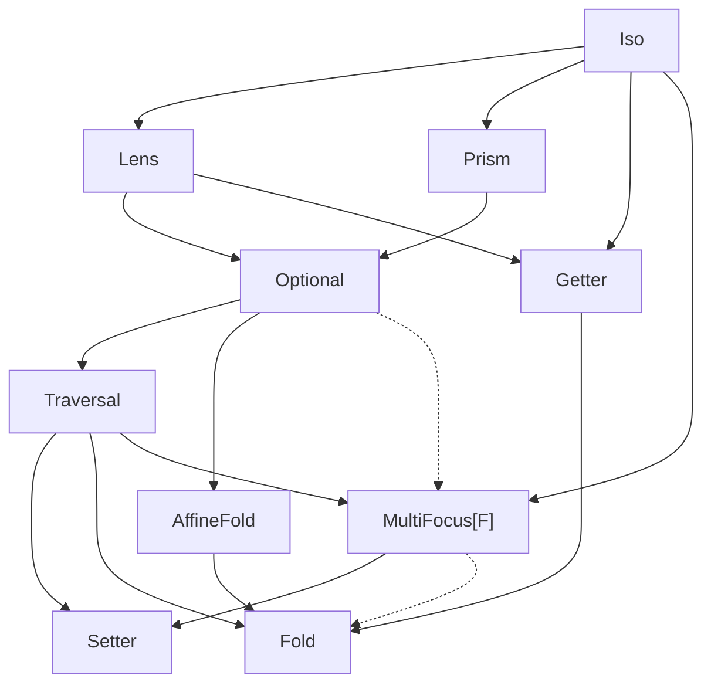

# Optics reference

One section per family, each with the shape, carrier, primary
use case, and a minimal runnable example. For the per-method
reference see the Scaladoc.

## Family taxonomy

Every family is a specialisation of the same `Optic[S, T, A, B, F]`
trait, differing only in the carrier `F[_, _]`. The diagram below is
a Hasse-style **composition lattice**: an edge `A → B` means *every
`A` is a `B`* (the carrier admits the conversion natively, often
with a fused `.andThen` overload). When you compose two optics, the
result family is their **join** — the lowest node both originals can
reach by following edges down. So `Iso.andThen(Lens)` lands on
`Lens`; `Lens.andThen(Prism)` lands on `Optional`;
`Optional.andThen(Traversal)` lands on `Traversal`; any read-only
chain lands on `Fold`. Click a node to jump to its section.



How to read the diagram in practice:

- **Same-family compose**: result stays in that family. `Lens ∘ Lens =
  Lens`, `Prism ∘ Prism = Prism`, `Iso ∘ Iso = Iso`.
- **Cross-family compose**: walk down from each input until they
  meet. `Lens ∘ Prism` walks Lens → Optional and Prism → Optional,
  meet at `Optional`. `Iso ∘ Setter` walks Iso → Lens → Optional →
  Traversal → Setter, meet at `Setter`.
- **Read-only families on the right branch absorb their read-write
  parents**. Composing into a Getter / AffineFold / Fold drops the
  write side; the result stays read-only.
- **Solid edges = native, fused, or `Composer`-resolved**. **Dotted
  edges = degraded conversion** that loses information (documented
  in the MultiFocus section).

The full cell-by-cell composition matrix lives in
[`docs/research/2026-04-23-composition-gap-analysis.md`](https://github.com/Constructive-Programming/eo/blob/main/docs/research/2026-04-23-composition-gap-analysis.md);
that's the source of truth — the lattice above is the geometric view
of the same data. Post-fold the matrix is 12×12 with 17 U cells
(down from 145 U cells across the 14×14 pre-fold matrix).

The standalone `Review` family sits outside this tree — it
deliberately doesn't extend `Optic` (no read side to fit the
trait's `to` contract) and lives in its own section below.


```scala mdoc:silent
import dev.constructive.eo.optics.{Lens, Optic}
import dev.constructive.eo.optics.Optic.*
import dev.constructive.eo.data.Forgetful.given    // Accessor[Forgetful] — powers .get on Iso / Getter
import dev.constructive.eo.data.Forget.given       // ForgetfulFunctor / Fold / Traverse for Forget[F] carriers
```

Every page here shows optics constructed by hand. For the
macro-derived `lens[S](_.field)` / `prism[S, A]` flavour, see
[Generics](generics.md).

## Lens

A `Lens[S, A]` focuses a single, always-present field of a
product type. Carrier: `Tuple2`.

```scala mdoc:silent
case class Person(name: String, age: Int)
val ageL = Lens[Person, Int](_.age, (p, a) => p.copy(age = a))
```

```scala mdoc
val alice = Person("Alice", 30)
ageL.get(alice)
ageL.replace(31)(alice)
ageL.modify(_ + 1)(alice)
```

Composes via `.andThen` with other Lenses and — transparently,
with no extra syntax — with `Optional` / `Setter` / `Traversal`
optics too. The cross-carrier variant of `.andThen` summons a
`Composer[F, G]` or `Composer[G, F]` to bring both sides under
a common carrier.

## Grate

The v1 `Grate` carrier (paired encoding `(A, X => A)`, classical
shape `((S => A) => B) => T` for distributive / Naperian rebuilds)
was absorbed into the unified `MultiFocus[F]` carrier pre-0.1.0
as `MultiFocus[Function1[X0, *]]`. The Grate-shaped factories ship
as `MultiFocus.tuple[T <: Tuple, A]` (homogeneous-tuple uniform
rewrite), `MultiFocus.representable[F: Representable, A]`
(arbitrary Naperian rebuild), and `MultiFocus.representableAt`
(representative-index variant).

See the [MultiFocus reference](multifocus.md) for the unified
treatment and [Cookbook → Recipe A](cookbook.md)
for a worked example of the absorbed Grate-shape.

## Prism

A `Prism[S, A]` focuses one branch of a sum type — `Some` over
`None`, or a specific case of an enum. Carrier: `Either`.

```scala mdoc:silent
import dev.constructive.eo.optics.Prism

enum Shape:
  case Circle(r: Double)
  case Square(s: Double)

val circleP = Prism[Shape, Shape.Circle](
  {
    case c: Shape.Circle => Right(c)
    case other           => Left(other)
  },
  identity,
)
```

```scala mdoc
circleP.to(Shape.Circle(1.0))
circleP.to(Shape.Square(2.0))

// modify acts only on the Circle branch; Squares pass through
// unchanged.
circleP.modify(c => Shape.Circle(c.r * 2))(Shape.Circle(1.0))
circleP.modify(c => Shape.Circle(c.r * 2))(Shape.Square(2.0))
```

For auto-derivation on enums / sealed traits / union types see
`prism[S, A]` in [Generics](generics.md).

## Iso

An `Iso[S, A]` is a bijection — every `S` round-trips to exactly
one `A` and back. Carrier: `Forgetful` (the identity carrier).

```scala mdoc:silent
import dev.constructive.eo.optics.Iso

case class PersonPair(age: Int, name: String)
val pairIso = Iso[(Int, String), (Int, String), PersonPair, PersonPair](
  t => PersonPair(t._1, t._2),
  p => (p.age, p.name),
)
```

```scala mdoc
pairIso.get((30, "Alice"))
pairIso.reverseGet(PersonPair(30, "Alice"))
```

## Optional

An `Optional[S, A]` focuses a conditionally-present field —
an `Option[A]` field, a predicate-gated access, a
refinement-style narrowing. Carrier: `Affine`.

```scala mdoc:silent
import dev.constructive.eo.data.Affine
import dev.constructive.eo.optics.Optional

case class Contact(flag: Option[String])

val presentFlag = Optional[Contact, Contact, String, String, Affine](
  getOrModify = c => c.flag.toRight(c),
  reverseGet  = { case (c, s) => c.copy(flag = Some(s)) },
)
```

```scala mdoc
presentFlag.modify(_.toUpperCase)(Contact(Some("hello")))
presentFlag.modify(_.toUpperCase)(Contact(None))
```

Composition with a Lens is automatic: `lens.andThen(optional)`
summons `Composer[Tuple2, Affine]` under the hood and morphs
the Lens into the Affine carrier. No explicit `.morph` required
on your end.

### Read-only construction

See [AffineFold](#affinefold) below. `Optional.readOnly` and
`Optional.selectReadOnly` are aliases that delegate to
`AffineFold.apply` / `AffineFold.select` — kept for users coming
from the "read-only Optional" mental model.

## AffineFold

An `AffineFold[S, A]` is the read-only 0-or-1 focus shape: a
partial projection with no write-back path. Type alias for
`Optic[S, Unit, A, A, Affine]` — the `T = Unit` slot statically
rules out `.modify` / `.replace`, so the only operations are
`.getOption`, `.foldMap`, and `.modifyA` (effectful read).

Use this when the source has no natural write-back
(`headOption` on a List, predicate-gated filters), or as an
API-boundary declaration that callers cannot write through the
returned optic.

```scala mdoc:silent
import dev.constructive.eo.optics.AffineFold

case class Adult(age: Int)
val adultAge: AffineFold[Adult, Int] =
  AffineFold(p => Option.when(p.age >= 18)(p.age))
```

```scala mdoc
adultAge.getOption(Adult(20))
adultAge.getOption(Adult(15))
```

`AffineFold.select(p)` is the filtering variant:

```scala mdoc:silent
val evenAF = AffineFold.select[Int](_ % 2 == 0)
```

```scala mdoc
evenAF.getOption(4)
evenAF.getOption(3)
```

Narrow an existing `Optional` or `Prism` to its read-only
projection via `AffineFold.fromOptional` / `AffineFold.fromPrism` —
both return an `AffineFold[S, A]` that holds the matcher but
discards the write / build path.

**Composition note.** Direct `lens.andThen(af)` on an
`AffineFold` does not type-check: the outer `B` slot doesn't
align with the inner `T = Unit`. Build a full composed
`Optional` through the Lens chain and narrow the result with
`AffineFold.fromOptional`.

**Specialisation.** `AffineFold.apply` picks `X = (Unit, Unit)`
rather than the `(Unit, S)` shape a full Optional would use:
the Hit branch never needs to store the source `S`, since
`from` throws its input away. Saves one reference slot per
`Affine.Hit` allocation on every read.

## Setter

A `Setter[S, A]` can modify but not read — a write-only focus
for cases where the focus value isn't observable to the caller.
Carrier: `SetterF`.

```scala mdoc:silent
import dev.constructive.eo.optics.Setter

case class SetterConfig(values: Map[String, Int])
val bumpAll = Setter[SetterConfig, SetterConfig, Int, Int] { f => cfg =>
  cfg.copy(values = cfg.values.view.mapValues(f).toMap)
}
```

```scala mdoc
bumpAll.modify(_ + 1)(SetterConfig(Map("a" -> 1, "b" -> 2)))
```

**Setter is a composition terminal.** `lens.andThen(setter)` works —
a Lens to a focus, then a Setter that writes into it. The reverse
chain, `setter.andThen(inner)`, does *not* work: there's no
`AssociativeFunctor[SetterF, _, _]` shipped, and no `Composer[SetterF,
_]`. That's intentional — SetterF's shape `(Fst[X], Snd[X] => A)`
doesn't carry a read side, so "compose another optic on top of a
write-only endpoint" doesn't have a natural semantics. If you want
`setter.andThen(…)`, restructure the chain so the Setter is the
inner — build `lens/prism/traversal.andThen(setter)` and call
`.modify` on the result.

## Getter

A `Getter[S, A]` is the read-only counterpart to `Setter` — a
pure projection. Carrier: `Forgetful` with `T = Unit`.

```scala mdoc:silent
import dev.constructive.eo.optics.Getter

val nameLen = Getter[Person, Int](_.name.length)
```

```scala mdoc
nameLen.get(Person("Alice", 30))
```

Getter → Getter doesn't compose via `Optic.andThen` today
(Getter's `T = Unit` mismatches the outer `B` slot). For a
deeper read, compose a Lens chain and call `.get` on the
composed lens.

## Fold

A `Fold[F, A]` summarises every element of a `Foldable[F]` via
`Monoid[M]`. Carrier: `Forget[F]`.

```scala mdoc:silent
import cats.instances.list.given
import dev.constructive.eo.optics.Fold

val listFold = Fold[List, Int]
```

```scala mdoc
listFold.foldMap(identity[Int])(List(1, 2, 3))
listFold.foldMap((i: Int) => i * i)(List(1, 2, 3))
```

`Fold.select(p)` narrows to elements matching a predicate:

```scala mdoc:silent
val positive = Fold.select[Int](_ > 0)
```

```scala mdoc
positive.foldMap(identity[Int])(3)
positive.foldMap(identity[Int])(-3)
```

## Review

A `Review[S, A]` is the reverse-only counterpart to `Getter` —
it wraps an `A => S` build function. Unlike the other families,
`Review` does **not** extend `Optic` (the Optic trait requires
an observing `to` that a pure review has none of); it's a
standalone type with its own composition.

```scala mdoc:silent
import dev.constructive.eo.optics.Review

val someIntR = Review[Option[Int], Int](Some(_))
```

```scala mdoc
someIntR.reverseGet(42)
```

Compose by composing the underlying `A => S` functions directly:

```scala mdoc:silent
val lengthR = Review[Int, String](_.length)
val someLen = Review[Option[Int], String](
  s => someIntR.reverseGet(lengthR.reverseGet(s))
)
```

```scala mdoc
someLen.reverseGet("hello")
```

Two factory methods pull the natural build direction out of an
Iso or a Prism — aliased as `ReversedLens` and `ReversedPrism`
for users who expect to find those names next to the rest of
the optics reference:

```scala mdoc:silent
import dev.constructive.eo.optics.{BijectionIso, MendTearPrism, ReversedLens, ReversedPrism}

val doubleIso =
  BijectionIso[Int, Int, Int, Int](_ * 2, _ / 2)
val revIso = ReversedLens(doubleIso)

val somePrism = new MendTearPrism[Option[Int], Option[Int], Int, Int](
  tear = {
    case Some(n) => Right(n)
    case other   => Left(other)
  },
  mend = Some(_),
)
val revPrism = ReversedPrism(somePrism)
```

```scala mdoc
revIso.reverseGet(5)
revPrism.reverseGet(7)
```

**`ReversedLens` only accepts a bijective Lens** (an
`BijectionIso`). A general Lens doesn't carry enough
information to reconstruct its source from the focus alone —
for that, construct a `Review` directly with your own
`A => S`.

## Traversal

A `Traversal` is the multi-focus modify optic — map over every
element of a container. Single carrier:

* `Traversal.each[F, A]` / `Traversal.pEach[F, A, B]` — carrier
  `MultiFocus[PSVec]`. Supports `.modify` / `.replace`
  (`Functor[PSVec]`), `.foldMap` (`Foldable[PSVec]`),
  `.modifyA` / `.all` (`Traverse[PSVec]`), and `.andThen` with
  downstream optics through the shared `MultiFocus[PSVec]`
  `AssociativeFunctor` (`mfAssocPSVec`). Linear scaling; overhead
  over a naive `copy`/`map` runs at 2-3× for dense chains
  (`Lens → Traversal → Lens`) and ~5× for the Prism miss-branch
  shape, amortising toward the lower end as the traversed-
  collection size grows (the
  [benchmarks](benchmarks.md#powerseries-traversal-with-downstream-composition)
  sweep sizes 4 / 32 / 256 / 1024). Internal machinery: the
  `MultiFocusSingleton` (AlwaysHit, for morphed Lenses) and
  `MultiFocusPSMaybeHit` (MaybeHit, for morphed Prisms / Optionals)
  fast-paths collect into pre-sized flat arrays without per-element
  wrapper allocations.

```scala mdoc:silent
import dev.constructive.eo.optics.Traversal
import dev.constructive.eo.data.MultiFocus.given  // Functor / Foldable / Traverse for MultiFocus[PSVec]

val listEach = Traversal.pEach[List, Int, Int]
```

```scala mdoc
listEach.modify(_ + 1)(List(1, 2, 3))
listEach.foldMap(identity[Int])(List(1, 2, 3))   // sum
```

`each` shines when the chain continues past the traversal — e.g.
"for every phone, toggle `isMobile`":

```scala mdoc:silent
case class Phone(isMobile: Boolean, number: String)
case class Owner(phones: List[Phone])

val ownerAllPhonesMobile =
  Lens[Owner, List[Phone]](_.phones, (o, ps) => o.copy(phones = ps))
    .andThen(Traversal.each[List, Phone])
    .andThen(Lens[Phone, Boolean](_.isMobile, (p, m) => p.copy(isMobile = m)))
```

```scala mdoc
ownerAllPhonesMobile.modify(!_)(Owner(List(
  Phone(isMobile = false, "555-0001"),
  Phone(isMobile = true,  "555-0002"),
)))
```

See [the PowerSeries benchmark
notes](https://github.com/Constructive-Programming/eo/blob/main/benchmarks/README.md#interpreting-powerseries-numbers)
for the cost tradeoff.

### Composer: `Iso` as the inner of `Traversal.each`

`Traversal.each[T, A].andThen(iso)` composes cleanly. The direct
`Composer[Forgetful, MultiFocus[F]]` given (`forgetful2multifocus`)
ships in `dev.constructive.eo.data.MultiFocus` and takes priority
over any transitive path (`Forgetful → Tuple2 → MultiFocus[PSVec]`
or `Forgetful → Either → MultiFocus[PSVec]`) that would otherwise
be ambiguous.

Same story for `Iso` as the inner of an `Optional` (Affine carrier)
— direct `Composer[Forgetful, Affine]` ships beside the carrier.
Earlier revisions of cats-eo required an explicit `.morph[Tuple2]`
step for these chains; post-Unit 16 it's a one-hop `.andThen` call
with no ceremony.

## MultiFocus

`MultiFocus[F][X, A] = (X, F[A])` — a structural leftover paired
with an `F`-shaped focus. The unified successor of five v1 carriers
(`AlgLens[F]`, `Kaleidoscope`, `Grate`, `PowerSeries`,
`FixedTraversal[N]`); each is now a sub-shape selected by `F`.

The carrier is **just a pair** — it ships no typeclass machinery of
its own and inherits whatever `F` brings. Surface lights up by
typeclass: `.modify` (`Functor[F]`), `.foldMap` (`Foldable[F]`),
`.modifyA` (`Traverse[F]`), `.collectMap` (`Functor[F]`),
`.collectList` (List-only cartesian), `.at(i)` (`Representable[F]`),
same-carrier `.andThen` (per-`F` `AssociativeFunctor` instances).

See the [MultiFocus reference](multifocus.md) for the unification
narrative, the typeclass-gated capability matrix, and the
composability profile (inbound bridges from every classical family,
single outbound to `SetterF`, structurally-rejected
`MultiFocus → Forgetful` / `MultiFocus → Forget[G]`). Worked
examples ground each absorbed sub-shape in the cookbook:
[Recipe A — Grate-shape](cookbook.md),
[Recipe B — Kaleidoscope-shape](cookbook.md),
[Recipe C — PowerSeries downstream composition](cookbook.md).

## Composition limits

Beyond the MultiFocus-outbound sink documented above, three categories
of pair are intentionally **not** bridged in 0.1.0. The short answer
is "the type system rules them out, and the natural workaround is a
plain Scala expression":

**Lens / Prism / Optional × `Fold[F]` when the outer focuses on a
scalar `A`** — the outer never produces an `F`-shape, so there's
nothing for the `Fold` to traverse. Use `fold.foldMap(f)(lens.get(s))`
directly. If your outer *does* focus on an `F[A]` (e.g.
`Lens[Row, List[Int]]`), use one of the `MultiFocus.fromLensF` /
`fromPrismF` / `fromOptionalF` factories to lift into `MultiFocus[F]`
and chain there.

**`Traversal.each` × `Fold[F]` / `MultiFocus[F]`** — `MultiFocus[PSVec]`
(the `Traversal.each` carrier) cannot widen into Forget's classifier
representation without dropping its rebuild data, and cannot widen
into another `MultiFocus[G]`'s per-candidate cardinality model without
a synthetic count. The idiomatic workaround pushes the inner under
the traversal: `traversal.modify(a => inner.replace(b)(a))(s)` for a
`MultiFocus` inner; `traversal.foldMap(f)(s)` (read-only escape on
any `MultiFocus[F]`-carrier optic) when you only need the fold side.

**`SetterF` outbound** — Setter is a composition terminal: ship it as
the leaf of a chain (Lens → Setter via `Composer[Tuple2, SetterF]`)
but don't try to chain off it. There is no `AssociativeFunctor[SetterF]`
and no outbound Composer.

**Fixed-arity traversal (`Traversal.two` / `.three` / `.four`)** —
post-fold these factories produce `MultiFocus[Function1[Int, *]]`-carrier
optics, so they inherit the absorbed-Grate sub-shape's composability:
`Iso ↪ MF[Function1[Int, *]]`, `MF[Function1[Int, *]] ↪ SetterF`, and
same-carrier `.andThen` via `mfAssocFunction1`. Lens / Prism / Optional
do NOT bridge in (Function1 lacks `Foldable` / `Alternative` — same
constraint as the v1 Grate).

The full taxonomy with cell-by-cell rationale lives in
[`docs/research/2026-04-23-composition-gap-analysis.md`](https://github.com/Constructive-Programming/eo/blob/main/docs/research/2026-04-23-composition-gap-analysis.md).
