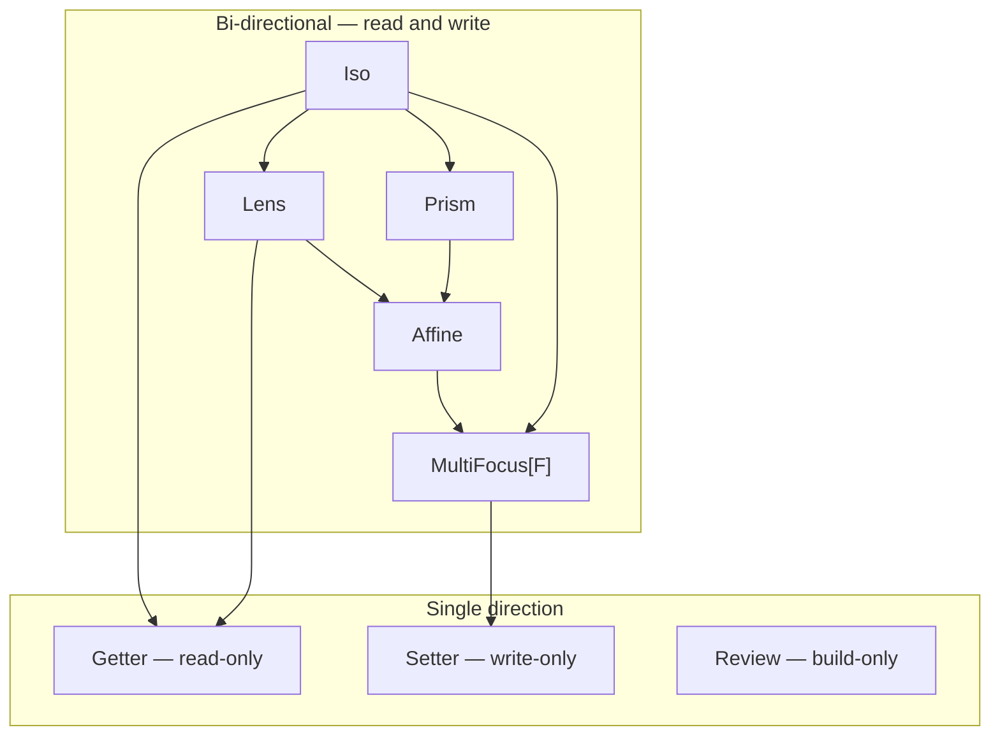

# Optics reference

One section per family — the shape, carrier, primary use case, and a
minimal runnable example. For the per-method reference see the
Scaladoc.

## Family taxonomy

Every family is a specialisation of the same `Optic[S, T, A, B, F]`
trait, differing only in the carrier `F[_, _]`. The diagram is a
composition lattice: an edge `A → B` means *every `A` is a `B`*, so
composing two optics lands on their **join** — the lowest node both
reach by following edges down. `Iso.andThen(Lens) = Lens`;
`Lens.andThen(Prism)` lands on the `Affine` carrier; a read-only chain
lands in the single-direction group.



How to read it:

- **Same-family compose** stays in that family: `Lens ∘ Lens = Lens`,
  `Prism ∘ Prism = Prism`, `Iso ∘ Iso = Iso`.
- **Cross-family compose** walks down from each input to where they
  meet: `Lens ∘ Prism` → `Affine`; `Iso ∘ Setter` → `Setter`.
- **The bi-directional spine** (Iso, Lens, Prism, Affine, MultiFocus)
  carries both a read and a write side. **Single-direction optics**
  keep only one: Getter reads, Setter writes, Review builds.
- Composing a bi-directional optic into Getter or Setter drops the
  other side — the result is single-direction.

`Affine` is the carrier shared by `Optional` (read and write) and
`AffineFold` (read-only). `MultiFocus[F]` is the multi-focus carrier;
its sub-shapes (PowerSeries, Grate, Kaleidoscope, `AlgLens[F]`) are
selected by `F`. The full cell-by-cell composition matrix lives in
[`docs/research/2026-04-23-composition-gap-analysis.md`](https://github.com/Constructive-Programming/eo/blob/main/docs/research/2026-04-23-composition-gap-analysis.md)
— the lattice above is its geometric view.

```scala mdoc:silent
import dev.constructive.eo.optics.{Lens, Optic}
import dev.constructive.eo.optics.Optic.*
import dev.constructive.eo.data.Direct.given    // Accessor[Direct] — powers .get on Iso / Getter
import dev.constructive.eo.data.Forget.given       // ForgetfulFunctor / Fold / Traverse for Forget[F] carriers
```

Every page here shows optics constructed by hand. For the
macro-derived `lens[S](_.field)` / `prism[S, A]` flavour, see
[Generics](generics.md).

## Iso

An `Iso[S, A]` is a bijection — every `S` round-trips to exactly
one `A` and back. Carrier: `Direct` (the identity carrier).

```scala mdoc:silent
import dev.constructive.eo.optics.Iso

case class PersonPair(age: Int, name: String)
val pairIso = Iso[(Int, String), (Int, String), PersonPair, PersonPair](
  t => PersonPair(t._1, t._2),
  p => (p.age, p.name),
)
```

```scala mdoc
pairIso.get((30, "Alice"))
pairIso.reverseGet(PersonPair(30, "Alice"))
```

## Lens

A `Lens[S, A]` focuses a single, always-present field of a
product type. Carrier: `Tuple2`.

```scala mdoc:silent
case class Person(name: String, age: Int)
val ageL = Lens[Person, Int](_.age, (p, a) => p.copy(age = a))
```

```scala mdoc
val alice = Person("Alice", 30)
ageL.get(alice)
ageL.replace(31)(alice)
ageL.modify(_ + 1)(alice)
```

Composes via `.andThen` with other Lenses and — transparently,
with no extra syntax — with `Optional` / `Setter` / `Traversal`
optics too. The cross-carrier variant of `.andThen` summons a
`Composer[F, G]` or `Composer[G, F]` to bring both sides under
a common carrier.

## Prism

A `Prism[S, A]` focuses one branch of a sum type — `Some` over
`None`, or a specific case of an enum. Carrier: `Either`.

```scala mdoc:silent
import dev.constructive.eo.optics.Prism

enum Shape:
  case Circle(r: Double)
  case Square(s: Double)

val circleP = Prism[Shape, Shape.Circle](
  {
    case c: Shape.Circle => Right(c)
    case other           => Left(other)
  },
  identity,
)
```

```scala mdoc
circleP.to(Shape.Circle(1.0))
circleP.to(Shape.Square(2.0))

// modify acts only on the Circle branch; Squares pass through
// unchanged.
circleP.modify(c => Shape.Circle(c.r * 2))(Shape.Circle(1.0))
circleP.modify(c => Shape.Circle(c.r * 2))(Shape.Square(2.0))
```

For auto-derivation on enums / sealed traits / union types see
`prism[S, A]` in [Generics](generics.md).

## Affine

The `Affine` carrier focuses a value that may or may not be present —
a 0-or-1 focus. Two families ride it: **Optional** (read and write)
and **AffineFold** (read-only).

### Optional

An `Optional[S, A]` focuses a conditionally-present field — an
`Option[A]` field, a predicate-gated access, a refinement-style
narrowing.

```scala mdoc:silent
import dev.constructive.eo.data.Affine
import dev.constructive.eo.optics.Optional

case class Contact(flag: Option[String])

val presentFlag = Optional[Contact, Contact, String, String, Affine](
  getOrModify = c => c.flag.toRight(c),
  reverseGet  = { case (c, s) => c.copy(flag = Some(s)) },
)
```

```scala mdoc
presentFlag.modify(_.toUpperCase)(Contact(Some("hello")))
presentFlag.modify(_.toUpperCase)(Contact(None))
```

Composition with a Lens is automatic: `lens.andThen(optional)`
summons `Composer[Tuple2, Affine]` under the hood and morphs
the Lens into the Affine carrier. No explicit `.morph` required
on your end.

### AffineFold (read-only)

The read-only projection of an Affine — a 0-or-1 focus with no
write-back path. `Optional.readOnly` / `Optional.selectReadOnly`
build one from the "read-only Optional" mental model. Full
treatment, with the read-only-direction story, lives in
[Single direction → AffineFold](#affinefold).

## MultiFocus

`MultiFocus[F][X, A] = (X, F[A])` — a structural leftover paired with
an `F`-shaped bundle of foci. It is the carrier for every optic that
focuses more than one value at once; the surface lights up by the
typeclasses `F` admits (`.modify` for `Functor`, `.foldMap` for
`Foldable`, `.modifyA` for `Traverse`, `.at(i)` for `Representable`,
`.collectMap` / `.collectList` for aggregation, and same-carrier
`.andThen`). The sub-shapes below are just different `F`s.

See the [MultiFocus reference](multifocus.md) for the full
typeclass-gated capability matrix and composability profile; the
[Cookbook](cookbook.md) ships runnable recipes for the Grate,
Kaleidoscope, and PowerSeries shapes.

### PowerSeries

`MultiFocus[PSVec]` — the `Traversal.each` / `Traversal.pEach`
carrier. Map, fold, or traverse every element of a collection, and
keep composing past the traversal with `.andThen`. Supports `.modify`
/ `.replace` (`Functor`), `.foldMap` (`Foldable`), `.modifyA` / `.all`
(`Traverse`), and downstream `.andThen` via `mfAssocPSVec`. Overhead
over a naive `copy`/`map` runs ~2-3× for dense chains and ~5× for the
Prism miss-branch shape, amortising down as the collection grows (the
[benchmarks](benchmarks.md#powerseries-traversal-with-downstream-composition)
sweep sizes 4 / 32 / 256 / 1024).

```scala mdoc:silent
import dev.constructive.eo.optics.Traversal
import dev.constructive.eo.data.MultiFocus.given  // Functor / Foldable / Traverse for MultiFocus[PSVec]

val listEach = Traversal.pEach[List, Int, Int]
```

```scala mdoc
listEach.modify(_ + 1)(List(1, 2, 3))
listEach.foldMap(identity[Int])(List(1, 2, 3))   // sum
```

`each` shines when the chain continues past the traversal — e.g.
"for every phone, toggle `isMobile`":

```scala mdoc:silent
case class Phone(isMobile: Boolean, number: String)
case class Owner(phones: List[Phone])

val ownerAllPhonesMobile =
  Lens[Owner, List[Phone]](_.phones, (o, ps) => o.copy(phones = ps))
    .andThen(Traversal.each[List, Phone])
    .andThen(Lens[Phone, Boolean](_.isMobile, (p, m) => p.copy(isMobile = m)))
```

```scala mdoc
ownerAllPhonesMobile.modify(!_)(Owner(List(
  Phone(isMobile = false, "555-0001"),
  Phone(isMobile = true,  "555-0002"),
)))
```

### Grate

`MultiFocus[Function1[X0, *]]` — a uniform rewrite across a fixed
shape: homogeneous tuples and Naperian / representable containers,
where every position is rebuilt the same way. The factories are
`MultiFocus.tuple[T <: Tuple, A]` (homogeneous-tuple uniform rewrite),
`MultiFocus.representable[F: Representable, A]` (arbitrary Naperian
rebuild), and `MultiFocus.representableAt` (representative-index
variant). See [MultiFocus reference](multifocus.md) and
[Cookbook → Recipe A](cookbook.md) for a worked example.

### Kaleidoscope

`MultiFocus[F]` for an `F` with `Apply` — the aggregating read: collapse
every focus to a single value with `.collectMap` (Functor-broadcast)
or `.collectList` (List cartesian). Reach for it when you want to read
the foci out as one summary rather than rewrite them in place. See
[MultiFocus reference](multifocus.md) and
[Cookbook → Recipe B](cookbook.md).

### `AlgLens[F]`

`MultiFocus[F]` for `F: Functor / Foldable / Traverse` — an algebraic
("classifier") lens whose focus is computed over the structure: the
read side folds/classifies, the write side broadcasts back. The
`MultiFocus.fromLensF` / `fromPrismF` / `fromOptionalF` factories lift
a single-focus optic over an `F[A]` focus into this shape. See
[MultiFocus reference](multifocus.md) and
[Cookbook → Recipe C](cookbook.md).

## Single direction

Optics that travel one way only — they keep a read side, a write side,
or a build side, but not the round trip.

### Getter

A `Getter[S, A]` is a pure projection — read-only. Carrier:
`Direct` with `T = Unit`.

```scala mdoc:silent
import dev.constructive.eo.optics.Getter

val nameLen = Getter[Person, Int](_.name.length)
```

```scala mdoc
nameLen.get(Person("Alice", 30))
```

Getter → Getter doesn't compose via `Optic.andThen` today
(Getter's `T = Unit` mismatches the outer `B` slot). For a
deeper read, compose a Lens chain and call `.get` on the
composed lens.

### Setter

A `Setter[S, A]` can modify but not read — a write-only focus
for cases where the focus value isn't observable to the caller.
Carrier: `SetterF`.

```scala mdoc:silent
import dev.constructive.eo.optics.Setter

case class SetterConfig(values: Map[String, Int])
val bumpAll = Setter[SetterConfig, SetterConfig, Int, Int] { f => cfg =>
  cfg.copy(values = cfg.values.view.mapValues(f).toMap)
}
```

```scala mdoc
bumpAll.modify(_ + 1)(SetterConfig(Map("a" -> 1, "b" -> 2)))
```

Both `lens.andThen(setter)` (a Lens to a focus, then a Setter that
writes into it) and `setter.andThen(setter)` work — `SetterF` ships an
`AssociativeFunctor[SetterF, Xo, Xi]` instance, so the standard
`Optic.andThen` resolution picks it up transparently.

```scala mdoc:silent
import dev.constructive.eo.Composer
import dev.constructive.eo.data.SetterF
import dev.constructive.eo.data.SetterF.given

final case class Box(value: Int)
final case class Holder(box: Box, tag: String)

val outer = summon[Composer[Tuple2, SetterF]].to(
  Lens[Holder, Box](_.box, (s, b) => s.copy(box = b))
)
val inner = summon[Composer[Tuple2, SetterF]].to(
  Lens[Box, Int](_.value, (s, v) => s.copy(value = v))
)
val composed = outer.andThen(inner)
```

```scala mdoc
composed.modify(_ + 1)(Holder(Box(10), "tag"))
```

Setter is a write-side terminal: there is no `Composer[SetterF, _]`
outbound, so to *escape* a SetterF chain into a Forget / MultiFocus /
Lens you have to restructure with the Setter on the inside.

### Review

A `Review[S, A]` is the build-only optic — it wraps an `A => S`
construction function and has no read side. Unlike the other families,
`Review` does **not** extend `Optic` (the Optic trait requires an
observing `to` that a pure review has none of); it's a standalone type
with its own composition.

```scala mdoc:silent
import dev.constructive.eo.optics.Review

val someIntR = Review[Option[Int], Int](Some(_))
```

```scala mdoc
someIntR.reverseGet(42)
```

Compose by composing the underlying `A => S` functions directly:

```scala mdoc:silent
val lengthR = Review[Int, String](_.length)
val someLen = Review[Option[Int], String](
  s => someIntR.reverseGet(lengthR.reverseGet(s))
)
```

```scala mdoc
someLen.reverseGet("hello")
```

Two factory methods pull the natural build direction out of an
Iso or a Prism — aliased as `ReversedLens` and `ReversedPrism`
for users who expect to find those names next to the rest of
the optics reference:

```scala mdoc:silent
import dev.constructive.eo.optics.{BijectionIso, MendTearPrism, ReversedLens, ReversedPrism}

val doubleIso =
  BijectionIso[Int, Int, Int, Int](_ * 2, _ / 2)
val revIso = ReversedLens(doubleIso)

val somePrism = new MendTearPrism[Option[Int], Option[Int], Int, Int](
  tear = {
    case Some(n) => Right(n)
    case other   => Left(other)
  },
  mend = Some(_),
)
val revPrism = ReversedPrism(somePrism)
```

```scala mdoc
revIso.reverseGet(5)
revPrism.reverseGet(7)
```

**`ReversedLens` only accepts a bijective Lens** (an
`BijectionIso`). A general Lens doesn't carry enough
information to reconstruct its source from the focus alone —
for that, construct a `Review` directly with your own
`A => S`.

### AffineFold

An `AffineFold[S, A]` is the read-only 0-or-1 focus shape: a
partial projection with no write-back path. Type alias for
`Optic[S, Unit, A, A, Affine]` — the `T = Unit` slot statically
rules out `.modify` / `.replace`, so the only operations are
`.getOption`, `.foldMap`, and `.modifyA` (effectful read).

Use this when the source has no natural write-back
(`headOption` on a List, predicate-gated filters), or as an
API-boundary declaration that callers cannot write through the
returned optic.

```scala mdoc:silent
import dev.constructive.eo.optics.AffineFold

case class Adult(age: Int)
val adultAge: AffineFold[Adult, Int] =
  AffineFold(p => Option.when(p.age >= 18)(p.age))
```

```scala mdoc
adultAge.getOption(Adult(20))
adultAge.getOption(Adult(15))
```

`AffineFold.select(p)` is the filtering variant:

```scala mdoc:silent
val evenAF = AffineFold.select[Int](_ % 2 == 0)
```

```scala mdoc
evenAF.getOption(4)
evenAF.getOption(3)
```

Narrow an existing `Optional` or `Prism` to its read-only
projection via `AffineFold.fromOptional` / `AffineFold.fromPrism` —
both return an `AffineFold[S, A]` that holds the matcher but
discards the write / build path.

**Composition note.** Direct `lens.andThen(af)` on an
`AffineFold` does not type-check: the outer `B` slot doesn't
align with the inner `T = Unit`. Build a full composed
`Optional` through the Lens chain and narrow the result with
`AffineFold.fromOptional`.

### Fold

A `Fold[F, A]` summarises every element of a `Foldable[F]` via
`Monoid[M]` — read-only, multi-element. Carrier: `Forget[F]`.

```scala mdoc:silent
import cats.instances.list.given
import dev.constructive.eo.optics.Fold

val listFold = Fold[List, Int]
```

```scala mdoc
listFold.foldMap(identity[Int])(List(1, 2, 3))
listFold.foldMap((i: Int) => i * i)(List(1, 2, 3))
```

`Fold.select(p)` narrows to elements matching a predicate:

```scala mdoc:silent
val positive = Fold.select[Int](_ > 0)
```

```scala mdoc
positive.foldMap(identity[Int])(3)
positive.foldMap(identity[Int])(-3)
```

## Composition limits

A few categories of pair are either intentionally **not** bridged or
only bridged through a user-opt-in side-channel. Each entry states the
structural shape, the rationale, and the idiomatic workaround:

**Lens / Prism / Optional × `Fold[F]` when the outer focuses on a
scalar `A`** — the outer never produces an `F`-shape, so there's
nothing for the `Fold` to traverse. Use `fold.foldMap(f)(lens.get(s))`
directly. If your outer *does* focus on an `F[A]` (e.g.
`Lens[Row, List[Int]]`), use one of the `MultiFocus.fromLensF` /
`fromPrismF` / `fromOptionalF` factories to lift into `MultiFocus[F]`
and chain there.

**`Traversal.each` × `Fold[F]` / `MultiFocus[F]`** — `MultiFocus[PSVec]`
(the `Traversal.each` carrier) cannot widen into another `MultiFocus[G]`'s
per-candidate cardinality model without a synthetic count. The
idiomatic workaround pushes the inner under the traversal:
`traversal.modify(a => inner.replace(b)(a))(s)` for a `MultiFocus`
inner; `traversal.foldMap(f)(s)` (the read-only escape on any
`MultiFocus[F]`-carrier optic) when you only need the fold side.

**Cross-F `Fold[F].andThen(Fold[G])`** — `Composer[Forget[F], Forget[G]]`
doesn't ship (Composer's signature has no slot for a per-call natural
transformation, and the carrier-generic `Optic.andThen` requires the
same `F`). Instead, `Forget.scala` ships a Forget-specific `.andThen`
extension that takes a user-supplied `cats.~>[F, G]` plus
`FlatMap[G]` and produces a `Forget[G]`-carrier optic:

```scala
import cats.~>
val outer: Optic[Source, Unit, A, A, Forget[List]]   = ...
val inner: Optic[A, Unit, B, B, Forget[Option]]      = ...
given listHead: List ~> Option = new (List ~> Option):
  def apply[T](xs: List[T]): Option[T] = xs.headOption
val composed: Optic[Source, Unit, B, B, Forget[Option]] =
  outer.andThen(inner)
```

The user picks the meaning by choosing the nat (e.g. `List ~> Option`
via `headOption`, `Option ~> List` via `toList`, `List ~> LazyList`
for streaming). Result carrier is `Forget[G]` — downstream composition
continues in `G`'s typeclass landscape. Restricted to `T = Unit`
(the Fold case) since cross-F composition has no natural way to
thread `from` for general `T`.

**`SetterF` outbound** — Setter is a write-side terminal: there is no
outbound `Composer[SetterF, _]`, so a chain that reaches Setter cannot
widen back into a Forget / MultiFocus / Lens. Same-carrier
`setter.andThen(setter)` *does* work — `SetterF.assocSetterF` ships
`AssociativeFunctor[SetterF, Xo, Xi]` with `Z = (Fst[Xo], Snd[Xi])`,
so the standard `Optic.andThen` resolves transparently.

**Fixed-arity traversal (`Traversal.two` / `.three` / `.four`)** —
these factories produce `MultiFocus[Function1[Int, *]]`-carrier optics,
so they inherit the Grate sub-shape's composability: `Iso ↪
MF[Function1[Int, *]]`, `MF[Function1[Int, *]] ↪ SetterF`, and
same-carrier `.andThen` via `mfAssocFunction1`. Lens / Prism / Optional
do NOT bridge in (Function1 lacks `Foldable` / `Alternative`).

The full taxonomy with cell-by-cell rationale lives in
[`docs/research/2026-04-23-composition-gap-analysis.md`](https://github.com/Constructive-Programming/eo/blob/main/docs/research/2026-04-23-composition-gap-analysis.md).
